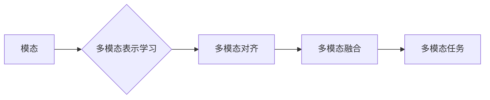

# 多模态大模型：技术原理与实战 多模态大模型的主要应用场景

作者：禅与计算机程序设计艺术

## 1. 背景介绍

### 1.1 单模态模型的局限性

传统的深度学习模型大多是单模态的，例如处理图像的卷积神经网络（CNN）和处理文本的循环神经网络（RNN）。这些模型在各自的领域取得了巨大的成功，但它们无法处理来自不同模态的信息，例如图像和文本之间的语义关系。

### 1.2 多模态学习的兴起

为了克服单模态模型的局限性，多模态学习应运而生。多模态学习旨在构建能够处理和理解来自多个模态信息的模型，例如图像、文本、音频、视频等。

### 1.3 多模态大模型的优势

近年来，随着深度学习技术的不断发展，多模态大模型逐渐成为研究热点。相比于传统的单模态模型，多模态大模型具有以下优势：

* **更强大的表征能力:** 多模态大模型能够学习到不同模态数据之间的复杂关系，从而获得更全面、更准确的数据表征。
* **更广泛的应用范围:** 多模态大模型可以应用于各种需要跨模态理解的任务，例如图像 captioning、视频问答、跨模态检索等。
* **更高的数据效率:** 多模态大模型可以利用来自不同模态的数据进行训练，从而提高数据效率，减少对单一模态数据的依赖。

## 2. 核心概念与联系

### 2.1 模态 (Modality)

模态是指信息的表示方式或形式，例如图像、文本、音频、视频等。

### 2.2 多模态表示学习 (Multimodal Representation Learning)

多模态表示学习旨在将来自不同模态的数据映射到一个共同的特征空间，使得不同模态的数据可以在同一个空间中进行比较和融合。

### 2.3 多模态对齐 (Multimodal Alignment)

多模态对齐是指将来自不同模态的数据点进行匹配，例如将图像中的物体与文本中的描述进行对应。

### 2.4 多模态融合 (Multimodal Fusion)

多模态融合是指将来自不同模态的特征进行整合，以获得更全面、更准确的信息表示。

### 2.5 核心概念联系图



## 3. 核心算法原理具体操作步骤

### 3.1 基于特征拼接的融合方法

#### 3.1.1 原理

将不同模态的特征向量直接拼接在一起，形成一个高维特征向量。

#### 3.1.2 操作步骤

1. 分别提取每个模态的特征向量。
2. 将所有特征向量拼接在一起。

#### 3.1.3 优缺点

* **优点:** 简单直观，易于实现。
* **缺点:** 容易受到维度灾难的影响，忽略了不同模态特征之间的交互关系。

### 3.2  基于注意力机制的融合方法

#### 3.2.1 原理

利用注意力机制学习不同模态特征之间的权重，从而实现更有效的特征融合。

#### 3.2.2 操作步骤

1. 分别提取每个模态的特征向量。
2. 利用注意力机制计算每个模态特征的权重。
3. 根据权重对不同模态的特征进行加权求和，得到融合后的特征向量。

#### 3.2.3 优缺点

* **优点:** 可以有效地捕捉不同模态特征之间的交互关系，提高融合效果。
* **缺点:** 模型复杂度较高，训练难度较大。

### 3.3 基于图神经网络的融合方法

#### 3.3.1 原理

将不同模态的数据表示成图结构，利用图神经网络学习节点之间的关系，从而实现多模态特征的融合。

#### 3.3.2 操作步骤

1. 将不同模态的数据表示成图结构，每个节点代表一个模态的特征。
2. 利用图神经网络学习节点之间的关系。
3. 根据学习到的关系，对不同模态的特征进行融合。

#### 3.3.3 优缺点

* **优点:** 可以有效地捕捉不同模态数据之间的复杂关系，提高融合效果。
* **缺点:** 模型复杂度较高，训练难度较大。

## 4. 数学模型和公式详细讲解举例说明

### 4.1 注意力机制

注意力机制可以被看作是一种软寻址机制，它可以根据输入数据的不同部分分配不同的权重。

#### 4.1.1 公式

$$
\alpha_i = \frac{exp(e_i)}{\sum_{j=1}^{n} exp(e_j)}
$$

其中，$e_i$ 表示第 $i$ 个输入元素的注意力得分，$\alpha_i$ 表示第 $i$ 个输入元素的注意力权重。

#### 4.1.2 例子

假设我们有一个图像和一段文本描述，我们想要利用注意力机制将图像和文本进行对齐。我们可以将图像中的每个区域看作一个输入元素，将文本中的每个单词看作一个输入元素。然后，我们可以利用注意力机制计算每个图像区域和每个文本单词之间的注意力权重，从而实现图像和文本的对齐。

### 4.2 图神经网络

图神经网络是一种专门用于处理图结构数据的深度学习模型。

#### 4.2.1 公式

$$
h_i^{(l+1)} = \sigma \left( W^{(l)} \cdot \text{AGG} \left( \{ h_j^{(l)} | j \in N(i) \} \right) + b^{(l)} \right)
$$

其中，$h_i^{(l)}$ 表示节点 $i$ 在第 $l$ 层的隐藏状态，$N(i)$ 表示节点 $i$ 的邻居节点集合，$\text{AGG}$ 表示聚合函数，$W^{(l)}$ 和 $b^{(l)}$ 分别表示第 $l$ 层的权重矩阵和偏置向量。

#### 4.2.2 例子

假设我们有一张社交网络图，每个节点代表一个用户，边表示用户之间的关系。我们可以利用图神经网络学习每个用户的特征表示，例如用户的兴趣爱好、社交关系等。

## 5. 项目实践：代码实例和详细解释说明

### 5.1 图文检索

#### 5.1.1 任务描述

给定一张图像和一段查询文本，从数据库中检索出与查询文本语义相关的图像。

#### 5.1.2 代码实例

```python
import torch
from transformers import ViTModel, BertModel

# 加载预训练模型
image_model = ViTModel.from_pretrained('google/vit-base-patch16-224')
text_model = BertModel.from_pretrained('bert-base-uncased')

# 提取图像和文本特征
image_features = image_model(pixel_values=image).last_hidden_state
text_features = text_model(input_ids=text_input_ids, attention_mask=text_attention_mask).last_hidden_state

# 计算图像和文本特征的相似度
similarity = torch.cosine_similarity(image_features, text_features, dim=1)

# 根据相似度排序，返回检索结果
sorted_indices = torch.argsort(similarity, descending=True)
```

#### 5.1.3 代码解释

1. 首先，我们加载预训练的 ViT 和 BERT 模型，用于提取图像和文本特征。
2. 然后，我们分别提取图像和文本的特征向量。
3. 接着，我们计算图像和文本特征向量之间的余弦相似度。
4. 最后，我们根据相似度对检索结果进行排序，返回最相关的图像。

### 5.2 图像 captioning

#### 5.2.1 任务描述

给定一张图像，生成一段描述图像内容的文本。

#### 5.2.2 代码实例

```python
import torch
from transformers import ViTModel, GPT2LMHeadModel

# 加载预训练模型
image_model = ViTModel.from_pretrained('google/vit-base-patch16-224')
text_model = GPT2LMHeadModel.from_pretrained('gpt2')

# 提取图像特征
image_features = image_model(pixel_values=image).last_hidden_state

# 将图像特征输入到文本生成模型中，生成文本描述
generated_text = text_model.generate(inputs_embeds=image_features)
```

#### 5.2.3 代码解释

1. 首先，我们加载预训练的 ViT 和 GPT-2 模型，用于提取图像特征和生成文本。
2. 然后，我们提取图像的特征向量。
3. 接着，我们将图像特征向量输入到 GPT-2 模型中，生成文本描述。

## 6. 实际应用场景

### 6.1 跨模态检索

* **电商搜索:** 用户可以使用文本、图像或视频来搜索商品。
* **新闻推荐:** 系统可以根据用户的阅读历史和兴趣推荐相关新闻，包括文本、图像和视频新闻。
* **医疗诊断:** 医生可以结合患者的病历、影像学检查结果和其他医疗数据进行诊断。

### 6.2  多模态问答

* **智能客服:** 用户可以使用自然语言与智能客服进行交互，智能客服可以理解用户的意图并提供相应的答案。
* **教育辅导:** 学生可以使用自然语言提问，系统可以根据学生的提问内容和学习情况提供个性化的辅导。
* **虚拟助手:** 虚拟助手可以理解用户的语音指令和图像信息，并执行相应的操作。

### 6.3 多模态内容生成

* **图像 captioning:** 自动生成图像的文本描述。
* **视频摘要:** 自动生成视频的简短概述。
* **跨模态机器翻译:** 将一种语言的文本翻译成另一种语言的图像或视频。

## 7. 工具和资源推荐

### 7.1 数据集

* **MS COCO:** 图像 captioning、目标检测、图像分割等任务的常用数据集。
* **Visual Genome:** 包含图像、物体、属性和关系的大规模数据集。
* **SBU Captions:** 图像 captioning 的常用数据集。

### 7.2  框架

* **TensorFlow:** Google 开源的深度学习框架。
* **PyTorch:** Facebook 开源的深度学习框架。
* **Hugging Face Transformers:** 提供预训练的多模态模型和工具。

### 7.3  论文

* **Multimodal Machine Learning: A Survey and Taxonomy:** 对多模态机器学习的全面概述。
* **BERT: Pre-training of Deep Bidirectional Transformers for Language Understanding:** BERT 模型的论文。
* **Vision Transformer (ViT): An Image is Worth 16x16 Words:** ViT 模型的论文。

## 8. 总结：未来发展趋势与挑战

### 8.1 未来发展趋势

* **更大规模的模型:** 随着计算能力的提升和数据量的增加，未来将会出现更大规模的多模态大模型。
* **更丰富的模态:** 未来的多模态大模型将会支持更多的模态，例如音频、视频、传感器数据等。
* **更强的泛化能力:** 未来的多模态大模型将会具有更强的泛化能力，可以应用于更广泛的任务和领域。

### 8.2  挑战

* **数据稀缺性:** 多模态数据的获取和标注成本较高，数据稀缺性是制约多模态大模型发展的主要瓶颈之一。
* **模型复杂度:** 多模态大模型的结构复杂，训练难度大，需要大量的计算资源和时间。
* **可解释性:** 多模态大模型的可解释性较差，难以理解模型的决策过程。

## 9. 附录：常见问题与解答

### 9.1 什么是多模态学习？

多模态学习是指构建能够处理和理解来自多个模态信息的模型，例如图像、文本、音频、视频等。

### 9.2 多模态学习有哪些应用场景？

多模态学习的应用场景非常广泛，例如跨模态检索、多模态问答、多模态内容生成等。

### 9.3 多模态学习面临哪些挑战？

多模态学习面临着数据稀缺性、模型复杂度和可解释性等挑战。
