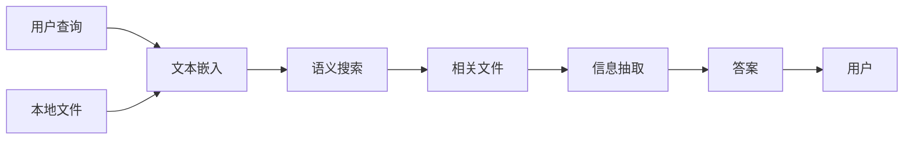

# 大语言模型应用指南：本地文件浏览

作者：禅与计算机程序设计艺术

## 1. 背景介绍

### 1.1  大语言模型与知识边界

近年来，大语言模型（LLM）在自然语言处理领域取得了显著的进展，展现出惊人的文本生成、翻译、问答等能力。然而，目前的LLM大多依赖于预先训练的海量文本数据，缺乏访问和理解外部世界信息的能力，这也被称为“知识边界”问题。

### 1.2  突破知识边界：本地文件浏览的意义

为了突破LLM的知识边界，使其能够获取和利用更广泛的信息，研究者们开始探索将LLM与外部知识库、数据库、文件系统等进行整合。其中，本地文件浏览作为一种直接、灵活的方式，为LLM提供了访问和理解用户本地信息的机会，具有重要的意义：

* **个性化知识**: 用户本地文件包含了大量个性化信息，例如个人笔记、代码库、项目文档等，这些信息对于LLM理解用户意图、提供个性化服务至关重要。
* **实时信息**:  与访问互联网相比，本地文件浏览可以提供更快速、更可靠的信息访问方式，尤其是在处理敏感信息或离线场景下。
* **扩展LLM应用场景**: 本地文件浏览能力可以扩展LLM的应用场景，例如：
    *  **智能文档助手**:  帮助用户快速检索、分析、编辑本地文档。
    *  **代码理解与生成**:  辅助程序员理解代码逻辑、生成代码片段、修复代码错误。
    *  **个性化知识问答**:  基于用户个人文件回答问题，提供更精准的答案。

### 1.3 本文目标和结构

本文旨在探讨如何利用LLM实现本地文件浏览功能，并介绍相关技术挑战、解决方案和未来发展方向。

本文结构如下：

* **第二章**：介绍本地文件浏览的核心概念和关键技术，包括文本嵌入、语义搜索、信息抽取等。
* **第三章**：详细阐述LLM实现本地文件浏览的核心算法原理和具体操作步骤。
* **第四章**:  介绍相关的数学模型和公式，并结合实际例子进行讲解说明。
* **第五章**:  提供一个完整的项目实践案例，包括代码实例和详细解释说明，帮助读者快速上手实践。
* **第六章**:  探讨本地文件浏览的实际应用场景，例如文档分析、代码理解、知识问答等。
* **第七章**:  推荐一些常用的工具和资源，帮助读者深入学习和研究。
* **第八章**:  总结LLM本地文件浏览的未来发展趋势和挑战，并展望其未来发展方向。
* **第九章**:  以附录的形式，列出一些常见问题和解答，帮助读者解决实际问题。

## 2. 核心概念与联系

### 2.1  文本嵌入

文本嵌入（Text Embedding）是将文本信息转换为向量表示的技术，是实现语义搜索和信息抽取的基础。常用的文本嵌入模型包括：

* **Word2Vec**: 通过预测目标词的上下文词来学习词向量，例如 CBOW 和 Skip-gram 模型。
* **GloVe**: 基于全局词共现矩阵学习词向量，能够捕捉词之间的语义关系。
* **FastText**: 在 Word2Vec 的基础上，考虑了词的形态信息，能够更好地处理未登录词。
* **Sentence-BERT**:  使用孪生网络结构，能够将句子映射到固定长度的向量空间，适用于句子相似度计算和语义搜索。

### 2.2  语义搜索

语义搜索（Semantic Search）是指根据文本的语义信息进行搜索，而不是仅仅依靠关键词匹配。在LLM本地文件浏览中，语义搜索用于根据用户查询找到最相关的文件和内容。常用的语义搜索方法包括：

* **基于向量空间模型**:  将文本和查询表示为向量，计算向量之间的相似度，例如余弦相似度。
* **基于深度学习模型**: 使用深度学习模型学习文本和查询的语义表示，例如 DSSM、ConvNet、Transformer 等。

### 2.3  信息抽取

信息抽取（Information Extraction）是指从非结构化文本中提取结构化信息的技术，例如实体识别、关系抽取、事件抽取等。在LLM本地文件浏览中，信息抽取用于从文件中提取关键信息，例如文档标题、作者、创建时间、关键段落等。常用的信息抽取方法包括：

* **基于规则**:  根据预定义的规则从文本中提取信息，例如正则表达式。
* **基于机器学习**:  使用机器学习模型学习文本中的模式，并根据学习到的模式提取信息，例如隐马尔可夫模型、条件随机场、最大熵模型等。
* **基于深度学习**:  使用深度学习模型学习文本的语义表示，并根据语义表示提取信息，例如 BiLSTM-CRF、BERT-CRF 等。

### 2.4  核心概念联系

下图展示了LLM本地文件浏览的核心概念之间的联系：



## 3. 核心算法原理具体操作步骤

### 3.1  数据预处理

在进行本地文件浏览之前，需要对本地文件进行预处理，主要步骤包括：

* **文件解析**:  将不同格式的文件解析为统一的文本格式，例如txt、markdown、pdf等。
* **文本清洗**:  对文本进行清洗，例如去除特殊字符、空格、停用词等。
* **分词**:  将文本分割成单词或词语序列。
* **文本嵌入**:  使用预训练的文本嵌入模型将文本转换为向量表示。

### 3.2  语义索引构建

为了实现高效的语义搜索，需要构建语义索引，主要步骤包括：

* **选择合适的文本嵌入模型**:  根据文件内容和搜索需求选择合适的文本嵌入模型。
* **生成文本嵌入向量**:  使用选择的文本嵌入模型将所有文件转换为向量表示。
* **构建索引**:  使用高效的索引结构存储文本嵌入向量，例如 Faiss、Annoy、Hnswlib 等。

### 3.3  查询处理

当用户提交查询时，需要对查询进行处理，主要步骤包括：

* **查询解析**:  对用户查询进行解析，例如分词、词性标注、命名实体识别等。
* **查询嵌入**:  使用与语义索引构建相同的文本嵌入模型将查询转换为向量表示。
* **语义搜索**:  使用查询嵌入向量在语义索引中搜索最相关的文件。

### 3.4  信息提取与答案生成

当找到相关文件后，需要从文件中提取关键信息并生成答案，主要步骤包括：

* **相关性排序**:  根据文件与查询的相关性对搜索结果进行排序。
* **信息抽取**:  使用信息抽取技术从相关文件中提取关键信息，例如答案片段、相关段落、关键实体等。
* **答案生成**:  根据提取的信息生成最终的答案，可以使用文本摘要、问答生成等技术。

## 4. 数学模型和公式详细讲解举例说明

### 4.1  余弦相似度

余弦相似度是衡量两个向量之间相似度的一种常用指标，其计算公式如下：

$$
similarity(A,B) = \frac{A \cdot B}{||A|| ||B||} = cos(\theta)
$$

其中，A 和 B 分别表示两个向量，||A|| 和 ||B|| 分别表示向量的模长，θ 表示两个向量之间的夹角。

余弦相似度的取值范围为 [-1, 1]，值越大表示两个向量越相似。

**示例:**

假设有两个文本嵌入向量：

```
A = [0.1, 0.2, 0.3]
B = [0.2, 0.4, 0.6]
```

则它们的余弦相似度为：

```
similarity(A,B) = (0.1 * 0.2 + 0.2 * 0.4 + 0.3 * 0.6) / (sqrt(0.1^2 + 0.2^2 + 0.3^2) * sqrt(0.2^2 + 0.4^2 + 0.6^2)) = 1.0
```

**结果表明，这两个文本嵌入向量完全相似。**

### 4.2  TF-IDF

TF-IDF (Term Frequency-Inverse Document Frequency) 是一种用于信息检索的统计方法，用于衡量一个词语在一篇文档中的重要程度。

TF-IDF 的计算公式如下：

$$
tfidf(t, d, D) = tf(t, d) * idf(t, D)
$$

其中：

* $tf(t, d)$ 表示词语 $t$ 在文档 $d$ 中出现的频率。
* $idf(t, D)$ 表示词语 $t$ 的逆文档频率，计算公式如下：

$$
idf(t, D) = log(\frac{|D|}{|\{d \in D : t \in d\}|})
$$

其中，$|D|$ 表示文档集合 $D$ 中的文档总数，$|\{d \in D : t \in d\}|$ 表示包含词语 $t$ 的文档数量。

TF-IDF 的值越高，表示词语 $t$ 在文档 $d$ 中越重要。

**示例:**

假设有一个文档集合 $D$，包含以下三个文档：

```
d1: "我喜欢吃苹果"
d2: "我喜欢吃香蕉"
d3: "我喜欢吃梨"
```

则词语 "苹果" 在文档 $d1$ 中的 TF-IDF 值为：

```
tf("苹果", d1) = 1 / 3
idf("苹果", D) = log(3 / 1) = log(3)
tfidf("苹果", d1, D) = (1 / 3) * log(3) ≈ 0.366
```

**结果表明，词语 "苹果" 在文档 $d1$ 中具有一定的重要性。**

## 5. 项目实践：代码实例和详细解释说明

### 5.1  项目目标

本项目旨在使用 Python 实现一个简单的本地文件浏览工具，该工具能够根据用户的自然语言查询，在本地文件中搜索相关内容，并返回搜索结果。

### 5.2  项目环境

* Python 3.7+
* transformers
* scikit-learn
* faiss-cpu

### 5.3  代码实现

```python
import os
import faiss
from sklearn.feature_extraction.text import TfidfVectorizer
from transformers import AutoTokenizer, AutoModel

# 设置模型参数
model_name = "bert-base-uncased"
max_length = 512

# 初始化模型和 tokenizer
tokenizer = AutoTokenizer.from_pretrained(model_name)
model = AutoModel.from_pretrained(model_name)

def preprocess_document(document_path):
    """
    预处理文档，包括读取文件内容、分词、生成文本嵌入向量等步骤。

    Args:
        document_path: 文档路径。

    Returns:
        文档的文本嵌入向量。
    """
    with open(document_path, "r", encoding="utf-8") as f:
        document = f.read()
    # 对文档进行分词等预处理操作
    # ...
    # 生成文本嵌入向量
    inputs = tokenizer(document, padding=True, truncation=True, max_length=max_length, return_tensors="pt")
    with torch.no_grad():
        outputs = model(**inputs)
    embeddings = outputs.last_hidden_state[:, 0, :].numpy()
    return embeddings

def build_search_index(documents_dir):
    """
    构建语义搜索索引。

    Args:
        documents_dir: 文档目录。

    Returns:
        Faiss 索引对象。
    """
    # 获取所有文档路径
    document_paths = [os.path.join(documents_dir, filename) for filename in os.listdir(documents_dir)]
    # 生成所有文档的文本嵌入向量
    document_embeddings = [preprocess_document(document_path) for document_path in document_paths]
    # 创建 Faiss 索引
    index = faiss.IndexFlatL2(document_embeddings[0].shape[1])
    # 添加向量到索引
    index.add(np.vstack(document_embeddings))
    return index

def search(query, index, document_paths, top_k=5):
    """
    搜索相关文档。

    Args:
        query: 用户查询。
        index: Faiss 索引对象。
        document_paths: 文档路径列表。
        top_k: 返回结果的数量。

    Returns:
        相关文档路径列表。
    """
    # 生成查询的文本嵌入向量
    query_embedding = preprocess_document(query)
    # 在索引中搜索最近邻
    distances, indices = index.search(query_embedding, top_k)
    # 返回相关文档路径
    return [document_paths[i] for i in indices[0]]

# 构建语义搜索索引
documents_dir = "/path/to/documents"
index = build_search_index(documents_dir)

# 用户查询
query = "人工智能的应用"

# 搜索相关文档
results = search(query, index, document_paths)

# 打印搜索结果
print(f"搜索结果：{results}")
```

### 5.4  代码解释

* **`preprocess_document()` 函数**:  该函数用于预处理文档，包括读取文件内容、分词、生成文本嵌入向量等步骤。
* **`build_search_index()` 函数**:  该函数用于构建语义搜索索引，包括获取所有文档路径、生成所有文档的文本嵌入向量、创建 Faiss 索引、添加向量到索引等步骤。
* **`search()` 函数**:  该函数用于搜索相关文档，包括生成查询的文本嵌入向量、在索引中搜索最近邻、返回相关文档路径等步骤。
* **主函数**:  主函数中首先构建语义搜索索引，然后接收用户查询，最后调用 `search()` 函数搜索相关文档并打印搜索结果。

## 6. 实际应用场景

### 6.1  智能文档助手

* **场景描述**:  用户可以使用自然语言与智能文档助手进行交互，例如询问文档内容、查找特定信息、生成文档摘要等。
* **实现方式**:  使用 LLM 本地文件浏览技术，可以实现以下功能：
    *  **语义搜索**:  根据用户查询，在文档库中搜索相关文档。
    *  **问答**:  根据用户问题，在文档中查找答案。
    *  **摘要**:  生成文档的摘要信息。
    *  **翻译**:  将文档翻译成其他语言。

### 6.2  代码理解与生成

* **场景描述**:  程序员可以使用 LLM 本地文件浏览技术来辅助代码理解和生成，例如查找代码示例、理解代码逻辑、生成代码注释等。
* **实现方式**:  使用 LLM 本地文件浏览技术，可以实现以下功能：
    *  **代码搜索**:  根据用户提供的代码片段或自然语言描述，搜索相关的代码示例。
    *  **代码解释**:  解释代码的功能和逻辑。
    *  **代码生成**:  根据用户提供的自然语言描述，生成相应的代码。

### 6.3  个性化知识问答

* **场景描述**:  用户可以使用 LLM 本地文件浏览技术来构建个性化的知识库，并基于该知识库进行问答。
* **实现方式**:  使用 LLM 本地文件浏览技术，可以实现以下功能：
    *  **知识抽取**:  从用户提供的文档中抽取知识，并构建知识图谱。
    *  **问答**:  根据用户问题，在知识图谱中查找答案。


## 7. 工具和资源推荐

### 7.1  文本嵌入模型

* **Hugging Face Transformers**:  提供了大量的预训练文本嵌入模型，例如 BERT、RoBERTa、Sentence-BERT 等。
* **Facebook FastText**:  提供了快速文本分类和词向量学习工具。
* **Google Word2Vec**:  提供了经典的 Word2Vec 模型实现。

### 7.2  语义搜索库

* **Faiss**:  Facebook 开源的高效相似性搜索库。
* **Annoy**:  Spotify 开源的近似最近邻搜索库。
* **Hnswlib**:  基于 Hierarchical Navigable Small World graphs 的近似最近邻搜索库。

### 7.3  信息抽取工具

* **SpaCy**:  Python 自然语言处理库，提供了实体识别、关系抽取等功能。
* **NLTK**:  Python 自然语言处理工具包，提供了分词、词性标注等功能。
* **Stanford CoreNLP**:  斯坦福大学自然语言处理组开发的自然语言处理工具包，提供了实体识别、关系抽取、情感分析等功能。

## 8. 总结：未来发展趋势与挑战

### 8.1  未来发展趋势

* **多模态信息融合**:  将 LLM 与图像、音频、视频等多模态信息进行融合，实现更全面的信息理解和更智能的应用。
* **个性化和隐私保护**:  开发更加个性化和隐私保护的 LLM 本地文件浏览技术，保护用户隐私和数据安全。
* **跨平台和跨设备**:  实现跨平台和跨设备的 LLM 本地文件浏览功能，方便用户在不同设备上访问和管理信息。

### 8.2  挑战

* **效率和性能**:  处理海量本地文件需要高效的算法和数据结构，以保证搜索和信息抽取的效率和性能。
* **安全性**:  访问本地文件需要考虑安全性问题，防止恶意代码攻击和信息泄露。
