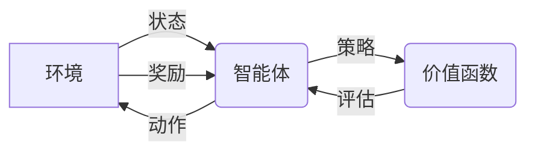

## 1. 背景介绍

### 1.1 强化学习的崛起

近年来，随着计算能力的提升和数据量的爆炸式增长，人工智能领域迎来了新的发展浪潮。其中，强化学习（Reinforcement Learning，RL）作为一种模仿生物学习机制的机器学习方法，备受关注。从 AlphaGo 击败围棋世界冠军，到 OpenAI Five 在 Dota2 中战胜人类职业玩家，强化学习在各个领域展现出惊人的潜力，推动着人工智能技术不断突破。

### 1.2  什么是强化学习？

强化学习关注的是智能体（Agent）如何在与环境（Environment）的交互中，通过试错学习最优策略（Policy），以最大化累积奖励（Cumulative Reward）。简而言之，强化学习的目标是让机器像人类一样，通过不断地尝试和学习，找到在特定环境下取得成功的最佳行动方案。

### 1.3 策略迭代与价值迭代：两种经典方法

为了解决强化学习问题，研究者们提出了许多算法。其中，策略迭代（Policy Iteration）和价值迭代（Value Iteration）是两种经典且应用广泛的方法。它们都属于动态规划（Dynamic Programming）的范畴，通过迭代计算最优策略或价值函数来解决问题。

## 2. 核心概念与联系

在深入探讨策略迭代和价值迭代之前，我们需要先了解一些强化学习中的核心概念：

### 2.1 状态（State）

状态是描述环境在特定时刻的特征或属性的集合。例如，在围棋游戏中，状态可以表示当前棋盘的布局；在自动驾驶中，状态可以表示车辆的位置、速度、周围环境等信息。

### 2.2  动作（Action）

动作是智能体可以采取的操作或决策。例如，在围棋游戏中，动作可以是落子的位置；在自动驾驶中，动作可以是转向、加速、刹车等操作。

### 2.3 奖励（Reward）

奖励是环境对智能体采取某个动作后给予的反馈信号，用于指示该动作的好坏程度。奖励可以是正数、负数或零。例如，在围棋游戏中，如果智能体落子后形成有效包围，则会获得正奖励；如果落子后被对手吃掉棋子，则会获得负奖励。

### 2.4 策略（Policy）

策略是智能体根据当前状态选择动作的规则或函数。它可以是一个确定性策略，即在每个状态下都选择一个确定的动作；也可以是一个随机性策略，即在每个状态下根据一定的概率分布选择不同的动作。

### 2.5 价值函数（Value Function）

价值函数用于评估智能体在某个状态下采取某种策略的长期累积奖励的期望值。它可以分为状态价值函数（State Value Function）和动作价值函数（Action Value Function）两种：

- 状态价值函数 $V^\pi(s)$ 表示从状态 $s$ 出发，按照策略 $\pi$ 行动，所能获得的长期累积奖励的期望值。
- 动作价值函数 $Q^\pi(s, a)$ 表示从状态 $s$ 出发，采取动作 $a$，然后按照策略 $\pi$ 行动，所能获得的长期累积奖励的期望值。

### 2.6  核心概念之间的联系

下图展示了强化学习中各个核心概念之间的联系：



智能体根据当前环境状态，选择并执行一个动作，环境对该动作给出奖励，并更新到下一个状态。智能体根据奖励信号更新策略，以期在未来获得更大的累积奖励。价值函数则用于评估策略的优劣，指导策略的更新。

## 3. 核心算法原理与具体操作步骤

### 3.1 策略迭代

策略迭代的核心思想是：

1. **策略评估（Policy Evaluation）：**  对于给定的策略 $\pi$，计算其对应的价值函数 $V^\pi$。
2. **策略改进（Policy Improvement）：**  根据当前的价值函数 $V^\pi$，更新策略 $\pi$，使其在每个状态下都能选择期望奖励更大的动作。

具体操作步骤如下：

1. **初始化：**  随机初始化策略 $\pi$ 和价值函数 $V(s)$。
2. **策略评估：**  对于当前的策略 $\pi$，迭代计算其对应的状态价值函数 $V^\pi(s)$，直到收敛。
   - 对于每个状态 $s$：
     - 初始化 $V(s) = 0$。
     - 循环迭代，直到 $V(s)$ 收敛：
       - 对于每个动作 $a$：
         - 计算采取动作 $a$ 后转移到下一个状态 $s'$ 的概率 $P(s'|s, a)$ 和奖励 $R(s, a, s')$。
         - 更新 $V(s) = \sum_{s'} P(s'|s, a) [R(s, a, s') + \gamma V(s')]$，其中 $\gamma$ 为折扣因子，用于平衡当前奖励和未来奖励的重要性。
3. **策略改进：**  对于每个状态 $s$，根据当前的状态价值函数 $V^\pi(s)$，更新策略 $\pi(s)$，使其选择期望奖励更大的动作：
   - $\pi'(s) = \arg\max_{a} \sum_{s'} P(s'|s, a) [R(s, a, s') + \gamma V^\pi(s')]$
4. **判断是否收敛：**  如果策略 $\pi$ 不再发生变化，则算法结束；否则，令 $\pi = \pi'$，返回步骤 2 继续迭代。

### 3.2 价值迭代

价值迭代的核心思想是：

1. **直接迭代计算最优价值函数** $V^*(s)$，而不是像策略迭代那样先计算某个策略的价值函数。
2. **根据最优价值函数** $V^*(s)$ **推导出最优策略** $\pi^*$。

具体操作步骤如下：

1. **初始化：**  随机初始化价值函数 $V(s)$。
2. **价值迭代：**  迭代计算最优价值函数 $V^*(s)$，直到收敛。
   - 对于每个状态 $s$：
     - 初始化 $V(s) = 0$。
     - 循环迭代，直到 $V(s)$ 收敛：
       - $V(s) = \max_{a} \sum_{s'} P(s'|s, a) [R(s, a, s') + \gamma V(s')]$
3. **提取最优策略：**  根据最优价值函数 $V^*(s)$，推导出最优策略 $\pi^*(s)$：
   - $\pi^*(s) = \arg\max_{a} \sum_{s'} P(s'|s, a) [R(s, a, s') + \gamma V^*(s')]$

### 3.3 策略迭代与价值迭代的联系

策略迭代和价值迭代都是解决强化学习问题的经典算法，它们之间有着密切的联系：

- **本质上，价值迭代可以看作是策略迭代的一种特殊情况。** 在策略迭代中，如果策略评估步骤只进行一次迭代，那么就相当于价值迭代。
- **两种算法都能收敛到最优策略** $\pi^*$ **和最优价值函数** $V^*$。
- **策略迭代在每次迭代过程中都需要进行策略评估，计算量较大；而价值迭代则直接迭代计算最优价值函数，计算量相对较小。** 因此，在状态空间和动作空间较小的问题中，价值迭代通常比策略迭代更高效。

## 4. 数学模型和公式详细讲解举例说明

为了更好地理解策略迭代和价值迭代的算法原理，我们以一个简单的例子来说明。

假设有一个 4x4 的网格世界，智能体可以从任何一个格子出发，目标是到达右上角的格子（目标状态）。智能体每次可以向上、下、左、右移动一个格子，如果移动到边界外，则会停留在原地。每个格子都对应一个状态，奖励函数定义为：

- 到达目标状态，获得奖励 +1。
- 其他状态，获得奖励 0。

折扣因子 $\gamma = 0.9$。

### 4.1 策略迭代

#### 4.1.1 策略评估

假设初始策略为随机策略，即在每个状态下，智能体等概率地选择向上、下、左、右移动。

第一次迭代：

- 对于每个状态 $s$，初始化 $V(s) = 0$。
- 由于初始策略是随机策略，因此每个状态的价值函数都为 0。

第二次迭代：

- 对于目标状态，$V(目标状态) = R(目标状态) + \gamma \sum_{s'} P(s'|目标状态, a) V(s') = 1$。
- 对于与目标状态相邻的状态，$V(相邻状态) = R(相邻状态) + \gamma \sum_{s'} P(s'|相邻状态, a) V(s') = 0.9$。
- 对于其他状态，$V(其他状态) = 0$。

以此类推，经过多次迭代后，状态价值函数会逐渐收敛。

#### 4.1.2 策略改进

根据收敛后的状态价值函数，我们可以对策略进行改进。

例如，对于与目标状态相邻的状态，由于向上移动可以到达目标状态，获得更大的奖励，因此可以将策略更新为：在该状态下，始终选择向上移动。

### 4.2 价值迭代

#### 4.2.1 价值迭代

与策略迭代不同，价值迭代直接迭代计算最优价值函数 $V^*(s)$。

第一次迭代：

- 对于每个状态 $s$，初始化 $V(s) = 0$。

第二次迭代：

- 对于目标状态，$V(目标状态) = \max_{a} \{R(目标状态, a) + \gamma \sum_{s'} P(s'|目标状态, a) V(s')\} = 1$。
- 对于与目标状态相邻的状态，$V(相邻状态) = \max_{a} \{R(相邻状态, a) + \gamma \sum_{s'} P(s'|相邻状态, a) V(s')\} = 0.9$。
- 对于其他状态，$V(其他状态) = 0$。

以此类推，经过多次迭代后，状态价值函数会逐渐收敛到最优价值函数 $V^*(s)$。

#### 4.2.2 提取最优策略

根据最优价值函数 $V^*(s)$，我们可以推导出最优策略 $\pi^*(s)$。

例如，对于与目标状态相邻的状态，由于向上移动可以获得最大的价值，因此最优策略为：在该状态下，始终选择向上移动。

## 5. 项目实践：代码实例和详细解释说明

```python
import numpy as np

# 定义环境
class GridWorld:
    def __init__(self, rows, cols, goal_state):
        self.rows = rows
        self.cols = cols
        self.goal_state = goal_state
        self.actions = ['up', 'down', 'left', 'right']

    def get_next_state(self, state, action):
        row, col = state
        if action == 'up':
            row = max(row - 1, 0)
        elif action == 'down':
            row = min(row + 1, self.rows - 1)
        elif action == 'left':
            col = max(col - 1, 0)
        elif action == 'right':
            col = min(col + 1, self.cols - 1)
        return (row, col)

    def get_reward(self, state):
        if state == self.goal_state:
            return 1
        else:
            return 0

# 策略迭代
def policy_iteration(env, gamma=0.9, theta=1e-6):
    # 初始化策略和价值函数
    policy = np.random.choice(env.actions, size=(env.rows, env.cols))
    value_function = np.zeros((env.rows, env.cols))

    while True:
        # 策略评估
        while True:
            delta = 0
            for row in range(env.rows):
                for col in range(env.cols):
                    state = (row, col)
                    v = value_function[state]
                    action = policy[state]
                    next_state = env.get_next_state(state, action)
                    reward = env.get_reward(next_state)
                    value_function[state] = reward + gamma * value_function[next_state]
                    delta = max(delta, abs(v - value_function[state]))
            if delta < theta:
                break

        # 策略改进
        policy_stable = True
        for row in range(env.rows):
            for col in range(env.cols):
                state = (row, col)
                old_action = policy[state]
                action_values = []
                for action in env.actions:
                    next_state = env.get_next_state(state, action)
                    reward = env.get_reward(next_state)
                    action_values.append(reward + gamma * value_function[next_state])
                best_action = env.actions[np.argmax(action_values)]
                policy[state] = best_action
                if old_action != best_action:
                    policy_stable = False
        if policy_stable:
            break

    return policy, value_function

# 价值迭代
def value_iteration(env, gamma=0.9, theta=1e-6):
    # 初始化价值函数
    value_function = np.zeros((env.rows, env.cols))

    while True:
        delta = 0
        for row in range(env.rows):
            for col in range(env.cols):
                state = (row, col)
                v = value_function[state]
                action_values = []
                for action in env.actions:
                    next_state = env.get_next_state(state, action)
                    reward = env.get_reward(next_state)
                    action_values.append(reward + gamma * value_function[next_state])
                value_function[state] = np.max(action_values)
                delta = max(delta, abs(v - value_function[state]))
        if delta < theta:
            break

    # 提取策略
    policy = np.random.choice(env.actions, size=(env.rows, env.cols))
    for row in range(env.rows):
        for col in range(env.cols):
            state = (row, col)
            action_values = []
            for action in env.actions:
                next_state = env.get_next_state(state, action)
                reward = env.get_reward(next_state)
                action_values.append(reward + gamma * value_function[next_state])
            best_action = env.actions[np.argmax(action_values)]
            policy[state] = best_action

    return policy, value_function

# 测试代码
if __name__ == '__main__':
    # 创建环境
    env = GridWorld(rows=4, cols=4, goal_state=(0, 3))

    # 策略迭代
    policy_pi, value_function_pi = policy_iteration(env)

    # 价值迭代
    policy_vi, value_function_vi = value_iteration(env)

    # 打印结果
    print("策略迭代：")
    print("策略：")
    print(policy_pi)
    print("价值函数：")
    print(value_function_pi)

    print("\n价值迭代：")
    print("策略：")
    print(policy_vi)
    print("价值函数：")
    print(value_function_vi)
```

代码解释：

1.  **环境定义：**  `GridWorld` 类用于表示 4x4 的网格世界环境，包括状态空间、动作空间、奖励函数等信息。
2.  **策略迭代：**  `policy_iteration` 函数实现了策略迭代算法，包括策略评估和策略改进两个步骤。
3.  **价值迭代：**  `value_iteration` 函数实现了价值迭代算法，包括价值迭代和策略提取两个步骤。
4.  **测试代码：**  创建了一个 `GridWorld` 环境，分别使用策略迭代和价值迭代算法求解，并打印最终的策略和价值函数。

## 6. 实际应用场景

策略迭代和价值迭代作为强化学习的经典算法，在许多领域都有着广泛的应用，例如：

- **游戏 AI：**  AlphaGo、AlphaZero 等围棋 AI 程序，以及 OpenAI Five 等 Dota2 AI 程序，都使用了强化学习算法进行训练，其中策略迭代和价值迭代是常用的算法之一。
- **机器人控制：**  强化学习可以用于训练机器人的运动控制策略，例如机械臂抓取、机器人导航等。
- **推荐系统：**  强化学习可以用于构建个性化推荐系统，根据用户的历史行为和偏好，推荐更符合用户口味的商品或服务。
- **金融交易：**  强化学习可以用于开发自动化交易系统，根据市场行情变化，自动进行股票、期货等交易。

## 7. 总结：未来发展趋势与挑战

策略迭代和价值迭代是强化学习领域的两大基石，它们为解决复杂决策问题提供了有效的解决方案。然而，随着强化