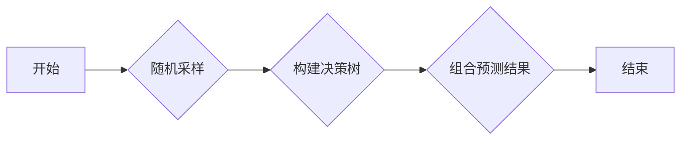

## 1. 背景介绍

### 1.1 从决策树到随机森林：集成学习的力量

在机器学习领域，决策树是一种简单而强大的预测模型。它以树状结构递归地将数据集划分为更小的子集，最终到达叶子节点进行预测。然而，单个决策树容易过拟合，即对训练数据表现良好，但在未见过的数据上泛化能力差。

为了克服决策树的局限性，**集成学习**应运而生。集成学习的核心思想是“三个臭皮匠，顶个诸葛亮”，通过组合多个弱学习器来构建一个强学习器。随机森林 (Random Forest) 就是一种经典的基于 Bagging 的集成学习算法，它通过构建多个决策树并结合它们的预测结果来提高模型的泛化能力和鲁棒性。

### 1.2 随机森林的优势

相比于单棵决策树，随机森林具有以下显著优势：

* **更高的准确率:** 通过组合多个决策树的预测结果，随机森林可以有效降低方差，提高预测精度。
* **更强的泛化能力:**  随机森林在训练过程中引入了随机性，可以有效避免过拟合，提升模型对未知数据的预测能力。
* **对异常值和噪声的鲁棒性:**  随机森林对异常值和噪声不敏感，因为单个决策树的偏差会被其他树所平衡。
* **可处理高维数据:** 随机森林可以处理具有大量特征的数据集，而不会像其他算法那样容易受到维度灾难的影响。
* **可用于特征选择:** 随机森林可以评估每个特征的重要性，从而帮助我们进行特征选择，简化模型并提高效率。

## 2. 核心概念与联系

### 2.1 集成学习 (Ensemble Learning)

集成学习是一种机器学习范式，它通过组合多个个体学习器来构建一个更强大的学习器。个体学习器可以是同一种类型的模型（例如，决策树），也可以是不同类型的模型（例如，决策树、支持向量机、神经网络）。

集成学习主要分为两大类：

* **Bagging (Bootstrap Aggregating):**  通过对训练集进行有放回的随机采样，生成多个不同的训练子集，然后在每个子集上训练一个独立的学习器。最终的预测结果通过对所有学习器的预测结果进行平均或投票得到。随机森林就是一种典型的 Bagging 算法。
* **Boosting:**  Boosting 算法是一种迭代式的集成学习方法，它通过改变训练样本的权重来依次训练多个学习器。每个学习器都关注于前一个学习器分类错误的样本，从而逐步提高模型的精度。常见的 Boosting 算法包括 AdaBoost、Gradient Boosting 等。

### 2.2 决策树 (Decision Tree)

决策树是一种树形结构的预测模型，它以递归的方式将数据集划分为更小的子集，最终到达叶子节点进行预测。每个内部节点表示一个特征或属性，每个分支代表一个特征取值，每个叶子节点代表一个预测结果。

构建决策树的关键在于如何选择最佳的特征进行划分。常用的特征选择指标包括：

* **信息增益 (Information Gain):**  信息增益衡量的是某个特征对数据集不确定性的减少程度。信息增益越大，说明该特征越重要。
* **基尼不纯度 (Gini Impurity):** 基尼不纯度衡量的是数据集的“纯度”，即随机从数据集中选择一个样本，其类别被错误分类的概率。基尼不纯度越低，说明数据集越“纯净”。

### 2.3 随机森林的构建过程

随机森林的构建过程可以概括为以下几个步骤：

1. **随机采样:** 从原始训练集中进行有放回的随机采样，生成多个与原始训练集大小相同的训练子集。每个子集被称为一个 bootstrap 样本。
2. **构建决策树:** 对每个 bootstrap 样本，构建一棵决策树。在构建决策树的过程中，每次选择最佳特征进行划分时，只考虑随机选择的 m 个特征（m << M，M 为总特征数）。
3. **组合预测结果:** 对于新的样本，每个决策树都会给出其预测结果。最终的预测结果通过对所有决策树的预测结果进行平均或投票得到。

## 3. 核心算法原理具体操作步骤

### 3.1 算法流程图



### 3.2 详细步骤说明

1. **随机采样:**  
    - 从原始训练集 D 中随机选择 n 个样本（n 为 bootstrap 样本的大小，通常与 D 的大小相同），构成一个新的训练子集 Di。
    - 重复上述步骤 k 次，得到 k 个训练子集 D1, D2, ..., Dk。

2. **构建决策树:**  
    - 对于每个训练子集 Di，构建一棵决策树 Ti。
    - 在构建决策树的过程中，每次选择最佳特征进行划分时，只考虑随机选择的 m 个特征（m << M，M 为总特征数）。
    - 不进行剪枝操作，即将决策树完全生长，直到每个叶子节点只包含同一类别的样本。

3. **组合预测结果:**  
    - 对于新的样本 x，每个决策树 Ti 都会给出其预测结果 yi。
    - 最终的预测结果 y 通过对所有决策树的预测结果进行平均或投票得到：
        - **回归问题:**  y = average(y1, y2, ..., yk)
        - **分类问题:**  y = majority_vote(y1, y2, ..., yk)

### 3.3 随机性引入

随机森林在构建过程中引入了两种随机性：

* **样本随机性:** 通过对训练集进行有放回的随机采样，每个决策树都训练在不同的数据子集上，从而增加了模型的多样性。
* **特征随机性:** 在每个节点选择最佳特征进行划分时，只考虑随机选择的 m 个特征，进一步增加了模型的随机性和泛化能力。

## 4. 数学模型和公式详细讲解举例说明

### 4.1 信息增益 (Information Gain)

信息增益是一种衡量特征重要性的指标，它表示使用某个特征进行划分后，数据集的不确定性减少的程度。

假设数据集 D 包含 c 个类别，类别 i 的样本数量为 ni，则数据集 D 的熵定义为：

$$
H(D) = -\sum_{i=1}^{c} p_i \log_2 p_i
$$

其中，pi = ni / |D| 表示类别 i 的样本在数据集 D 中的比例。

假设使用特征 A 进行划分，将数据集 D 划分为 v 个子集 D1, D2, ..., Dv，则特征 A 对数据集 D 的信息增益定义为：

$$
Gain(D, A) = H(D) - \sum_{v=1}^{V} \frac{|D_v|}{|D|} H(D_v)
$$

其中，|Dv| 表示子集 Dv 中的样本数量。

信息增益越大，说明使用特征 A 进行划分后，数据集的不确定性减少的越多，因此特征 A 越重要。

### 4.2 基尼不纯度 (Gini Impurity)

基尼不纯度是另一种衡量数据集“纯度”的指标，它表示随机从数据集中选择一个样本，其类别被错误分类的概率。

假设数据集 D 包含 c 个类别，类别 i 的样本数量为 ni，则数据集 D 的基尼不纯度定义为：

$$
Gini(D) = 1 - \sum_{i=1}^{c} p_i^2
$$

其中，pi = ni / |D| 表示类别 i 的样本在数据集 D 中的比例。

假设使用特征 A 进行划分，将数据集 D 划分为 v 个子集 D1, D2, ..., Dv，则特征 A 在数据集 D 上的基尼指数定义为：

$$
Gini\_index(D, A) = \sum_{v=1}^{V} \frac{|D_v|}{|D|} Gini(D_v)
$$

基尼不纯度越低，说明数据集越“纯净”，即随机从数据集中选择一个样本，其类别被正确分类的概率越高。

### 4.3 举例说明

假设我们有一个包含 10 个样本的数据集，每个样本有两个特征 (A, B) 和一个类别标签 (0 或 1)：

| 样本 | A | B | 类别 |
|---|---|---|---|
| 1 | 1 | 1 | 0 |
| 2 | 1 | 2 | 0 |
| 3 | 2 | 1 | 0 |
| 4 | 2 | 2 | 1 |
| 5 | 3 | 1 | 1 |
| 6 | 3 | 2 | 0 |
| 7 | 1 | 3 | 1 |
| 8 | 2 | 3 | 1 |
| 9 | 3 | 3 | 0 |
| 10 | 2 | 1 | 1 |

我们可以使用信息增益或基尼不纯度来选择最佳特征进行划分。

**使用信息增益:**

- 首先计算数据集 D 的熵：

```
H(D) = - (5/10) * log2(5/10) - (5/10) * log2(5/10) = 1
```

- 然后分别计算使用特征 A 和特征 B 进行划分后的信息增益：

```
# 使用特征 A 进行划分
Gain(D, A) = H(D) - (3/10) * H(D1) - (4/10) * H(D2) - (3/10) * H(D3) = 0.47

# 使用特征 B 进行划分
Gain(D, B) = H(D) - (6/10) * H(D1) - (4/10) * H(D2) = 0.11
```

- 由于 Gain(D, A) > Gain(D, B)，因此选择特征 A 进行划分。

**使用基尼不纯度:**

- 首先计算数据集 D 的基尼不纯度：

```
Gini(D) = 1 - (5/10)^2 - (5/10)^2 = 0.5
```

- 然后分别计算使用特征 A 和特征 B 进行划分后的基尼指数：

```
# 使用特征 A 进行划分
Gini_index(D, A) = (3/10) * Gini(D1) + (4/10) * Gini(D2) + (3/10) * Gini(D3) = 0.36

# 使用特征 B 进行划分
Gini_index(D, B) = (6/10) * Gini(D1) + (4/10) * Gini(D2) = 0.44
```

- 由于 Gini_index(D, A) < Gini_index(D, B)，因此选择特征 A 进行划分。

## 5. 项目实践：代码实例和详细解释说明

### 5.1 Python 代码实现

```python
from sklearn.ensemble import RandomForestClassifier
from sklearn.datasets import load_iris
from sklearn.model_selection import train_test_split
from sklearn.metrics import accuracy_score

# 加载数据集
iris = load_iris()
X = iris.data
y = iris.target

# 划分训练集和测试集
X_train, X_test, y_train, y_test = train_test_split(X, y, test_size=0.2)

# 创建随机森林模型
rf = RandomForestClassifier(n_estimators=100, max_depth=5, random_state=42)

# 训练模型
rf.fit(X_train, y_train)

# 预测测试集
y_pred = rf.predict(X_test)

# 评估模型
accuracy = accuracy_score(y_test, y_pred)
print("Accuracy:", accuracy)
```

### 5.2 代码解释

1. 导入必要的库：
    - `sklearn.ensemble`：包含随机森林模型。
    - `sklearn.datasets`：包含示例数据集。
    - `sklearn.model_selection`：包含用于划分数据集的函数。
    - `sklearn.metrics`：包含用于评估模型性能的函数。

2. 加载数据集：
    - 使用 `load_iris()` 函数加载鸢尾花数据集。

3. 划分训练集和测试集：
    - 使用 `train_test_split()` 函数将数据集划分为训练集和测试集，其中 `test_size=0.2` 表示将 20% 的数据用于测试。

4. 创建随机森林模型：
    - 使用 `RandomForestClassifier()` 函数创建一个随机森林模型，并设置以下参数：
        - `n_estimators`：决策树的数量，设置为 100。
        - `max_depth`：决策树的最大深度，设置为 5。
        - `random_state`：随机种子，设置为 42，以确保结果可重复。

5. 训练模型：
    - 使用 `fit()` 方法在训练集上训练模型。

6. 预测测试集：
    - 使用 `predict()` 方法对测试集进行预测。

7. 评估模型：
    - 使用 `accuracy_score()` 函数计算模型的准确率。

## 6. 实际应用场景

随机森林是一种应用广泛的机器学习算法，可以用于解决各种分类和回归问题，例如：

* **图像分类:** 识别图像中的物体、场景或人脸。
* **自然语言处理:**  进行文本分类、情感分析、机器翻译等任务。
* **金融风控:**  预测信用卡欺诈、贷款违约等风险。
* **生物医学:** 进行疾病诊断、药物研发等研究。

## 7. 工具和资源推荐

* **Scikit-learn:** Python 中最流行的机器学习库之一，提供了丰富的机器学习算法实现，包括随机森林。
* **XGBoost:** 一种高效、可扩展的梯度提升算法库，可以用于构建高性能的随机森林模型。
* **LightGBM:**  另一种高效的梯度提升算法库，相对于 XGBoost 具有更快的训练速度和更低的内存占用。

## 8. 总结：未来发展趋势与挑战

### 8.1 未来发展趋势

* **深度随机森林:** 将深度学习技术与随机森林相结合，构建更强大的模型。
* **可解释性随机森林:**  提高随机森林模型的可解释性，使其更容易理解和应用。
* **分布式随机森林:**  将随机森林算法扩展到分布式计算环境中，以处理更大规模的数据集。

### 8.2 面临挑战

* **超参数调优:** 随机森林模型有很多超参数需要调整，找到最佳的超参数组合是一个挑战。
* **模型解释性:**  随机森林模型是一个黑盒模型，解释其预测结果比较困难。
* **计算复杂度:** 构建和训练随机森林模型的计算复杂度较高，尤其是在处理大规模数据集时。

## 9. 附录：常见问题与解答

### 9.1 随机森林如何处理缺失值？

随机森林可以使用不同的方法来处理缺失值，例如：

* **使用均值或众数填充:**  对于数值型特征，可以使用均值填充缺失值；对于类别型特征，可以使用众数填充缺失值。
* **使用决策树预测缺失值:**  可以使用已有的特征构建一棵决策树，然后使用该决策树来预测缺失值。
* **忽略缺失值:**  对于某些算法，可以直接忽略缺失值。

### 9.2 随机森林如何防止过拟合？

随机森林通过以下方式来防止过拟合：

* **样本随机性:**  通过对训练集进行有放回的随机采样，每个决策树都训练在不同的数据子集上，从而增加了模型的多样性。
* **特征随机性:**  在每个节点选择最佳特征进行划分时，只考虑随机选择的 m 个特征，进一步增加了模型的随机性和泛化能力。

### 9.3 随机森林的优缺点是什么？

**优点:**

* 预测精度高。
* 泛化能力强。
* 对异常值和噪声不敏感。
* 可处理高维数据。
* 可用于特征选择。

**缺点:**

* 计算复杂度较高。
* 模型解释性较差。
* 超参数调优比较困难。
