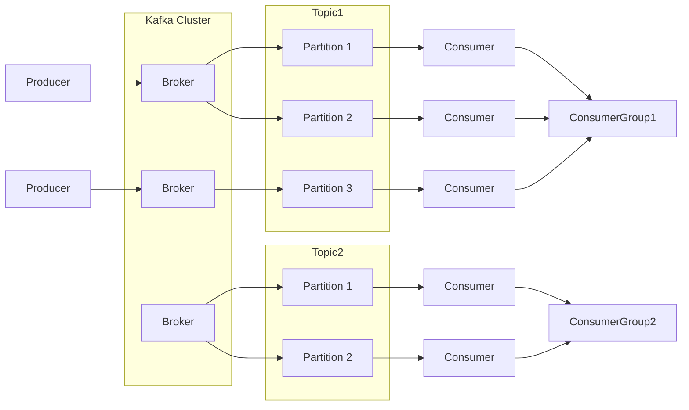
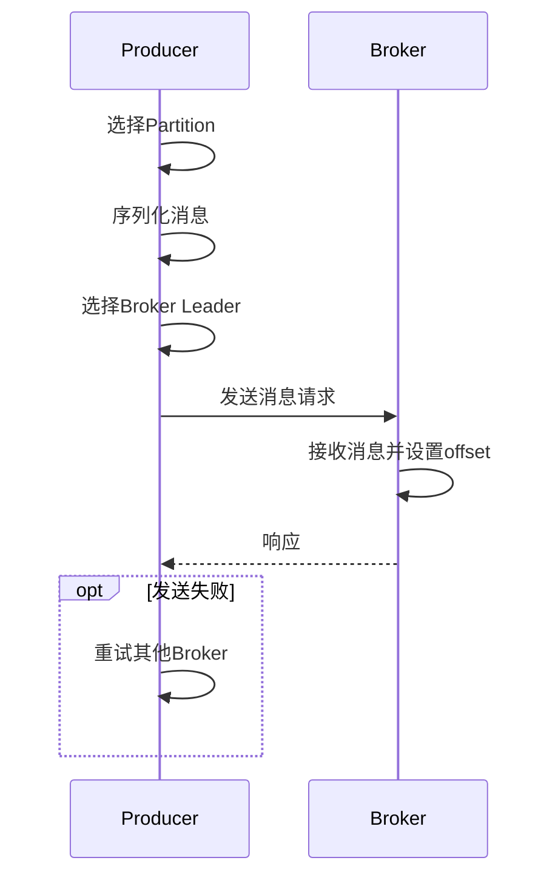

# AI系统Kafka原理与代码实战案例讲解

## 1.背景介绍

### 1.1 什么是Kafka

Apache Kafka是一个分布式流处理平台。它是一个可扩展的、容错的发布-订阅消息队列,最初由LinkedIn公司开发。Kafka旨在为处理实时数据提供一个统一、高吞吐量、低延迟的平台。

### 1.2 Kafka的应用场景

Kafka被广泛应用于以下场景:

- 消息系统 - 用于构建实时流数据管道,实现系统解耦和异步通信
- 活动跟踪 - 跟踪网站活动、服务器日志等,用于在线或离线分析
- 数据集成 - 从多个数据源收集数据到集中存储,如Hadoop或离线数据仓库
- 流处理 - 对实时数据流进行低延迟处理和转换

### 1.3 Kafka的优势

相比传统消息队列,Kafka具有以下优势:

- 高吞吐量 - 能够以集群方式运行并处理大量数据
- 可扩展性 - 通过分区和复制实现水平扩展
- 持久化 - 消息被持久化到磁盘,可用于批处理
- 高可用性 - 允许节点失败而不影响整体可用性
- 容错性 - 通过复制实现自动故障转移

## 2.核心概念与联系 

### 2.1 Kafka架构

Kafka集群通常由以下几个组件组成:

- Broker - Kafka集群由一个或多个服务实例组成,称为Broker
- Topic - 消息按主题(Topic)进行分类,每个Topic可分为多个分区(Partition)
- Partition - Topic中的消息被分散存储在多个Partition中
- Producer - 向Kafka发送消息的客户端
- Consumer - 从Kafka订阅并消费消息的客户端
- Consumer Group - 一组Consumer,同一Group内的Consumer只消费不同Partition的消息



### 2.2 核心概念解析

- **Broker**：Kafka集群中的每个服务实例称为Broker。Broker接收来自Producer的消息，为消息设置偏移量，并提交消息到磁盘保存。

- **Topic**：Kafka中的消息按主题(Topic)进行分类。Topic是消息的订阅单元,Producer向Topic发布消息,Consumer从Topic订阅消费消息。

- **Partition**：Topic中的消息被分散存储在多个Partition中,每个Partition在集群中的一个Broker上。这种分区方式实现了水平扩展。

- **Producer**：向Kafka发送消息的客户端称为Producer。Producer决定将消息发送到哪个Topic。

- **Consumer**：从Kafka订阅并消费消息的客户端称为Consumer。Consumer订阅一个或多个Topic,并按序从订阅的Partition中拉取消息。

- **Consumer Group**：Kafka中的消费者组由多个Consumer实例组成。同一个Group内的Consumer只消费不同Partition的消息,实现负载均衡和容错。

## 3.核心算法原理具体操作步骤

### 3.1 生产者(Producer)发送消息流程

1. **选择Partition**:Producer根据Partition策略选择将消息发送到Topic的哪个Partition。

2. **序列化消息**:Producer将消息序列化为字节数组,准备发送到Broker。

3. **选择Broker**:Producer基于Topic的Partition元数据选择Broker的领导者(Leader)。

4. **发送消息**:Producer通过TCP协议向Broker发送消息请求。

5. **Broker响应**:Broker接收消息,并为消息设置偏移量(offset),然后返回响应给Producer。

6. **Producer重试**:如果发送失败,Producer可以重试其他Broker。



### 3.2 消费者(Consumer)消费消息流程

1. **加入Consumer Group**:Consumer向Kafka集群的任意Broker发送加入Consumer Group的请求。

2. **订阅Topic**:Consumer向Group Coordinator发送订阅Topic的请求。

3. **分配Partition**:Group Coordinator根据组成员和订阅Topic的Partition分配策略,为每个Consumer分配Partition。

4. **拉取消息**:Consumer从分配的Partition的Leader Broker拉取消息。

5. **处理消息**:Consumer处理拉取到的消息。

6. **提交offset**:处理完消息后,Consumer向Broker提交已消费的offset。

7. **消费位移**:如果Consumer失败,新的Consumer将从提交的offset处继续消费。

```mermaid
sequenceDiagram
    participant C as Consumer
    participant B as Broker
    participant GC as Group Coordinator
    C->>B: 加入Consumer Group
    C->>GC: 订阅Topic
    GC->>GC: 分配Partition
    C->>B: 拉取消息
    C->>C: 处理消息
    C->>B: 提交offset
    opt Consumer失败
        C2 as 新Consumer
        C2->>B: 从提交offset处继续消费
    end
```

## 4.数学模型和公式详细讲解举例说明

### 4.1 Kafka消息传递模型

Kafka采用生产者-消费者模型进行消息传递。生产者将消息发送到Topic的一个或多个Partition,消费者从订阅的Partition拉取并消费消息。

假设有N个生产者和M个消费者,消息以速率λ被生产,以速率μ被消费。我们可以将Kafka消息队列建模为一个M/M/1队列模型。

其中:

- 到达过程为泊松过程,平均到达率为λ
- 服务时间服从负指数分布,平均服务率为μ
- 单个服务台(即单个Partition)

根据M/M/1队列模型,我们可以计算以下性能指标:

- 平均队列长度 $L_q = \frac{\rho}{1-\rho}$
- 平均响应时间 $W_q = \frac{1}{\mu-\lambda}$
- 系统吞吐量 $X = \lambda(1-P_0)$

其中:
- $\rho = \frac{\lambda}{\mu}$ 为系统利用率
- $P_0 = 1 - \rho$ 为系统空闲概率

通过控制λ和μ,我们可以优化Kafka的吞吐量和延迟性能。例如,增加Partition数量可提高μ,从而降低响应时间。

### 4.2 Kafka复制模型

为了实现高可用性,Kafka采用了复制机制。每个Partition都有一个Leader副本和多个Follower副本。

假设有N个Broker,每个Partition有R个副本,其中:

- Leader副本负责处理所有生产和消费请求
- Follower副本从Leader副本复制数据,用于故障转移

我们可以将Kafka的复制模型建模为一个具有N个节点和R个副本的分布式系统。

令:
- λ为节点失效率
- μ为节点恢复率

根据马尔可夫模型,我们可以计算系统可用性为:

$$
A(N, R) = \sum_{i=R}^{N} \binom{N}{i} \left(\frac{\mu}{\lambda+\mu}\right)^i \left(\frac{\lambda}{\lambda+\mu}\right)^{N-i}
$$

其中$\binom{N}{i}$为组合数,表示从N个节点中选取i个节点的方式数。

通过增加副本数R,我们可以提高Kafka的可用性。但同时也会增加存储和网络开销。因此,需要在可用性和成本之间进行权衡。

## 4.项目实践:代码实例和详细解释说明  

本节将通过Java代码示例演示如何使用Kafka Producer和Consumer进行消息的生产和消费。

### 4.1 Producer示例

```java
Properties props = new Properties();
props.put("bootstrap.servers", "localhost:9092");
props.put("key.serializer", "org.apache.kafka.common.serialization.StringSerializer");
props.put("value.serializer", "org.apache.kafka.common.serialization.StringSerializer");

Producer<String, String> producer = new KafkaProducer<>(props);

for (int i = 0; i < 100; i++) {
    String message = "Message " + i;
    producer.send(new ProducerRecord<>("topic1", message));
}

producer.flush();
producer.close();
```

1. 首先创建`Properties`对象,配置Kafka Broker地址和序列化器。
2. 创建`KafkaProducer`实例。
3. 使用`send`方法向Topic发送消息,这里向"topic1"发送100条消息。
4. `flush`确保所有消息被发送出去。
5. 最后关闭Producer。

### 4.2 Consumer示例

```java
Properties props = new Properties();
props.put("bootstrap.servers", "localhost:9092");
props.put("group.id", "group1");
props.put("key.deserializer", "org.apache.kafka.common.serialization.StringDeserializer");
props.put("value.deserializer", "org.apache.kafka.common.serialization.StringDeserializer");

KafkaConsumer<String, String> consumer = new KafkaConsumer<>(props);
consumer.subscribe(Collections.singletonList("topic1"));

while (true) {
    ConsumerRecords<String, String> records = consumer.poll(Duration.ofMillis(100));
    for (ConsumerRecord<String, String> record : records) {
        System.out.println(record.value());
    }
}
```

1. 创建`Properties`对象,配置Kafka Broker地址、Consumer Group和反序列化器。
2. 创建`KafkaConsumer`实例。
3. 调用`subscribe`方法订阅"topic1"。
4. 使用`poll`方法拉取消息,并打印消息内容。

通过这两个示例,我们可以看到Kafka Producer和Consumer的基本用法。在实际应用中,我们还需要处理更多的场景,如消息分区、消费位移提交等。

## 5.实际应用场景

Kafka由于其高吞吐量、可扩展性和容错性,被广泛应用于各种场景。下面列举了一些典型的应用场景:

### 5.1 实时数据管道

Kafka可以作为实时数据管道,将数据从各种来源(如日志文件、传感器、Web应用等)收集并传输到数据湖或数据仓库中,供后续的批处理或实时处理。例如,Netflix使用Kafka作为实时数据管道,将视频观看数据传输到Hadoop集群进行离线分析。

### 5.2 微服务架构

在微服务架构中,Kafka可以用于构建异步事件驱动的通信机制,实现服务之间的解耦。各个微服务将事件发布到Kafka,其他服务订阅并消费感兴趣的事件进行处理。这种模式提高了系统的可扩展性和容错性。

### 5.3 网站活动跟踪

Kafka可以用于收集和处理网站活动数据,如用户浏览记录、点击流等。这些数据可用于实时监控网站性能,也可以进行离线分析,了解用户行为模式,优化网站体验。

### 5.4 物联网(IoT)数据处理

在物联网场景中,大量的传感器数据需要被实时收集和处理。Kafka可以作为实时数据管道,从各个传感器收集数据,并将数据传输到实时处理系统(如Spark Streaming或Flink)进行处理和分析。

### 5.5 日志收集和处理

Kafka可以用于收集和处理各种应用程序日志,如Web服务器日志、应用程序日志等。这些日志数据可用于实时监控应用程序健康状况,也可以进行离线分析,诊断和解决问题。

## 6.工具和资源推荐

### 6.1 Kafka工具

- **Kafka Tool**:官方提供的命令行工具,用于管理和操作Kafka集群。
- **Kafka Manager**:开源Web UI,