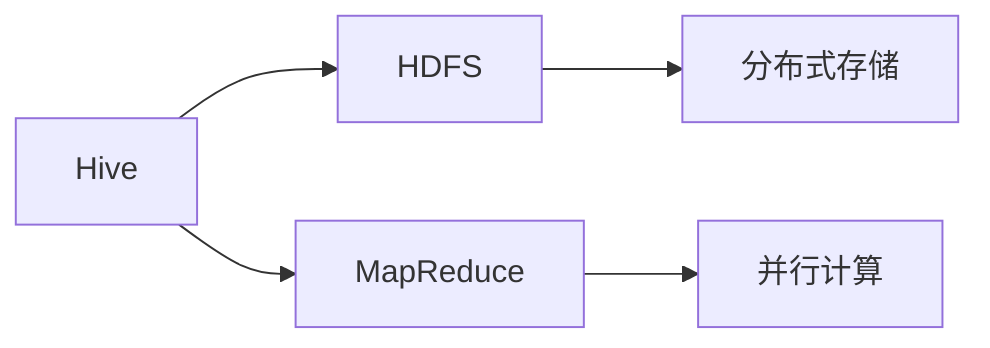
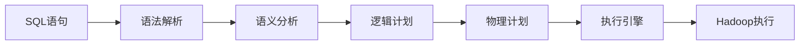

# AI系统Hive原理与代码实战案例讲解

## 1.背景介绍

在当今数据爆炸式增长的时代,如何高效地处理和分析海量数据成为了一个巨大的挑战。传统的数据处理系统往往无法满足实时性、可扩展性和容错性等关键需求。为了解决这些问题,Apache Hive应运而生。

Hive是一种建立在Apache Hadoop之上的数据仓库基础构件,它将结构化的数据文件映射为一张数据库表,并提供类SQL语句来实现数据的统计分析查询。Hive的设计目标是通过将数据查询语言SQL与分布式计算框架MapReduce有机结合,为用户提供更加熟悉的数据访问方式,从而大大降低了数据分析的门槛。

## 2.核心概念与联系

### 2.1 Hive核心概念

**Hive数据仓库(Hive Warehouse)**: Hive中所有的数据都存储在Hive数据仓库目录中,默认路径为`/user/hive/warehouse`。

**外部表(External Table)**: 外部表的数据存储位置可以是数据仓库目录,也可以是其他指定的路径。

**内部表(Internal Table)**: 内部表的数据存储位置默认为数据仓库目录下的`/user/hive/warehouse/数据库名.db/表名`。

**分区(Partition)**: 分区是将表中的数据按照分区字段进行分区存储,方便数据的查询和管理。

**Bucket(Bucketing)**: 分桶是在分区的基础上,根据数据的Hash值对数据进行进一步的划分,以提高数据的查询效率。

**视图(View)**: 视图是一种虚拟表,用于简化复杂查询或者重用查询逻辑。

### 2.2 Hive与Hadoop的关系

Hive依赖于Hadoop提供的HDFS和MapReduce服务。HDFS为Hive提供了分布式数据存储服务,而MapReduce为Hive提供了并行计算能力。Hive将SQL语句转换为MapReduce作业,然后在Hadoop集群上执行。



## 3.核心算法原理具体操作步骤  

### 3.1 Hive SQL执行流程

当用户提交一个Hive SQL语句时,Hive的执行流程如下:

1. **语法解析(Parser)**: 将SQL语句转换为抽象语法树(AST)。
2. **语义分析(Semantic Analyzer)**: 对AST进行语义检查,如表是否存在、字段是否正确等。
3. **逻辑计划(Logical Plan)**: 根据AST生成逻辑执行计划。
4. **物理计划(Physical Plan)**: 将逻辑执行计划转换为物理执行计划,即MapReduce作业。
5. **执行引擎(Execution Engine)**: 将物理执行计划提交给Hadoop进行执行。



### 3.2 Hive查询优化

Hive在执行查询时,会自动进行一些优化,以提高查询效率:

1. **投影剪裁(Projection Pruning)**: 只读取查询中需要的列,减少IO开销。
2. **分区剪裁(Partition Pruning)**: 只扫描满足条件的分区,避免全表扫描。
3. **预先合并(Bucketed Mapjoin)**: 对于Join操作,如果两个表都进行了分桶,可以在Map端进行Join,减少数据传输。
4. **延迟向量化(Vectorization)**: 将行式数据转换为列式数据,提高CPU利用率。

## 4.数学模型和公式详细讲解举例说明

在Hive中,常用的数学函数有:

1. **聚合函数**: 如`SUM`、`AVG`、`COUNT`等,用于对一组值进行聚合计算。

   $$AVG(col) = \frac{\sum_{i=1}^{n}col_i}{n}$$

   其中$n$表示记录数,$col_i$表示第$i$条记录的$col$列的值。

2. **数学函数**: 如`ROUND`、`FLOOR`、`CEIL`等,用于对数值进行取整或舍入操作。

   $$ROUND(x, d) = \lfloor(x\times10^d+0.5)\rfloor\times10^{-d}$$

   其中$x$表示原始数值,$d$表示小数位数,$\lfloor\cdot\rfloor$表示向下取整。

3. **统计函数**: 如`CORR`、`VARIANCE`、`STDDEV`等,用于计算数据的统计特征。

   $$VAR(col) = \frac{\sum_{i=1}^{n}(col_i-\overline{col})^2}{n}$$

   其中$\overline{col}$表示$col$列的均值。

## 5.项目实践:代码实例和详细解释说明

下面通过一个电商数据分析的实例,演示Hive的基本使用。

### 5.1 创建表

首先,创建一张用于存储订单数据的表:

```sql
CREATE TABLE orders(
    order_id BIGINT,
    order_date STRING,
    order_customer_id BIGINT,
    order_status STRING
)
ROW FORMAT DELIMITED
FIELDS TERMINATED BY ','
STORED AS TEXTFILE;
```

这里使用了逗号分隔的文本文件存储数据。

### 5.2 加载数据

将订单数据文件`orders.txt`加载到Hive表中:

```sql
LOAD DATA LOCAL INPATH '/path/to/orders.txt' 
OVERWRITE INTO TABLE orders;
```

### 5.3 创建分区表

为了提高查询效率,我们可以按照`order_date`字段对数据进行分区:

```sql
CREATE TABLE orders_part(
    order_id BIGINT,
    order_customer_id BIGINT,
    order_status STRING
)
PARTITIONED BY (order_date STRING)
ROW FORMAT DELIMITED
FIELDS TERMINATED BY ',';

-- 加载数据到分区表
SET HIVE.EXEC.DYNAMIC.PARTITION=true;
SET HIVE.EXEC.DYNAMIC.PARTITION.MODE=nonstrict;

INSERT OVERWRITE TABLE orders_part
PARTITION (order_date)
SELECT order_id, order_customer_id, order_status, order_date
FROM orders;
```

### 5.4 数据查询分析

现在,我们可以对订单数据进行各种查询和分析操作:

```sql
-- 统计每个客户的订单数
SELECT order_customer_id, COUNT(*) AS order_count
FROM orders_part
GROUP BY order_customer_id;

-- 计算每个状态的订单金额总和(假设有order_total_cost字段)
SELECT order_status, SUM(order_total_cost) AS total_cost
FROM orders_part
GROUP BY order_status;

-- 查询最近7天的订单数据
SELECT *
FROM orders_part
WHERE order_date >= DATE_SUB(CURRENT_DATE(), 7);
```

## 6.实际应用场景

Hive广泛应用于以下场景:

1. **数据仓库构建**: Hive可以将HDFS上的结构化数据映射为数据库表,为数据仓库应用提供SQL查询支持。

2. **日志数据分析**: Hive适合对网站访问日志、服务器日志等结构化日志数据进行离线分析。

3. **ETL工具**: Hive可以作为ETL(提取、转换、加载)工具,对数据进行清洗、转换和加载。

4. **机器学习数据处理**: Hive可以对机器学习所需的大规模数据集进行预处理和特征提取。

## 7.工具和资源推荐

1. **Hive官方文档**: https://hive.apache.org/
2. **Hive编程指南**: https://cwiki.apache.org/confluence/display/Hive/Home
3. **Hive可视化工具**: Hue、DBeaver等
4. **Hive性能优化**: https://cwiki.apache.org/confluence/display/Hive/Hive+Performance+Tuning
5. **Hive最佳实践**: https://cwiki.apache.org/confluence/display/Hive/Hive+Best+Practices

## 8.总结:未来发展趋势与挑战

Hive作为一种SQL-on-Hadoop的解决方案,极大地降低了大数据分析的门槛,但也存在一些局限性:

1. **延迟高**: Hive基于MapReduce,每个查询都需要启动新的作业,导致高延迟。
2. **资源利用率低**: MapReduce作业之间无法共享资源,造成资源浪费。
3. **功能有限**: 与传统数据库相比,Hive在事务支持、更新操作等方面功能较为有限。

为了解决这些问题,新一代的SQL-on-Hadoop引擎如Apache Spark、Apache Impala等应运而生,它们提供了更低的延迟、更高的资源利用率和更丰富的功能。

未来,随着云计算、人工智能等新技术的发展,大数据分析将面临新的挑战和机遇。Hive及其生态系统也将继续演进,以满足不断变化的需求。

## 9.附录:常见问题与解答

1. **Hive是否支持实时查询?**

   Hive主要面向离线批量数据处理,不适合实时查询场景。如需实时查询,可以考虑使用Apache Impala或Apache Spark SQL等引擎。

2. **Hive如何处理带有NULL值的数据?**

   Hive在处理NULL值时,遵循SQL标准。例如,`SUM(col)`会忽略NULL值,而`COUNT(col)`会统计NULL值。可以使用`COALESCE`函数替换NULL值。

3. **Hive是否支持事务?**

   从Hive 0.13版本开始,支持基本的ACID事务,但功能有限。对于复杂的事务场景,建议使用传统的关系型数据库。

4. **如何提高Hive的查询性能?**

   可以从以下几个方面着手:数据压缩、分区剪裁、预先合并、延迟向量化等优化手段;合理设置Hive参数;使用Tez或Spark作为执行引擎等。

5. **Hive与Spark SQL的区别是什么?**

   Hive基于MapReduce,主要面向批量数据处理;而Spark SQL基于Spark,支持批处理和流处理,具有更低的延迟和更高的吞吐量。但Hive在社区支持和成熟度方面更有优势。

作者: 禅与计算机程序设计艺术 / Zen and the Art of Computer Programming