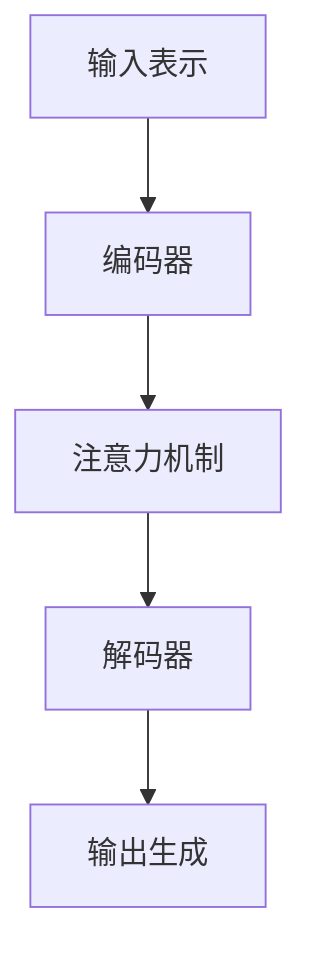

# Language Translation原理与代码实例讲解

## 1.背景介绍

在当今全球化的世界中,不同语言之间的交流和理解变得越来越重要。语言翻译技术的发展使得人与人之间、人与机器之间的语言障碍得以消除,为跨语言交流提供了便利。语言翻译不仅仅是将一种语言转换为另一种语言的简单替换,更重要的是要保持语义和语境的一致性,确保翻译的准确性和可读性。

语言翻译技术的发展经历了多个阶段,从最初的基于规则的翻译系统,到统计机器翻译,再到当前的基于神经网络的神经机器翻译(NMT)。每一个新的技术阶段都显著提高了翻译质量,使得机器翻译越来越接近人工翻译的水平。

## 2.核心概念与联系

语言翻译涉及多个关键概念,包括:

1. **语言模型(Language Model)**: 用于捕获源语言和目标语言的语法和语义规则,以生成自然和流畅的翻译结果。

2. **翻译模型(Translation Model)**: 建立源语言和目标语言之间的对应关系,将源语言映射到目标语言。

3. **序列到序列模型(Sequence-to-Sequence Model)**: 将翻译任务建模为将源语言序列映射到目标语言序列的过程,通常使用编码器-解码器架构。

4. **注意力机制(Attention Mechanism)**: 允许模型在生成翻译时,动态关注源语言序列中的不同部分,提高了翻译质量。

5. **词嵌入(Word Embedding)**: 将单词映射到连续的向量空间中,捕获单词之间的语义关系。

6. **子词(Subword)**: 将单词分解为更小的子词单元,如字符或字节对,以处理未见词和减少词汇表大小。

这些概念相互关联,共同构建了现代神经机器翻译系统的基础。

## 3.核心算法原理具体操作步骤

神经机器翻译系统通常采用编码器-解码器架构,其核心算法原理可概括为以下步骤:

1. **输入表示**: 将源语言序列转换为向量表示,通常使用词嵌入或子词嵌入。

2. **编码器**: 使用递归神经网络(RNN)或transformer编码器对输入序列进行编码,获得源语言的上下文表示。

3. **注意力机制**: 计算目标序列每个位置对源语言序列不同位置的注意力权重,捕获源语言和目标语言之间的对应关系。

4. **解码器**: 使用RNN或transformer解码器,结合注意力权重和目标语言的语言模型,生成目标语言序列的每个词。

5. **输出生成**: 根据解码器的输出概率分布,选择最可能的词作为翻译结果。

此外,还可以采用诸如束搜索(Beam Search)等解码策略,以提高翻译质量。



## 4.数学模型和公式详细讲解举例说明

神经机器翻译系统的数学模型通常基于条件概率,目标是最大化给定源语言序列 $X$ 时,生成目标语言序列 $Y$ 的条件概率 $P(Y|X)$。

$$P(Y|X) = \prod_{t=1}^{T}P(y_t|y_{<t}, X)$$

其中, $T$ 是目标序列的长度, $y_t$ 是第 $t$ 个目标词, $y_{<t}$ 表示前 $t-1$ 个目标词。

在基于注意力的序列到序列模型中,条件概率 $P(y_t|y_{<t}, X)$ 可以由编码器和解码器计算得到:

$$P(y_t|y_{<t}, X) = \text{Decoder}(y_{<t}, c_t, s_t)$$

其中, $c_t$ 是注意力机制计算得到的上下文向量,表示目标词 $y_t$ 对源语言序列 $X$ 的注意力权重; $s_t$ 是解码器的隐藏状态,编码了目标语言的语言模型信息。

注意力机制的计算公式为:

$$c_t = \sum_{j=1}^{J}\alpha_{tj}h_j$$

$$\alpha_{tj} = \frac{\exp(e_{tj})}{\sum_{k=1}^{J}\exp(e_{tk})}$$

$$e_{tj} = \text{score}(s_{t-1}, h_j)$$

其中, $h_j$ 是编码器在位置 $j$ 的输出, $\alpha_{tj}$ 是注意力权重, $e_{tj}$ 是注意力能量,通过评分函数 $\text{score}$ 计算得到。

通过优化上述条件概率的对数似然,可以训练神经机器翻译模型的参数。

## 5.项目实践:代码实例和详细解释说明

以下是一个使用Python和PyTorch实现的简单神经机器翻译系统的代码示例,用于将英语翻译成法语。

```python
import torch
import torch.nn as nn
import torch.optim as optim

# 数据预处理
src_vocab = {'I': 0, 'am': 1, 'a': 2, 'student': 3}
tgt_vocab = {'je': 0, 'suis': 1, 'un': 2, 'etudiant': 3}

# 编码器
class Encoder(nn.Module):
    def __init__(self, input_size, hidden_size):
        super(Encoder, self).__init__()
        self.hidden_size = hidden_size
        self.embedding = nn.Embedding(input_size, hidden_size)
        self.gru = nn.GRU(hidden_size, hidden_size)

    def forward(self, input, hidden):
        embedded = self.embedding(input).view(1, 1, -1)
        output, hidden = self.gru(embedded, hidden)
        return output, hidden

# 注意力机制
def attention(hidden, encoder_outputs):
    energy = hidden.squeeze(0).unsqueeze(2) @ encoder_outputs.permute(1, 2, 0)
    attention = torch.softmax(energy, dim=2)
    return (attention @ encoder_outputs.permute(1, 0, 2)).permute(1, 2, 0)

# 解码器
class Decoder(nn.Module):
    def __init__(self, hidden_size, output_size):
        super(Decoder, self).__init__()
        self.hidden_size = hidden_size
        self.embedding = nn.Embedding(output_size, hidden_size)
        self.gru = nn.GRU(hidden_size, hidden_size)
        self.out = nn.Linear(hidden_size, output_size)
        self.softmax = nn.LogSoftmax(dim=1)

    def forward(self, input, hidden, encoder_outputs):
        output = self.embedding(input).view(1, 1, -1)
        output = torch.cat((output, attention(hidden, encoder_outputs).unsqueeze(0)), 2)
        output, hidden = self.gru(output, hidden)
        output = self.softmax(self.out(output[0]))
        return output, hidden

# 模型初始化
encoder = Encoder(len(src_vocab), 256)
decoder = Decoder(256, len(tgt_vocab))

# 模型训练
criterion = nn.NLLLoss()
encoder_optimizer = optim.SGD(encoder.parameters(), lr=0.01)
decoder_optimizer = optim.SGD(decoder.parameters(), lr=0.01)

# 训练循环
for epoch in range(10):
    input_tensor = torch.tensor([src_vocab['I'], src_vocab['am'], src_vocab['a'], src_vocab['student']], dtype=torch.long)
    target_tensor = torch.tensor([tgt_vocab['je'], tgt_vocab['suis'], tgt_vocab['un'], tgt_vocab['etudiant']], dtype=torch.long)

    loss = 0
    encoder_hidden = torch.zeros(1, 1, encoder.hidden_size)
    encoder_outputs, encoder_hidden = encoder(input_tensor, encoder_hidden)

    decoder_input = torch.tensor([[tgt_vocab['<sos>']]], dtype=torch.long)
    decoder_hidden = encoder_hidden

    for di in range(target_tensor.size(0)):
        decoder_output, decoder_hidden = decoder(decoder_input, decoder_hidden, encoder_outputs)
        loss += criterion(decoder_output, target_tensor[di])
        decoder_input = target_tensor[di].view(1, 1)

    loss.backward()
    encoder_optimizer.step()
    decoder_optimizer.step()

# 模型评估
input_tensor = torch.tensor([src_vocab['I'], src_vocab['am'], src_vocab['a'], src_vocab['student']], dtype=torch.long)
encoder_hidden = torch.zeros(1, 1, encoder.hidden_size)
encoder_outputs, encoder_hidden = encoder(input_tensor, encoder_hidden)

decoder_input = torch.tensor([[tgt_vocab['<sos>']]], dtype=torch.long)
decoder_hidden = encoder_hidden

decoded_words = []
for di in range(20):
    decoder_output, decoder_hidden = decoder(decoder_input, decoder_hidden, encoder_outputs)
    topv, topi = decoder_output.data.topk(1)
    if topi.item() == tgt_vocab['<eos>']:
        break
    else:
        decoded_words.append(list(tgt_vocab.keys())[topi.item()])

    decoder_input = topi.view(1, 1)

print('Decoded sentence:', ' '.join(decoded_words))
```

上述代码实现了一个简单的序列到序列模型,包括编码器、注意力机制和解码器三个主要部分。

- 编码器使用GRU网络对输入序列进行编码,获得上下文向量。
- 注意力机制计算解码器每个时间步对编码器输出的注意力权重。
- 解码器结合注意力权重和目标语言的语言模型,生成翻译结果。

在训练过程中,使用随机梯度下降优化器更新模型参数,最小化负对数似然损失。在评估阶段,通过贪婪搜索或束搜索生成翻译序列。

虽然这是一个简化的示例,但它展示了神经机器翻译系统的核心原理和实现思路。在实际应用中,通常会使用更复杂的模型架构(如Transformer)、更大的数据集和更多的优化技巧来提高翻译质量。

## 6.实际应用场景

神经机器翻译技术在许多实际应用场景中发挥着重要作用,包括但不限于:

1. **在线翻译服务**: 提供实时的跨语言翻译,方便用户浏览外语网页、进行跨语言交流等。谷歌翻译、百度翻译等都采用了神经机器翻译技术。

2. **多语种内容本地化**: 将网站、应用程序、游戏等内容翻译成多种语言,为不同地区的用户提供本地化体验。

3. **会议同声传译**: 实时将发言内容翻译成其他语言,用于国际会议、视频会议等场景。

4. **跨语言信息检索**: 将查询和文档翻译成相同语言,实现跨语言的信息检索和理解。

5. **语言辅助工具**: 集成到文字处理软件、电子邮件客户端等应用中,提供翻译辅助功能。

6. **多语种客户服务**: 为客户提供多语种的客户服务和支持,提高服务质量和用户体验。

7. **语音翻译**: 将语音输入翻译成文本,再将文本翻译成目标语言,实现跨语言的语音交流。

8. **新闻、社交媒体内容翻译**: 自动翻译新闻报道、社交媒体帖子等内容,促进信息的跨语言传播。

随着神经机器翻译技术的不断进步,它在更多领域将发挥重要作用,推动语言障碍的消除和文化交流的加深。

## 7.工具和资源推荐

对于想要学习和使用神经机器翻译技术的开发者和研究人员,以下是一些推荐的工具和资源:

1. **开源框架**:
   - Fairseq: Facebook AI Research开发的序列到序列学习工具包,支持多种翻译模型。
   - OpenNMT: Harvard NLP开发的开源神经机器翻译系统,提供多种模型和工具。
   - Tensor2Tensor: Google Brain团队开发的深度学习库,支持多种序列到序列任务。

2. **预训练模型**:
   - BART: Facebook AI Research开发的用于序列生成任务的预训练模型。
   - mT5: Google AI开发的多语种预训练模型,支持多达101种语言。
   - M2M-100: Facebook AI Research开发的支持100多种语言的多语种预训练模型。

3. **数据集**:
   - WMT: 机器翻译领域最权威的评测数据集,包括多种语言对。
   - TED Talks: TED演讲的多语种语料库,常用于训练和评估机器翻译系统。
   - OPUS: 开放的并行语料库,涵盖多个领域和语言对。

4. **在线资源**:
   - Machine Translation Archive: 包含大量机器