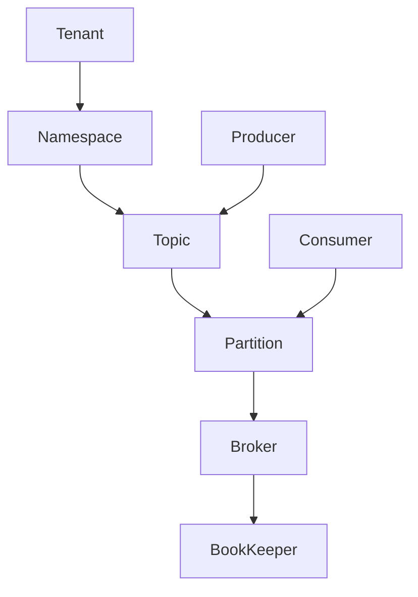

# Pulsar原理与代码实例讲解

## 1. 背景介绍

### 1.1 Pulsar的起源与发展
Pulsar是由Yahoo开发的一个分布式pub-sub消息系统,于2016年9月成为Apache顶级开源项目。它具有高吞吐、低延迟、高可扩展性等特点,被广泛应用于实时计算、日志收集、在线机器学习等领域。

### 1.2 Pulsar在大数据生态系统中的地位
在当前大数据生态系统中,Pulsar与Kafka、RocketMQ等消息队列一起,构成了数据管道的重要组成部分。相比其他消息队列,Pulsar在多租户、跨地域复制、强一致性等方面有独特优势。

### 1.3 学习Pulsar的意义
对于开发者而言,深入理解Pulsar的原理和使用,有助于设计和构建更加高效、可靠的流式数据处理系统。同时Pulsar社区也在快速发展,参与其中有利于个人成长。

## 2. 核心概念与联系

### 2.1 Producer与Consumer
- Producer: 消息生产者,负责将消息发送到Pulsar中
- Consumer: 消息消费者,负责从Pulsar中拉取消息并消费

### 2.2 Topic与Partition
- Topic: 消息的逻辑分类,生产者发送消息到指定的Topic,消费者从Topic拉取消息
- Partition: Topic物理上的分区,一个Topic可以划分为多个Partition,提高并行度

### 2.3 Broker与BookKeeper
- Broker: 无状态的消息服务进程,负责接收和分发消息
- BookKeeper: 一个分布式的日志存储系统,Pulsar用它来持久化消息

### 2.4 Namespace与Tenant
- Tenant: 租户,一个物理隔离的资源容器
- Namespace: 租户下的逻辑隔离单元,不同Namespace的Topic可以配置不同的策略

以上概念的关系可以用下图表示:



## 3. 核心算法原理与具体操作步骤

### 3.1 生产消息的过程
1. Producer连接到任一Broker
2. Producer查询Topic所在的Broker
3. Producer将消息发送到Topic的一个Partition对应的Broker
4. Broker将消息持久化到BookKeeper
5. Broker返回ack给Producer

### 3.2 消费消息的过程 
1. Consumer连接到任一Broker
2. Consumer查询Topic的Partition信息
3. Consumer从各个Partition对应的Broker拉取消息
4. Broker从BookKeeper读取消息返回给Consumer
5. Consumer处理消息,更新消费进度

### 3.3 消息分发算法
Pulsar采用了一致性哈希算法将消息均匀分发到各个Partition,具体步骤如下:

1. 将Partition和Consumer的hash值映射到一个圆环上
2. 将消息的key进行hash,确定其在圆环上的位置
3. 顺时针找到第一个Partition,将消息发送到该Partition
4. 当Consumer增减时,只需调整受影响的一小部分映射关系

## 4. 数学模型和公式详解

### 4.1 指数衰减移动平均算法
Pulsar使用EWMA(Exponential Weighted Moving Average)来估计消息的生产和消费速率,公式如下:

$$\begin{aligned}
\mathrm{EWMA}_{t} &=\mathrm{EWMA}_{t-1}+\alpha \cdot\left(r_{t}-\mathrm{EWMA}_{t-1}\right) \\
&=(1-\alpha) \cdot \mathrm{EWMA}_{t-1}+\alpha \cdot r_{t}
\end{aligned}$$

其中$r_t$表示第$t$个时间窗口的速率,$\alpha$是平滑因子,控制历史数据的权重衰减速度。

### 4.2 生产者限流算法
Pulsar基于EWMA实现了生产者限流,核心思想是根据消费速率动态调整生产速率。假设目标消息积压量为$\tau$,则限流阈值计算公式为:

$$\mathrm{rateLimit}=\max \left(consumeEWMA-\frac{maxPendingMessages-\tau}{adjustTimeMs}, 0\right)$$

其中$consumeEWMA$为消费EWMA速率,$maxPendingMessages$为当前实际消息积压量,$adjustTimeMs$为期望在多长时间内调整到目标积压量。

## 5. 项目实践:代码实例与详解

下面是一个简单的Pulsar Java客户端示例,包括生产者、消费者两部分。

### 5.1 添加Maven依赖
```xml
<dependency>
  <groupId>org.apache.pulsar</groupId>
  <artifactId>pulsar-client</artifactId>
  <version>2.7.0</version>
</dependency>
```

### 5.2 生产者示例
```java
PulsarClient client = PulsarClient.builder()
        .serviceUrl("pulsar://localhost:6650")
        .build();
Producer<byte[]> producer = client.newProducer()
        .topic("my-topic")
        .create();
for (int i = 0; i < 10; i++) {
    producer.send(("Hello Pulsar " + i).getBytes());
}
producer.close();
client.close();
```

这段代码创建了一个Pulsar客户端,连接到本地的Pulsar服务。然后创建了一个Producer,向名为"my-topic"的Topic发送10条消息。

### 5.3 消费者示例
```java
PulsarClient client = PulsarClient.builder()
        .serviceUrl("pulsar://localhost:6650")
        .build();
Consumer consumer = client.newConsumer()
        .topic("my-topic")
        .subscriptionName("my-subscription")
        .subscribe();
while (true) {
    Message msg = consumer.receive();
    System.out.printf("Message received: %s", new String(msg.getData()));
    consumer.acknowledge(msg);
}
consumer.close();
client.close();
```

这段代码创建了一个Pulsar消费者,订阅了"my-topic"这个Topic,消费组名为"my-subscription"。然后不断地接收消息,并打印消息内容,同时进行消息确认。

## 6. 实际应用场景

### 6.1 日志收集与处理
Pulsar可以作为分布式日志收集的中间件,接收来自各个服务器上的日志,再由下游的流处理引擎如Flink、Spark等进行实时处理和分析。

### 6.2 消息队列
Pulsar可以替代Kafka等传统消息队列,实现各个微服务之间的异步通信和解耦。同时Pulsar支持多租户和跨地域复制,适合大规模分布式场景。

### 6.3 实时计算
Pulsar可以作为实时计算引擎的数据源,提供低延迟、高吞吐的数据流,例如用于实时推荐、欺诈检测等场景。

## 7. 工具与资源推荐

- [Pulsar官网](https://pulsar.apache.org/): Pulsar项目官方网站,包含文档、博客等
- [Pulsar Github](https://github.com/apache/pulsar): Pulsar项目源码,可以了解内部实现
- [Pulsar Summit](https://pulsar-summit.org/): Pulsar开发者大会,分享最佳实践和使用案例
- [StreamNative](https://streamnative.io/): 专注于Pulsar的商业公司,提供云服务和技术支持

## 8. 总结:未来发展与挑战

### 8.1 云原生化
Pulsar需要更好地适应云原生环境,提供Kubernetes部署模式,与服务网格结合,简化运维。

### 8.2 SQL支持
Pulsar需要提供SQL接口,方便用户进行数据查询和分析,与Presto、Flink等引擎集成。

### 8.3 弹性伸缩
Pulsar需要提供更加智能的资源调度和弹性伸缩能力,根据负载情况自动调整Broker、BookKeeper数量。

### 8.4 多语言支持
目前Pulsar主要支持Java和C++,需要提供更多语言的SDK,如Go、Python等,方便不同语言的开发者使用。

## 9. 附录:常见问题与解答

### 9.1 Pulsar与Kafka的区别是什么?
Pulsar在很多方面都与Kafka类似,但主要区别在于:
- Pulsar将存储和计算分离,使用BookKeeper进行存储,而Kafka使用自己的日志存储
- Pulsar原生支持多租户和跨地域复制,更适合云环境
- Pulsar支持更灵活的订阅模型,如Shared、Failover、Key_Shared等

### 9.2 Pulsar如何保证消息的顺序性?
Pulsar默认保证同一个Partition内的消息是有序的,但不保证全局有序。如果需要全局有序,可以将Topic的Partition数设置为1,或者使用Key_Shared订阅模型,将同一个Key的消息路由到同一个Consumer。

### 9.3 Pulsar如何实现跨地域复制?
Pulsar支持异步和同步两种跨地域复制模式,前者通过BookKeeper的异地复制机制实现,后者通过Pulsar的Geo Replication协议实现。用户可以根据需求在不同Namespace或者Topic上配置不同的复制策略。

作者：禅与计算机程序设计艺术 / Zen and the Art of Computer Programming