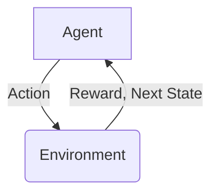

# Reinforcement Learning原理与代码实例讲解

## 1.背景介绍

强化学习(Reinforcement Learning, RL)是机器学习的一个重要分支,它关注如何基于环境反馈来学习行为策略,以最大化长期累积奖励。与监督学习和无监督学习不同,强化学习没有提供明确的输入/输出对样本,而是通过与环境的互动来学习。

强化学习的思想源于心理学中的行为主义理论,后来被数学家扩展到最优控制理论和运筹学中。近年来,随着深度学习的兴起,结合深度神经网络,强化学习在多个领域取得了突破性进展,如电子游戏、机器人控制、自动驾驶等。

强化学习的核心思想是让智能体(Agent)通过与环境(Environment)的交互来学习,获得奖励最大化的策略。这种学习过程没有人为标注的训练数据,而是通过试错和累积经验来优化决策。



## 2.核心概念与联系

### 2.1 智能体(Agent)

智能体是指能够感知环境、做出决策并执行动作的主体。它根据当前状态选择一个动作,将动作执行到环境中,并观察环境的反馈。

### 2.2 环境(Environment)

环境是指智能体所处的外部世界,包括所有可能的状态。环境会根据智能体的动作产生新的状态,并给出对应的奖励或惩罚信号。

### 2.3 状态(State)

状态是环境在某个特定时刻的具体情况,包含了足够的信息来描述智能体所处的位置和状况。

### 2.4 动作(Action)

动作是智能体对环境可以采取的操作,会导致环境状态的转移。

### 2.5 奖励(Reward)

奖励是环境对智能体当前动作的评价反馈,它是一个标量值,正值表示获得奖赏,负值表示受到惩罚。目标是最大化整个过程中累积获得的奖励。

### 2.6 策略(Policy)

策略是智能体在每个状态下选择动作的规则或映射函数。它定义了智能体如何在给定状态下选择动作。强化学习的目标就是寻找一个最优策略。

## 3.核心算法原理具体操作步骤

强化学习算法的核心思想是让智能体通过与环境交互来学习,根据获得的奖励信号不断优化自身的策略。主要分为以下几个步骤:

1. **初始化**:初始化智能体和环境,设置初始状态。

2. **选择动作**:根据当前状态和策略,智能体选择一个动作。

3. **执行动作**:智能体执行选择的动作,环境转移到新的状态。

4. **获取奖励**:环境根据智能体的动作给出对应的奖励或惩罚。

5. **更新策略**:根据获得的奖励,智能体更新自身的策略,以提高未来获得更大奖励的可能性。

6. **重复交互**:重复步骤2-5,直到达到终止条件(如最大回合数)。

该过程可以用以下伪代码表示:

```python
初始化智能体和环境
repeat:
    当前状态 = 环境.获取当前状态()
    动作 = 智能体.选择动作(当前状态)
    新状态, 奖励 = 环境.执行动作(动作)
    智能体.更新策略(当前状态, 动作, 奖励, 新状态)
until 终止条件满足
```

在这个循环过程中,智能体通过不断试错和累积经验,逐步优化自身的策略,以期获得最大的长期累积奖励。

## 4.数学模型和公式详细讲解举例说明

### 4.1 马尔可夫决策过程(Markov Decision Process, MDP)

强化学习问题通常建模为马尔可夫决策过程(MDP),它是一个离散时间的随机控制过程,由以下几个要素组成:

- 状态集合 $\mathcal{S}$
- 动作集合 $\mathcal{A}$
- 转移概率 $\mathcal{P}_{ss'}^a = \mathcal{P}(s' \mid s, a)$,表示在状态 $s$ 执行动作 $a$ 后,转移到状态 $s'$ 的概率
- 奖励函数 $\mathcal{R}_s^a$ 或 $\mathcal{R}_{ss'}^a$,表示在状态 $s$ 执行动作 $a$ 获得的奖励
- 折扣因子 $\gamma \in [0, 1)$,用于权衡未来奖励的重要性

在 MDP 中,我们希望找到一个策略 $\pi: \mathcal{S} \rightarrow \mathcal{A}$,使得期望的累积折扣奖励最大化:

$$
\max_\pi \mathbb{E}_\pi \left[ \sum_{t=0}^\infty \gamma^t r_t \right]
$$

其中 $r_t$ 是在时间步 $t$ 获得的奖励。

### 4.2 价值函数(Value Function)

价值函数用于评估一个状态或状态-动作对在遵循某个策略时的长期价值。有两种形式:

**状态价值函数** $V^\pi(s)$:表示从状态 $s$ 开始,遵循策略 $\pi$ 所能获得的期望累积奖励:

$$
V^\pi(s) = \mathbb{E}_\pi \left[ \sum_{t=0}^\infty \gamma^t r_t \mid s_0 = s \right]
$$

**状态-动作价值函数** $Q^\pi(s, a)$:表示从状态 $s$ 开始,先执行动作 $a$,然后遵循策略 $\pi$ 所能获得的期望累积奖励:

$$
Q^\pi(s, a) = \mathbb{E}_\pi \left[ \sum_{t=0}^\infty \gamma^t r_t \mid s_0 = s, a_0 = a \right]
$$

价值函数满足以下递推关系,称为**贝尔曼方程**:

$$
\begin{aligned}
V^\pi(s) &= \sum_{a \in \mathcal{A}} \pi(a \mid s) \left( \mathcal{R}_s^a + \gamma \sum_{s' \in \mathcal{S}} \mathcal{P}_{ss'}^a V^\pi(s') \right) \\
Q^\pi(s, a) &= \mathcal{R}_s^a + \gamma \sum_{s' \in \mathcal{S}} \mathcal{P}_{ss'}^a V^\pi(s')
\end{aligned}
$$

求解价值函数是强化学习算法的核心,通过估计价值函数可以找到最优策略。

### 4.3 贝尔曼最优方程(Bellman Optimality Equation)

贝尔曼最优方程给出了最优价值函数和最优策略之间的关系:

$$
\begin{aligned}
V^*(s) &= \max_{a \in \mathcal{A}} \left( \mathcal{R}_s^a + \gamma \sum_{s' \in \mathcal{S}} \mathcal{P}_{ss'}^a V^*(s') \right) \\
Q^*(s, a) &= \mathcal{R}_s^a + \gamma \sum_{s' \in \mathcal{S}} \mathcal{P}_{ss'}^a \max_{a' \in \mathcal{A}} Q^*(s', a')
\end{aligned}
$$

其中 $V^*(s)$ 和 $Q^*(s, a)$ 分别是最优状态价值函数和最优状态-动作价值函数。

最优策略 $\pi^*$ 可以通过这些最优价值函数得到:

$$
\pi^*(s) = \arg\max_{a \in \mathcal{A}} Q^*(s, a)
$$

强化学习算法的目标就是求解最优价值函数和最优策略。

## 5.项目实践:代码实例和详细解释说明

以下是一个使用 Python 实现的简单网格世界(GridWorld)强化学习示例,通过 Q-Learning 算法求解最优策略。

### 5.1 环境设置

```python
import numpy as np

# 定义网格世界
WORLD = np.array([
    [0, 0, 0, 1],
    [0, None, 0, -1],
    [0, 0, 0, 0]
])

# 定义动作
ACTIONS = ['left', 'right', 'up', 'down']

# 定义奖励
REWARDS = {
    0: 0,
    1: 1,
    -1: -1,
    None: None
}

# 定义gamma
GAMMA = 0.9
```

这里定义了一个 3x4 的网格世界,其中 0 表示普通状态,1 表示目标状态(获得+1奖励),None 表示障碍物状态(无法到达),-1 表示陷阱状态(获得-1惩罚)。ACTIONS 定义了四个可能的动作,REWARDS 定义了不同状态的奖励值,GAMMA 是折扣因子。

### 5.2 Q-Learning 算法实现

```python
import random

# 初始化Q表
Q = {}
for i in range(WORLD.shape[0]):
    for j in range(WORLD.shape[1]):
        if WORLD[i, j] is not None:
            Q[(i, j)] = {action: 0 for action in ACTIONS}

# 定义epsilon-greedy策略
def epsilon_greedy(state, epsilon):
    if random.uniform(0, 1) < epsilon:
        return random.choice(ACTIONS)
    else:
        return max(Q[state], key=Q[state].get)

# 更新Q值
def update_Q(state, action, reward, next_state):
    current_value = Q[state][action]
    next_max = max([Q[next_state][a] for a in ACTIONS if Q[next_state][a] is not None]) if next_state in Q else 0
    new_value = reward + GAMMA * next_max
    Q[state][action] = current_value + 0.1 * (new_value - current_value)

# 训练
for episode in range(1000):
    state = (0, 0)  # 初始状态
    done = False
    while not done:
        action = epsilon_greedy(state, 0.1)
        next_state, reward = get_next_state_and_reward(state, action)
        update_Q(state, action, reward, next_state)
        state = next_state
        if reward == 1 or reward == -1:
            done = True

# 输出最优策略
for i in range(WORLD.shape[0]):
    for j in range(WORLD.shape[1]):
        if WORLD[i, j] is not None:
            print(f'({i}, {j}): {max(Q[(i, j)], key=Q[(i, j)].get)}')
```

1. 首先初始化 Q 表,为每个状态-动作对设置初始值 0。

2. 定义 epsilon-greedy 策略函数,根据当前状态和 epsilon 值选择动作。epsilon 控制探索和利用的权衡。

3. 定义 update_Q 函数,根据贝尔曼方程更新 Q 值。

4. 进行训练,每个回合从初始状态开始,根据 epsilon-greedy 策略选择动作,执行动作获得奖励和新状态,更新 Q 值。重复直到达到终止状态(获得奖励或惩罚)。

5. 训练结束后,输出每个状态下的最优动作,即最优策略。

这个示例使用 Q-Learning 算法,通过不断试错和更新 Q 值,最终学习到了最优策略。实际应用中,环境和奖励函数可能会更加复杂,但基本原理是相同的。

## 6.实际应用场景

强化学习已经在多个领域取得了重大进展和应用,例如:

1. **游戏AI**: AlphaGo、AlphaZero等利用强化学习战胜了人类顶尖棋手,在国际象棋、围棋、星际争霸等复杂游戏中表现出色。

2. **机器人控制**: 波士顿动力公司的机器人Atlas通过强化学习实现了各种复杂动作,如跳跃、翻滚等。

3. **自动驾驶**: Waymo、Tesla等公司正在使用强化学习技术训练自动驾驶系统,以优化决策和路径规划。

4. **推荐系统**: 强化学习可以用于个性化推荐,通过学习用户的偏好来最大化用户满意度。

5. **对话系统**: 通过与用户的交互,强化学习可以优化对话策略,生成更加自然流畅的对话。

6. **广告投放**: 在线广告系统可以利用强化学习来优化广告投放策略,提高点击率和收益。

7. **资源调度**: 在数据中心、物流等领域,强化学习可以用于资源调度和优化,提高效率。

8. **金融交易**: 量化交易系统可以使用强化学