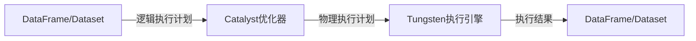
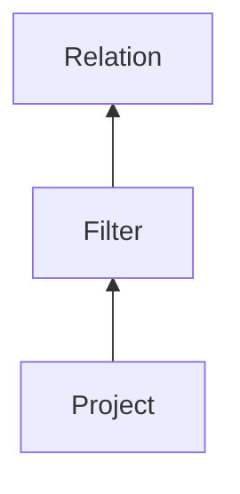
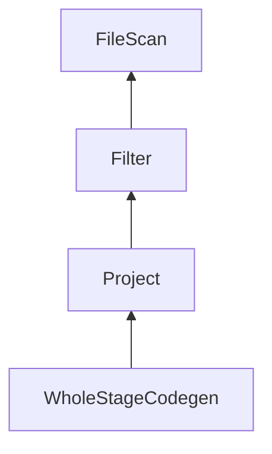

# Spark SQL原理与代码实例讲解

## 1. 背景介绍

在大数据时代,数据处理和分析成为了一个重要的课题。Apache Spark作为一种快速、通用的大规模数据处理引擎,凭借其优秀的性能和易用性,在企业和学术界获得了广泛的应用。Spark SQL作为Spark的一个重要模块,为结构化数据的处理提供了高效且统一的方式。

Spark SQL可以作为分布式SQL查询引擎,集成了对SQL查询的支持。它能够直接运行SQL查询,或者从Spark程序中调用SQL查询。同时,Spark SQL还支持多种数据源,包括Hive、Parquet、JSON等,使得数据的导入和处理更加方便。

### 1.1 Spark SQL的优势

相比于传统的大数据处理框架(如MapReduce),Spark SQL具有以下优势:

- **性能高效** - Spark SQL在内部使用了查询优化器,能够自动选择高效的执行计划,充分利用Spark的内存计算能力。
- **统一的数据访问** - 无论数据存储在哪里,Spark SQL都可以用统一的方式访问,包括Hive、Parquet、JSON等格式。
- **标准的SQL支持** - 支持标准的SQL语法,降低了学习成本,方便已有SQL开发人员的迁移。
- **与Spark无缝集成** - Spark SQL可以无缝集成到Spark应用程序中,方便与RDD、Dataset等API进行混合编程。

## 2. 核心概念与联系

为了理解Spark SQL的原理,我们需要先了解几个核心概念及其之间的关系。

### 2.1 DataFrame

DataFrame是Spark SQL中处理结构化和半结构化数据的核心数据结构。它是一种分布式数据集合,类似于关系型数据库中的表,但底层由RDD表示。DataFrame提供了Schema信息,可以通过编程或者反射自动推断。

### 2.2 Dataset

Dataset是Spark 1.6中引入的新数据结构,它是DataFrame的一种特例,提供了更多的类型安全性。Dataset在底层也是由RDD表示,但与DataFrame不同的是,它知道每个记录的精确数据类型。

### 2.3 Catalyst优化器

Catalyst优化器是Spark SQL的查询优化器,它负责将逻辑执行计划转换为高效的物理执行计划。Catalyst优化器包含多个优化规则,如投射剪枝、谓词下推等,可以有效减少不必要的计算。

### 2.4 Tungsten执行引擎

Tungsten是Spark SQL的执行引擎,它负责高效地执行物理执行计划。Tungsten引入了许多优化技术,如整个stage代码生成、缓存内核数据以及off-heap数据编码等,大幅提升了Spark SQL的性能。

### 2.5 核心概念关系

上述四个核心概念的关系如下所示:



用户可以通过DataFrame/Dataset提交查询,Catalyst优化器会将逻辑执行计划优化为高效的物理执行计划,然后由Tungsten执行引擎执行并返回结果。

## 3. 核心算法原理具体操作步骤

接下来,我们将详细介绍Spark SQL的核心算法原理和具体操作步骤。

### 3.1 逻辑计划分析

当用户提交一个SQL查询时,Spark SQL首先会对SQL语句进行语法分析和语义分析,构建一个初始的逻辑执行计划。逻辑执行计划是一个树形结构,描述了查询的执行流程,但并不涉及具体的执行细节。

例如,对于SQL查询:

```sql
SELECT name, age 
FROM people
WHERE age > 30;
```

Spark SQL会构建如下逻辑执行计划:



其中:

- Project代表选择列的操作
- Filter代表过滤数据的操作
- Relation代表底层的数据源

### 3.2 查询优化

接下来,Catalyst优化器会对逻辑执行计划进行一系列优化,以生成更高效的物理执行计划。优化规则包括:

1. **投影剪枝(Projection Pruning)**: 移除不需要的投影列。
2. **谓词下推(Predicate Pushdown)**: 将过滤条件下推到数据源,减少数据shuffle。
3. **常量折叠(Constant Folding)**: 预计算常量表达式。
4. **空值优化(Null Optimization)**: 优化处理空值的逻辑。
5. **代码生成(Code Generation)**: 将执行计划编译为Java字节码,避免解释器开销。

经过优化后,上述逻辑执行计划可能被转换为:



其中:

- WholeStageCodegen代表整个Stage的代码生成
- FileScan代表从文件中扫描数据

### 3.3 物理执行

最后,优化后的物理执行计划会由Tungsten执行引擎执行。Tungsten采用了多种优化技术,如向量化执行、缓存内核数据、off-heap数据编码等,以提高执行效率。

在执行过程中,Spark SQL会根据执行计划构建一系列RDD,并行执行各个阶段的计算任务。最终,结果会以DataFrame或Dataset的形式返回给用户。

## 4. 数学模型和公式详细讲解举例说明

在Spark SQL的查询优化过程中,涉及到一些数学模型和公式,我们将详细讲解其中的代表性模型。

### 4.1 代价模型

Catalyst优化器在选择执行计划时,需要评估不同执行计划的代价,以选择最优的执行计划。代价模型用于估算每个执行计划的代价,通常包括以下几个方面:

1. **数据读取代价**
2. **数据处理代价**
3. **数据传输代价**

其中,数据读取代价和数据处理代价可以通过以下公式估算:

$$
Cost_{read} = numPartitions \times selectivity \times rowSize\\
Cost_{process} = numRows \times processingWeight
$$

其中:

- $numPartitions$表示数据分区数量
- $selectivity$表示选择率,即过滤后剩余数据的比例
- $rowSize$表示每行数据的大小
- $numRows$表示处理的行数
- $processingWeight$表示处理每行数据的代价权重

数据传输代价则取决于数据是否需要跨节点传输,以及传输数据的大小。

通过合理估算上述代价,Catalyst优化器可以选择代价最小的执行计划。

### 4.2 列剪裁

在数据处理过程中,如果只需要访问部分列,则可以通过列剪裁来减少数据读取和处理的代价。列剪裁的基本思想是,只读取和处理所需的列,而忽略不需要的列。

假设我们有一个表$T$,包含$n$列$\{c_1, c_2, \dots, c_n\}$,查询只需要访问前$k$列,则列剪裁后的代价为:

$$
Cost_{pruned} = numPartitions \times selectivity \times \sum_{i=1}^{k}size(c_i)
$$

相比于读取全部列的代价:

$$
Cost_{full} = numPartitions \times selectivity \times \sum_{i=1}^{n}size(c_i)
$$

可以看出,列剪裁可以显著降低数据读取和处理的代价,尤其是在存在宽表(包含很多列)的情况下。

## 5. 项目实践: 代码实例和详细解释说明

接下来,我们将通过一个实际的项目案例,演示如何使用Spark SQL进行数据处理和分析。

### 5.1 项目背景

我们将基于一个开源的航空数据集,分析不同航空公司的航班延误情况。数据集包含以下几个主要字段:

- `Year`: 年份
- `Month`: 月份
- `DayofMonth`: 日期
- `AirlineID`: 航空公司ID
- `ArrDelay`: 到达延误时间(分钟)
- `DepDelay`: 起飞延误时间(分钟)

### 5.2 数据准备

首先,我们需要从数据源读取数据,并创建一个DataFrame:

```scala
// 从CSV文件读取数据
val flightsDF = spark.read
  .format("csv")
  .option("header", "true")
  .load("data/flights.csv")

// 打印Schema
flightsDF.printSchema()
```

输出:

```
root
 |-- Year: integer (nullable = true)
 |-- Month: integer (nullable = true)
 |-- DayofMonth: integer (nullable = true)
 |-- AirlineID: integer (nullable = true)
 |-- ArrDelay: double (nullable = true)
 |-- DepDelay: double (nullable = true)
```

### 5.3 数据查询

接下来,我们可以使用SQL或DataFrame API对数据进行查询和处理。

例如,计算每个航空公司的平均到达延误时间:

```scala
// SQL方式
val avgArrDelaySQL = spark.sql("""
  SELECT AirlineID, avg(ArrDelay) as AvgArrDelay
  FROM flightsDF
  GROUP BY AirlineID
  ORDER BY AvgArrDelay DESC
""")

avgArrDelaySQL.show()
```

或者使用DataFrame API:

```scala
import org.apache.spark.sql.functions._

val avgArrDelayDF = flightsDF
  .groupBy("AirlineID")
  .agg(avg("ArrDelay").alias("AvgArrDelay"))
  .orderBy(desc("AvgArrDelay"))

avgArrDelayDF.show()
```

输出示例:

```
+----------+------------------+
|AirlineID|      AvgArrDelay|
+----------+------------------+
|        19|18.904624277456646|
|        21| 16.92835766423358|
|        5|14.908292010915462|
|        6| 14.06547475708502|
|        11|13.987574368231047|
|         ...
+----------+------------------+
```

### 5.4 数据可视化

为了更直观地观察数据,我们可以使用Spark内置的可视化工具对数据进行绘图。

例如,绘制每个航空公司的延误时间分布直方图:

```scala
import org.apache.spark.sql.functions._

val delaysByAirline = flightsDF
  .groupBy("AirlineID")
  .agg(
    count("*").alias("Total"),
    count(when($"ArrDelay" < 0, true)).alias("EarlyArrivals"),
    count(when($"ArrDelay" >= 0 && $"ArrDelay" <= 60, true)).alias("OnTimeArrivals"),
    count(when($"ArrDelay" > 60, true)).alias("LateArrivals")
  )

val delaysViz = delaysByAirline.select(
  $"AirlineID",
  $"Total",
  ($"EarlyArrivals" / $"Total").alias("EarlyArrivalsRatio"),
  ($"OnTimeArrivals" / $"Total").alias("OnTimeArrivalsRatio"),
  ($"LateArrivals" / $"Total").alias("LateArrivalsRatio")
)

delaysViz.orderBy($"AirlineID").show()
```

输出:

```
+----------+------+------------------+-------------------+----------------+
|AirlineID|Total|EarlyArrivalsRatio|OnTimeArrivalsRatio|LateArrivalsRatio|
+----------+------+------------------+-------------------+----------------+
|         1| 20015|            0.1044|              0.7206|           0.1750|
|         2|  4963|            0.0725|              0.7582|           0.1693|
|         3| 27292|            0.0731|              0.7383|           0.1886|
|         4| 14554|            0.1215|              0.6669|           0.2116|
|         5| 18696|            0.0999|              0.6828|           0.2173|
|         ...
+----------+------+------------------+-------------------+----------------+
```

然后,我们可以使用`spark.sql().createTempView`创建一个临时视图,并使用Spark内置的可视化工具进行绘图:

```scala
delaysViz.createOrReplaceTempView("delaysVizTable")

%sql
SELECT AirlineID, EarlyArrivalsRatio, OnTimeArrivalsRatio, LateArrivalsRatio
FROM delaysVizTable
ORDER BY AirlineID
```


通过可视化,我们可以直观地观察到不同航空公司的延误情况,为后续的分析和优化提供依据。

## 6. 实际应用场景

Spark SQL在实际应用中有着广泛的用途,包括但不限