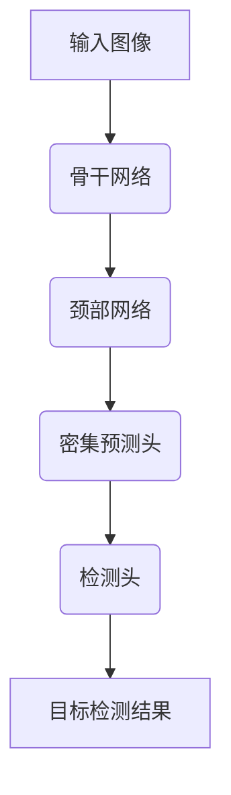

# YOLOv8原理与代码实例讲解

## 1.背景介绍

在计算机视觉领域,目标检测是一项非常重要和具有挑战性的任务。它旨在从给定的图像或视频中定位并识别出感兴趣的目标对象。近年来,基于深度学习的目标检测算法取得了长足的进展,其中YOLO(You Only Look Once)系列算法因其高效和准确而备受关注。

YOLOv8是YOLO系列算法的最新版本,由AI研究员Glenn Jocher于2023年4月发布。它在其前身YOLOv7的基础上进行了多方面的改进和优化,在保持高精度的同时进一步提升了推理速度,扩展了应用场景。YOLOv8支持多种训练模式,可用于目标检测、实例分割、图像分类等多种视觉任务。

## 2.核心概念与联系

### 2.1 YOLO系列算法核心思想

YOLO算法的核心思想是将目标检测任务转化为回归问题,直接在输入图像上进行端到端的预测。具体来说,YOLO将输入图像划分为S×S个网格单元,每个单元预测B个边界框以及每个边界框内目标的置信度和类别概率。这种思路与传统的基于候选区域生成的两阶段目标检测算法不同,避免了大量的计算开销,因此具有更高的检测速度。

### 2.2 YOLOv8的改进

相较于YOLOv7,YOLOv8在以下几个方面进行了改进:

1. **新的骨干网络**: YOLOv8采用了更强大的骨干网络EfficientRep,提升了检测精度。
2. **注意力机制**: 引入了Mask注意力机制,帮助模型更好地关注目标区域。
3. **数据增强**: 采用了更多数据增强策略,如Mosaic等,增强了模型的泛化能力。
4. **自动锚框计算**: 通过K-Means聚类算法自动计算锚框参数,提高了模型适应性。
5. **推理速度优化**: 对模型进行了多方面的优化,如模型剪枝、量化等,提升了推理速度。

### 2.3 YOLOv8架构概览

YOLOv8的整体架构可分为四个主要部分:骨干网络、颈部网络、密集预测头和检测头。



1. **骨干网络**: 用于从输入图像中提取特征,YOLOv8使用了EfficientRep作为骨干网络。
2. **颈部网络**: 对骨干网络提取的特征进行融合和处理,生成特征金字塔。
3. **密集预测头**: 在每个特征层上进行密集预测,生成初步的目标检测结果。
4. **检测头**: 对密集预测头的输出进行后处理,包括非极大值抑制等,得到最终的检测结果。

## 3.核心算法原理具体操作步骤

### 3.1 目标检测任务形式化

在目标检测任务中,给定一个输入图像$I$,我们需要预测一个边界框集合$B=\{b_1, b_2, ..., b_n\}$,其中每个边界框$b_i$由其位置$(x_i, y_i, w_i, h_i)$和对应的类别标签$c_i$组成。同时,每个边界框还有一个置信度得分$s_i$,表示该边界框包含目标的可信程度。

因此,目标检测任务可以形式化为:对于给定的输入图像$I$,我们需要找到一个边界框集合$B$,使得每个边界框$b_i$内包含一个目标对象,并且正确预测了该目标的类别$c_i$和置信度得分$s_i$。

### 3.2 YOLOv8算法步骤

YOLOv8算法的具体步骤如下:

1. **图像预处理**: 将输入图像缩放到网络输入尺寸,并进行归一化处理。

2. **特征提取**: 将预处理后的图像输入到骨干网络EfficientRep中,提取不同尺度的特征图。

3. **特征融合**: 将骨干网络提取的特征图输入到颈部网络中,进行特征融合和处理,生成特征金字塔。

4. **密集预测**: 在每个特征层上应用密集预测头,对每个网格单元预测边界框、置信度和类别概率。

5. **非极大值抑制(NMS)**: 对密集预测头的输出应用NMS,去除重叠的冗余边界框。

6. **后处理**: 根据置信度阈值和非极大值抑制的结果,输出最终的目标检测结果。

### 3.3 密集预测头

密集预测头是YOLOv8算法的核心部分之一。它在每个特征层上进行密集预测,为每个网格单元生成以下预测结果:

- 边界框坐标: 预测边界框的$(x, y, w, h)$坐标,其中$(x, y)$是边界框中心相对于网格单元的偏移量,$(w, h)$是边界框的宽高。
- 目标置信度: 预测该边界框内包含目标的置信度得分。
- 类别概率: 预测该边界框内目标属于每个类别的概率。

密集预测头的输出可以表示为一个三维张量$P$,其中$P[i, j, :]$代表第$i$行第$j$列网格单元的预测结果。

### 3.4 损失函数

YOLOv8使用了一种复合损失函数,包括边界框回归损失、目标置信度损失和类别损失三部分:

$$
\mathcal{L} = \mathcal{L}_{box} + \mathcal{L}_{obj} + \mathcal{L}_{cls}
$$

其中:

- $\mathcal{L}_{box}$是边界框回归损失,用于优化边界框的位置和尺寸预测。
- $\mathcal{L}_{obj}$是目标置信度损失,用于优化每个边界框内是否包含目标的预测。
- $\mathcal{L}_{cls}$是类别损失,用于优化每个边界框内目标类别的预测。

在训练过程中,YOLOv8通过最小化这个复合损失函数来优化网络参数。

## 4.数学模型和公式详细讲解举例说明

### 4.1 边界框编码

在YOLOv8中,边界框的坐标$(x, y, w, h)$是相对于网格单元的,需要进行编码才能输入到网络中。具体来说,对于第$i$行第$j$列的网格单元,边界框的编码方式如下:

$$
b_x = \sigma(t_x) + c_x \\
b_y = \sigma(t_y) + c_y \\
b_w = p_w e^{t_w} \\
b_h = p_h e^{t_h}
$$

其中:

- $(t_x, t_y, t_w, t_h)$是网络预测的未编码坐标
- $(c_x, c_y)$是网格单元的左上角坐标
- $(p_w, p_h)$是先验边界框的宽高
- $\sigma$是sigmoid函数,用于将$(t_x, t_y)$的值限制在$(0, 1)$范围内

这种编码方式使得网络只需要预测一个小的调整值,而不是直接预测绝对坐标,从而提高了预测的精度和稳定性。

### 4.2 目标置信度

对于每个边界框,YOLOv8需要预测它包含目标的置信度得分。这个得分是通过两部分相乘得到的:

$$
\text{Conf} = \text{Pr}(Object) \times \text{IOU}_{pred}^{truth}
$$

其中:

- $\text{Pr}(Object)$是网络预测的该边界框内包含目标的概率
- $\text{IOU}_{pred}^{truth}$是预测边界框与真实边界框的交并比(Intersection over Union)

这种方式可以同时考虑边界框内是否包含目标以及边界框的位置精度,从而更好地评估预测结果的质量。

### 4.3 类别概率

对于每个边界框,YOLOv8还需要预测它内部目标属于每个类别的概率。假设有$C$个类别,那么网络需要预测一个长度为$C$的向量$\mathbf{p}$,其中$p_i$表示该边界框内目标属于第$i$类的概率。

在训练过程中,对于包含目标的边界框,我们使用交叉熵损失函数来优化类别概率预测:

$$
\mathcal{L}_{cls} = -\sum_{i=1}^C y_i \log(p_i)
$$

其中$\mathbf{y}$是一个one-hot编码向量,表示真实的类别标签。

### 4.4 非极大值抑制(NMS)

由于密集预测头会为每个网格单元预测多个边界框,因此会存在重叠的冗余边界框。为了解决这个问题,YOLOv8使用了非极大值抑制(NMS)算法。

NMS算法的步骤如下:

1. 根据置信度得分对所有预测边界框进行排序
2. 从置信度最高的边界框开始,计算它与其他边界框的交并比(IOU)
3. 移除所有与当前边界框的IOU大于阈值的边界框
4. 重复步骤2和3,直到所有边界框都被处理完毕

通过NMS,我们可以保留置信度最高的、不重叠的边界框,从而获得最终的目标检测结果。

## 5.项目实践:代码实例和详细解释说明

在这一部分,我们将通过一个实际的代码示例来演示如何使用YOLOv8进行目标检测。我们将使用PyTorch作为深度学习框架,并基于官方提供的YOLOv8代码库进行实现。

### 5.1 安装依赖

首先,我们需要安装YOLOv8及其依赖项。可以使用pip或conda进行安装:

```bash
pip install ultralytics
```

### 5.2 导入必要的模块

```python
from ultralytics import YOLO
import cv2
```

我们从ultralytics库中导入YOLO类,用于加载和运行YOLOv8模型。同时,我们还导入了OpenCV库,用于读取和显示图像。

### 5.3 加载预训练模型

```python
model = YOLO("yolov8n.pt")
```

我们使用`YOLO`类加载一个预训练的YOLOv8模型。这里我们选择加载`yolov8n.pt`模型,它是一个较小的模型,适合在资源受限的环境中运行。

### 5.4 目标检测

```python
img = cv2.imread("example.jpg")
results = model(img)
```

我们读取一张名为`example.jpg`的图像,并将其输入到YOLOv8模型中进行推理。`model(img)`会返回一个`Results`对象,包含了检测到的目标信息。

### 5.5 可视化结果

```python
results.show()
cv2.waitKey(0)
```

我们使用`Results`对象的`show()`方法将检测结果可视化,并在OpenCV窗口中显示。`cv2.waitKey(0)`会保持窗口打开,直到按下任意键。

### 5.6 访问检测结果

`Results`对象提供了多种方式来访问检测结果,例如:

```python
print(results.boxes)  # 打印所有检测到的边界框坐标
print(results.boxes.cls)  # 打印每个边界框对应的类别
print(results.masks)  # 打印实例分割掩码(如果模型支持)
```

### 5.7 进一步处理

根据具体需求,我们可以对检测结果进行进一步的处理,例如:

- 过滤掉置信度较低的检测结果
- 在原始图像上绘制边界框和标签
- 将检测结果保存到文件或数据库中
- 将检测结果输入到其他模块进行后续处理,如目标跟踪、行为分析等

## 6.实际应用场景

YOLOv8作为一种高效准确的目标检测算法,在各种领域都有广泛的应用前景:

1. **安防监控**: 在视频监控系统中,YOLOv8可以实时检测和跟踪移动目标,用于安全防范、交通监控等。

2. **自动驾驶**: 在自动驾