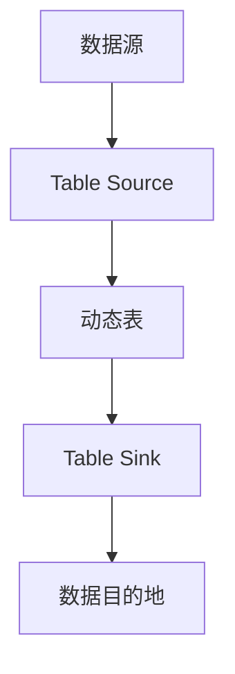
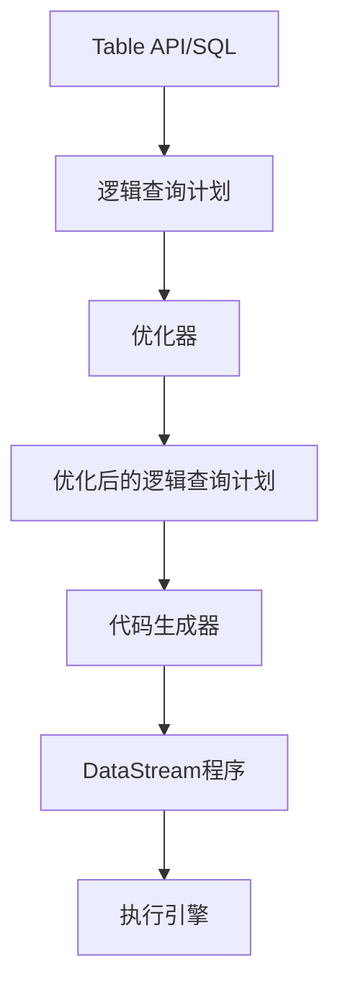

# 【AI大数据计算原理与代码实例讲解】Table API和SQL

## 1.背景介绍

在当今大数据时代,数据处理和分析已成为各行业的核心需求。传统的关系型数据库虽然功能强大,但在处理海量数据时往往效率低下。为了解决这一问题,Apache Flink等新一代大数据处理框架应运而生。其中,Table API和SQL作为Flink的两大核心API,为用户提供了统一的批流处理方式,极大简化了数据分析流程。

### 1.1 Apache Flink简介

Apache Flink是一个开源的分布式大数据处理引擎,能够对有界和无界数据流进行有状态计算。作为新一代大数据处理框架的代表,Flink具有以下几个关键特性:

- 事件驱动型(Event-driven)
- 基于流的世界观(Streams are first-class citizens)
- 支持有状态计算(Stateful Computations)
- 高吞吐、低延迟(High Throughput & Low Latency)
- 精确一次语义(Exactly-once)

### 1.2 Table API和SQL在Flink中的作用

Table API是一套嵌入在Java和Scala语言中的查询API,它以更接近SQL的方式组织流处理逻辑。SQL则是一种声明式的查询语言,能够直接在Flink中执行SQL语句。二者的出现让开发者无需了解底层执行细节,即可以标准化的方式进行复杂的数据分析,大大降低了使用门槛。

## 2.核心概念与联系

在深入探讨Table API和SQL之前,我们需要先了解几个核心概念。

### 2.1 表(Table)

表是关系型数据库中的核心概念,由行和列组成。在Flink中,表可以是临时的批视图(Batch View),也可以是持续的流视图(Streaming View)。

### 2.2 动态表(Dynamic Table)

动态表是Flink对表的实现和抽象,支持数据持续修改。它由一个持续查询(Continuous Query)定义,可以从各种持续的流或外部连接器(Connector)读取数据。

### 2.3 表源(Table Source)和表sink(Table Sink)

表源定义了从存储系统或外部系统读取数据的方式,而表sink则定义了将数据持久化到存储系统或外部系统的方式。Flink提供了众多开箱即用的连接器,用户也可以自定义连接器。



### 2.4 查询(Query)

查询定义了对动态表的数据进行转换、过滤等操作的逻辑,可以通过Table API或SQL语句来表示。查询的结果可以是新的动态表,也可以将结果写入表sink。

## 3.核心算法原理具体操作步骤 

虽然Table API和SQL在语法和使用方式上存在差异,但在Flink内部,它们的执行流程是高度统一的。



1. **Table API/SQL查询** - 用户通过Table API或SQL语句定义查询逻辑。

2. **逻辑查询计划** - Flink会将查询解析为逻辑查询计划,表示查询的逻辑结构。

3. **查询优化** - 优化器基于一系列规则对逻辑查询计划进行等价重写,以获得更优的执行方式。

4. **优化后的逻辑查询计划** - 优化后的逻辑查询计划更加高效。

5. **代码生成** - Flink会将优化后的逻辑查询计划翻译为DataStream程序。

6. **DataStream程序** - 生成的DataStream程序包含了所有的执行逻辑。

7. **执行引擎** - Flink的执行引擎(如流执行器)负责执行DataStream程序并输出结果。

## 4.数学模型和公式详细讲解举例说明

在大数据处理中,常常需要对数据进行聚合和统计等操作。这些操作往往涉及到数学模型和公式的应用。以下我们将介绍几个常见的数学模型和公式。

### 4.1 平均值(Mean)

平均值是描述数据集中心趋势的常用度量,计算公式如下:

$$\overline{x} = \frac{1}{n}\sum_{i=1}^{n}x_i$$

其中$\overline{x}$表示平均值,$x_i$表示第$i$个数据点,$n$表示数据点总数。

在SQL中,我们可以使用AVG函数计算平均值:

```sql
SELECT AVG(column) FROM table;
```

### 4.2 方差(Variance)

方差是衡量数据离散程度的指标,公式如下:

$$s^2 = \frac{1}{n}\sum_{i=1}^{n}(x_i - \overline{x})^2$$

其中$s^2$表示方差,$x_i$表示第$i$个数据点,$\overline{x}$表示平均值,$n$表示数据点总数。

在SQL中,我们可以使用VAR_POP函数计算总体方差:

```sql
SELECT VAR_POP(column) FROM table;
```

### 4.3 相关系数(Correlation Coefficient)

相关系数用于衡量两个变量之间的线性相关程度,取值范围在[-1,1]之间。计算公式如下:

$$r = \frac{\sum_{i=1}^{n}(x_i - \overline{x})(y_i - \overline{y})}{\sqrt{\sum_{i=1}^{n}(x_i - \overline{x})^2}\sqrt{\sum_{i=1}^{n}(y_i - \overline{y})^2}}$$

其中$r$表示相关系数,$x_i$和$y_i$分别表示第$i$个数据点的两个变量值,$\overline{x}$和$\overline{y}$分别表示两个变量的平均值,$n$表示数据点总数。

在SQL中,我们可以使用CORR函数计算相关系数:

```sql
SELECT CORR(column1, column2) FROM table;
```

## 5.项目实践:代码实例和详细解释说明

为了更好地理解Table API和SQL在Flink中的使用,我们将通过一个简单的电商订单分析项目来进行实践。

### 5.1 需求描述

我们有一个电商网站的订单数据集,其中包含订单ID、用户ID、商品ID、订单时间和订单金额等字段。我们需要统计以下几个指标:

1. 每个商品的总销售额
2. 每个用户的平均订单金额
3. 订单金额与订单时间的相关系数

### 5.2 环境准备

我们将使用Flink 1.14.0版本,并在本地运行。首先,我们需要下载Flink发行版并解压。然后,进入解压目录下的bin目录,启动本地集群:

```bash
./start-cluster.sh
```

### 5.3 Table API实践

首先,我们需要在Java代码中创建一个TableEnvironment对象,并注册一个源表:

```java
// 创建TableEnvironment
StreamExecutionEnvironment env = StreamExecutionEnvironment.getExecutionEnvironment();
StreamTableEnvironment tEnv = StreamTableEnvironment.create(env);

// 注册源表
tEnv.executeSql("CREATE TABLE orders (" +
                "  order_id BIGINT," +
                "  user_id BIGINT," +
                "  product_id BIGINT," +
                "  order_time TIMESTAMP(3)," +
                "  order_amount DOUBLE" +
                ") WITH (" +
                "  'connector' = 'filesystem'," +
                "  'path' = '/path/to/orders.csv'," +
                "  'format' = 'csv'" +
                ")");
```

接下来,我们可以使用Table API进行查询:

```java
// 每个商品的总销售额
Table productRevenue = tEnv.from("orders")
                           .groupBy($("product_id"))
                           .select($("product_id"), $("order_amount").sum().as("total_revenue"));

// 每个用户的平均订单金额                  
Table userAvgAmount = tEnv.from("orders")
                          .groupBy($("user_id"))
                          .select($("user_id"), $("order_amount").mean().as("avg_amount"));
                          
// 订单金额与订单时间的相关系数
Table correlation = tEnv.from("orders")
                        .select(call("CORR", $("order_amount"), $("order_time").unixTimestamp()).as("correlation"));
```

最后,我们可以将结果表sink到文件系统或打印到控制台:

```java
// 将结果表sink到文件系统
productRevenue.executeInsert("product_revenue");
userAvgAmount.executeInsert("user_avg_amount");
correlation.executeInsert("order_correlation");

// 或者打印到控制台
productRevenue.execute().print();
userAvgAmount.execute().print();
correlation.execute().print();
```

### 5.4 SQL实践

除了使用Table API,我们也可以使用SQL语句来完成相同的任务:

```sql
-- 每个商品的总销售额
SELECT 
  product_id,
  SUM(order_amount) AS total_revenue
FROM orders
GROUP BY product_id;

-- 每个用户的平均订单金额
SELECT
  user_id,
  AVG(order_amount) AS avg_amount  
FROM orders
GROUP BY user_id;

-- 订单金额与订单时间的相关系数
SELECT CORR(order_amount, UNIX_TIMESTAMP(order_time)) AS correlation
FROM orders;
```

在Flink的命令行客户端中,我们可以执行上述SQL语句并查看结果:

```bash
./bin/sql-client.sh embedded
```

## 6.实际应用场景

Table API和SQL在Flink中的应用场景非常广泛,包括但不限于:

1. **电商分析** - 统计用户行为、商品销售情况等,为营销决策提供支持。
2. **日志分析** - 分析服务器日志,发现异常模式、性能瓶颈等。
3. **物联网数据处理** - 处理来自各种传感器的实时数据流,进行监控和预测。
4. **金融风控** - 实时检测异常交易行为,防范金融风险。
5. **推荐系统** - 基于用户历史行为数据,为用户推荐感兴趣的内容。

## 7.工具和资源推荐

在使用Flink的Table API和SQL时,以下工具和资源或许能给您带来帮助:

1. **Apache Flink官方文档** - https://nightlies.apache.org/flink/flink-docs-release-1.14/
2. **Ververica平台** - Ververica公司提供的基于Flink的数据流解决方案。
3. **SQL Client** - Flink自带的命令行SQL客户端,可用于执行SQL查询。
4. **Table API Java UDF示例** - https://github.com/apache/flink/tree/master/flink-examples/flink-examples-table
5. **Flink Forward** - Flink官方年度会议,了解最新动态和最佳实践。

## 8.总结:未来发展趋势与挑战

Table API和SQL为Flink带来了更高的易用性和标准化,但仍面临一些挑战:

1. **性能优化** - 需要持续优化查询执行效率,特别是在处理海量数据时。
2. **语义扩展** - 支持更丰富的语义特性,如窗口、模式匹配等。
3. **生态集成** - 与更多数据源、存储系统无缝集成。
4. **可解释性** - 提高查询计划的可解释性,方便调试和优化。

未来,Table API和SQL在Flink中的地位将更加重要,成为数据处理和分析的主要范式。随着AI、物联网等领域的快速发展,对实时数据处理和分析的需求将与日俱增。Flink及其Table API和SQL将在这一过程中扮演关键角色。

## 9.附录:常见问题与解答

### 9.1 Table API和SQL有什么区别?

Table API是一套嵌入式查询API,而SQL是一种声明式查询语言。前者更接近于编程语言,后者则更贴近关系型数据库。二者在Flink内部的执行流程是统一的。

### 9.2 动态表是如何工作的?

动态表是Flink对持续查询的一种抽象和实现。它由一个持续查询定义,可以从各种连接器读取数据,并将结果写入连接器。动态表支持数据的持续修改,是Flink实现流处理的关键。

### 9.3 Flink是如何保证精确一次(Exactly-once)语义的?

Flink通过checkpoint机制和端到端的exactly-once状态一致性来实现精确一次语义。checkpoint可以恢复作业的状态,而端