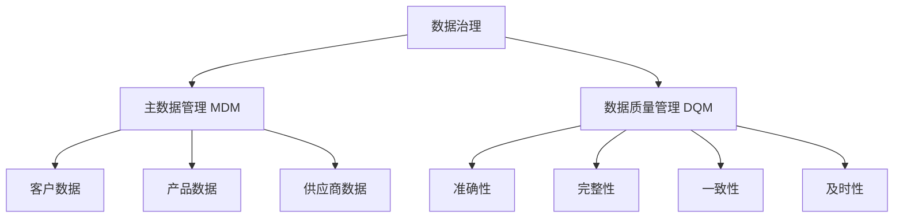

# 【AI大数据计算原理与代码实例讲解】数据治理

## 1. 背景介绍
### 1.1 数据治理的重要性
在当今大数据时代,企业和组织面临着海量数据的挑战。如何有效地管理、利用和保护这些数据资产,已经成为一个关键问题。数据治理应运而生,它是一套全面的策略、流程和技术,旨在确保数据的质量、安全性、可访问性和合规性。良好的数据治理可以帮助企业提高数据驱动决策的准确性,降低风险,提升运营效率。

### 1.2 数据治理面临的挑战
实施数据治理并非易事。企业往往面临着数据孤岛、数据质量差、缺乏数据标准、数据安全隐患等诸多挑战。此外,不同业务部门对数据的需求和理解也存在差异,如何在企业内部达成一致,建立统一的数据治理框架,也是一大难题。

### 1.3 AI和大数据技术在数据治理中的应用
随着人工智能和大数据技术的发展,数据治理迎来了新的机遇。机器学习算法可以自动发现数据质量问题,知识图谱可以帮助构建企业级数据地图,数据脱敏技术可以保护敏感数据隐私。这些新兴技术为数据治理赋能,使之更加智能化和自动化。

## 2. 核心概念与联系
### 2.1 数据治理的定义与目标
数据治理是一套管理数据的策略、流程、标准、角色和责任,旨在最大化数据价值,最小化数据风险。其核心目标包括:
- 提高数据质量
- 确保数据安全与合规 
- 促进数据共享与集成
- 支持数据驱动的业务决策

### 2.2 数据治理框架的关键要素
一个完善的数据治理框架通常包括以下关键要素:
- 数据战略与原则
- 数据标准与元数据管理
- 数据质量管理
- 数据安全与隐私保护
- 数据生命周期管理
- 数据架构与集成
- 数据管理组织与角色

### 2.3 数据治理与主数据管理、数据质量管理的关系
数据治理是一个宏观的概念,其中主数据管理(MDM)和数据质量管理(DQM)是两个重要的组成部分。
- 主数据管理关注企业核心数据的一致性,如客户、产品、供应商等。
- 数据质量管理致力于提高数据的准确性、完整性、一致性和及时性。
- 数据治理为MDM和DQM提供总体的指导原则和管理框架。



## 3. 核心算法原理具体操作步骤
### 3.1 数据探查与画像算法
数据探查与画像是数据治理的第一步,目的是全面了解企业的数据资产现状。常用的算法包括:
1. 数据分布分析:通过直方图、箱线图等可视化图表,分析数据的分布特征。
2. 缺失值分析:统计每个字段的缺失值比例,识别数据完整性问题。
3. 异常值检测:使用3σ原则、箱线图等方法,发现异常偏离的数据点。
4. 字段相关性分析:计算字段之间的相关系数矩阵,挖掘隐藏的关联关系。
5. 数据血缘分析:追踪数据的来源、转换和流向,绘制数据血缘图。

### 3.2 数据质量检测与修复算法
保障数据质量是数据治理的核心任务之一。常见的数据质量问题包括:错误值、缺失值、重复值、不一致等。相应的检测与修复算法有:
1. 字段合法性检查:根据预定义的规则(如取值范围、格式等),检查每个字段的合法性。
2. 缺失值填充:对于缺失值,可以使用均值、中位数、众数填充,或者基于机器学习模型预测。
3. 异常值修正:对检测出的异常值,可以进行删除、替换、调整等处理。
4. 重复值消除:对于重复记录,可以基于主键或者业务规则进行去重。
5. 数据标准化:对不一致的数据表示进行统一和规范化处理,如地址、时间格式等。

### 3.3 数据安全与隐私保护算法
在数据治理过程中,确保数据安全和个人隐私至关重要。常用的安全与隐私保护算法包括:
1. 数据脱敏:对敏感数据进行掩码、加密、哈希等处理,防止数据泄露。
2. 访问控制:基于角色(RBAC)或属性(ABAC)的访问控制模型,严格管理数据访问权限。
3. 同态加密:在加密状态下直接对数据进行计算和处理,兼顾使用与隐私。
4. 差分隐私:通过添加随机噪声,保护个体隐私,同时保留数据的统计特性。
5. 区块链:利用区块链的不可篡改和可追溯特性,提升数据安全与可信度。

## 4. 数学模型和公式详细讲解举例说明
### 4.1 皮尔逊相关系数
皮尔逊相关系数用于度量两个连续变量之间的线性相关性,取值范围为[-1,1]。公式为:

$$r = \frac{\sum_{i=1}^{n} (x_i - \bar{x})(y_i - \bar{y})}{\sqrt{\sum_{i=1}^{n} (x_i - \bar{x})^2} \sqrt{\sum_{i=1}^{n} (y_i - \bar{y})^2}}$$

其中,$x_i$和$y_i$分别表示两个变量的第$i$个取值,$\bar{x}$和$\bar{y}$为两个变量的均值,$n$为样本量。

举例:假设我们有两个字段"年龄"和"收入",通过计算皮尔逊相关系数,可以量化两者的相关性。如果结果为0.8,说明年龄与收入呈现较强的正相关。

### 4.2 Benford's Law
Benford定律(也称为一阶数字规律)是一种描述自然数据集中首位数字分布的定律。它指出,在很多真实数据集中,首位数字为1的概率接近30.1%,首位数字为2的概率接近17.6%,以此类推。Benford定律的概率公式为:

$$P(d) = \log_{10}(1+\frac{1}{d}), d=1,2,...,9$$

其中,$d$表示首位数字,$P(d)$表示首位数字为$d$的概率。

举例:在财务数据审计中,可以利用Benford定律检测数据造假。如果某公司的财务数据偏离Benford分布,可能存在人为操纵的嫌疑。

### 4.3 Gini不纯度
基尼不纯度(Gini Impurity)常用于评估分类模型的性能,衡量一个数据集合的"不纯度"。假设数据有$k$个类别,每个类别的样本比例为$p_i$,则基尼不纯度的计算公式为:

$$Gini(p) = \sum_{i=1}^{k} p_i(1-p_i) = 1 - \sum_{i=1}^{k} p_i^2$$

基尼不纯度的取值范围为[0,1],值越小表示数据集合的纯度越高。

举例:在数据质量评估中,可以用基尼不纯度衡量一个字段值的分布是否集中。如果某个字段90%的值都为"未知",则该字段的基尼不纯度会很高,提示我们数据可能有完整性问题。

## 5. 项目实践:代码实例和详细解释说明
下面以Python为例,演示几个数据治理的常用代码片段。
### 5.1 缺失值统计与填充
```python
import pandas as pd
from sklearn.impute import SimpleImputer

# 读取数据
data = pd.read_csv('data.csv')

# 统计每列的缺失值比例
missing_pct = data.isnull().mean()
print(missing_pct)

# 使用中位数填充缺失值
imputer = SimpleImputer(strategy='median')
data_imputed = imputer.fit_transform(data)
```
说明:
- 使用`isnull()`和`mean()`方法,可以快速计算出每列的缺失值比例。
- `SimpleImputer`是一个方便的缺失值填充工具,`strategy`参数指定填充策略,如中位数填充。

### 5.2 异常值检测与处理
```python
import numpy as np

# 假设data是一个数值型的DataFrame
# 计算每列的上下四分位数
Q1 = data.quantile(0.25)
Q3 = data.quantile(0.75)
IQR = Q3 - Q1

# 定义异常值判断条件
outlier_condition = (data < (Q1 - 1.5 * IQR)) | (data > (Q3 + 1.5 * IQR))

# 标记异常值为NaN
data[outlier_condition] = np.nan
```
说明:
- 使用四分位数(IQR)法检测异常值,IQR即第三四分位数与第一四分位数的差值。
- 小于$Q1-1.5*IQR$或大于$Q3+1.5*IQR$的值被定义为异常值。
- 这里将检测出的异常值标记为NaN,后续可以进一步进行删除或填充。

### 5.3 数据标准化
```python
from sklearn.preprocessing import StandardScaler

# 对数值型特征进行Z-score标准化
scaler = StandardScaler()
data_scaled = scaler.fit_transform(data)
```
说明:
- Z-score标准化将每个特征的均值变为0,标准差变为1,消除量纲影响。
- `StandardScaler`可以方便地进行Z-score标准化,`fit_transform`方法即训练并转换数据。

## 6. 实际应用场景
数据治理在各行各业都有广泛应用,下面列举几个典型场景:
### 6.1 金融行业的反欺诈
银行、保险等金融机构通过数据治理建立反欺诈模型,实时监控交易行为,识别可疑模式。其中会用到异常检测、关联规则、图神经网络等算法。

### 6.2 电商行业的客户画像
电商平台通过收集用户的浏览、购买、评价等行为数据,构建全景式客户画像。数据治理过程包括数据集成、清洗、挖掘、可视化等步骤,最终形成对客户的多维度理解,指导个性化营销。

### 6.3 制造业的设备预测性维护
工业制造企业在设备上安装各类传感器,实时采集设备运行数据。通过数据治理和机器学习,可以建立预测性维护模型,提前发现设备故障征兆,减少非计划停机时间。

### 6.4 医疗行业的辅助诊断
医院通过数据治理整合患者的电子病历、影像、化验等数据,建立疾病知识图谱。AI算法可以利用这些结构化的医疗数据,辅助医生进行疾病诊断和用药推荐,提高诊疗效率和准确性。

## 7. 工具和资源推荐
### 7.1 数据治理平台
- IBM InfoSphere Information Governance Catalog
- Collibra Data Governance Center
- Informatica Axon Data Governance
- Apache Atlas

### 7.2 数据质量管理工具
- Talend Data Quality
- SAS Data Quality
- Oracle Enterprise Data Quality
- SAP Information Steward

### 7.3 开源数据治理项目
- Apache Ranger:数据安全和访问控制
- Apache Atlas:元数据治理和血缘追踪
- Egeria:企业数据目录和治理
- Marquez:数据血缘和发现

### 7.4 数据治理社区
- Data Governance Professionals Organization (DGPO)
- The Data Governance Institute (DGI)
- Data Management Association International (DAMA)

## 8. 总结:未来发展趋势与挑战
数据治理是一个持续演进的过程,随着数据量的爆发式增长和业务需求的快速变化,数据治理也面临着新的趋势和挑战:
- 数据治理与AI、