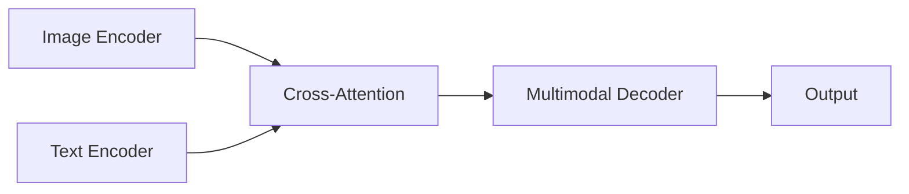

# 多模态大模型：技术原理与实战部署流程

## 1.背景介绍

### 1.1 人工智能发展历程

人工智能(Artificial Intelligence, AI)是当代科技发展的前沿领域,旨在使机器能够模仿人的认知功能,如学习、推理、感知、规划等。自20世纪50年代AI概念提出以来,经历了几个重要发展阶段。

### 1.2 大模型兴起

近年来,随着算力、数据和算法的飞速发展,大型神经网络模型在自然语言处理、计算机视觉等领域展现出了强大的能力。2018年,谷歌发布BERT模型,开启了大模型时代。2020年,OpenAI发布GPT-3,展示了大模型在生成任务中的卓越表现。

### 1.3 多模态AI崛起

传统的AI模型通常专注于单一模态,如文本或图像。然而,真实世界是多模态的,人类认知是基于视觉、听觉、语言等多种信息源的融合。多模态AI旨在整合多种感知信号,实现更加智能、通用的人工智能系统。

### 1.4 多模态大模型意义重大

多模态大模型集成了多个任务的能力,可以在不同领域发挥作用,是通向通用人工智能(Artificial General Intelligence, AGI)的关键一步。同时,多模态大模型也面临着诸多技术挑战,如模态融合、数据效率、解释性等,需要持续的探索和创新。

## 2.核心概念与联系

### 2.1 大模型(Large Model)

大模型指具有数十亿甚至上万亿参数的大型神经网络模型。这些模型通过在海量数据上预训练,学习到丰富的知识表示,在下游任务上表现出色。典型的大模型包括GPT、BERT、CLIP等。

### 2.2 多模态(Multimodal)

多模态指融合多种感知信号,如文本、图像、语音等。多模态AI系统能够更好地理解和表达复杂的信息,更接近人类的认知方式。

### 2.3 预训练(Pre-training)

预训练是大模型训练的关键步骤。模型在大规模无监督数据上进行自监督学习,获取通用的表示能力,为下游任务做好准备。常见的预训练技术包括自编码(Autoencoding)、蒸馏(Distillation)等。

### 2.4 微调(Fine-tuning)

在完成预训练后,大模型需要在具体任务上进行微调,使其适应特定的应用场景。微调过程通常只需少量标注数据,即可获得良好的性能。

### 2.5 模态融合(Modality Fusion)

多模态模型的核心是如何有效融合不同模态的信息。常见的融合方式包括:
- 早期融合:在模型底层对原始数据进行融合
- 中期融合:在中间层对特征进行融合
- 晚期融合:在顶层对模态特定表示进行融合

### 2.6 评估指标

多模态模型的评估需要考虑不同任务,常用指标包括:
- 分类任务:准确率(Accuracy)、F1分数等
- 生成任务:BLEU、METEOR、CIDEr等
- 检索任务:平均精度(mAP)、查全率(Recall)等

## 3.核心算法原理具体操作步骤 

多模态大模型的训练通常分为两个阶段:预训练和微调。

### 3.1 预训练阶段

预训练旨在让模型在大量无监督数据上学习通用的表示能力,为下游任务做好准备。常见的预训练策略包括:

#### 3.1.1 自监督预训练

利用自编码(Autoencoding)、对比学习(Contrastive Learning)等自监督技术,在无监督数据上训练模型,使其学习有效的表示。

1. 自编码:重构输入数据,如BERT中的Masked LM、ViT中的Masked Patch Prediction等。
2. 对比学习:在正样本和负样本之间建立判别,如CLIP中的对比学习。

#### 3.1.2 监督预训练

利用大规模标注数据,在多个下游任务上联合预训练模型,获取多任务能力。

1. 多任务学习:在不同任务之间共享模型参数。
2. 转移学习:利用在某个领域预训练的模型,在相关领域进行进一步微调。

#### 3.1.3 半监督预训练

结合无监督数据和少量标注数据,通过半监督学习技术训练模型。

1. 伪标注(Pseudo-Labeling):利用模型在无标注数据上的预测结果,生成伪标签进行训练。
2. 一致性正则(Consistency Regularization):在数据增强下,要求模型输出保持一致性。

### 3.2 微调阶段

在完成预训练后,需要针对具体的下游任务进行微调,使模型适应特定场景。微调通常遵循以下步骤:

1. **数据准备**:收集并清洗特定任务的训练数据,构建标注集。
2. **模型选择**:选择合适的预训练模型作为初始化权重。
3. **微调策略**:确定微调的超参数,如学习率、批大小等,并决定是否冻结部分层。
4. **训练过程**:在标注数据上对模型进行监督微调训练。
5. **评估和调优**:在验证集上评估模型性能,并根据需要调整超参数。
6. **模型部署**:将微调后的模型应用于实际场景。

## 4.数学模型和公式详细讲解举例说明

多模态大模型通常基于Transformer等注意力机制架构,融合了不同模态的编码器和解码器。以下是一些核心数学模型和公式:

### 4.1 Transformer 注意力机制

Transformer是一种基于自注意力(Self-Attention)的序列建模架构,广泛应用于自然语言处理和计算机视觉等领域。

自注意力机制的计算公式如下:

$$\text{Attention}(Q, K, V) = \text{softmax}\left(\frac{QK^T}{\sqrt{d_k}}\right)V$$

其中:
- $Q$为查询(Query)
- $K$为键(Key) 
- $V$为值(Value)
- $d_k$为缩放因子,用于防止内积过大导致梯度消失

多头注意力(Multi-Head Attention)则是将注意力机制运用于不同的子空间,公式为:

$$\text{MultiHead}(Q, K, V) = \text{Concat}(head_1, ..., head_h)W^O$$
$$\text{where } head_i = \text{Attention}(QW_i^Q, KW_i^K, VW_i^V)$$

### 4.2 Vision Transformer

Vision Transformer(ViT)是将Transformer应用于计算机视觉任务的典型模型,它将图像分割为多个patch,并将每个patch投影到一个向量,作为Transformer的输入序列。

ViT的输入嵌入公式为:

$$z_0 = [x_\text{class}; x_p^1 E; x_p^2 E; ...; x_p^N E]$$

其中:
- $x_\text{class}$为分类嵌入(Class Embedding)
- $x_p^i$为第i个patch的像素值
- $E$为线性投影层
- $;$表示向量拼接操作

### 4.3 Multimodal Transformer

多模态Transformer通过设计不同的编码器和解码器,实现跨模态的信息融合。

以Vision-Language Transformer为例,其架构如下:



编码器分别对图像和文本进行编码,解码器则通过交叉注意力(Cross-Attention)机制融合两种模态的表示,生成最终的多模态输出。

交叉注意力的计算公式为:

$$\text{CrossAttention}(Q, K, V) = \text{softmax}\left(\frac{QK^T}{\sqrt{d_k}}\right)V$$

其中$Q$来自解码器,而$K$和$V$来自不同模态的编码器输出。

## 5.项目实践:代码实例和详细解释说明

以下是一个使用PyTorch实现的简单多模态Transformer模型示例,用于图像描述任务。

### 5.1 导入库

```python
import torch
import torch.nn as nn
import torchvision.models as models
```

### 5.2 定义模型

```python
class MultimodalTransformer(nn.Module):
    def __init__(self, text_dim, image_dim, hidden_dim, num_heads, num_layers):
        super().__init__()
        
        # 文本编码器
        self.text_encoder = nn.TransformerEncoder(
            nn.TransformerEncoderLayer(text_dim, num_heads, hidden_dim),
            num_layers
        )
        
        # 图像编码器
        self.image_encoder = nn.TransformerEncoder(
            nn.TransformerEncoderLayer(image_dim, num_heads, hidden_dim),
            num_layers
        )
        
        # 多模态解码器
        self.decoder = nn.TransformerDecoder(
            nn.TransformerDecoderLayer(hidden_dim, num_heads, hidden_dim),
            num_layers
        )
        
        # 输出层
        self.output = nn.Linear(hidden_dim, text_dim)
        
    def forward(self, text, image):
        text_encoding = self.text_encoder(text)
        image_encoding = self.image_encoder(image)
        
        output = self.decoder(text_encoding, image_encoding)
        output = self.output(output)
        
        return output
```

### 5.3 使用示例

```python
# 准备输入数据
text = torch.randn(32, 10, 512) # 批量大小32, 序列长度10, 文本维度512
image = torch.randn(32, 14, 14, 512) # 批量大小32, 图像大小14x14, 图像维度512

# 创建模型实例
model = MultimodalTransformer(512, 512, 768, 8, 6)

# 前向传播
output = model(text, image)
```

在这个示例中,我们定义了一个简单的多模态Transformer模型,包含文本编码器、图像编码器和多模态解码器。模型接受文本序列和图像作为输入,并输出预测的文本序列。

需要注意的是,这只是一个简化的示例,实际应用中的模型会更加复杂,可能需要进一步的优化和调整。此外,还需要准备适当的数据集,并进行训练和评估。

## 6.实际应用场景

多模态大模型在诸多领域展现出广阔的应用前景,包括但不限于:

### 6.1 视觉问答(Visual Question Answering)

给定一幅图像和一个相关的自然语言问题,模型需要综合图像和文本信息,生成正确的答案。这项任务需要同时理解视觉和语言信息,是评估多模态理解能力的重要基准。

### 6.2 图像描述(Image Captioning)

根据给定的图像,生成对应的自然语言描述。这项任务需要模型捕捉图像中的关键信息,并用流畅的语言进行表达,对于辅助视觉障碍人士等具有重要应用价值。

### 6.3 多模态检索(Multimodal Retrieval)

给定一个查询(如文本或图像),从大规模的多模态数据库中检索相关的数据样本。这项任务在信息检索、内容推荐等领域有广泛应用。

### 6.4 多模态对话(Multimodal Dialogue)

在对话系统中融入视觉、语音等多模态信息,实现更加自然、流畅的人机交互。这对于智能助手、虚拟现实等应用场景至关重要。

### 6.5 多模态生成(Multimodal Generation)

基于文本、图像等多模态输入,生成新的多模态内容,如图像生成、视频编辑等。这为创意设计、内容创作等领域带来了新的可能性。

### 6.6 其他领域

多模态大模型还可以应用于机器翻译、医疗影像分析、自动驾驶等诸多领域,展现出巨大的潜力。

## 7.工具和资源推荐

在开发和使用多模态大模型时,以下工具和资源可以为您提供帮助:

### 7.1 深度学习框架

- **PyTorch**:支持动态计算图,具有良好的可扩展性和调试工具。
- **TensorFlow**:功能全面,提供了多模态相关的API和模型库。
- **Jax**:基于XLA编译器,具有高效的并行计算能力。

### 7.2 模型库