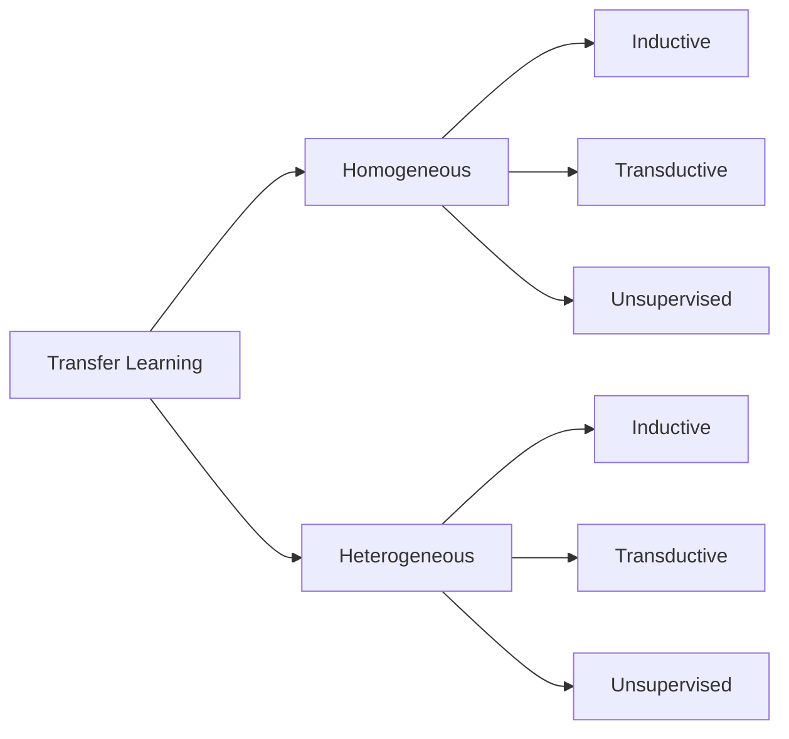
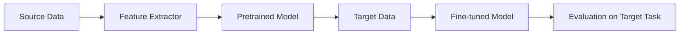

# 迁移学习(Transfer Learning) - 原理与代码实例讲解

## 1.背景介绍
### 1.1 什么是迁移学习
迁移学习(Transfer Learning)是机器学习中的一种重要方法,其目的是将已经学习过的知识应用到新的但相似的问题中去。与传统的机器学习方法相比,迁移学习更加注重知识的迁移和复用,避免了针对每个新任务都从头开始学习的低效。

### 1.2 迁移学习的意义
在现实世界中,我们经常遇到这样的情况:手头上的任务缺乏足够的训练数据,而收集和标注大量数据的成本很高。此时,如果能够利用已有的相关数据来辅助学习,无疑能极大提升学习的效率。迁移学习正是基于这种思想,通过在不同但相关的领域间进行知识迁移,来实现对新领域的快速适应。

### 1.3 迁移学习的应用场景
迁移学习在计算机视觉、自然语言处理等领域有广泛应用,如:
- 利用 ImageNet 上训练好的模型来识别医学影像
- 用 Wikipedia 上的词向量来初始化专门领域的文本分类模型
- 在语音识别中利用跨语言的声学模型适配新的语言

## 2.核心概念与联系
### 2.1 基本概念
- 域(Domain):由特征空间和边缘概率分布组成,即 $\mathcal{D}=\{\mathcal{X},P(X)\}$
- 任务(Task):由标签空间和条件概率分布组成,即 $\mathcal{T}=\{\mathcal{Y},P(Y|X)\}$

迁移学习中,我们称原始学习任务的域为源域(Source Domain),新学习任务的域为目标域(Target Domain)。

### 2.2 分类体系
按照源域和目标域的相似程度,迁移学习可分为:
- 同构迁移学习(Homogeneous Transfer Learning):源域和目标域的特征空间相同,即$\mathcal{X}_S=\mathcal{X}_T$
- 异构迁移学习(Heterogeneous Transfer Learning):源域和目标域的特征空间不同,即$\mathcal{X}_S \neq \mathcal{X}_T$

按照源任务和目标任务的相似程度,迁移学习可分为:
- 归纳式迁移学习(Inductive Transfer Learning):源任务和目标任务不同,即$\mathcal{T}_S \neq \mathcal{T}_T$
- 直推式迁移学习(Transductive Transfer Learning):源任务和目标任务相同,即$\mathcal{T}_S = \mathcal{T}_T$
- 无监督迁移学习(Unsupervised Transfer Learning):源任务和目标任务均没有标签信息



## 3.核心算法原理具体操作步骤
以最常用的同构归纳式迁移学习为例,其主要步骤如下:

### 3.1 特征表示学习
通过在源域上训练,学习一个良好的特征表示,使得不同域的数据在这个特征空间上更加接近。常见方法有:
- 基于深度网络的特征提取器,如预训练的 CNN
- 基于子空间学习的特征变换,如核映射、度量学习等

### 3.2 模型微调
在学习到的特征表示基础上,针对目标任务进行模型微调。常见方法有:
- 深度网络后几层的 fine-tuning
- 基于预训练词向量的文本分类器调优

### 3.3 模型评估
在目标域上评估迁移学习的效果,以验证特征表示和模型的泛化性能。常见的评估指标有:
- 准确率、召回率、F1 值等分类指标
- 均方误差、平均绝对误差等回归指标

迁移学习的训练过程可总结为:



## 4.数学模型和公式详细讲解举例说明
以经典的 MMD(Maximum Mean Discrepancy)度量为例,说明如何度量不同域数据的分布差异。

给定源域数据 $\{x_i^s\}_{i=1}^{n_s} \sim P$ 和目标域数据 $\{x_i^t\}_{i=1}^{n_t} \sim Q$,MMD 度量定义为:

$$
\text{MMD}(P,Q) = \left\Vert \frac{1}{n_s}\sum_{i=1}^{n_s}\phi(x_i^s) - \frac{1}{n_t}\sum_{i=1}^{n_t}\phi(x_i^t) \right\Vert_{\mathcal{H}}
$$

其中 $\phi(\cdot)$ 为映射函数,将原始数据映射到再生核希尔伯特空间(RKHS) $\mathcal{H}$。直观上,MMD 度量了两组数据映射后的均值在 RKHS 中的距离。如果 $P=Q$,那么 $\text{MMD}(P,Q)=0$。

在实际应用中,我们常用核函数 $k(x,y)$ 来隐式地表示映射 $\phi$。给定核函数,MMD 可表示为:

$$
\text{MMD}(P,Q) = \left( \frac{1}{n_s^2}\sum_{i=1}^{n_s}\sum_{j=1}^{n_s}k(x_i^s,x_j^s) + \frac{1}{n_t^2}\sum_{i=1}^{n_t}\sum_{j=1}^{n_t}k(x_i^t,x_j^t) - \frac{2}{n_s n_t}\sum_{i=1}^{n_s}\sum_{j=1}^{n_t}k(x_i^s,x_j^t) \right)^{1/2}
$$

常用的核函数包括线性核、高斯核等。基于 MMD 的迁移学习方法通过最小化源域和目标域的 MMD 距离,来学习域不变的特征表示。

## 5.项目实践:代码实例和详细解释说明
下面以 PyTorch 为例,展示如何用预训练的 ResNet-50 模型进行迁移学习,实现细粒度图像分类。

```python
import torch
import torch.nn as nn
import torchvision.models as models

# 加载预训练的 ResNet-50 模型
model = models.resnet50(pretrained=True)

# 冻结模型前面的层
for param in model.parameters():
    param.requires_grad = False
    
# 替换最后一层全连接层
num_classes = 100 # 假设有 100 个类别
model.fc = nn.Linear(2048, num_classes)

# 定义损失函数和优化器
criterion = nn.CrossEntropyLoss()
optimizer = torch.optim.SGD(model.fc.parameters(), lr=0.001, momentum=0.9)

# 训练模型
for epoch in range(num_epochs):
    for i, (inputs, labels) in enumerate(trainloader):
        outputs = model(inputs)
        loss = criterion(outputs, labels)
        
        optimizer.zero_grad()
        loss.backward()
        optimizer.step()
```

在这个例子中,我们使用在 ImageNet 上预训练的 ResNet-50 模型作为特征提取器,只微调最后一层全连接层以适应新的分类任务。这种方法可以显著减少所需的训练数据量和训练时间,同时还能达到较好的性能。

## 6.实际应用场景
迁移学习在许多实际场景中都有成功应用,例如:
- 跨领域的文本分类:利用百科知识来辅助专门领域(如医疗、金融)的文本分类任务
- 跨语言的命名实体识别:利用资源丰富语言(如英语)上的注释数据,来提升低资源语言(如印地语)上的命名实体识别性能
- 跨场景的目标检测:利用普通场景(如 COCO)的检测模型,来辅助特定场景(如无人驾驶)的目标检测任务

总的来说,迁移学习提供了一种有效的手段,让我们能够利用已有的知识和资源,来应对新的学习任务,提高学习的效率和性能。

## 7.工具和资源推荐
以下是一些有助于学习和应用迁移学习的工具和资源:
- 深度学习框架:PyTorch、TensorFlow 等主流框架都提供了丰富的预训练模型和迁移学习支持
- 数据集:ImageNet、COCO、GloVe 等大型数据集是许多迁移学习方法的基础
- 论文与教程:一些高质量的综述论文和教程,如 [A Survey on Transfer Learning](https://www.cse.ust.hk/~qyang/Docs/2009/tkde_transfer_learning.pdf)、[Transfer Learning Tutorial](https://github.com/jindongwang/transferlearning-tutorial)

## 8.总结:未来发展趋势与挑战
迁移学习作为机器学习的一个重要分支,近年来受到了广泛的关注和研究。展望未来,迁移学习还有许多值得探索的方向:
- 深度迁移学习:利用深度神经网络强大的表示学习能力,来学习更加通用和高效的特征表示
- 元迁移学习:研究如何自动学习和调节迁移学习过程中的超参数,以适应不同的任务场景
- 在线迁移学习:探索在数据持续到来的情况下,如何进行实时的迁移学习和模型更新
- 理论基础:加强迁移学习的理论研究,如可迁移性的度量、负迁移的避免等

同时,迁移学习也面临着一些挑战:
- 负迁移问题:当源域和目标域差异过大时,迁移学习可能会带来负面影响,需要更好的方法来度量和控制迁移过程
- 可解释性:现有的许多迁移学习方法还是黑盒模型,缺乏对知识迁移过程的解释和理解
- 数据隐私:在一些隐私敏感的场景下,如何在保护数据隐私的同时进行跨域知识迁移,也是一个值得关注的问题

## 9.附录:常见问题与解答
### Q1:什么情况下适合使用迁移学习?
A1:当目标任务缺乏足够的标注数据,但存在相关领域的知识或数据时,使用迁移学习可以显著提高学习效率和性能。

### Q2:迁移学习与多任务学习、元学习有什么区别?
A2:多任务学习侧重于同时学习多个相关任务,元学习侧重于学习如何快速学习新任务,而迁移学习侧重于利用已学知识来辅助新任务学习。三者侧重点不同,但也有一定的交叉。

### Q3:如何选择合适的源域和预训练模型?
A3:一般来说,源域与目标域之间的相似性越高,迁移学习的效果就越好。预训练模型的选择需要考虑任务类型、数据特征等因素,尽量选择在相似任务上表现良好的模型。此外,还需要权衡模型的大小、训练成本等实际因素。

作者:禅与计算机程序设计艺术 / Zen and the Art of Computer Programming