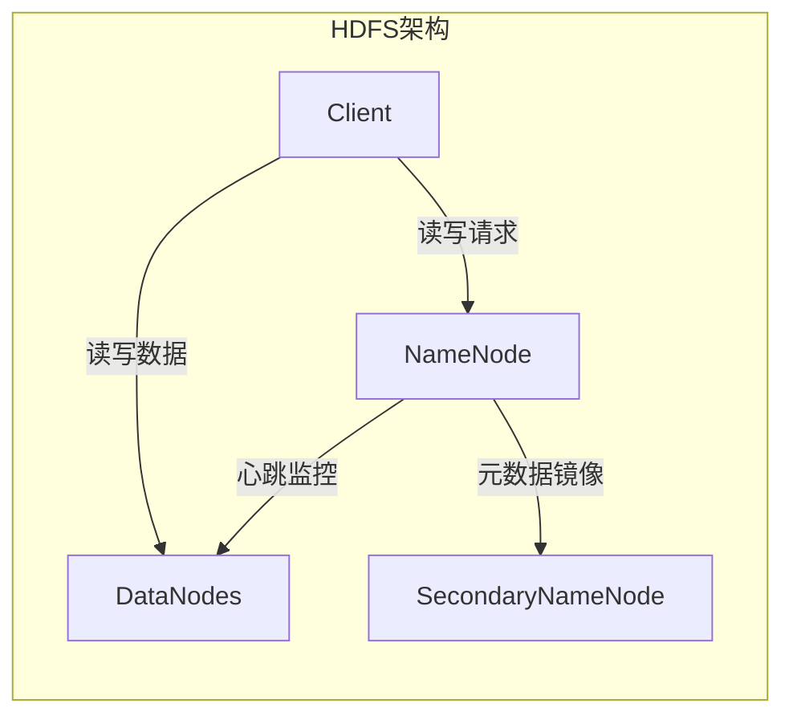
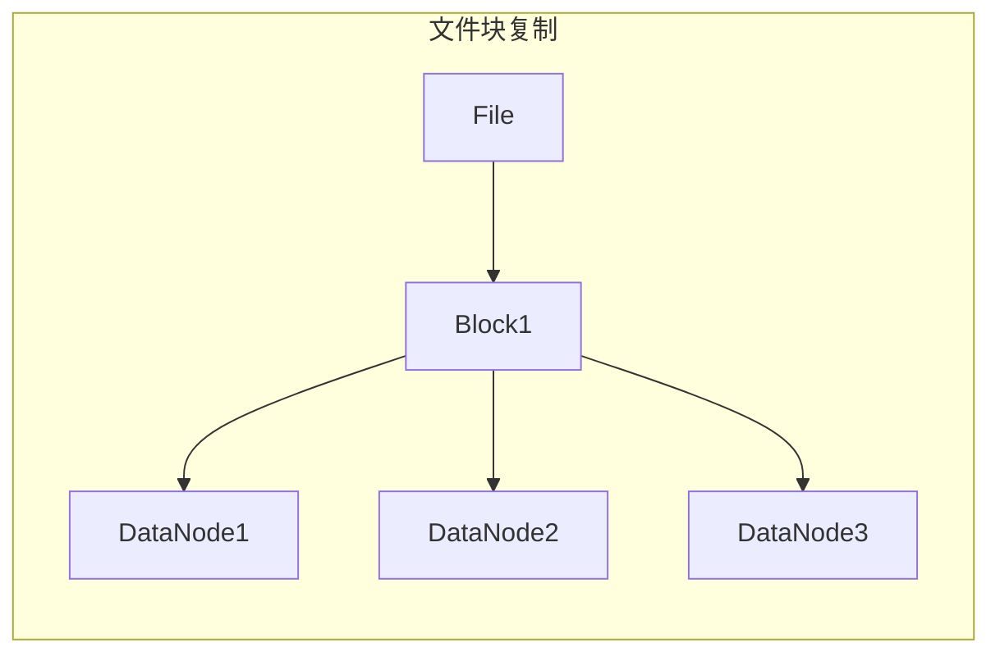
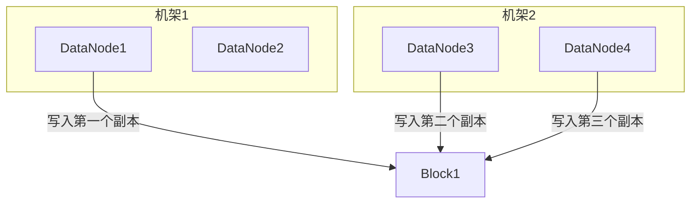

# HDFS原理与代码实例讲解

## 1.背景介绍

### 1.1 大数据时代的到来

随着互联网、移动互联网、物联网等新兴技术的快速发展,数据呈现出爆炸式增长。根据IDC(International Data Corporation)的预测,到2025年,全球数据总量将达到175ZB(1ZB=1万亿GB)。传统的数据存储和处理方式已经无法满足当前大数据时代的需求,因此分布式存储和计算框架应运而生。

### 1.2 HDFS的重要性

Apache Hadoop是一个开源的分布式系统基础架构,主要由HDFS(Hadoop Distributed File System)和MapReduce两个核心组件组成。HDFS是Hadoop生态系统中的分布式文件系统,为海量数据的存储提供了可靠、高吞吐量的解决方案,而MapReduce则为海量数据的分布式计算提供了支持。HDFS的设计初衷是为了部署在廉价的机器集群上,提供高容错性、高吞吐量的数据存储服务。

### 1.3 HDFS的应用场景

HDFS广泛应用于各种大数据场景,如日志数据分析、大数据分析、机器学习等。它的主要优势包括:

1. 高容错性:HDFS通过数据块复制实现高容错性,可以在节点出现故障时保证数据的完整性。
2. 高吞吐量:HDFS采用流式数据访问模式,适合于大文件的存储和批量数据处理。
3. 大规模扩展:HDFS可以通过简单地增加更多节点来扩展存储容量。

## 2.核心概念与联系

### 2.1 HDFS架构

HDFS遵循主从架构模式,主要由以下三个组件组成:

1. **NameNode**(名字节点):负责管理文件系统的命名空间和客户端对文件的访问。
2. **DataNode**(数据节点):负责存储实际的数据块。
3. **SecondaryNameNode**(辅助名字节点):用于定期合并NameNode的编辑日志,防止NameNode内存占用过高。



### 2.2 文件块和复制

HDFS将文件划分为一个或多个数据块(Block),并将这些数据块存储在一组DataNode上。每个数据块都可以有多个副本(默认为3个),从而实现容错性和高可用性。



### 2.3 读写流程

1. **写入流程**:客户端先向NameNode申请写入文件,NameNode为该文件分配数据块ID并返回DataNode节点列表。客户端将数据块写入DataNode,并在写入完成后通知NameNode。
2. **读取流程**:客户端先向NameNode申请读取文件,NameNode返回文件对应的数据块位置信息。客户端直接从DataNode读取数据块。

## 3.核心算法原理具体操作步骤

### 3.1 数据块放置策略

HDFS采用机架感知策略来确定数据块的放置位置,提高容错性和网络带宽利用率。具体步骤如下:

1. 首先,将第一个副本放置在上传文件的DataNode所在的节点。
2. 其次,将第二个副本放置在与第一个副本不同的机架上的随机节点。
3. 最后,将第三个副本放置在与第二个副本不同的节点上。



### 3.2 数据块复制与负载均衡

HDFS定期检查数据块的副本数量,如果低于设定值,则会自动创建新的副本。同时,HDFS也会根据节点的剩余存储空间进行负载均衡,将数据块从空间较少的节点迁移到空间较多的节点。

### 3.3 数据完整性检查

HDFS通过定期计算数据块的校验和来检查数据完整性。如果发现数据块损坏,则会从其他DataNode拉取副本进行修复。

## 4.数学模型和公式详细讲解举例说明

### 4.1 数据块大小计算

HDFS将文件划分为固定大小的数据块,默认数据块大小为128MB。数据块大小的选择需要权衡以下几个因素:

1. **磁盘传输效率**:较大的数据块可以提高磁盘传输效率,减少磁盘寻址开销。
2. **并行处理能力**:较小的数据块可以提高并行处理能力,充分利用集群资源。
3. **内存占用**:较大的数据块会导致NameNode的内存占用增加。

假设文件大小为$F$,数据块大小为$B$,则数据块个数$N$可以计算如下:

$$N = \lceil \frac{F}{B} \rceil$$

例如,如果文件大小为1GB,数据块大小为128MB,则数据块个数为:

$$N = \lceil \frac{1024}{128} \rceil = 8$$

### 4.2 数据复制因子

HDFS通过数据复制来实现容错性和高可用性。数据复制因子$R$表示每个数据块的副本数量,默认值为3。复制因子的选择需要权衡以下几个因素:

1. **可靠性**:较高的复制因子可以提高数据的可靠性,但也会增加存储开销。
2. **读取吞吐量**:较高的复制因子可以提高数据读取的吞吐量。
3. **写入吞吐量**:较低的复制因子可以提高数据写入的吞吐量。

假设文件大小为$F$,数据块大小为$B$,复制因子为$R$,则HDFS的总存储开销$S$可以计算如下:

$$S = R \times \lceil \frac{F}{B} \rceil \times B$$

例如,如果文件大小为1GB,数据块大小为128MB,复制因子为3,则HDFS的总存储开销为:

$$S = 3 \times \lceil \frac{1024}{128} \rceil \times 128 = 3 \times 8 \times 128 = 3072\text{MB}$$

## 5.项目实践:代码实例和详细解释说明

在本节中,我们将通过一个简单的Java示例程序来演示如何与HDFS进行交互。

### 5.1 环境准备

1. 安装Hadoop环境,可参考官方文档:https://hadoop.apache.org/docs/stable/hadoop-project-dist/hadoop-common/SingleCluster.html
2. 配置HDFS并启动NameNode和DataNode进程。

### 5.2 Java代码示例

```java
import org.apache.hadoop.conf.Configuration;
import org.apache.hadoop.fs.FSDataInputStream;
import org.apache.hadoop.fs.FSDataOutputStream;
import org.apache.hadoop.fs.FileSystem;
import org.apache.hadoop.fs.Path;

import java.io.BufferedReader;
import java.io.InputStreamReader;
import java.io.IOException;

public class HDFSExample {
    public static void main(String[] args) throws IOException {
        Configuration conf = new Configuration();
        conf.set("fs.defaultFS", "hdfs://localhost:9000");
        FileSystem fs = FileSystem.get(conf);

        // 写入文件
        Path filePath = new Path("/example/data.txt");
        FSDataOutputStream out = fs.create(filePath);
        out.writeUTF("Hello, HDFS!");
        out.close();

        // 读取文件
        FSDataInputStream in = fs.open(filePath);
        BufferedReader br = new BufferedReader(new InputStreamReader(in));
        String line = br.readLine();
        System.out.println("File content: " + line);
        br.close();

        // 删除文件
        fs.delete(filePath, true);
    }
}
```

代码解释:

1. 首先,创建一个`Configuration`对象,并设置HDFS的默认文件系统URI。
2. 通过`FileSystem.get()`方法获取HDFS文件系统实例。
3. 使用`FSDataOutputStream`向HDFS写入一个文件。
4. 使用`FSDataInputStream`从HDFS读取文件内容。
5. 最后,删除HDFS上的文件。

### 5.3 运行示例程序

1. 将上述Java代码编译为class文件。
2. 将class文件打包为jar文件,例如`hdfs-example.jar`。
3. 执行以下命令运行程序:

```
hadoop jar hdfs-example.jar HDFSExample
```

如果一切正常,你应该能在控制台看到输出:

```
File content: Hello, HDFS!
```

## 6.实际应用场景

HDFS在以下场景中发挥着重要作用:

1. **大数据分析**:HDFS为大数据分析平台(如Apache Spark、Apache Hive等)提供了可靠的数据存储和访问服务。
2. **日志处理**:HDFS可以高效地存储和处理大量的日志数据,为日志分析提供支持。
3. **机器学习**:HDFS可以存储海量的训练数据,为机器学习模型的训练提供数据支持。
4. **内容存储**:HDFS可以作为大规模内容存储系统,如视频、图像等。

## 7.工具和资源推荐

1. **Apache Hadoop官网**:https://hadoop.apache.org/
2. **HDFS命令手册**:https://hadoop.apache.org/docs/stable/hadoop-project-dist/hadoop-hdfs/HDFSCommands.html
3. **HDFS架构设计**:https://hadoop.apache.org/docs/stable/hadoop-project-dist/hadoop-hdfs/HdfsDesign.html
4. **HDFS权威指南**:https://book.douban.com/subject/25942339/

## 8.总结:未来发展趋势与挑战

### 8.1 未来发展趋势

1. **异构存储支持**:HDFS未来可能会支持更多异构存储介质,如SSD、NVMe等,以提高存储性能。
2. **安全性增强**:HDFS将进一步加强安全性,如数据加密、访问控制等。
3. **元数据管理优化**:NameNode的元数据管理将得到优化,以支持更大规模的集群和更高的并发访问。
4. **云原生支持**:HDFS可能会更好地支持云原生环境,如Kubernetes集成。

### 8.2 挑战

1. **元数据瓶颈**:NameNode作为集中式元数据管理器,在大规模集群中可能会遇到性能瓶颈。
2. **小文件存储效率**:HDFS更适合存储大文件,对于小文件的存储效率较低。
3. **数据本地性**:在数据局部性和负载均衡之间需要权衡。
4. **安全性和隐私保护**:随着数据量的增长,确保数据安全和隐私保护将变得更加重要。

## 9.附录:常见问题与解答

### 9.1 HDFS与传统文件系统的区别是什么?

HDFS是一种分布式文件系统,设计目标是存储和处理大规模数据集,而传统文件系统则更适合存储和管理较小的文件。HDFS采用了不同的设计原则和架构,如数据块存储、数据复制、流式数据访问等,以满足大数据场景的需求。

### 9.2 如何确定HDFS的数据块大小?

数据块大小的选择需要权衡磁盘传输效率、并行处理能力和内存占用等因素。一般来说,数据块大小设置为128MB或256MB是比较合理的选择。

### 9.3 HDFS是否支持数据压缩?

是的,HDFS支持多种压缩算法,如GZIP、BZIP2、LZO等。压缩可以减小存储空间占用,但也会增加CPU开销。

### 9.4 如何监控HDFS的健康状态?

Hadoop提供了多种工具和界面来监控HDFS的健康状态,如NameNode Web UI、DataNode Web UI、HDFS命令行工具等。您可以通过这些工具查看集群状态、数据块位置、磁盘使用情况等信息。

### 9.5 HDFS是否支持文件权限管理?

是的,HDFS支持基于POSIX标准的文件权限管理,包括读、写和执行权限。您可以通过命令行或API设置文件和目录的权限。

作者:禅与计算