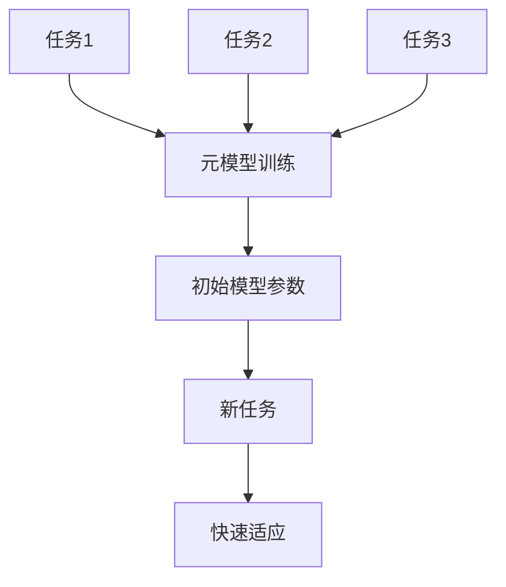
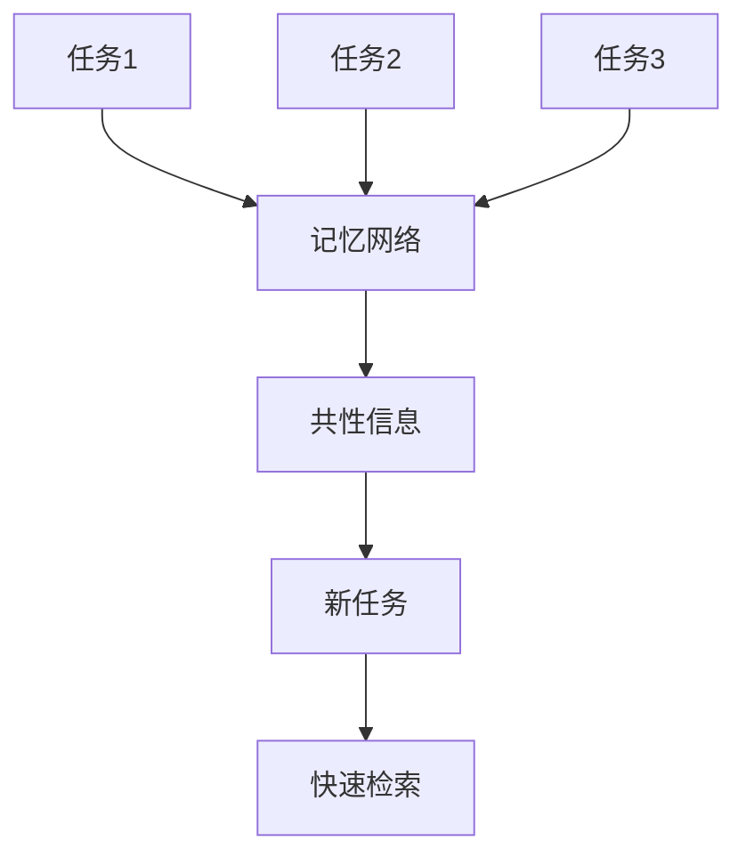

# Meta-Learning原理与代码实例讲解

## 1.背景介绍

在人工智能和机器学习领域，Meta-Learning（元学习）作为一种新兴的研究方向，正逐渐引起广泛关注。Meta-Learning的核心思想是“学习如何学习”，即通过训练一个模型，使其能够快速适应新任务。传统的机器学习方法通常需要大量的数据和时间来训练，而Meta-Learning则试图通过学习任务间的共性，来提高模型在新任务上的学习效率。

Meta-Learning的应用场景非常广泛，包括但不限于图像分类、自然语言处理、强化学习等。它的出现为解决小样本学习、快速适应新环境等问题提供了新的思路。

## 2.核心概念与联系

### 2.1 Meta-Learning的定义

Meta-Learning，也称为“学习的学习”，是一种通过训练一个元模型（Meta-Model），使其能够快速适应新任务的学习方法。元模型通过在多个任务上进行训练，学习到任务间的共性，从而在面对新任务时能够快速调整自身参数，实现高效学习。

### 2.2 Meta-Learning与传统机器学习的区别

传统机器学习方法通常需要大量的数据和时间来训练一个模型，而Meta-Learning则通过在多个任务上进行训练，学习到任务间的共性，从而在面对新任务时能够快速适应。具体区别如下：

- **数据需求**：传统机器学习需要大量的数据，而Meta-Learning可以在小样本数据上表现出色。
- **训练时间**：传统机器学习训练时间较长，而Meta-Learning通过元模型的快速调整，能够在短时间内适应新任务。
- **适应性**：传统机器学习模型在面对新任务时需要重新训练，而Meta-Learning模型可以通过元模型的调整快速适应新任务。

### 2.3 Meta-Learning的分类

Meta-Learning可以分为以下几类：

- **基于模型的方法**：通过设计特定的模型结构，使其能够快速适应新任务。
- **基于优化的方法**：通过优化算法，使模型能够在新任务上快速收敛。
- **基于记忆的方法**：通过记忆机制，存储任务间的共性信息，从而在新任务上快速检索和应用。

## 3.核心算法原理具体操作步骤

### 3.1 基于模型的方法

基于模型的方法通过设计特定的模型结构，使其能够快速适应新任务。常见的方法包括：

- **MAML（Model-Agnostic Meta-Learning）**：通过在多个任务上进行训练，学习到一个初始模型参数，使其在新任务上能够通过少量的梯度更新快速适应。



### 3.2 基于优化的方法

基于优化的方法通过优化算法，使模型能够在新任务上快速收敛。常见的方法包括：

- **Reptile**：通过在多个任务上进行训练，学习到一个初始模型参数，使其在新任务上能够通过少量的梯度更新快速适应。


### 3.3 基于记忆的方法

基于记忆的方法通过记忆机制，存储任务间的共性信息，从而在新任务上快速检索和应用。常见的方法包括：

- **MetaNet**：通过记忆网络，存储任务间的共性信息，从而在新任务上快速检索和应用。



## 4.数学模型和公式详细讲解举例说明

### 4.1 MAML算法

MAML（Model-Agnostic Meta-Learning）是一种基于模型的方法，其核心思想是通过在多个任务上进行训练，学习到一个初始模型参数，使其在新任务上能够通过少量的梯度更新快速适应。

#### 4.1.1 公式推导

假设我们有一个任务集合 $\mathcal{T}$，每个任务 $T_i$ 包含一个训练集 $D_i^{train}$ 和一个测试集 $D_i^{test}$。MAML的目标是找到一个初始模型参数 $\theta$，使其在新任务上通过少量的梯度更新能够快速适应。

具体步骤如下：

1. **初始化模型参数** $\theta$。
2. **在每个任务上进行训练**：
   - 对于每个任务 $T_i$，在训练集 $D_i^{train}$ 上进行梯度更新，得到更新后的参数 $\theta_i'$：
     $$
     \theta_i' = \theta - \alpha \nabla_\theta \mathcal{L}_{T_i}(f_\theta)
     $$
   - 其中，$\alpha$ 是学习率，$\mathcal{L}_{T_i}$ 是任务 $T_i$ 的损失函数。
3. **在测试集上计算损失**：
   - 在测试集 $D_i^{test}$ 上计算更新后参数 $\theta_i'$ 的损失：
     $$
     \mathcal{L}_{meta} = \sum_{T_i \in \mathcal{T}} \mathcal{L}_{T_i}(f_{\theta_i'})
     $$
4. **更新初始模型参数** $\theta$：
   - 通过梯度下降法更新初始模型参数 $\theta$：
     $$
     \theta \leftarrow \theta - \beta \nabla_\theta \mathcal{L}_{meta}
     $$
   - 其中，$\beta$ 是元学习率。

### 4.2 Reptile算法

Reptile是一种基于优化的方法，其核心思想是通过在多个任务上进行训练，学习到一个初始模型参数，使其在新任务上能够通过少量的梯度更新快速适应。

#### 4.2.1 公式推导

Reptile的具体步骤如下：

1. **初始化模型参数** $\theta$。
2. **在每个任务上进行训练**：
   - 对于每个任务 $T_i$，在训练集 $D_i^{train}$ 上进行多次梯度更新，得到更新后的参数 $\theta_i'$：
     $$
     \theta_i' = \theta - \alpha \nabla_\theta \mathcal{L}_{T_i}(f_\theta)
     $$
   - 其中，$\alpha$ 是学习率，$\mathcal{L}_{T_i}$ 是任务 $T_i$ 的损失函数。
3. **更新初始模型参数** $\theta$：
   - 通过加权平均法更新初始模型参数 $\theta$：
     $$
     \theta \leftarrow \theta + \beta (\theta_i' - \theta)
     $$
   - 其中，$\beta$ 是元学习率。

### 4.3 MetaNet算法

MetaNet是一种基于记忆的方法，其核心思想是通过记忆网络，存储任务间的共性信息，从而在新任务上快速检索和应用。

#### 4.3.1 公式推导

MetaNet的具体步骤如下：

1. **初始化记忆网络** $M$。
2. **在每个任务上进行训练**：
   - 对于每个任务 $T_i$，在训练集 $D_i^{train}$ 上进行训练，更新记忆网络 $M$：
     $$
     M \leftarrow \text{UpdateMemory}(M, D_i^{train})
     $$
3. **在新任务上进行快速检索**：
   - 在新任务 $T_{new}$ 上，通过记忆网络 $M$ 快速检索共性信息，并进行少量的梯度更新：
     $$
     \theta_{new} = \text{RetrieveMemory}(M, D_{new}^{train}) - \alpha \nabla_\theta \mathcal{L}_{T_{new}}(f_\theta)
     $$
   - 其中，$\alpha$ 是学习率，$\mathcal{L}_{T_{new}}$ 是新任务 $T_{new}$ 的损失函数。

## 5.项目实践：代码实例和详细解释说明

### 5.1 MAML算法代码实例

以下是一个使用PyTorch实现MAML算法的代码实例：

```python
import torch
import torch.nn as nn
import torch.optim as optim

class MAMLModel(nn.Module):
    def __init__(self):
        super(MAMLModel, self).__init__()
        self.fc1 = nn.Linear(28 * 28, 64)
        self.fc2 = nn.Linear(64, 10)

    def forward(self, x):
        x = torch.relu(self.fc1(x))
        x = self.fc2(x)
        return x

def train_maml(model, tasks, meta_lr, task_lr, num_iterations):
    meta_optimizer = optim.Adam(model.parameters(), lr=meta_lr)

    for iteration in range(num_iterations):
        meta_loss = 0
        for task in tasks:
            # Clone model parameters for task-specific updates
            task_model = MAMLModel()
            task_model.load_state_dict(model.state_dict())
            task_optimizer = optim.SGD(task_model.parameters(), lr=task_lr)

            # Perform task-specific updates
            for _ in range(task['num_steps']):
                task_optimizer.zero_grad()
                outputs = task_model(task['data'])
                loss = nn.CrossEntropyLoss()(outputs, task['labels'])
                loss.backward()
                task_optimizer.step()

            # Compute meta-loss
            outputs = task_model(task['data'])
            meta_loss += nn.CrossEntropyLoss()(outputs, task['labels'])

        # Update meta-model parameters
        meta_optimizer.zero_grad()
        meta_loss.backward()
        meta_optimizer.step()

# Example usage
model = MAMLModel()
tasks = [{'data': torch.randn(32, 28 * 28), 'labels': torch.randint(0, 10, (32,)), 'num_steps': 5} for _ in range(10)]
train_maml(model, tasks, meta_lr=0.001, task_lr=0.01, num_iterations=1000)
```

### 5.2 Reptile算法代码实例

以下是一个使用PyTorch实现Reptile算法的代码实例：

```python
import torch
import torch.nn as nn
import torch.optim as optim

class ReptileModel(nn.Module):
    def __init__(self):
        super(ReptileModel, self).__init__()
        self.fc1 = nn.Linear(28 * 28, 64)
        self.fc2 = nn.Linear(64, 10)

    def forward(self, x):
        x = torch.relu(self.fc1(x))
        x = self.fc2(x)
        return x

def train_reptile(model, tasks, meta_lr, task_lr, num_iterations):
    meta_optimizer = optim.Adam(model.parameters(), lr=meta_lr)

    for iteration in range(num_iterations):
        for task in tasks:
            # Clone model parameters for task-specific updates
            task_model = ReptileModel()
            task_model.load_state_dict(model.state_dict())
            task_optimizer = optim.SGD(task_model.parameters(), lr=task_lr)

            # Perform task-specific updates
            for _ in range(task['num_steps']):
                task_optimizer.zero_grad()
                outputs = task_model(task['data'])
                loss = nn.CrossEntropyLoss()(outputs, task['labels'])
                loss.backward()
                task_optimizer.step()

            # Update meta-model parameters
            for param, task_param in zip(model.parameters(), task_model.parameters()):
                param.data = param.data + meta_lr * (task_param.data - param.data)

# Example usage
model = ReptileModel()
tasks = [{'data': torch.randn(32, 28 * 28), 'labels': torch.randint(0, 10, (32,)), 'num_steps': 5} for _ in range(10)]
train_reptile(model, tasks, meta_lr=0.001, task_lr=0.01, num_iterations=1000)
```

### 5.3 MetaNet算法代码实例

以下是一个使用PyTorch实现MetaNet算法的代码实例：

```python
import torch
import torch.nn as nn
import torch.optim as optim

class MetaNetModel(nn.Module):
    def __init__(self):
        super(MetaNetModel, self).__init__()
        self.fc1 = nn.Linear(28 * 28, 64)
        self.fc2 = nn.Linear(64, 10)
        self.memory = {}

    def forward(self, x):
        x = torch.relu(self.fc1(x))
        x = self.fc2(x)
        return x

    def update_memory(self, task_id, data, labels):
        self.memory[task_id] = (data, labels)

    def retrieve_memory(self, task_id):
        return self.memory.get(task_id, (None, None))

def train_metanet(model, tasks, meta_lr, task_lr, num_iterations):
    meta_optimizer = optim.Adam(model.parameters(), lr=meta_lr)

    for iteration in range(num_iterations):
        for task_id, task in enumerate(tasks):
            # Update memory
            model.update_memory(task_id, task['data'], task['labels'])

            # Retrieve memory
            memory_data, memory_labels = model.retrieve_memory(task_id)

            if memory_data is not None:
                # Clone model parameters for task-specific updates
                task_model = MetaNetModel()
                task_model.load_state_dict(model.state_dict())
                task_optimizer = optim.SGD(task_model.parameters(), lr=task_lr)

                # Perform task-specific updates
                for _ in range(task['num_steps']):
                    task_optimizer.zero_grad()
                    outputs = task_model(memory_data)
                    loss = nn.CrossEntropyLoss()(outputs, memory_labels)
                    loss.backward()
                    task_optimizer.step()

                # Update meta-model parameters
                for param, task_param in zip(model.parameters(), task_model.parameters()):
                    param.data = param.data + meta_lr * (task_param.data - param.data)

# Example usage
model = MetaNetModel()
tasks = [{'data': torch.randn(32, 28 * 28), 'labels': torch.randint(0, 10, (32,)), 'num_steps': 5} for _ in range(10)]
train_metanet(model, tasks, meta_lr=0.001, task_lr=0.01, num_iterations=1000)
```

## 6.实际应用场景

### 6.1 图像分类

Meta-Learning在图像分类任务中表现出色，特别是在小样本学习场景下。通过在多个图像分类任务上进行训练，Meta-Learning模型能够快速适应新类别的图像分类任务。

### 6.2 自然语言处理

在自然语言处理任务中，Meta-Learning可以用于快速适应新语言或新领域的文本分类、情感分析等任务。通过在多个语言或领域的任务上进行训练，Meta-Learning模型能够快速适应新任务。

### 6.3 强化学习

Meta-Learning在强化学习任务中也有广泛应用。通过在多个环境中进行训练，Meta-Learning模型能够快速适应新环境，实现高效的策略学习。

### 6.4 医疗诊断

在医疗诊断任务中，Meta-Learning可以用于快速适应新疾病的诊断。通过在多个疾病诊断任务上进行训练，Meta-Learning模型能够快速适应新疾病的诊断任务，提高诊断准确率。

## 7.工具和资源推荐

### 7.1 工具推荐

- **PyTorch**：一个开源的深度学习框架，支持动态计算图，适合实现Meta-Learning算法。
- **TensorFlow**：一个开源的深度学习框架，支持静态计算图，适合实现大规模的Meta-Learning算法。
- **Scikit-Learn**：一个开源的机器学习库，提供了丰富的机器学习算法和工具，适合进行数据预处理和模型评估。

### 7.2 资源推荐

- **Meta-Learning Papers**：一个收集Meta-Learning相关论文的网站，提供了丰富的Meta-Learning研究资源。
- **GitHub Repositories**：在GitHub上搜索Meta-Learning相关的开源项目，可以找到许多优秀的实现和代码示例。
- **在线课程**：Coursera、edX等平台上有许多关于Meta-Learning的在线课程，适合初学者和进阶学习者。

## 8.总结：未来发展趋势与挑战

### 8.1 未来发展趋势

Meta-Learning作为一种新兴的研究方向，未来有着广阔的发展前景。随着数据量的增加和计算能力的提升，Meta-Learning在各个领域的应用将会越来越广泛。未来的发展趋势包括：

- **更高效的算法**：研究更高效的Meta-Learning算法，提高模型的学习效率和适应能力。
- **跨领域应用**：将Meta-Learning应用于更多领域，如金融、医疗、自动驾驶等。
- **与其他技术结合**：将Meta-Learning与其他技术（如强化学习、生成对抗网络等）结合，探索新的应用场景和解决方案。

### 8.2 挑战

尽管Meta-Learning有着广阔的发展前景，但也面临着一些挑战：

- **数据依赖**：Meta-Learning模型的性能依赖于训练数据的多样性和质量，如何获取高质量的训练数据是一个挑战。
- **计算资源**：Meta-Learning算法通常需要大量的计算资源，如何提高计算效率是一个亟待解决的问题。
- **模型泛化**：如何提高Meta-Learning模型在新任务上的泛化能力，是一个重要的研究方向。

## 9.附录：常见问题与解答

### 9.1 什么是Meta-Learning？

Meta-Learning是一种通过训练一个元模型，使其能够快速适应新任务的学习方法。其核心思想是