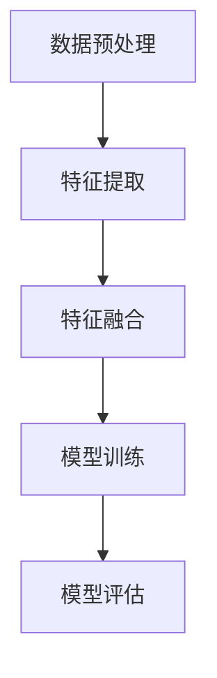

# 多模态大模型：技术原理与实战 跨模态多重组合技术

## 1.背景介绍

在人工智能领域，多模态大模型（Multimodal Large Models, MLMs）正逐渐成为研究热点。多模态大模型通过整合不同模态的数据（如文本、图像、音频等），实现了更为复杂和智能的任务处理能力。随着深度学习和大数据技术的发展，多模态大模型在自然语言处理、计算机视觉、语音识别等领域展现出了巨大的潜力。

多模态大模型的核心在于跨模态多重组合技术，这种技术能够将不同模态的数据进行有效融合，从而提升模型的表现力和泛化能力。本文将深入探讨多模态大模型的技术原理与实战，详细介绍其核心概念、算法原理、数学模型、项目实践、实际应用场景、工具和资源推荐，并展望其未来发展趋势与挑战。

## 2.核心概念与联系

### 2.1 多模态数据

多模态数据是指来自不同来源或具有不同特征的数据类型，如文本、图像、音频、视频等。每种模态的数据都包含独特的信息，通过融合这些信息，可以获得更全面的理解和更准确的预测。

### 2.2 跨模态学习

跨模态学习是指通过学习不同模态之间的关系和相互作用，来提升模型的性能。跨模态学习的关键在于如何有效地表示和融合不同模态的数据，使得模型能够从多模态数据中提取有用的信息。

### 2.3 多模态大模型

多模态大模型是指能够处理和融合多模态数据的大规模深度学习模型。这类模型通常具有复杂的网络结构和大量的参数，能够在多种任务中表现出色，如图像分类、文本生成、语音识别等。

### 2.4 跨模态多重组合技术

跨模态多重组合技术是多模态大模型的核心技术之一。它通过设计复杂的网络结构和融合策略，将不同模态的数据进行有效组合，从而提升模型的表现力和泛化能力。

## 3.核心算法原理具体操作步骤

### 3.1 数据预处理

数据预处理是多模态大模型训练的第一步。不同模态的数据需要进行不同的预处理操作，如文本的分词和向量化、图像的归一化和增强、音频的特征提取等。

### 3.2 特征提取

特征提取是指从原始数据中提取出有用的特征表示。对于不同模态的数据，特征提取的方法也不同，如卷积神经网络（CNN）用于图像特征提取，循环神经网络（RNN）用于文本特征提取，梅尔频谱倒谱系数（MFCC）用于音频特征提取等。

### 3.3 特征融合

特征融合是多模态大模型的关键步骤。常见的特征融合方法包括早期融合、晚期融合和中期融合。早期融合是指在特征提取阶段就将不同模态的特征进行融合，晚期融合是指在模型的决策阶段进行融合，中期融合则是在模型的中间层进行融合。

### 3.4 模型训练

模型训练是指通过优化算法对多模态大模型的参数进行调整，使得模型能够在训练数据上表现良好。常见的优化算法包括随机梯度下降（SGD）、Adam等。

### 3.5 模型评估

模型评估是指通过一定的评估指标来衡量多模态大模型的性能。常见的评估指标包括准确率、精确率、召回率、F1值等。

以下是一个简单的多模态大模型的流程图：



## 4.数学模型和公式详细讲解举例说明

### 4.1 特征提取的数学表示

假设我们有两种模态的数据：文本和图像。对于文本数据，我们可以使用词嵌入（Word Embedding）方法将其表示为向量 $ \mathbf{t} \in \mathbb{R}^d $，其中 $ d $ 是词嵌入的维度。对于图像数据，我们可以使用卷积神经网络（CNN）提取其特征表示为向量 $ \mathbf{i} \in \mathbb{R}^k $，其中 $ k $ 是图像特征的维度。

### 4.2 特征融合的数学表示

特征融合的目标是将文本特征 $ \mathbf{t} $ 和图像特征 $ \mathbf{i} $ 进行有效组合。常见的特征融合方法包括：

#### 4.2.1 早期融合

早期融合是指在特征提取阶段就将不同模态的特征进行融合。假设我们使用简单的加权求和方法进行融合，则融合后的特征表示为：

$$
\mathbf{f} = \alpha \mathbf{t} + \beta \mathbf{i}
$$

其中，$ \alpha $ 和 $ \beta $ 是融合权重，满足 $ \alpha + \beta = 1 $。

#### 4.2.2 晚期融合

晚期融合是指在模型的决策阶段进行融合。假设我们有两个独立的分类器，分别对文本特征和图像特征进行分类，得到的分类结果分别为 $ y_t $ 和 $ y_i $。则融合后的分类结果可以表示为：

$$
y = \gamma y_t + \delta y_i
$$

其中，$ \gamma $ 和 $ \delta $ 是融合权重，满足 $ \gamma + \delta = 1 $。

#### 4.2.3 中期融合

中期融合是指在模型的中间层进行融合。假设我们在中间层使用简单的拼接操作进行融合，则融合后的特征表示为：

$$
\mathbf{f} = [\mathbf{t}; \mathbf{i}]
$$

其中，$ [\mathbf{t}; \mathbf{i}] $ 表示将 $ \mathbf{t} $ 和 $ \mathbf{i} $ 进行拼接。

### 4.3 模型训练的数学表示

模型训练的目标是通过优化算法对模型的参数进行调整，使得模型能够在训练数据上表现良好。假设我们使用交叉熵损失函数，则损失函数可以表示为：

$$
L = -\frac{1}{N} \sum_{i=1}^N \left[ y_i \log(\hat{y}_i) + (1 - y_i) \log(1 - \hat{y}_i) \right]
$$

其中，$ N $ 是训练样本的数量，$ y_i $ 是第 $ i $ 个样本的真实标签，$ \hat{y}_i $ 是第 $ i $ 个样本的预测概率。

## 5.项目实践：代码实例和详细解释说明

### 5.1 数据预处理

以下是一个简单的多模态数据预处理的代码示例：

```python
import numpy as np
from sklearn.preprocessing import StandardScaler
from keras.preprocessing.text import Tokenizer
from keras.preprocessing.sequence import pad_sequences
from keras.applications.vgg16 import VGG16, preprocess_input
from keras.preprocessing.image import load_img, img_to_array

# 文本数据预处理
texts = ["This is a sample text.", "Another example of text."]
tokenizer = Tokenizer(num_words=10000)
tokenizer.fit_on_texts(texts)
sequences = tokenizer.texts_to_sequences(texts)
text_data = pad_sequences(sequences, maxlen=100)

# 图像数据预处理
image_paths = ["path/to/image1.jpg", "path/to/image2.jpg"]
image_data = []
for path in image_paths:
    img = load_img(path, target_size=(224, 224))
    img_array = img_to_array(img)
    img_array = preprocess_input(img_array)
    image_data.append(img_array)
image_data = np.array(image_data)

# 标准化
scaler = StandardScaler()
text_data = scaler.fit_transform(text_data)
image_data = scaler.fit_transform(image_data.reshape(-1, image_data.shape[-1])).reshape(image_data.shape)
```

### 5.2 特征提取

以下是一个简单的特征提取的代码示例：

```python
from keras.models import Model
from keras.layers import Input, Embedding, LSTM, Dense, Flatten

# 文本特征提取
text_input = Input(shape=(100,))
embedding = Embedding(input_dim=10000, output_dim=128)(text_input)
lstm = LSTM(128)(embedding)
text_features = Dense(128, activation='relu')(lstm)

# 图像特征提取
image_input = Input(shape=(224, 224, 3))
vgg16 = VGG16(weights='imagenet', include_top=False)(image_input)
image_features = Flatten()(vgg16)
image_features = Dense(128, activation='relu')(image_features)

# 特征融合
merged_features = Dense(128, activation='relu')([text_features, image_features])

# 模型定义
model = Model(inputs=[text_input, image_input], outputs=merged_features)
model.compile(optimizer='adam', loss='binary_crossentropy', metrics=['accuracy'])
```

### 5.3 模型训练

以下是一个简单的模型训练的代码示例：

```python
# 假设我们有标签数据
labels = np.array([0, 1])

# 模型训练
model.fit([text_data, image_data], labels, epochs=10, batch_size=2)
```

### 5.4 模型评估

以下是一个简单的模型评估的代码示例：

```python
# 模型评估
loss, accuracy = model.evaluate([text_data, image_data], labels)
print(f"Loss: {loss}, Accuracy: {accuracy}")
```

## 6.实际应用场景

### 6.1 医疗影像分析

多模态大模型在医疗影像分析中具有广泛的应用。例如，通过融合患者的病历文本和医学影像数据，可以提高疾病诊断的准确性。

### 6.2 自动驾驶

在自动驾驶领域，多模态大模型可以融合摄像头、激光雷达、雷达等多种传感器的数据，从而实现更为精准的环境感知和决策。

### 6.3 多媒体检索

多模态大模型在多媒体检索中也有重要应用。例如，通过融合图像和文本描述，可以实现更为精准的图像检索和推荐。

### 6.4 智能客服

在智能客服系统中，多模态大模型可以融合语音、文本和情感分析等多种模态的数据，从而提供更为智能和人性化的服务。

## 7.工具和资源推荐

### 7.1 工具

- **TensorFlow**：一个开源的深度学习框架，支持多模态大模型的构建和训练。
- **PyTorch**：另一个流行的深度学习框架，具有灵活的动态计算图和强