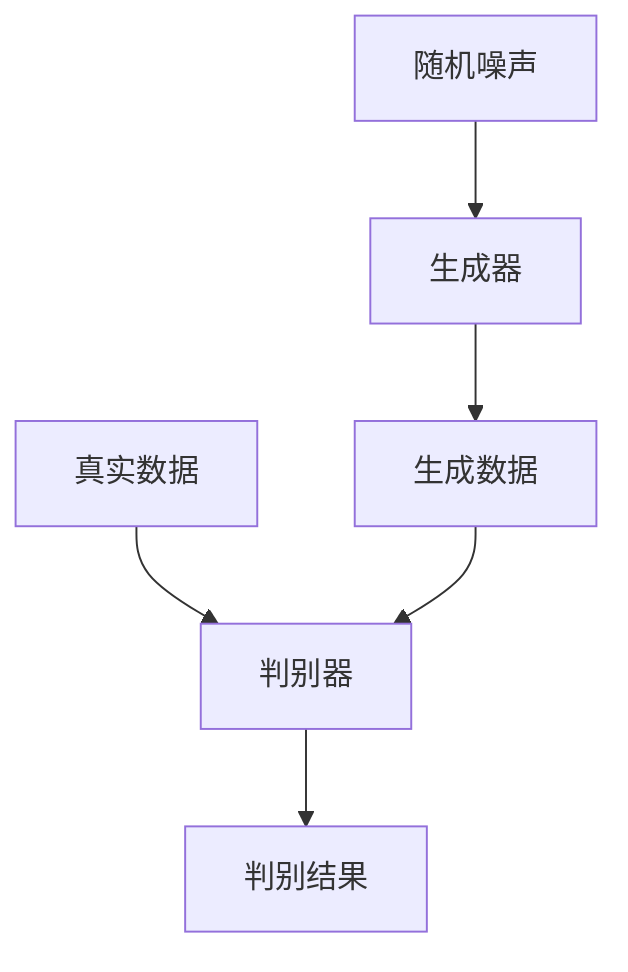

# 生成对抗网络 (Generative Adversarial Network)

## 1.背景介绍

生成对抗网络（Generative Adversarial Network，简称GAN）是由Ian Goodfellow及其同事在2014年提出的一种深度学习模型。GAN的出现为生成模型领域带来了革命性的变化。其核心思想是通过两个神经网络——生成器（Generator）和判别器（Discriminator）之间的对抗训练，使得生成器能够生成逼真的数据样本。

### 1.1 生成模型的历史

在GAN出现之前，生成模型主要包括自回归模型（Autoregressive Models）、变分自编码器（Variational Autoencoders，VAE）等。这些模型在生成数据方面取得了一定的成功，但在生成数据的质量和多样性上仍存在不足。

### 1.2 GAN的诞生

Ian Goodfellow等人提出的GAN通过引入对抗训练的机制，使得生成器和判别器在不断博弈中共同进化，从而生成高质量的数据样本。GAN的出现不仅在图像生成领域取得了显著成果，还在文本生成、语音合成等多个领域展现了强大的潜力。

## 2.核心概念与联系

### 2.1 生成器（Generator）

生成器的任务是从随机噪声中生成逼真的数据样本。生成器通常是一个深度神经网络，其输入是一个随机向量，输出是生成的数据样本。

### 2.2 判别器（Discriminator）

判别器的任务是区分真实数据和生成数据。判别器也是一个深度神经网络，其输入是数据样本，输出是一个概率值，表示输入数据是真实数据的概率。

### 2.3 对抗训练

对抗训练是GAN的核心机制。生成器和判别器在训练过程中相互博弈，生成器试图欺骗判别器，而判别器则试图准确区分真实数据和生成数据。通过这种对抗训练，生成器不断改进其生成能力，判别器也不断提高其判别能力。

### 2.4 GAN的工作流程

以下是GAN的工作流程的Mermaid流程图：



## 3.核心算法原理具体操作步骤

### 3.1 初始化

首先，初始化生成器和判别器的参数。生成器的输入是一个随机噪声向量，判别器的输入是数据样本。

### 3.2 生成数据

生成器从随机噪声中生成数据样本。生成的数据样本将作为判别器的输入之一。

### 3.3 判别器训练

将真实数据和生成数据输入判别器，计算判别器的输出。判别器的目标是最大化其对真实数据的判别准确率，同时最小化其对生成数据的判别准确率。

### 3.4 生成器训练

生成器的目标是最小化判别器对生成数据的判别准确率。通过反向传播算法，更新生成器的参数，使其生成的数据样本更加逼真。

### 3.5 迭代训练

重复上述步骤，直到生成器和判别器的性能达到预期目标。

## 4.数学模型和公式详细讲解举例说明

### 4.1 GAN的目标函数

GAN的目标函数由生成器和判别器的损失函数组成。判别器的损失函数为：

$$
L_D = -\mathbb{E}_{x \sim p_{data}(x)}[\log D(x)] - \mathbb{E}_{z \sim p_z(z)}[\log(1 - D(G(z)))]
$$

生成器的损失函数为：

$$
L_G = -\mathbb{E}_{z \sim p_z(z)}[\log D(G(z))]
$$

### 4.2 交替优化

在训练过程中，首先固定生成器的参数，优化判别器的损失函数。然后固定判别器的参数，优化生成器的损失函数。通过交替优化，生成器和判别器在对抗中不断提升性能。

### 4.3 数学推导

通过对GAN的目标函数进行数学推导，可以证明在理想情况下，生成器生成的数据分布将与真实数据分布一致。具体推导过程如下：

1. 判别器的最优解为：

$$
D^*(x) = \frac{p_{data}(x)}{p_{data}(x) + p_g(x)}
$$

2. 将判别器的最优解代入生成器的损失函数，得到生成器的目标函数为：

$$
L_G = -\mathbb{E}_{x \sim p_{data}(x)}[\log D^*(x)] - \mathbb{E}_{x \sim p_g(x)}[\log(1 - D^*(x))]
$$

3. 通过优化生成器的目标函数，可以证明在理想情况下，生成器生成的数据分布 $p_g(x)$ 将与真实数据分布 $p_{data}(x)$ 一致。

## 5.项目实践：代码实例和详细解释说明

### 5.1 环境准备

首先，确保安装了必要的Python库，如TensorFlow或PyTorch。

```bash
pip install tensorflow
pip install numpy
```

### 5.2 数据准备

以MNIST数据集为例，加载数据集：

```python
import tensorflow as tf
from tensorflow.keras.datasets import mnist

(x_train, _), (_, _) = mnist.load_data()
x_train = x_train / 255.0
x_train = x_train.reshape(-1, 28, 28, 1)
```

### 5.3 构建生成器

定义生成器模型：

```python
from tensorflow.keras import layers

def build_generator():
    model = tf.keras.Sequential()
    model.add(layers.Dense(256, input_dim=100))
    model.add(layers.LeakyReLU(alpha=0.2))
    model.add(layers.BatchNormalization(momentum=0.8))
    model.add(layers.Dense(512))
    model.add(layers.LeakyReLU(alpha=0.2))
    model.add(layers.BatchNormalization(momentum=0.8))
    model.add(layers.Dense(1024))
    model.add(layers.LeakyReLU(alpha=0.2))
    model.add(layers.BatchNormalization(momentum=0.8))
    model.add(layers.Dense(28 * 28 * 1, activation='tanh'))
    model.add(layers.Reshape((28, 28, 1)))
    return model
```

### 5.4 构建判别器

定义判别器模型：

```python
def build_discriminator():
    model = tf.keras.Sequential()
    model.add(layers.Flatten(input_shape=(28, 28, 1)))
    model.add(layers.Dense(512))
    model.add(layers.LeakyReLU(alpha=0.2))
    model.add(layers.Dense(256))
    model.add(layers.LeakyReLU(alpha=0.2))
    model.add(layers.Dense(1, activation='sigmoid'))
    return model
```

### 5.5 训练模型

定义GAN模型并进行训练：

```python
import numpy as np

def train(generator, discriminator, epochs, batch_size=128, save_interval=50):
    (x_train, _), (_, _) = mnist.load_data()
    x_train = x_train / 255.0
    x_train = x_train.reshape(-1, 28, 28, 1)
    
    valid = np.ones((batch_size, 1))
    fake = np.zeros((batch_size, 1))
    
    for epoch in range(epochs):
        idx = np.random.randint(0, x_train.shape[0], batch_size)
        imgs = x_train[idx]
        
        noise = np.random.normal(0, 1, (batch_size, 100))
        gen_imgs = generator.predict(noise)
        
        d_loss_real = discriminator.train_on_batch(imgs, valid)
        d_loss_fake = discriminator.train_on_batch(gen_imgs, fake)
        d_loss = 0.5 * np.add(d_loss_real, d_loss_fake)
        
        noise = np.random.normal(0, 1, (batch_size, 100))
        g_loss = gan.train_on_batch(noise, valid)
        
        if epoch % save_interval == 0:
            print(f"{epoch} [D loss: {d_loss[0]}] [G loss: {g_loss}]")

generator = build_generator()
discriminator = build_discriminator()
discriminator.compile(loss='binary_crossentropy', optimizer='adam', metrics=['accuracy'])

z = layers.Input(shape=(100,))
img = generator(z)
discriminator.trainable = False
valid = discriminator(img)

gan = tf.keras.Model(z, valid)
gan.compile(loss='binary_crossentropy', optimizer='adam')

train(generator, discriminator, epochs=10000, batch_size=64, save_interval=1000)
```

## 6.实际应用场景

### 6.1 图像生成

GAN在图像生成领域取得了显著成果，如生成高分辨率图像、图像修复、图像超分辨率等。

### 6.2 文本生成

GAN在文本生成领域也展现了潜力，如生成自然语言文本、对话系统等。

### 6.3 语音合成

GAN在语音合成领域的应用包括生成高质量的语音、语音转换等。

### 6.4 数据增强

GAN可以用于数据增强，生成更多样化的数据样本，提升模型的泛化能力。

## 7.工具和资源推荐

### 7.1 开源框架

- TensorFlow: https://www.tensorflow.org/
- PyTorch: https://pytorch.org/

### 7.2 相关书籍

- 《深度学习》 - Ian Goodfellow, Yoshua Bengio, Aaron Courville
- 《生成对抗网络入门》 - 李沐, 阿斯顿张

### 7.3 在线课程

- Coursera: Generative Adversarial Networks (GANs) Specialization
- Udacity: Intro to Deep Learning with PyTorch

## 8.总结：未来发展趋势与挑战

### 8.1 未来发展趋势

GAN在生成模型领域展现了巨大的潜力，未来的发展趋势包括更高效的训练算法、更强大的生成能力、更广泛的应用场景等。

### 8.2 挑战

GAN的训练过程存在不稳定性、模式崩溃等问题。如何提高GAN的训练稳定性、生成数据的多样性是未来研究的重点。

## 9.附录：常见问题与解答

### 9.1 GAN的训练不稳定怎么办？

GAN的训练不稳定是一个常见问题，可以尝试以下方法：
- 使用更稳定的优化算法，如RMSprop、Adam等。
- 调整生成器和判别器的训练频率。
- 使用梯度惩罚等正则化方法。

### 9.2 如何提高生成数据的多样性？

可以尝试以下方法：
- 使用多样性损失函数，如模式崩溃惩罚。
- 增加生成器的复杂度，提高其生成能力。

### 9.3 GAN的应用场景有哪些？

GAN的应用场景包括图像生成、文本生成、语音合成、数据增强等。

---

作者：禅与计算机程序设计艺术 / Zen and the Art of Computer Programming