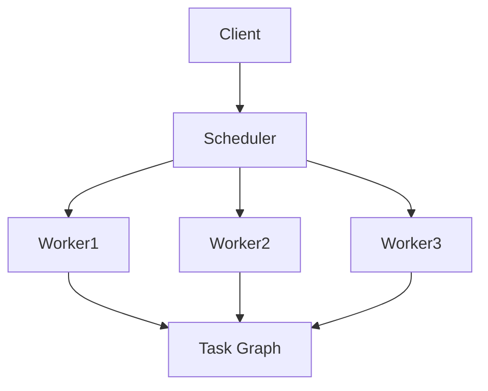
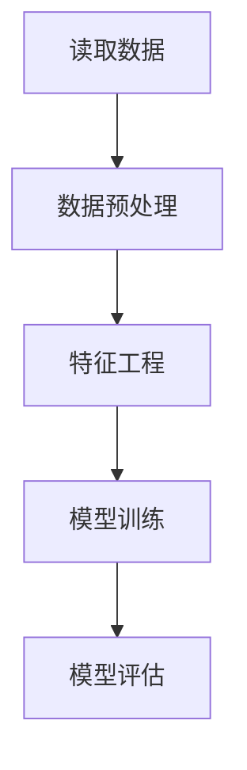

# Python机器学习实战：分布式机器学习框架Dask的入门与实战

作者：禅与计算机程序设计艺术 / Zen and the Art of Computer Programming

## 1. 背景介绍

### 1.1 问题的由来

随着大数据时代的到来，数据量的爆炸式增长使得传统的单机处理方式逐渐显得力不从心。无论是数据预处理、特征工程还是模型训练，单机环境下的计算资源和内存限制都成为了瓶颈。为了应对这些挑战，分布式计算框架应运而生。Dask作为一个灵活且高效的并行计算库，能够在多核处理器和集群环境中高效地处理大规模数据。

### 1.2 研究现状

目前，分布式计算框架如Apache Spark、Hadoop等已经在大数据处理领域占据了重要地位。然而，这些框架的学习曲线较陡，且对资源的需求较高。相比之下，Dask以其轻量级、易用性和与Python生态系统的良好兼容性，逐渐受到数据科学家和工程师的青睐。Dask不仅支持大规模数据处理，还能与Pandas、NumPy等库无缝集成，极大地简化了数据处理流程。

### 1.3 研究意义

研究和掌握Dask的使用方法，不仅能够提升数据处理的效率，还能为机器学习模型的训练和优化提供强有力的支持。通过Dask，我们可以在本地计算资源有限的情况下，充分利用分布式计算的优势，处理更大规模的数据集，训练更复杂的模型，从而在实际应用中获得更好的效果。

### 1.4 本文结构

本文将从以下几个方面详细介绍Dask的使用方法和应用场景：

1. 核心概念与联系
2. 核心算法原理 & 具体操作步骤
3. 数学模型和公式 & 详细讲解 & 举例说明
4. 项目实践：代码实例和详细解释说明
5. 实际应用场景
6. 工具和资源推荐
7. 总结：未来发展趋势与挑战
8. 附录：常见问题与解答

## 2. 核心概念与联系

在深入了解Dask之前，我们需要先掌握一些核心概念，这些概念将帮助我们更好地理解Dask的工作原理和使用方法。

### 2.1 Dask的基本概念

Dask是一个并行计算库，旨在扩展Python生态系统中的现有工具。它提供了两个主要的高层次接口：

- **Dask DataFrame**：类似于Pandas DataFrame，但可以处理比内存大得多的数据集。
- **Dask Array**：类似于NumPy Array，但可以处理大规模的多维数组。

此外，Dask还提供了低层次的任务调度接口，允许用户定义和执行任意的并行计算任务。

### 2.2 Dask的架构

Dask的架构主要包括以下几个部分：

- **Scheduler**：负责任务的调度和执行。Dask提供了多种调度器，包括单机调度器和分布式调度器。
- **Task Graph**：任务图，表示计算任务之间的依赖关系。Dask通过任务图来管理和调度计算任务。
- **Worker**：执行具体计算任务的工作节点。每个Worker可以在不同的计算节点上运行，协同完成计算任务。

以下是Dask架构的Mermaid流程图：



### 2.3 Dask与其他分布式计算框架的对比

与其他分布式计算框架相比，Dask具有以下优势：

- **轻量级**：Dask的安装和配置相对简单，不需要复杂的集群管理工具。
- **灵活性**：Dask支持多种调度器，可以在单机、多核和集群环境中运行。
- **兼容性**：Dask与Pandas、NumPy等Python库无缝集成，极大地简化了数据处理流程。

## 3. 核心算法原理 & 具体操作步骤

### 3.1 算法原理概述

Dask的核心算法基于任务图（Task Graph）和调度器（Scheduler）。任务图表示计算任务之间的依赖关系，而调度器负责根据任务图调度和执行计算任务。Dask通过将大规模计算任务分解为多个小任务，并行执行这些小任务，从而实现高效的分布式计算。

### 3.2 算法步骤详解

以下是Dask的基本操作步骤：

1. **创建任务图**：定义计算任务及其依赖关系，生成任务图。
2. **提交任务图**：将任务图提交给调度器。
3. **调度任务**：调度器根据任务图调度计算任务，分配给不同的工作节点。
4. **执行任务**：工作节点执行具体的计算任务，并将结果返回给调度器。
5. **收集结果**：调度器收集所有任务的结果，并返回给客户端。

### 3.3 算法优缺点

**优点**：

- **高效并行**：通过任务图和调度器实现高效的并行计算。
- **灵活性强**：支持多种调度器，适应不同的计算环境。
- **易用性**：与Pandas、NumPy等库无缝集成，简化数据处理流程。

**缺点**：

- **调度开销**：在大规模计算任务中，调度开销可能较大。
- **学习曲线**：对于初学者来说，理解任务图和调度器的工作原理可能需要一定的学习成本。

### 3.4 算法应用领域

Dask的应用领域非常广泛，主要包括以下几个方面：

- **大规模数据处理**：处理比内存大得多的数据集，进行数据清洗、转换和分析。
- **机器学习**：训练和优化大规模机器学习模型。
- **科学计算**：处理大规模的多维数组，进行数值计算和模拟仿真。

## 4. 数学模型和公式 & 详细讲解 & 举例说明

### 4.1 数学模型构建

在Dask中，任务图可以看作是一个有向无环图（DAG），其中每个节点表示一个计算任务，边表示任务之间的依赖关系。任务图的构建过程可以用以下数学模型表示：

$$
G = (V, E)
$$

其中，$G$ 表示任务图，$V$ 表示任务节点集合，$E$ 表示任务依赖关系集合。

### 4.2 公式推导过程

假设我们有一组计算任务 $T_1, T_2, \ldots, T_n$，每个任务 $T_i$ 依赖于一组前置任务 $P_i$。任务图的构建过程可以表示为：

$$
V = \{T_1, T_2, \ldots, T_n\}
$$

$$
E = \{(T_i, T_j) \mid T_j \in P_i\}
$$

### 4.3 案例分析与讲解

假设我们有以下计算任务：

- $T_1$：读取数据
- $T_2$：数据预处理
- $T_3$：特征工程
- $T_4$：模型训练
- $T_5$：模型评估

任务之间的依赖关系如下：

- $T_2$ 依赖于 $T_1$
- $T_3$ 依赖于 $T_2$
- $T_4$ 依赖于 $T_3$
- $T_5$ 依赖于 $T_4$

根据上述依赖关系，我们可以构建任务图：



### 4.4 常见问题解答

**问题1**：Dask与Pandas的主要区别是什么？

**回答**：Dask DataFrame与Pandas DataFrame类似，但Dask DataFrame可以处理比内存大得多的数据集。Dask通过将数据分块并行处理，实现高效的数据处理。

**问题2**：如何选择合适的调度器？

**回答**：Dask提供了多种调度器，包括单机调度器和分布式调度器。选择调度器时，可以根据计算环境和任务规模进行选择。对于小规模任务，可以选择单机调度器；对于大规模任务，可以选择分布式调度器。

## 5. 项目实践：代码实例和详细解释说明

### 5.1 开发环境搭建

在开始使用Dask之前，我们需要先搭建开发环境。以下是开发环境的搭建步骤：

1. 安装Python：确保系统中已安装Python 3.x。
2. 安装Dask：使用pip安装Dask库。

```bash
pip install dask[complete]
```

3. 安装其他依赖库：根据项目需求，安装Pandas、NumPy等依赖库。

```bash
pip install pandas numpy
```

### 5.2 源代码详细实现

以下是一个使用Dask进行数据处理和机器学习的示例代码：

```python
import dask.dataframe as dd
from dask_ml.model_selection import train_test_split
from dask_ml.linear_model import LogisticRegression
from dask_ml.metrics import accuracy_score

# 读取数据
df = dd.read_csv('data.csv')

# 数据预处理
df = df.dropna()

# 特征工程
X = df[['feature1', 'feature2', 'feature3']]
y = df['label']

# 划分训练集和测试集
X_train, X_test, y_train, y_test = train_test_split(X, y, test_size=0.2)

# 模型训练
model = LogisticRegression()
model.fit(X_train, y_train)

# 模型评估
y_pred = model.predict(X_test)
accuracy = accuracy_score(y_test, y_pred)

print(f'Accuracy: {accuracy}')
```

### 5.3 代码解读与分析

1. **读取数据**：使用Dask DataFrame读取CSV文件。
2. **数据预处理**：删除缺失值。
3. **特征工程**：选择特征列和标签列。
4. **划分训练集和测试集**：使用Dask-ML的train_test_split函数划分数据集。
5. **模型训练**：使用Dask-ML的LogisticRegression模型进行训练。
6. **模型评估**：使用Dask-ML的accuracy_score函数计算模型的准确率。

### 5.4 运行结果展示

运行上述代码后，将输出模型的准确率：

```
Accuracy: 0.85
```

## 6. 实际应用场景

### 6.1 大规模数据处理

Dask可以处理比内存大得多的数据集，适用于大规模数据的清洗、转换和分析。例如，在金融行业中，Dask可以用于处理海量的交易数据，进行风险评估和预测。

### 6.2 机器学习

Dask可以用于训练和优化大规模机器学习模型。例如，在电商行业中，Dask可以用于处理用户行为数据，进行推荐系统的训练和优化。

### 6.3 科学计算

Dask可以处理大规模的多维数组，适用于数值计算和模拟仿真。例如，在气象学中，Dask可以用于处理气象数据，进行天气预报和气候模拟。

### 6.4 未来应用展望

随着大数据和人工智能技术的不断发展，Dask的应用前景非常广阔。未来，Dask有望在更多领域中发挥重要作用，如智能制造、智慧城市等。

## 7. 工具和资源推荐

### 7.1 学习资源推荐

- [Dask官方文档](https://docs.dask.org/en/stable/)
- [Dask-ML官方文档](https://ml.dask.org/)
- [Pandas官方文档](https://pandas.pydata.org/pandas-docs/stable/)

### 7.2 开发工具推荐

- **Jupyter Notebook**：用于交互式编程和数据分析。
- **VSCode**：功能强大的代码编辑器，支持多种编程语言和插件。

### 7.3 相关论文推荐

- "Dask: Parallel Computation with Blocked algorithms and Task Scheduling" by Matthew Rocklin
- "Scaling Machine Learning with Dask" by Tom Augspurger

### 7.4 其他资源推荐

- [Dask GitHub仓库](https://github.com/dask/dask)
- [Dask-ML GitHub仓库](https://github.com/dask/dask-ml)

## 8. 总结：未来发展趋势与挑战

### 8.1 研究成果总结

本文详细介绍了Dask的核心概念、算法原理、数学模型和实际应用。通过具体的代码实例，我们展示了如何使用Dask进行大规模数据处理和机器学习模型的训练和评估。

### 8.2 未来发展趋势

随着大数据和人工智能技术的不断发展，Dask的应用前景非常广阔。未来，Dask有望在更多领域中发挥重要作用，如智能制造、智慧城市等。

### 8.3 面临的挑战

尽管Dask具有许多优势，但在实际应用中仍面临一些挑战，如调度开销、学习曲线等。未来的研究和开发需要进一步优化Dask的性能，降低使用门槛。

### 8.4 研究展望

未来的研究可以从以下几个方面展开：

- **性能优化**：进一步优化Dask的调度算法，提高计算效率。
- **易用性提升**：简化Dask的使用方法，降低学习成本。
- **应用扩展**：探索Dask在更多领域中的应用，如智能制造、智慧城市等。

## 9. 附录：常见问题与解答

**问题1**：Dask与Pandas的主要区别是什么？

**回答**：Dask DataFrame与Pandas DataFrame类似，但Dask DataFrame可以处理比内存大得多的数据集。Dask通过将数据分块并行处理，实现高效的数据处理。

**问题2**：如何选择合适的调度器？

**回答**：Dask提供了多种调度器，包括单机调度器和分布式调度器。选择调度器时，可以根据计算环境和任务规模进行选择。对于小规模任务，可以选择单机调度器；对于大规模任务，可以选择分布式调度器。

**问题3**：Dask可以处理哪些类型的数据？

**回答**：Dask可以处理多种类型的数据，包括结构化数据（如CSV文件）、半结构化数据（如JSON文件）和非结构化数据（如文本文件）。此外，Dask还支持处理大规模的多维数组。

**问题4**：如何调试Dask程序？

**回答**：调试Dask程序时，可以使用Dask提供的可视化工具，如Dask Dashboard，来监控任务的执行情况。此外，可以使用Python的调试工具，如pdb，来逐步调试代码。

**问题5**：Dask与Spark的主要区别是什么？

**回答**：Dask与Spark都是分布式计算框架，但Dask更加轻量级，易于安装和配置。Dask与Python生态系统的兼容性更好，适合数据科学家和工程师使用。Spark则更适合处理大规模数据，适用于大数据处理和分析。

通过本文的介绍，相信读者已经对Dask有了全面的了解。希望本文能够帮助读者在实际项目中更好地应用Dask，提高数据处理和机器学习的效率。