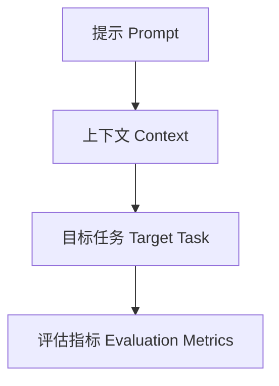

# 大语言模型应用指南：提示工程

作者：禅与计算机程序设计艺术 / Zen and the Art of Computer Programming

## 1. 背景介绍

### 1.1 问题的由来

在过去的十年中，人工智能（AI）和机器学习（ML）领域取得了显著的进展，尤其是在自然语言处理（NLP）方面。大语言模型（LLM），如OpenAI的GPT-3和Google的BERT，已经展示了其在生成和理解自然语言方面的强大能力。然而，如何有效地利用这些大语言模型仍然是一个复杂的问题。提示工程（Prompt Engineering）作为一种新兴的技术，旨在通过设计和优化输入提示来最大化大语言模型的性能。

### 1.2 研究现状

目前，提示工程已经在多个领域得到了广泛应用，包括文本生成、问答系统、翻译和对话系统等。研究人员和开发者通过实验和实践，逐步积累了大量的经验和技巧。然而，系统性和理论性的研究仍然相对较少，特别是在如何构建高效提示、如何评估提示效果以及如何在不同应用场景中优化提示等方面。

### 1.3 研究意义

提示工程不仅可以提高大语言模型的性能，还可以降低其计算成本和资源消耗。通过优化提示，我们可以在不增加模型复杂度的情况下，显著提升模型的输出质量。此外，提示工程还可以帮助我们更好地理解大语言模型的内部机制和工作原理，从而为未来的模型设计和优化提供重要的参考。

### 1.4 本文结构

本文将详细介绍提示工程的核心概念、算法原理、数学模型、项目实践以及实际应用场景。具体章节安排如下：

1. 背景介绍
2. 核心概念与联系
3. 核心算法原理 & 具体操作步骤
4. 数学模型和公式 & 详细讲解 & 举例说明
5. 项目实践：代码实例和详细解释说明
6. 实际应用场景
7. 工具和资源推荐
8. 总结：未来发展趋势与挑战
9. 附录：常见问题与解答

## 2. 核心概念与联系

提示工程的核心概念包括提示（Prompt）、上下文（Context）、目标任务（Target Task）和评估指标（Evaluation Metrics）。这些概念之间的联系如下图所示：



### 提示（Prompt）

提示是输入给大语言模型的一段文本，用于引导模型生成特定的输出。提示的设计直接影响模型的性能和输出质量。

### 上下文（Context）

上下文是提示所依赖的背景信息，包括历史对话、相关文档和其他辅助信息。上下文的选择和组织对提示的效果有重要影响。

### 目标任务（Target Task）

目标任务是提示工程的最终目标，如文本生成、问答、翻译等。不同的目标任务对提示的要求和评估标准有所不同。

### 评估指标（Evaluation Metrics）

评估指标用于衡量提示工程的效果，常见的评估指标包括准确率、召回率、F1分数、BLEU分数等。

## 3. 核心算法原理 & 具体操作步骤

### 3.1 算法原理概述

提示工程的核心算法包括提示生成、提示优化和提示评估。提示生成是指构建初始提示，提示优化是指通过实验和调整来改进提示，提示评估是指使用评估指标来衡量提示的效果。

### 3.2 算法步骤详解

#### 提示生成

提示生成的步骤如下：

1. 确定目标任务和评估指标。
2. 收集和整理上下文信息。
3. 构建初始提示。

#### 提示优化

提示优化的步骤如下：

1. 进行初步实验，收集模型输出。
2. 分析输出结果，找出问题和不足。
3. 调整提示，重新进行实验。
4. 重复上述步骤，直到达到满意的效果。

#### 提示评估

提示评估的步骤如下：

1. 使用预定的评估指标对模型输出进行评估。
2. 比较不同提示的效果，选择最佳提示。

### 3.3 算法优缺点

#### 优点

1. 提高模型性能：通过优化提示，可以显著提升模型的输出质量。
2. 降低计算成本：优化提示可以减少模型的计算资源消耗。
3. 增强模型理解：提示工程有助于我们更好地理解大语言模型的内部机制。

#### 缺点

1. 复杂性高：提示工程需要大量的实验和调整，过程复杂且耗时。
2. 依赖经验：提示的设计和优化高度依赖于开发者的经验和技巧。

### 3.4 算法应用领域

提示工程在以下领域有广泛应用：

1. 文本生成：如新闻生成、故事创作等。
2. 问答系统：如智能客服、知识问答等。
3. 翻译：如多语言翻译、专业术语翻译等。
4. 对话系统：如聊天机器人、虚拟助手等。

## 4. 数学模型和公式 & 详细讲解 & 举例说明

### 4.1 数学模型构建

提示工程的数学模型可以表示为一个优化问题，其中目标是最大化模型的输出质量。设 $P$ 为提示，$C$ 为上下文，$T$ 为目标任务，$M$ 为大语言模型，$E$ 为评估指标，则优化问题可以表示为：

$$
\max_{P} E(M(P, C), T)
$$

### 4.2 公式推导过程

假设评估指标 $E$ 是一个函数，表示模型输出与目标任务的匹配程度。我们可以通过梯度下降法来优化提示 $P$。具体步骤如下：

1. 初始化提示 $P_0$。
2. 计算模型输出 $O = M(P, C)$。
3. 计算评估指标 $E(O, T)$。
4. 计算梯度 $\nabla_P E(O, T)$。
5. 更新提示 $P_{t+1} = P_t + \alpha \nabla_P E(O, T)$，其中 $\alpha$ 为学习率。
6. 重复步骤 2-5，直到收敛。

### 4.3 案例分析与讲解

假设我们要构建一个新闻生成系统，目标任务是生成高质量的新闻文章。我们可以使用以下提示：

```
请根据以下信息生成一篇新闻文章：
[上下文信息]
```

通过实验和优化，我们可以逐步改进提示，使生成的新闻文章更加符合预期。

### 4.4 常见问题解答

#### 问题1：提示工程的效果如何评估？

提示工程的效果可以通过多种评估指标来衡量，如准确率、召回率、F1分数、BLEU分数等。具体选择哪种评估指标取决于目标任务的要求。

#### 问题2：提示工程是否适用于所有大语言模型？

提示工程适用于大多数大语言模型，但具体效果取决于模型的架构和训练数据。不同模型可能需要不同的提示设计和优化策略。

## 5. 项目实践：代码实例和详细解释说明

### 5.1 开发环境搭建

在进行提示工程的项目实践之前，我们需要搭建开发环境。以下是所需的工具和库：

1. Python 3.8+
2. OpenAI API
3. Jupyter Notebook
4. 其他依赖库：numpy、pandas、scikit-learn等

### 5.2 源代码详细实现

以下是一个简单的提示工程代码示例：

```python
import openai

# 设置API密钥
openai.api_key = 'your-api-key'

# 定义提示
prompt = "请根据以下信息生成一篇新闻文章：\n[上下文信息]"

# 调用OpenAI API
response = openai.Completion.create(
    engine="davinci",
    prompt=prompt,
    max_tokens=500
)

# 输出生成的新闻文章
print(response.choices[0].text.strip())
```

### 5.3 代码解读与分析

上述代码首先设置了OpenAI API的密钥，然后定义了一个简单的提示。接着，调用OpenAI API生成新闻文章，并输出结果。这个示例展示了提示工程的基本流程。

### 5.4 运行结果展示

运行上述代码后，我们可以得到一篇生成的新闻文章。通过调整提示和上下文信息，我们可以逐步改进生成的文章质量。

## 6. 实际应用场景

提示工程在多个实际应用场景中得到了广泛应用。以下是一些典型的应用场景：

### 6.1 文本生成

在文本生成领域，提示工程可以用于生成新闻文章、故事、诗歌等。通过优化提示，我们可以生成更加符合预期的文本内容。

### 6.2 问答系统

在问答系统中，提示工程可以用于构建智能客服、知识问答等系统。通过设计和优化提示，我们可以提高问答系统的准确性和响应速度。

### 6.3 翻译

在翻译领域，提示工程可以用于多语言翻译、专业术语翻译等。通过优化提示，我们可以提高翻译的准确性和流畅度。

### 6.4 对话系统

在对话系统中，提示工程可以用于构建聊天机器人、虚拟助手等。通过设计和优化提示，我们可以提高对话系统的自然性和用户体验。

### 6.5 未来应用展望

随着大语言模型的不断发展，提示工程的应用前景将更加广阔。未来，我们可以期待提示工程在更多领域中发挥重要作用，如教育、医疗、金融等。

## 7. 工具和资源推荐

### 7.1 学习资源推荐

1. 《深度学习》 - Ian Goodfellow, Yoshua Bengio, Aaron Courville
2. 《自然语言处理综论》 - Daniel Jurafsky, James H. Martin
3. Coursera上的NLP课程

### 7.2 开发工具推荐

1. Jupyter Notebook
2. OpenAI API
3. Hugging Face Transformers

### 7.3 相关论文推荐

1. "Attention is All You Need" - Vaswani et al.
2. "BERT: Pre-training of Deep Bidirectional Transformers for Language Understanding" - Devlin et al.
3. "Language Models are Few-Shot Learners" - Brown et al.

### 7.4 其他资源推荐

1. GitHub上的NLP项目
2. Kaggle上的NLP竞赛
3. AI社区和论坛，如Reddit的r/MachineLearning

## 8. 总结：未来发展趋势与挑战

### 8.1 研究成果总结

本文详细介绍了提示工程的核心概念、算法原理、数学模型、项目实践以及实际应用场景。通过提示工程，我们可以显著提升大语言模型的性能和输出质量。

### 8.2 未来发展趋势

未来，提示工程将继续在多个领域中发挥重要作用。随着大语言模型的不断发展，我们可以期待提示工程在更多应用场景中得到广泛应用。

### 8.3 面临的挑战

提示工程面临的主要挑战包括提示设计的复杂性、优化过程的耗时性以及评估指标的选择等。解决这些挑战需要更多的研究和实践。

### 8.4 研究展望

未来的研究可以集中在以下几个方面：

1. 提示设计的自动化：通过机器学习算法自动生成和优化提示。
2. 提示评估的标准化：建立统一的评估标准和指标。
3. 提示工程的理论研究：深入研究提示工程的数学模型和理论基础。

## 9. 附录：常见问题与解答

### 问题1：提示工程的效果如何评估？

提示工程的效果可以通过多种评估指标来衡量，如准确率、召回率、F1分数、BLEU分数等。具体选择哪种评估指标取决于目标任务的要求。

### 问题2：提示工程是否适用于所有大语言模型？

提示工程适用于大多数大语言模型，但具体效果取决于模型的架构和训练数据。不同模型可能需要不同的提示设计和优化策略。

### 问题3：提示工程的优化过程是否可以自动化？

提示工程的优化过程可以部分自动化，但仍然需要人工干预和调整。未来的研究可以集中在提示设计和优化的自动化方面。

### 问题4：提示工程是否有通用的设计原则？

提示工程的设计原则包括明确目标任务、选择合适的上下文信息、逐步优化提示等。具体的设计原则可能因应用场景而异。

### 问题5：提示工程的研究前景如何？

提示工程的研究前景广阔，未来可以在更多领域中发挥重要作用。随着大语言模型的不断发展，提示工程的应用前景将更加广阔。