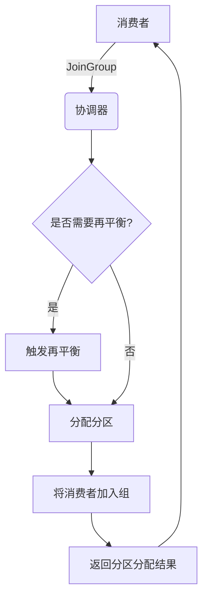
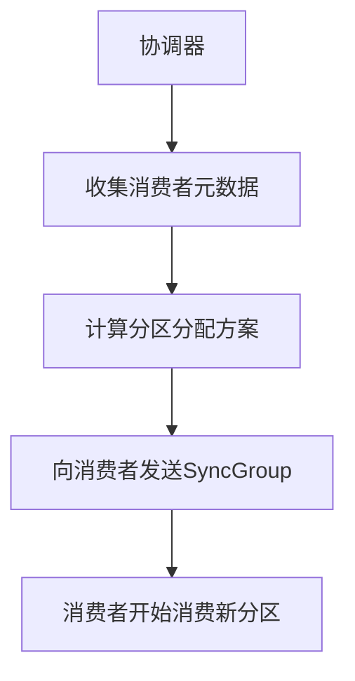
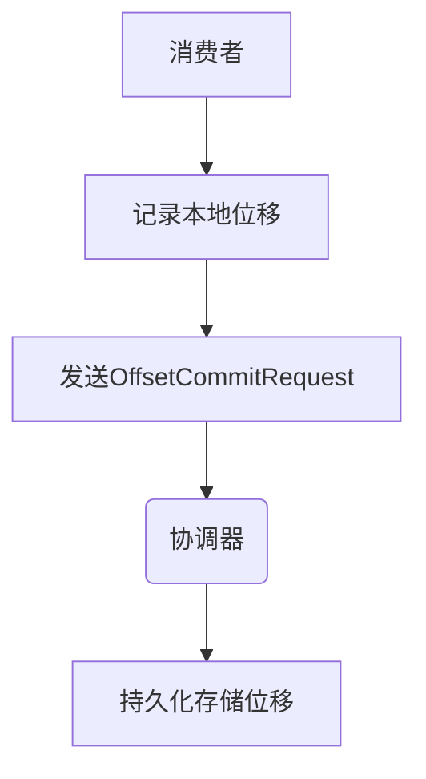
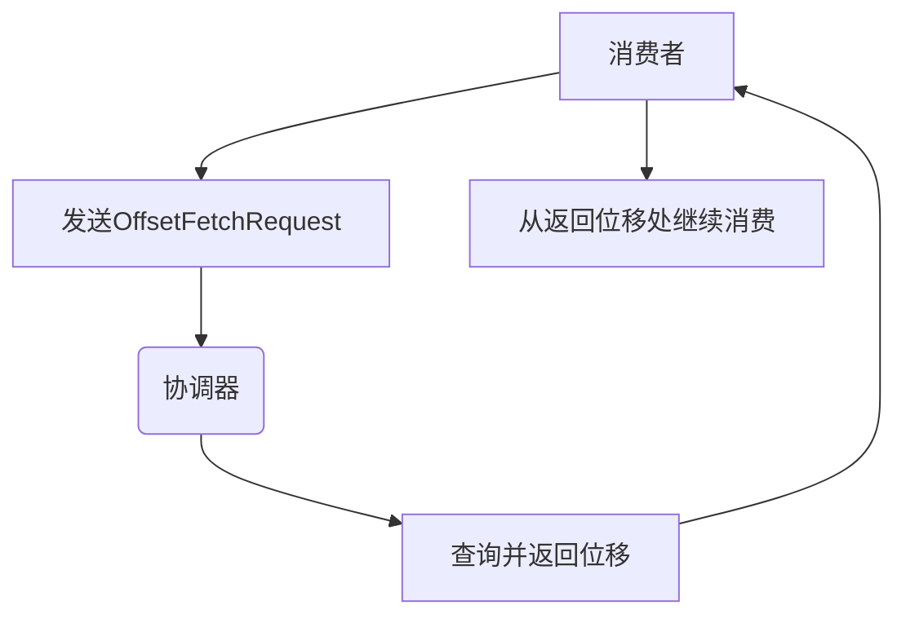
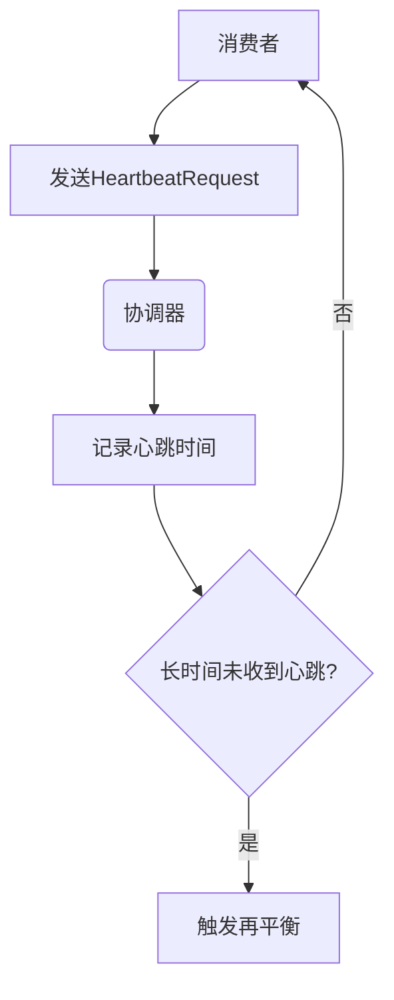

# 消费者组 原理与代码实例讲解

## 1. 背景介绍

### 1.1 问题的由来

在现代分布式系统中,消息队列扮演着关键的角色,用于实现异步通信、解耦生产者和消费者、缓冲消息等功能。然而,单个消费者处理能力有限,当面临高并发、海量消息时,单个消费者很容易成为系统瓶颈。为了提高系统的吞吐量和可扩展性,消费者组(Consumer Group)的概念应运而生。

### 1.2 研究现状

消费者组作为消息队列中的一个重要概念,已经被广泛应用于各种分布式系统中。Apache Kafka作为领先的分布式流处理平台,将消费者组概念实现得相当完善。其他消息队列系统如RabbitMQ、Apache RocketMQ等也提供了类似的消费者组功能。

### 1.3 研究意义

理解消费者组的原理对于构建高可用、高吞吐的分布式系统至关重要。通过合理利用消费者组,可以实现以下目标:

1. **提高系统吞吐量**: 将消息平均分配给多个消费者,利用多线程并行处理提高吞吐能力。
2. **实现消费者的冗余与容错**: 当某个消费者发生故障时,其分配的分区可被其他消费者接管,确保消息不丢失。
3. **实现消费者的动态扩展与收缩**: 可以根据负载动态调整消费者数量,实现资源的弹性伸缩。
4. **实现消费者的负载均衡**: 消息会被均匀分配给组内所有消费者,避免单个消费者过载。

### 1.4 本文结构

本文将从以下几个方面全面介绍消费者组的原理和实践:

1. 核心概念与联系
2. 核心算法原理与具体操作步骤
3. 数学模型和公式详细讲解与案例分析
4. 项目实践:代码实例和详细解释说明
5. 实际应用场景
6. 工具和资源推荐
7. 总结:未来发展趋势与挑战
8. 附录:常见问题与解答

## 2. 核心概念与联系

消费者组(Consumer Group)是消息队列中的一个重要概念,与其密切相关的还有分区(Partition)、复制(Replication)、消费位移(Consumer Offset)等概念。

**分区(Partition)**:消息队列通常会将消息流分散存储到多个分区中,每个分区是一个有序、不可变的消息序列。分区不仅提高了并行度,还为消费者组内的消费者分配提供了基础。

**复制(Replication)**:为了实现容错,每个分区都会有多个副本,副本之间会自动同步,以确保在节点故障时仍能正常工作。

**消费位移(Consumer Offset)**:消费者组内的每个消费者都会记录自己消费到的位置(offset),以便在重启后能够继续消费。

**消费者组协调器(Group Coordinator)**:负责管理消费者组的元数据,包括组成员关系、消费位移等。消费者组内的所有消费者都需要与协调器保持联系。

**分区分配策略(Partition Assignment Strategy)**:决定如何将分区分配给消费者组内的消费者。常见策略包括范围分区(Range)和轮询分区(RoundRobin)等。

这些概念相互关联、相辅相成,共同构建了消费者组的工作原理。下一节将详细介绍消费者组的核心算法原理。

## 3. 核心算法原理与具体操作步骤

### 3.1 算法原理概述

消费者组的核心算法包括以下几个主要步骤:

1. **加入消费者组**:消费者向协调器发送加入组的请求,协调器将其加入组并分配分区给它。
2. **分区再平衡**:当组成员发生变化(加入/离开)时,协调器会触发分区再平衡,重新分配分区。
3. **消费位移提交**:消费者定期向协调器提交自己的消费位移,以便故障恢复时继续消费。
4. **消费位移获取**:消费者在重新加入组或重启时,会从协调器获取自己的消费位移。
5. **心跳检测**:消费者定期向协调器发送心跳,协调器根据心跳检测消费者是否活跃。

这些步骤通过消费者与协调器的交互完成,确保了消费者组的正常运行。下面将详细介绍每个步骤的具体操作。

### 3.2 算法步骤详解

#### 3.2.1 加入消费者组

当消费者启动时,会向协调器发送`JoinGroup`请求,尝试加入指定的消费者组。协调器会执行以下操作:

1. 如果该组不存在,则创建一个新的消费者组。
2. 如果该组已存在且有活跃的消费者,则触发一次分区再平衡。
3. 将消费者加入组,并分配分区给它。

加入组的过程如下所示:

#### 3.2.2 分区再平衡

当消费者组成员发生变化时,协调器会触发分区再平衡,重新分配分区。再平衡的过程如下:

1. 协调器收集所有消费者的元数据(订阅主题、消费位移等)。
2. 根据分区分配策略,计算出新的分区分配方案。
3. 向所有消费者发送`SyncGroup`请求,通知它们新的分区分配结果。
4. 消费者开始从新分配的分区位置消费。

再平衡过程如下所示:

#### 3.2.3 消费位移提交

为了实现故障恢复,消费者需要定期向协调器提交自己的消费位移。提交过程如下:

1. 消费者在本地记录消费位移。
2. 定期向协调器发送`OffsetCommitRequest`,提交本地记录的位移。
3. 协调器持久化存储该消费位移。

消费位移提交过程如下所示:

#### 3.2.4 消费位移获取

当消费者重新加入组或重启时,需要从协调器获取自己的消费位移,以继续消费。获取过程如下:

1. 消费者向协调器发送`OffsetFetchRequest`。
2. 协调器查询并返回该消费者最新的已提交位移。
3. 消费者从返回的位移处继续消费。

消费位移获取过程如下所示:

#### 3.2.5 心跳检测

为了检测消费者是否活跃,消费者需要定期向协调器发送心跳。心跳检测过程如下:

1. 消费者定期向协调器发送`HeartbeatRequest`。
2. 协调器记录该消费者的最新心跳时间。
3. 如果长时间未收到某个消费者的心跳,则认为该消费者已经失效,触发再平衡。

心跳检测过程如下所示:

通过以上步骤,消费者组能够高效、可靠地运行,实现消费者的动态扩展、故障恢复和负载均衡。

### 3.3 算法优缺点

**优点**:

1. **提高吞吐量**:通过并行消费,可以大幅提高系统的吞吐能力。
2. **高可用性**:当某个消费者失效时,其分区会被其他消费者接管,确保消息不丢失。
3. **动态扩展**:可以根据负载动态调整消费者数量,实现资源的弹性伸缩。
4. **负载均衡**:消息会被均匀分配给组内所有消费者,避免单个消费者过载。

**缺点**:

1. **复杂性**:消费者组的实现相对复杂,需要协调器管理组元数据和分区分配。
2. **开销**:频繁的再平衡和心跳检测会带来一定的网络和计算开销。
3. **一致性**:在再平衡期间,可能会出现短暂的不一致,导致部分消息被重复消费或丢失。
4. **有界性**:消费者组的扩展能力受限于分区数量,当分区数量固定时,扩展能力也就受到限制。

总的来说,消费者组的优点远远大于缺点,是实现高吞吐、高可用分布式系统的关键技术之一。

### 3.4 算法应用领域

消费者组广泛应用于以下领域:

1. **流处理系统**:如Apache Kafka Streams、Apache Flink等,利用消费者组实现流数据的并行处理。
2. **消息驱动架构**:通过消费者组实现异步通信、解耦生产者和消费者,构建高可扩展的分布式系统。
3. **日志收集系统**:如ELK(Elasticsearch, Logstash, Kibana)栈,利用消费者组从Kafka消费日志数据。
4. **数据集成系统**:如Apache NiFi、Kafka Connect等,通过消费者组从Kafka消费数据,实现数据的转换和加载。
5. **物联网(IoT)系统**:利用消费者组实时处理来自众多设备的海量数据流。

总之,无论是流处理、异步通信,还是日志收集、数据集成等领域,消费者组都扮演着重要的角色,是构建现代分布式系统的核心技术之一。

## 4. 数学模型和公式详细讲解与举例说明

为了更好地理解消费者组的工作原理,我们可以构建一个数学模型来描述其中的关键概念和算法。

### 4.1 数学模型构建

假设我们有一个消息队列系统,包含以下元素:

- $T$: 主题(Topic)集合,每个主题 $t \in T$ 包含一个或多个分区。
- $P$: 分区(Partition)集合,每个分区 $p \in P$ 属于一个主题 $t \in T$。
- $C$: 消费者(Consumer)集合,每个消费者 $c \in C$ 属于一个消费者组 $g \in G$。
- $G$: 消费者组(Consumer Group)集合。
- $A$: 分区分配函数,将分区分配给消费者组内的消费者,即 $A: P \times G \rightarrow C$。

我们的目标是找到一个合理的分区分配函数 $A$,使得:

1. 每个分区都被分配给一个且仅一个消费者。
2. 分区被均匀分配给消费者组内的所有消费者。
3. 当消费者加入或离开组时,能够快速重新分配分区,实现负载均衡。

### 4.2 公式推导过程

为了实现上述目标,我们可以构建以下公式:

$$
\begin{align}
\forall p \in P, \exists ! c \in C: A(p, g) = c & \quad (1) \\
\forall c_1, c_2 \in C, |A^{-1}(c_1, g)| \approx |A^{-1}(c_2, g)| & \quad (2) \\
\min \sum_{c \in C} |A^{-1}(c, g) - A^{-1}(c, g')| & \quad (3)
\end{align}
$$

其中:

- 公式 (1) 确保每个分区都被分配给一个且仅一个消费者。
- 公式 (2) 确保分区被均