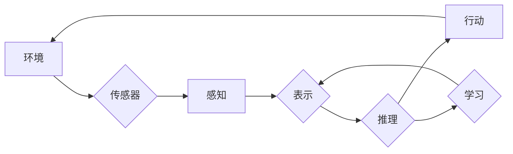
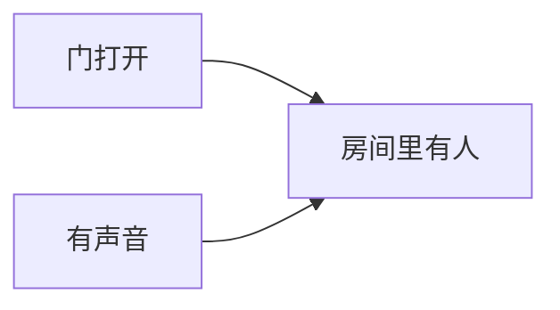

# AI人工智能 Agent：理解和应用智能体的感知机制

作者：禅与计算机程序设计艺术

## 1. 背景介绍

### 1.1 人工智能简史与发展趋势

人工智能(AI) 的概念自 20 世纪 50 年代提出以来，经历了符号主义、连接主义、统计学习等多个发展阶段，近年来随着深度学习的突破，AI 进入了快速发展的新时期。从 AlphaGo 战胜围棋世界冠军，到自动驾驶汽车上路测试，AI 正在深刻地改变着我们的生活。

### 1.2 智能体(Agent) 的概念与意义

智能体(Agent) 是指能够感知环境并采取行动以实现目标的自主实体。智能体可以是软件程序、机器人、甚至生物体。智能体是 AI 的核心概念之一，因为它提供了一个框架，可以用来理解和构建各种智能系统。

### 1.3 感知机制在智能体中的重要性

感知机制是智能体与环境交互的关键桥梁。通过感知机制，智能体可以获取环境信息，理解当前状态，并根据目标做出合理的决策。因此，深入理解智能体的感知机制对于设计和构建高效的 AI 系统至关重要。

## 2. 核心概念与联系

### 2.1 感知(Perception)

感知是指智能体通过传感器获取环境信息的过程。传感器可以是摄像头、麦克风、激光雷达等。感知的结果是原始的传感器数据，例如图像、声音、距离等。

### 2.2 表示(Representation)

表示是指将原始的传感器数据转换为智能体可以理解和处理的形式。常见的表示形式包括特征向量、符号、图形等。

### 2.3 推理(Reasoning)

推理是指智能体根据感知到的信息和自身的知识库进行逻辑推理和决策的过程。推理的结果是智能体要采取的行动。

### 2.4 学习(Learning)

学习是指智能体根据经验不断改进自身行为的过程。通过学习，智能体可以提高感知、表示和推理的能力。

### 2.5  核心概念之间的联系

智能体的感知机制可以看作是一个信息处理的过程，包括感知、表示、推理和学习四个环节。这些环节相互联系，共同构成了智能体与环境交互的基础。



## 3. 核心算法原理具体操作步骤

### 3.1 基于规则的感知

-   **3.1.1 原理：** 基于预先定义的规则，将传感器数据映射到特定的感知结果。
-   **3.1.2 操作步骤：**
    1.  定义规则库，包含一系列条件和对应的感知结果。
    2.  将传感器数据与规则库中的条件进行匹配。
    3.  如果匹配成功，则输出对应的感知结果。

### 3.2 基于统计的感知

-   **3.2.1 原理：** 利用统计学习方法，从大量的传感器数据中学习感知模型。
-   **3.2.2 操作步骤：**
    1.  收集大量的传感器数据，并进行标注。
    2.  选择合适的机器学习模型，例如支持向量机、神经网络等。
    3.  使用标注数据训练感知模型。
    4.  使用训练好的模型对新的传感器数据进行预测。

### 3.3 深度学习感知

-   **3.3.1 原理：** 利用深度神经网络，自动学习传感器数据中的特征表示，并进行感知。
-   **3.3.2 操作步骤：**
    1.  构建深度神经网络模型，例如卷积神经网络、循环神经网络等。
    2.  使用大量的传感器数据训练深度神经网络。
    3.  使用训练好的模型对新的传感器数据进行预测。

## 4. 数学模型和公式详细讲解举例说明

### 4.1 贝叶斯网络

贝叶斯网络是一种概率图模型，可以用来表示变量之间的概率关系。在智能体感知中，贝叶斯网络可以用来表示传感器数据、环境状态和智能体感知结果之间的概率关系。

**公式：**

$$P(H|E) = \frac{P(E|H)P(H)}{P(E)}$$

其中：

-   $P(H|E)$ 表示在观察到证据 $E$ 的情况下，假设 $H$ 成立的概率。
-   $P(E|H)$ 表示在假设 $H$ 成立的情况下，观察到证据 $E$ 的概率。
-   $P(H)$ 表示假设 $H$ 成立的先验概率。
-   $P(E)$ 表示观察到证据 $E$ 的概率。

**举例：**

假设一个智能体要感知房间里是否有人。它有两个传感器：门传感器和声音传感器。门传感器可以检测门是否打开，声音传感器可以检测房间里是否有声音。

我们可以使用贝叶斯网络来表示这个问题：



其中：

-   $A$ 表示门打开，$B$ 表示有声音，$C$ 表示房间里有人。

假设我们已知：

-   $P(A) = 0.1$ (门的先验概率为 0.1)
-   $P(B) = 0.2$ (有声音的先验概率为 0.2)
-   $P(C|A,B) = 0.9$ (如果门打开且有声音，则房间里有人概率为 0.9)
-   $P(C|A,\neg B) = 0.5$ (如果门打开但没有声音，则房间里有人概率为 0.5)
-   $P(C|\neg A,B) = 0.6$ (如果门没有打开但有声音，则房间里有人概率为 0.6)
-   $P(C|\neg A,\neg B) = 0.1$ (如果门没有打开且没有声音，则房间里有人概率为 0.1)

现在，假设门传感器检测到门打开了，声音传感器检测到没有声音。我们可以使用贝叶斯网络来计算房间里有人的概率：

$$
\begin{aligned}
P(C|A,\neg B) &= \frac{P(A,\neg B|C)P(C)}{P(A,\neg B)} \\
&= \frac{P(A|C)P(\neg B|C)P(C)}{P(A)P(\neg B)} \\
&= \frac{P(C|A,\neg B)P(A)P(\neg B)}{P(A)P(\neg B)} \\
&= P(C|A,\neg B) \\
&= 0.5
\end{aligned}
$$

因此，在观察到门打开但没有声音的情况下，房间里有人的概率为 0.5。

### 4.2 隐马尔可夫模型

隐马尔可夫模型（Hidden Markov Model，HMM）是另一种概率图模型，可以用来对时间序列数据进行建模。在智能体感知中，HMM 可以用来对传感器数据随时间的变化进行建模，例如语音识别、手势识别等。

**模型表示：**

一个 HMM 模型由以下几个部分组成：

-   **状态集合** $S = \{s_1, s_2, ..., s_N\}$，表示系统可能处于的隐含状态。
-   **观测序列** $O = \{o_1, o_2, ..., o_T\}$，表示系统的观测值序列。
-   **状态转移概率矩阵** $A = \{a_{ij}\}$，表示系统从状态 $s_i$ 转移到状态 $s_j$ 的概率。
-   **观测概率矩阵** $B = \{b_j(k)\}$，表示系统在状态 $s_j$ 时观测到 $o_k$ 的概率。
-   **初始状态概率分布** $\pi = \{\pi_i\}$，表示系统初始状态为 $s_i$ 的概率。

**三个基本问题：**

1.  **评估问题:** 给定模型参数 $\lambda = (A, B, \pi)$ 和观测序列 $O$，计算该观测序列出现的概率 $P(O|\lambda)$。
2.  **解码问题:** 给定模型参数 $\lambda = (A, B, \pi)$ 和观测序列 $O$，找到最有可能产生该观测序列的隐含状态序列 $Q = \{q_1, q_2, ..., q_T\}$。
3.  **学习问题:** 给定观测序列 $O$ 和状态集合 $S$，学习模型参数 $\lambda = (A, B, \pi)$，使得 $P(O|\lambda)$ 最大。

**举例：**

假设一个智能体要识别一个人说的一句话。这句话可以被表示成一个音素序列，例如 "Hello world" 可以被表示成 "/h eh l ow w er l d/"。

我们可以使用 HMM 模型来对语音识别问题进行建模。

-   **状态集合** $S$ 可以是所有可能的音素，例如 "/h/", "/eh/", "/l/", "/ow/", "/w/", "/er/", "/d/"。
-   **观测序列** $O$ 是语音信号的特征向量序列。
-   **状态转移概率矩阵** $A$ 表示从一个音素到另一个音素的转移概率。
-   **观测概率矩阵** $B$ 表示在某个音素状态下观测到某个特征向量的概率。

通过训练 HMM 模型，我们可以得到模型参数 $\lambda = (A, B, \pi)$。然后，当我们接收到一段新的语音信号时，我们可以使用 Viterbi 算法找到最有可能产生该语音信号的音素序列，从而识别出这句话。

## 5. 项目实践：代码实例和详细解释说明

### 5.1 基于 OpenCV 的图像识别

```python
import cv2

# 加载训练好的模型
face_cascade = cv2.CascadeClassifier('haarcascade_frontalface_default.xml')

# 读取图像
img = cv2.imread('image.jpg')

# 将图像转换为灰度图像
gray = cv2.cvtColor(img, cv2.COLOR_BGR2GRAY)

# 检测人脸
faces = face_cascade.detectMultiScale(gray, 1.3, 5)

# 标记人脸
for (x,y,w,h) in faces:
    cv2.rectangle(img,(x,y),(x+w,y+h),(255,0,0),2)

# 显示结果
cv2.imshow('img',img)
cv2.waitKey(0)
cv2.destroyAllWindows()
```

**代码解释：**

1.  首先，我们需要加载训练好的 Haar 特征分类器。
2.  然后，我们读取一张图像，并将其转换为灰度图像。
3.  接下来，我们使用 `detectMultiScale()` 函数检测图像中的人脸。
4.  最后，我们使用 `rectangle()` 函数在原始图像上绘制矩形框，标记出检测到的人脸。

### 5.2 基于 TensorFlow 的手写数字识别

```python
import tensorflow as tf

# 加载 MNIST 数据集
(x_train, y_train), (x_test, y_test) = tf.keras.datasets.mnist.load_data()

# 数据预处理
x_train = x_train.astype('float32') / 255.0
x_test = x_test.astype('float32') / 255.0
y_train = tf.keras.utils.to_categorical(y_train, 10)
y_test = tf.keras.utils.to_categorical(y_test, 10)

# 构建模型
model = tf.keras.models.Sequential([
  tf.keras.layers.Flatten(input_shape=(28, 28)),
  tf.keras.layers.Dense(128, activation='relu'),
  tf.keras.layers.Dropout(0.2),
  tf.keras.layers.Dense(10, activation='softmax')
])

# 编译模型
model.compile(optimizer='adam',
              loss='categorical_crossentropy',
              metrics=['accuracy'])

# 训练模型
model.fit(x_train, y_train, epochs=5)

# 评估模型
loss, accuracy = model.evaluate(x_test, y_test, verbose=0)
print('Accuracy: {}'.format(accuracy))
```

**代码解释：**

1.  首先，我们加载 MNIST 数据集，这是一个包含 70,000 张手写数字图像的数据集。
2.  然后，我们对数据进行预处理，将像素值缩放到 0 到 1 之间，并将标签转换为 one-hot 编码。
3.  接下来，我们构建一个简单的神经网络模型，该模型包含一个输入层、一个隐藏层和一个输出层。
4.  然后，我们编译模型，选择优化器、损失函数和评估指标。
5.  接下来，我们使用训练数据训练模型。
6.  最后，我们使用测试数据评估模型的性能。

## 6. 实际应用场景

### 6.1 自动驾驶

自动驾驶汽车需要感知周围环境，包括道路、车辆、行人等。自动驾驶系统通常使用各种传感器，例如摄像头、激光雷达、雷达等来感知环境。

### 6.2 机器人

机器人需要感知周围环境，以便导航、避障和完成任务。机器人可以使用各种传感器，例如摄像头、激光雷达、触觉传感器等来感知环境。

### 6.3 智能家居

智能家居系统需要感知用户的行为和环境，以便提供个性化的服务。智能家居系统可以使用各种传感器，例如运动传感器、温度传感器、光线传感器等来感知环境。

### 6.4 医疗诊断

医疗诊断系统可以使用图像识别技术来分析医学影像，例如 X 光片、CT 扫描图像等。

## 7. 工具和资源推荐

### 7.1 OpenCV

OpenCV (Open Source Computer Vision Library) 是一个开源的计算机视觉库，提供了各种图像处理和计算机视觉算法的实现。

### 7.2 TensorFlow

TensorFlow 是一个开源的机器学习平台，提供了各种机器学习算法的实现，包括深度学习算法。

### 7.3 PyTorch

PyTorch 是另一个开源的机器学习平台，提供了灵活的深度学习框架。

### 7.4 scikit-learn

scikit-learn 是一个开源的机器学习库，提供了各种机器学习算法的实现，包括分类、回归、聚类等。

## 8. 总结：未来发展趋势与挑战

### 8.1 多模态感知

未来的智能体将能够融合来自多个传感器的信息，例如视觉、听觉、触觉等，以获得更全面和准确的环境感知。

### 8.2 小样本学习

目前的深度学习模型通常需要大量的训练数据。未来的智能体将能够从少量的数据中学习，以适应新的环境和任务。

### 8.3 持续学习

未来的智能体将能够不断地从新的经验中学习，并随着时间的推移提高自身的性能。

### 8.4 可解释性

目前的深度学习模型通常是一个黑盒子，很难理解其决策过程。未来的智能体将更加透明，其决策过程将更容易被人类理解。

## 9. 附录：常见问题与解答

### 9.1 什么是智能体？

智能体是指能够感知环境并采取行动以实现目标的自主实体。

### 9.2 智能体的感知机制是什么？

智能体的感知机制是指智能体如何感知环境并将其转换为可以理解和处理的信息的过程。

### 9.3 智能体的感知机制有哪些类型？

智能体的感知机制可以分为基于规则的感知、基于统计的感知和深度学习感知三种类型。

### 9.4 智能体的感知机制有哪些应用？

智能体的感知机制应用广泛，例如自动驾驶、机器人、智能家居、医疗诊断等。
