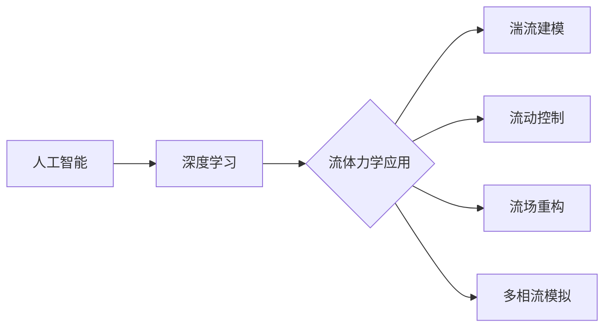

# AI人工智能深度学习算法：在流体动力学中的应用

作者：禅与计算机程序设计艺术

## 1. 背景介绍

### 1.1 流体力学与工程应用

流体力学是研究流体（包括液体和气体）的力学行为及其应用的学科。它是众多工程领域的基础，如航空航天、海洋工程、能源、环境科学等。传统的流体力学研究方法主要依赖于实验和理论分析，但随着计算机技术的发展，计算流体力学（CFD）逐渐成为一种重要的研究手段。

### 1.2 计算流体力学的局限性

CFD利用数值方法求解描述流体运动的偏微分方程（Navier-Stokes方程），从而模拟流体流动。然而，传统的CFD方法在处理复杂流动现象、高雷诺数流动、多相流等问题时面临着巨大的挑战。例如：

* **计算量巨大：** 复杂流动的模拟需要求解大规模的非线性方程组，对计算资源要求极高。
* **模型精度不足：** 传统的湍流模型难以准确描述复杂流动中的湍流现象。
* **缺乏泛化能力：** 针对特定问题的CFD模型往往难以推广到其他场景。

### 1.3 深度学习的兴起与应用

近年来，深度学习在计算机视觉、自然语言处理等领域取得了突破性进展。其强大的特征提取和非线性建模能力为解决流体力学中的难题提供了新的思路。深度学习方法可以从大量的流体数据中学习复杂的流动规律，从而克服传统CFD方法的局限性。

## 2. 核心概念与联系

### 2.1 人工智能与深度学习

人工智能（AI）旨在使计算机能够像人类一样思考和行动。深度学习是AI的一个子领域，它利用包含多个隐藏层的神经网络对数据进行学习和预测。

### 2.2 深度学习在流体力学中的应用

深度学习可以应用于流体力学的各个方面，包括：

* **湍流建模：** 利用深度神经网络学习湍流的复杂行为，构建更精确的湍流模型。
* **流动控制：** 通过深度强化学习等方法优化流动控制策略，提高流动效率。
* **流场重构：** 从有限的测量数据中重建完整的流场信息。
* **多相流模拟：** 模拟复杂的多相流现象，如气泡流动、液滴碰撞等。

### 2.3 核心概念联系图



## 3. 核心算法原理具体操作步骤

### 3.1 卷积神经网络（CNN）

CNN是一种专门用于处理图像数据的深度学习模型，它通过卷积层和池化层提取图像的特征。在流体力学中，CNN可以用于：

* **从流场图像中提取特征**，例如涡旋、边界层等。
* **预测流场变量**，例如速度、压力等。

#### 3.1.1 CNN的基本结构

一个典型的CNN模型包括输入层、卷积层、池化层、全连接层和输出层。

* **输入层：** 接收原始数据，例如流场图像。
* **卷积层：** 使用卷积核对输入数据进行卷积运算，提取特征。
* **池化层：** 对卷积层的输出进行降采样，减少参数数量。
* **全连接层：** 将特征图转换为向量，用于分类或回归。
* **输出层：** 输出预测结果。

#### 3.1.2 CNN的操作步骤

1. 将流场数据转换为图像格式。
2. 将图像输入CNN模型进行训练。
3. 使用训练好的模型预测新的流场数据。

### 3.2 循环神经网络（RNN）

RNN是一种专门用于处理序列数据的深度学习模型，它可以捕捉数据之间的时序依赖关系。在流体力学中，RNN可以用于：

* **预测时间序列数据**，例如流场随时间的变化。
* **模拟流动控制系统**，例如预测控制信号对流动的影响。

#### 3.2.1 RNN的基本结构

一个典型的RNN模型包括输入层、隐藏层和输出层。

* **输入层：** 接收序列数据，例如时间序列的流场数据。
* **隐藏层：** 存储历史信息，并将其传递给下一时刻。
* **输出层：** 输出预测结果。

#### 3.2.2 RNN的操作步骤

1. 将流场数据转换为时间序列格式。
2. 将时间序列数据输入RNN模型进行训练。
3. 使用训练好的模型预测新的时间序列数据。

## 4. 数学模型和公式详细讲解举例说明

### 4.1 Navier-Stokes 方程

Navier-Stokes 方程是描述流体运动的基本方程，它表示动量守恒定律。方程的形式如下：

$$
\rho \left( \frac{\partial \mathbf{u}}{\partial t} + \mathbf{u} \cdot \nabla \mathbf{u} \right) = -\nabla p + \mu \nabla^2 \mathbf{u} + \mathbf{f} 
$$

其中：

* $\rho$ 是流体密度
* $\mathbf{u}$ 是流体速度矢量
* $t$ 是时间
* $p$ 是压力
* $\mu$ 是动力粘度
* $\mathbf{f}$ 是体积力

### 4.2 雷诺平均 Navier-Stokes 方程（RANS）

RANS 方程是求解湍流流动的一种常用方法，它将流场分解为平均流动和脉动流动。RANS 方程的形式如下：

$$
\rho \left( \frac{\partial \overline{\mathbf{u}}}{\partial t} + \overline{\mathbf{u}} \cdot \nabla \overline{\mathbf{u}} \right) = -\nabla \overline{p} + \mu \nabla^2 \overline{\mathbf{u}} - \rho \overline{\mathbf{u}' \mathbf{u}'}
$$

其中：

* $\overline{\mathbf{u}}$ 是平均速度
* $\mathbf{u}'$ 是脉动速度
* $\overline{\mathbf{u}' \mathbf{u}'}$ 是雷诺应力项

### 4.3 k-ε 湍流模型

k-ε 湍流模型是一种常用的 RANS 湍流模型，它通过两个附加方程来模拟湍流动能 ($k$) 和湍流耗散率 ($\epsilon$)。

$$
\frac{\partial (\rho k)}{\partial t} + \nabla \cdot (\rho k \overline{\mathbf{u}}) = \nabla \cdot \left[ (\mu + \frac{\mu_t}{\sigma_k}) \nabla k \right] + P_k - \rho \epsilon
$$

$$
\frac{\partial (\rho \epsilon)}{\partial t} + \nabla \cdot (\rho \epsilon \overline{\mathbf{u}}) = \nabla \cdot \left[ (\mu + \frac{\mu_t}{\sigma_\epsilon}) \nabla \epsilon \right] + C_{\epsilon 1} \frac{\epsilon}{k} P_k - C_{\epsilon 2} \rho \frac{\epsilon^2}{k}
$$

其中：

* $\mu_t$ 是湍流粘度
* $P_k$ 是湍流动能产生项
* $C_{\epsilon 1}$, $C_{\epsilon 2}$, $\sigma_k$, $\sigma_\epsilon$ 是模型常数

### 4.4 数学模型举例

以圆柱绕流为例，说明如何利用深度学习预测流场。

1. **数据准备：** 收集不同雷诺数下的圆柱绕流数据，包括流场图像和对应的速度、压力等变量。
2. **模型训练：** 使用 CNN 模型对数据进行训练，学习流场图像和变量之间的映射关系。
3. **模型预测：** 使用训练好的模型预测新的雷诺数下的流场变量。

## 5. 项目实践：代码实例和详细解释说明

```python
import tensorflow as tf

# 定义 CNN 模型
model = tf.keras.models.Sequential([
    tf.keras.layers.Conv2D(32, (3, 3), activation='relu', input_shape=(64, 64, 1)),
    tf.keras.layers.MaxPooling2D((2, 2)),
    tf.keras.layers.Conv2D(64, (3, 3), activation='relu'),
    tf.keras.layers.MaxPooling2D((2, 2)),
    tf.keras.layers.Flatten(),
    tf.keras.layers.Dense(10, activation='softmax')
])

# 编译模型
model.compile(optimizer='adam',
              loss='sparse_categorical_crossentropy',
              metrics=['accuracy'])

# 加载数据
(x_train,