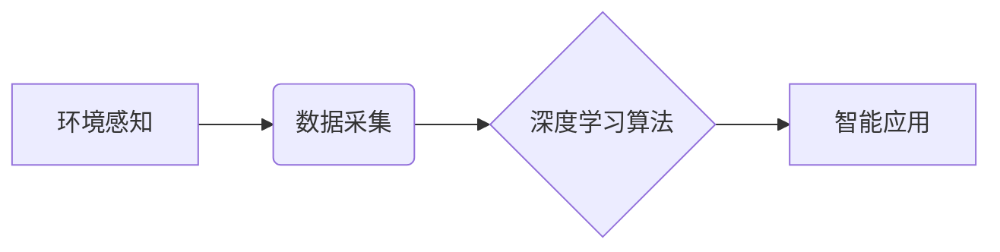

## 1. 背景介绍

### 1.1 人工智能与深度学习的崛起

近年来，人工智能（AI）技术取得了突飞猛进的发展，其中深度学习作为其核心驱动力，在图像识别、语音处理、自然语言处理等领域取得了突破性进展。深度学习的本质是构建多层神经网络，通过模拟人脑神经元的连接和信息传递机制，从海量数据中学习复杂的模式和规律，从而实现智能化的决策和预测。

### 1.2 环境感知与数据采集的重要性

环境感知和数据采集是人工智能应用的基石，它为深度学习算法提供源源不断的学习素材，决定了算法模型的性能上限。环境感知是指智能体通过传感器等设备获取外部环境信息的能力，例如图像、声音、温度、湿度等；数据采集则是指将感知到的环境信息转化为计算机可处理的结构化数据的过程。

### 1.3 本文研究内容概述

本文将深入探讨人工智能深度学习算法中的环境感知与数据采集机制，从以下几个方面展开论述：

* 常见环境感知传感器类型及其工作原理
* 数据采集的基本流程和关键技术
* 数据预处理方法和技巧
* 基于深度学习的环境感知与数据采集应用案例
* 未来发展趋势与挑战


## 2. 核心概念与联系

### 2.1 环境感知

环境感知是指智能体通过传感器等设备获取外部环境信息的能力，是人工智能应用的基础。常见的环境感知传感器包括：

* **视觉传感器：**  例如摄像头，用于捕捉图像信息，是环境感知最重要的传感器之一。
* **听觉传感器：** 例如麦克风，用于捕捉声音信息，在语音识别、声纹识别等领域应用广泛。
* **触觉传感器：** 例如压力传感器、温度传感器，用于感知物体的物理属性，在机器人控制、智能家居等领域具有重要意义。
* **距离传感器：** 例如激光雷达、超声波传感器，用于测量物体距离，在自动驾驶、机器人导航等领域不可或缺。
* **其他传感器：** 例如GPS、陀螺仪、加速度计等，用于获取位置、方向、运动状态等信息。

### 2.2 数据采集

数据采集是指将感知到的环境信息转化为计算机可处理的结构化数据的过程，是连接环境感知和深度学习算法的桥梁。数据采集通常包括以下步骤：

1. **数据获取：** 通过传感器获取原始的环境信息。
2. **数据预处理：** 对原始数据进行清洗、去噪、格式转换等操作，提高数据质量。
3. **数据存储：** 将预处理后的数据存储到数据库或文件中，方便后续分析和利用。

### 2.3 深度学习

深度学习是一种基于人工神经网络的机器学习方法，通过构建多层神经网络，从海量数据中学习复杂的模式和规律，从而实现智能化的决策和预测。深度学习在图像识别、语音处理、自然语言处理等领域取得了突破性进展，其核心优势在于能够自动学习特征，无需人工设计特征。

### 2.4 核心概念联系图



## 3. 核心算法原理具体操作步骤

### 3.1 环境感知算法

环境感知算法是实现环境感知的核心，其主要功能是从传感器数据中提取有用的环境信息，例如物体识别、目标跟踪、场景理解等。常见的环境感知算法包括：

* **图像处理算法：** 例如图像分类、目标检测、图像分割等，用于从图像中提取信息。
* **语音处理算法：** 例如语音识别、声纹识别、语音合成等，用于处理声音信息。
* **传感器融合算法：** 例如卡尔曼滤波、粒子滤波等，用于融合多个传感器的的信息，提高感知精度。

#### 3.1.1 图像处理算法

* **图像分类：** 将图像划分到预定义的类别中，例如识别图像中的猫、狗、汽车等。
* **目标检测：** 在图像中定位和识别特定类型的物体，例如检测图像中的人脸、车辆、交通标志等。
* **图像分割：** 将图像分割成多个具有语义信息的区域，例如将图像中的人物、背景、道路等分割开来。

#### 3.1.2 语音处理算法

* **语音识别：** 将语音信号转换为文本，例如将语音转换为文字。
* **声纹识别：** 根据语音信号识别说话人的身份，例如用于身份验证。
* **语音合成：** 将文本转换为语音信号，例如用于语音助手、智能客服等。

#### 3.1.3 传感器融合算法

* **卡尔曼滤波：** 一种线性滤波算法，用于估计线性系统的状态，例如用于估计车辆的位置和速度。
* **粒子滤波：** 一种非线性滤波算法，用于估计非线性系统的状态，例如用于估计机器人在复杂环境中的位姿。

### 3.2 数据采集流程

数据采集流程是指将感知到的环境信息转化为计算机可处理的结构化数据的过程，其主要步骤如下：

1. **数据获取：** 通过传感器获取原始的环境信息，例如图像、声音、温度、湿度等。
2. **数据预处理：** 对原始数据进行清洗、去噪、格式转换等操作，提高数据质量。
3. **数据标注：** 为数据添加标签，例如为图像中的物体添加类别标签，为语音数据添加文本标签等。
4. **数据存储：** 将预处理和标注后的数据存储到数据库或文件中，方便后续分析和利用。

#### 3.2.1 数据预处理

数据预处理是指对原始数据进行清洗、去噪、格式转换等操作，提高数据质量的过程，是数据采集流程中至关重要的一步。常见的数据预处理方法包括：

* **数据清洗：**  去除数据中的错误值、缺失值、重复值等。
* **数据去噪：**  去除数据中的噪声，例如图像中的噪点、语音中的背景噪音等。
* **数据归一化：** 将数据缩放到相同的范围，例如将数据缩放到0到1之间。
* **数据标准化：** 将数据转换为均值为0，标准差为1的分布。
* **数据降维：** 降低数据的维度，例如使用主成分分析（PCA）将高维数据降维到低维数据。

#### 3.2.2 数据标注

数据标注是指为数据添加标签，例如为图像中的物体添加类别标签，为语音数据添加文本标签等。数据标注是监督学习算法训练过程中必不可少的环节，其质量直接影响模型的性能。

#### 3.2.3 数据存储

数据存储是指将预处理和标注后的数据存储到数据库或文件中，方便后续分析和利用。常见的数据存储方式包括：

* **关系型数据库：** 例如MySQL、Oracle等，适用于存储结构化数据。
* **非关系型数据库：** 例如MongoDB、Cassandra等，适用于存储半结构化和非结构化数据。
* **文件存储：** 例如CSV文件、TXT文件、JSON文件等，适用于存储小型数据集。


## 4. 数学模型和公式详细讲解举例说明

### 4.1 卷积神经网络（CNN）

卷积神经网络（CNN）是一种专门用于处理图像数据的深度学习模型，其核心是卷积层和池化层。

#### 4.1.1 卷积层

卷积层通过卷积核对输入数据进行卷积运算，提取图像的局部特征。卷积核是一个小的权重矩阵，它会在输入数据上滑动，并计算每个位置的加权和。

卷积运算的公式如下：

$$
y_{i,j} = \sum_{m=1}^{k} \sum_{n=1}^{k} w_{m,n} \cdot x_{i+m-1, j+n-1}
$$

其中：

* $y_{i,j}$ 是输出特征图的第 $i$ 行，第 $j$ 列的值。
* $k$ 是卷积核的大小。
* $w_{m,n}$ 是卷积核的权重。
* $x_{i+m-1, j+n-1}$ 是输入数据的第 $i+m-1$ 行，第 $j+n-1$ 列的值。

#### 4.1.2 池化层

池化层用于降低特征图的维度，减少计算量，并提高模型的鲁棒性。常见的池化操作包括最大池化和平均池化。

* **最大池化：**  选择池化窗口中最大的值作为输出。
* **平均池化：**  计算池化窗口中所有值的平均值作为输出。

### 4.2 循环神经网络（RNN）

循环神经网络（RNN）是一种专门用于处理序列数据的深度学习模型，其核心是循环单元。循环单元能够记忆之前的信息，并将其应用于当前的输入，从而处理序列数据。

#### 4.2.1 循环单元

循环单元的公式如下：

$$
h_t = f(W_{xh}x_t + W_{hh}h_{t-1} + b_h)
$$

其中：

* $h_t$ 是当前时刻的隐藏状态。
* $x_t$ 是当前时刻的输入。
* $h_{t-1}$ 是上一时刻的隐藏状态。
* $W_{xh}$ 是输入到隐藏状态的权重矩阵。
* $W_{hh}$ 是隐藏状态到隐藏状态的权重矩阵。
* $b_h$ 是偏置项。
* $f$ 是激活函数，例如sigmoid函数、tanh函数等。

## 5. 项目实践：代码实例和详细解释说明

### 5.1 基于OpenCV的图像分类

本节将介绍如何使用OpenCV库实现一个简单的图像分类器，用于识别图像中的猫和狗。

#### 5.1.1 安装OpenCV库

```bash
pip install opencv-python
```

#### 5.1.2 加载预训练模型

```python
import cv2

# 加载预训练的猫狗分类模型
model = cv2.dnn.readNetFromTensorflow('path/to/model.pb', 'path/to/model.pbtxt')
```

#### 5.1.3 加载图像并进行预处理

```python
# 加载图像
image = cv2.imread('path/to/image.jpg')

# 将图像转换为模型输入格式
blob = cv2.dnn.blobFromImage(image, 1.0, (224, 224), (104, 117, 123), swapRB=True, crop=False)
```

#### 5.1.4 进行预测

```python
# 将图像输入模型进行预测
model.setInput(blob)
output = model.forward()

# 获取预测结果
class_id = output.argmax()
confidence = output[0][class_id]

# 打印预测结果
if class_id == 0:
    print('预测结果：猫，置信度：{}'.format(confidence))
else:
    print('预测结果：狗，置信度：{}'.format(confidence))
```

### 5.2 基于Librosa的语音识别

本节将介绍如何使用Librosa库实现一个简单的语音识别器，用于识别数字0到9的语音。

#### 5.2.1 安装Librosa库

```bash
pip install librosa
```

#### 5.2.2 加载预训练模型

```python
import librosa
import numpy as np

# 加载预训练的数字语音识别模型
model = librosa.load('path/to/model.pkl')
```

#### 5.2.3 加载语音并进行预处理

```python
# 加载语音文件
audio, sr = librosa.load('path/to/audio.wav')

# 提取MFCC特征
mfccs = librosa.feature.mfcc(audio, sr=sr, n_mfcc=13)
mfccs = np.mean(mfccs.T, axis=0)

# 将特征转换为模型输入格式
mfccs = np.expand_dims(mfccs, axis=0)
```

#### 5.2.4 进行预测

```python
# 将语音特征输入模型进行预测
prediction = model.predict(mfccs)

# 获取预测结果
predicted_digit = np.argmax(prediction)

# 打印预测结果
print('预测结果：{}'.format(predicted_digit))
```

## 6. 实际应用场景

### 6.1 自动驾驶

自动驾驶汽车需要实时感知周围环境，包括道路状况、交通标志、行人、车辆等。环境感知技术为自动驾驶汽车提供了关键的技术支撑，例如：

* **车道线检测：**  识别车道线，保持车辆在车道内行驶。
* **交通标志识别：**  识别交通标志，遵守交通规则。
* **行人检测：**  检测行人，避免发生碰撞事故。
* **车辆检测：**  检测其他车辆，保持安全距离。

### 6.2 智能安防

智能安防系统利用环境感知技术，实现对监控区域的实时监控和预警，例如：

* **人脸识别：**  识别人员身份，用于门禁、考勤等。
* **入侵检测：**  检测异常入侵行为，例如翻越围栏、破窗而入等。
* **火灾预警：**  检测火灾烟雾，及时发出警报。

### 6.3 智能家居

智能家居系统利用环境感知技术，实现家居环境的智能化控制，例如：

* **语音控制：**  通过语音控制家居设备，例如开关灯、调节空调温度等。
* **智能照明：**  根据环境光线自动调节灯光亮度。
* **智能温控：**  根据环境温度自动调节空调温度。

## 7. 工具和资源推荐

### 7.1 环境感知工具

* **OpenCV：**  开源计算机视觉库，提供了丰富的图像处理和计算机视觉算法。
* **PCL（Point Cloud Library）：**  开源点云处理库，提供了点云处理、三维重建等算法。
* **ROS（Robot Operating System）：**  机器人操作系统，提供了丰富的机器人开发工具和库。

### 7.2 数据采集工具

* **Audacity：**  开源音频编辑软件，可以用于录制、编辑和处理音频。
* **OBS Studio：**  开源视频录制和直播软件，可以用于录制视频和采集图像。
* **Kinect：**  微软公司开发的深度相机，可以用于采集深度图像和骨骼信息。

### 7.3 深度学习框架

* **TensorFlow：**  谷歌公司开发的深度学习框架，支持多种深度学习模型。
* **PyTorch：**  Facebook公司开发的深度学习框架，易于使用，灵活度高。
* **Keras：**  基于TensorFlow和Theano的高级深度学习库，易于学习和使用。

## 8. 总结：未来发展趋势与挑战

### 8.1 未来发展趋势

* **多传感器融合：**  融合多种传感器的信息，提高环境感知的精度和可靠性。
* **边缘计算：**  将环境感知和数据处理任务放到边缘设备上，减少数据传输延迟，提高实时性。
* **深度学习与传统方法的结合：**  将深度学习与传统的环境感知方法结合，充分发挥各自的优势。

### 8.2 面临的挑战

* **数据质量：**  环境感知数据通常存在噪声、缺失、误差等问题，影响模型的性能。
* **计算资源：**  环境感知和深度学习算法通常需要大量的计算资源，限制了其在资源受限设备上的应用。
* **安全性：**  环境感知数据可能包含敏感信息，需要采取安全措施保护数据安全。


## 9. 附录：常见问题与解答

### 9.1 什么是深度学习？

深度学习是一种基于人工神经网络的机器学习方法，通过构建多层神经网络，从海量数据中学习复杂的模式和规律，从而实现智能化的决策和预测。

### 9.2 环境感知有哪些应用场景？

环境感知的应用场景非常广泛，例如自动驾驶、智能安防、智能家居、机器人、医疗诊断等。

### 9.3 数据采集需要注意哪些问题？

数据采集需要注意数据质量、数据标注、数据存储等问题，以确保数据的准确性、完整性和可用性。
