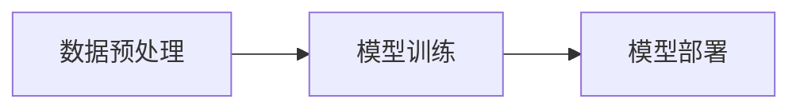

## AI工程最佳实践原理与代码实战案例讲解

作者：禅与计算机程序设计艺术

## 1. 背景介绍

### 1.1 人工智能的兴起与挑战

近年来，人工智能（AI）技术取得了突飞猛进的发展，已经在各个领域展现出巨大的潜力。然而，将AI技术从实验室研究转化为实际应用，却面临着巨大的挑战。AI工程应运而生，旨在为AI应用的开发、部署和维护提供系统化的解决方案。

### 1.2 AI工程的定义与目标

AI工程是将软件工程的原则和实践应用于人工智能系统的设计、开发、部署和维护的一门学科。其目标是：

- **提高AI系统的质量和可靠性:**  通过规范化的流程、最佳实践和自动化工具，降低AI系统出现错误和偏差的风险。
- **加速AI应用的开发和部署:**  通过模块化设计、可复用组件和自动化工具，缩短AI应用的开发周期。
- **降低AI应用的维护成本:**  通过可观测性、可解释性和可维护性设计，降低AI应用的维护难度和成本。

### 1.3 本文的目标与结构

本文旨在介绍AI工程的最佳实践原理，并结合代码实战案例，帮助读者深入理解和掌握AI工程的核心技术。

本文共分为八个部分：

- 第一部分：背景介绍，介绍了AI工程的背景、定义和目标。
- 第二部分：核心概念与联系，介绍了AI工程的核心概念，例如数据预处理、模型训练、模型评估、模型部署等，并阐述了它们之间的联系。
- 第三部分：核心算法原理具体操作步骤，以具体的AI算法为例，详细介绍了其原理和操作步骤。
- 第四部分：数学模型和公式详细讲解举例说明，以数学模型为基础，详细介绍了AI算法的数学原理和应用。
- 第五部分：项目实践：代码实例和详细解释说明，结合实际项目案例，展示了如何使用代码实现AI工程的各个环节。
- 第六部分：实际应用场景，介绍了AI工程在各个领域的应用场景。
- 第七部分：工具和资源推荐，推荐了一些常用的AI工程工具和资源。
- 第八部分：总结：未来发展趋势与挑战，总结了AI工程的未来发展趋势和挑战。

## 2. 核心概念与联系

### 2.1 数据预处理

#### 2.1.1 数据清洗

数据清洗是数据预处理的第一步，旨在识别和处理数据中的错误、缺失值和异常值。

- **常见的数据清洗方法:**
    - **缺失值处理:**  使用均值、中位数、众数等方法填充缺失值。
    - **异常值处理:**  使用箱线图、Z-score等方法检测和处理异常值。
    - **数据格式转换:**  将数据转换为统一的格式，例如日期格式、时间格式等。

#### 2.1.2 数据集成

数据集成是将来自多个数据源的数据合并成一个统一的数据集的过程。

- **常见的数据集成方法:**
    - **数据融合:**  将来自多个数据源的数据进行融合，例如将用户的基本信息和购买记录进行融合。
    - **数据清洗:**  在数据集成过程中，需要进行数据清洗，以确保数据的准确性和一致性。

#### 2.1.3 数据变换

数据变换是将数据转换为适合模型训练的格式的过程。

- **常见的数据变换方法:**
    - **特征缩放:**  将不同特征的值缩放到相同的范围，例如使用 Min-Max 缩放或标准化。
    - **特征编码:**  将类别特征转换为数值特征，例如使用独热编码或标签编码。
    - **特征选择:**  选择与目标变量相关的特征，例如使用卡方检验或信息增益。

### 2.2 模型训练

#### 2.2.1 模型选择

模型选择是根据具体的业务场景和数据特点，选择合适的机器学习模型的过程。

- **常见的机器学习模型:**
    - **监督学习:**  线性回归、逻辑回归、支持向量机、决策树、随机森林等。
    - **无监督学习:**  K-means聚类、DBSCAN聚类、主成分分析等。
    - **强化学习:**  Q-learning、SARSA、Deep Q Network等。

#### 2.2.2 模型训练

模型训练是使用训练数据来调整模型参数，使其能够对新数据进行预测的过程。

- **常见的模型训练方法:**
    - **梯度下降法:**  通过迭代计算损失函数的梯度，并更新模型参数，直到损失函数收敛。
    - **随机梯度下降法:**  每次迭代只使用部分训练数据来计算梯度，可以加快训练速度。
    - **批量梯度下降法:**  每次迭代使用所有训练数据来计算梯度，可以得到更精确的结果。

#### 2.2.3 模型评估

模型评估是使用测试数据来评估模型的性能，例如准确率、精确率、召回率等指标。

- **常见的模型评估指标:**
    - **分类模型:**  准确率、精确率、召回率、F1-score、ROC曲线、AUC值等。
    - **回归模型:**  均方误差、均方根误差、决定系数等。

### 2.3 模型部署

#### 2.3.1 模型序列化

模型序列化是将训练好的模型保存到磁盘，以便于后续加载和使用的过程。

- **常见的模型序列化方法:**
    - **pickle:**  Python标准库中的序列化模块。
    - **joblib:**  专门用于序列化机器学习模型的库。

#### 2.3.2 模型部署方式

模型部署是将训练好的模型部署到生产环境，以便于用户使用的过程。

- **常见的模型部署方式:**
    - **Web服务:**  将模型部署为Web服务，用户可以通过API接口调用模型。
    - **批处理:**  将模型部署为批处理程序，定期对数据进行预测。
    - **边缘计算:**  将模型部署到边缘设备，例如手机、智能家居等。

### 2.4 核心概念之间的联系

数据预处理、模型训练和模型部署是AI工程的三个核心环节，它们之间存在着密切的联系。



数据预处理是模型训练的基础，模型训练是模型部署的前提，模型部署是AI应用的最终目标。

## 3. 核心算法原理具体操作步骤

### 3.1 线性回归

#### 3.1.1 原理

线性回归是一种用于预测连续目标变量的监督学习算法。它假设目标变量和特征之间存在线性关系。

#### 3.1.2 操作步骤

1. **准备数据:**  收集并清洗数据，将特征和目标变量分别存储在不同的数组中。
2. **创建模型:**  使用 scikit-learn 库中的 LinearRegression 类创建一个线性回归模型。
3. **训练模型:**  使用 fit() 方法训练模型，传入特征和目标变量作为参数。
4. **预测结果:**  使用 predict() 方法对新数据进行预测，传入特征作为参数。
5. **评估模型:**  使用 score() 方法评估模型的性能，例如 R-squared 值。

#### 3.1.3 代码示例

```python
from sklearn.linear_model import LinearRegression
from sklearn.model_selection import train_test_split
from sklearn.metrics import r2_score

# 准备数据
X = [[1], [2], [3], [4], [5]]
y = [2, 4, 5, 4, 6]

# 创建模型
model = LinearRegression()

# 训练模型
model.fit(X, y)

# 预测结果
y_pred = model.predict(X)

# 评估模型
print(r2_score(y, y_pred))
```

### 3.2 逻辑回归

#### 3.2.1 原理

逻辑回归是一种用于预测离散目标变量的监督学习算法。它使用 sigmoid 函数将线性模型的输出转换为概率。

#### 3.2.2 操作步骤

1. **准备数据:**  收集并清洗数据，将特征和目标变量分别存储在不同的数组中。
2. **创建模型:**  使用 scikit-learn 库中的 LogisticRegression 类创建一个逻辑回归模型。
3. **训练模型:**  使用 fit() 方法训练模型，传入特征和目标变量作为参数。
4. **预测结果:**  使用 predict() 方法对新数据进行预测，传入特征作为参数。
5. **评估模型:**  使用 accuracy_score() 方法评估模型的性能，例如准确率。

#### 3.2.3 代码示例

```python
from sklearn.linear_model import LogisticRegression
from sklearn.model_selection import train_test_split
from sklearn.metrics import accuracy_score

# 准备数据
X = [[1, 2], [2, 3], [3, 1], [4, 2], [5, 3]]
y = [0, 1, 0, 1, 0]

# 创建模型
model = LogisticRegression()

# 训练模型
model.fit(X, y)

# 预测结果
y_pred = model.predict(X)

# 评估模型
print(accuracy_score(y, y_pred))
```

## 4. 数学模型和公式详细讲解举例说明

### 4.1 线性回归

#### 4.1.1 数学模型

线性回归的数学模型可以表示为：

$$
y = \beta_0 + \beta_1 x_1 + \beta_2 x_2 + ... + \beta_n x_n + \epsilon
$$

其中：

- $y$ 是目标变量。
- $x_1, x_2, ..., x_n$ 是特征。
- $\beta_0, \beta_1, \beta_2, ..., \beta_n$ 是模型参数。
- $\epsilon$ 是误差项。

#### 4.1.2 参数估计

线性回归的目标是找到一组参数 $\beta_0, \beta_1, \beta_2, ..., \beta_n$，使得模型的预测值与真实值之间的误差最小。

通常使用最小二乘法来估计参数，即最小化误差平方和：

$$
\min_{\beta_0, \beta_1, \beta_2, ..., \beta_n} \sum_{i=1}^m (y_i - (\beta_0 + \beta_1 x_{i1} + \beta_2 x_{i2} + ... + \beta_n x_{in}))^2
$$

#### 4.1.3 举例说明

假设我们有一组数据，表示房屋面积和房价之间的关系：

| 面积(平方米) | 房价(万元) |
|---|---|
| 50 | 100 |
| 60 | 120 |
| 70 | 140 |
| 80 | 160 |
| 90 | 180 |

我们可以使用线性回归模型来预测房价：

$$
房价 = \beta_0 + \beta_1 * 面积
$$

使用最小二乘法估计参数，得到：

$$
\beta_0 = 0
$$

$$
\beta_1 = 2
$$

因此，线性回归模型为：

$$
房价 = 2 * 面积
$$

例如，如果房屋面积为 100 平方米，则预测房价为 200 万元。

### 4.2 逻辑回归

#### 4.2.1 数学模型

逻辑回归的数学模型可以表示为：

$$
P(y=1|x) = \frac{1}{1 + e^{-(\beta_0 + \beta_1 x_1 + \beta_2 x_2 + ... + \beta_n x_n)}}
$$

其中：

- $P(y=1|x)$ 是目标变量 $y$ 等于 1 的概率，给定特征 $x$。
- $x_1, x_2, ..., x_n$ 是特征。
- $\beta_0, \beta_1, \beta_2, ..., \beta_n$ 是模型参数。

#### 4.2.2 参数估计

逻辑回归的目标是找到一组参数 $\beta_0, \beta_1, \beta_2, ..., \beta_n$，使得模型的预测概率与真实概率之间的误差最小。

通常使用最大似然估计法来估计参数，即最大化似然函数：

$$
\max_{\beta_0, \beta_1, \beta_2, ..., \beta_n} \prod_{i=1}^m P(y_i|x_i)
$$

#### 4.2.3 举例说明

假设我们有一组数据，表示用户的年龄和是否点击广告之间的关系：

| 年龄 | 是否点击广告 |
|---|---|
| 20 | 1 |
| 30 | 0 |
| 40 | 1 |
| 50 | 0 |
| 60 | 1 |

我们可以使用逻辑回归模型来预测用户是否点击广告：

$$
P(点击广告=1|年龄) = \frac{1}{1 + e^{-(\beta_0 + \beta_1 * 年龄)}}
$$

使用最大似然估计法估计参数，得到：

$$
\beta_0 = -2.1
$$

$$
\beta_1 = 0.05
$$

因此，逻辑回归模型为：

$$
P(点击广告=1|年龄) = \frac{1}{1 + e^{-(-2.1 + 0.05 * 年龄)}}
$$

例如，如果用户的年龄为 35 岁，则预测其点击广告的概率为：

$$
P(点击广告=1|年龄=35) = \frac{1}{1 + e^{-(-2.1 + 0.05 * 35)}} = 0.62
$$

## 5. 项目实践：代码实例和详细解释说明

### 5.1 图像分类

#### 5.1.1 项目背景

图像分类是计算机视觉领域的一个重要任务，旨在将图像分类到不同的类别中。

#### 5.1.2 代码实例

```python
import tensorflow as tf
from tensorflow.keras import layers, models

# 加载数据集
(x_train, y_train), (x_test, y_test) = tf.keras.datasets.cifar10.load_data()

# 预处理数据
x_train = x_train.astype('float32') / 255
x_test = x_test.astype('float32') / 255

# 创建模型
model = models.Sequential()
model.add(layers.Conv2D(32, (3, 3), activation='relu', input_shape=(32, 32, 3)))
model.add(layers.MaxPooling2D((2, 2)))
model.add(layers.Conv2D(64, (3, 3), activation='relu'))
model.add(layers.MaxPooling2D((2, 2)))
model.add(layers.Conv2D(128, (3, 3), activation='relu'))
model.add(layers.Flatten())
model.add(layers.Dense(10, activation='softmax'))

# 编译模型
model.compile(optimizer='adam',
              loss='sparse_categorical_crossentropy',
              metrics=['accuracy'])

# 训练模型
model.fit(x_train, y_train, epochs=10)

# 评估模型
test_loss, test_acc = model.evaluate(x_test, y_test)
print('Test accuracy:', test_acc)
```

#### 5.1.3 代码解释

- **加载数据:**  使用 `tf.keras.datasets.cifar10.load_data()` 加载 CIFAR-10 数据集。
- **预处理数据:**  将像素值缩放到 0 到 1 之间。
- **创建模型:**  创建一个卷积神经网络模型，包括卷积层、池化层、全连接层等。
- **编译模型:**  配置模型的优化器、损失函数和评估指标。
- **训练模型:**  使用训练数据训练模型。
- **评估模型:**  使用测试数据评估模型的性能。

### 5.2 文本生成

#### 5.2.1 项目背景

文本生成是自然语言处理领域的一个重要任务，旨在生成自然流畅的文本。

#### 5.2.2 代码实例

```python
import tensorflow as tf
from tensorflow.keras import layers

# 准备数据
text = """This is a sample text.
This is another sample text.
"""
tokenizer = tf.keras.preprocessing.text.Tokenizer()
tokenizer.fit_on_texts([text])
sequences = tokenizer.texts_to_sequences([text])[0]

# 创建模型
model = tf.keras.models.Sequential()
model.add(layers.Embedding(len(tokenizer.word_index) + 1, 64))
model.add(layers.LSTM(64))
model.add(layers.Dense(len(tokenizer.word_index) + 1, activation='softmax'))

# 编译模型
model.compile(loss='sparse_categorical_crossentropy', optimizer='adam')

# 训练模型
model.fit(sequences[:-1], sequences[1:], epochs=100)

# 生成文本
seed_text = "This is"
next_words = 10
for _ in range(next_words):
    token_list = tokenizer.texts_to_sequences([seed_text])[0]
    token_list = tf.keras.preprocessing.sequence.pad_sequences([token_list], maxlen=64