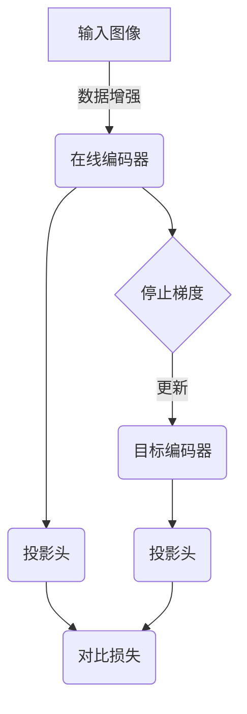

# BYOL原理与代码实例讲解

## 1.背景介绍

### 1.1 自监督学习的兴起

近年来,由于标注数据的获取成本高昂,自监督学习(Self-Supervised Learning)作为一种无需人工标注的学习范式,受到了广泛的关注和研究。自监督学习方法通过设计预训练任务,利用数据本身的信息进行模型预训练,然后将预训练模型迁移到下游任务中进行微调,取得了非常优异的效果。

### 1.2 对比学习的重要性

对比学习(Contrastive Learning)是自监督表示学习的一种主要形式,其核心思想是通过最大化正样本对与负样本对之间的相似性差异,学习出具有区分性的数据表示。对比学习方法通常包括数据增强、正负样本构造和对比损失函数三个关键组成部分。

### 1.3 BYOL的提出

Bootstrap Your Own Latent (BYOL)是2020年由DeepMind提出的一种新型对比学习框架,它通过一种特殊的正负样本构造方式和停止梯度操作,成功解决了对比学习框架中存在的一些问题,取得了令人瞩目的性能。

## 2.核心概念与联系  

### 2.1 BYOL框架概述

BYOL框架包含两个encoders:在线(online)编码器和目标(target)编码器,如下图所示:



其中:

- 输入图像经过数据增强后分别输入到在线编码器和目标编码器
- 目标编码器的参数是在线编码器参数的指数移动平均(Exponential Moving Average)
- 在线编码器和目标编码器的输出通过投影头映射到对比空间
- 对比损失函数最小化在线投影和停止梯度的目标投影之间的均方差

这种设计使BYOL在无需传统对比学习框架中的显式正负样本对构造的情况下,仍能学习到有区分性的表示。

### 2.2 BYOL与其他对比学习方法的区别

相比较而言,BYOL有以下几个显著特点:

1. 无需构造显式的正负样本对
2. 通过停止梯度操作解耦了在线编码器和目标编码器的更新
3. 引入了目标编码器作为在线编码器的"虚拟教师"
4. 损失函数简单高效,是两个投影输出的均方差
5. 可直接应用于下游任务,无需特殊的fine-tuning策略

这些特点使BYOL在训练效率和迁移性能上都有了极大的提升。

## 3.核心算法原理具体操作步骤  

### 3.1 数据增强

BYOL使用了数据增强的方式来构造视图(view),常用的数据增强操作包括:

- 随机裁剪(Random Crop)
- 随机水平翻转(Random Horizontal Flip) 
- 颜色失真(Color Distortion)
- 高斯模糊(Gaussian Blur)

通过对同一输入图像应用不同的数据增强操作,可以得到不同的视图,增加了数据的多样性。

### 3.2 在线编码器和目标编码器

BYOL框架中有两个编码器(encoder):

1. **在线编码器(Online Encoder) $f_\theta$**: 将增强后的图像编码为表示向量
2. **目标编码器(Target Encoder) $\xi$**: 其参数是在线编码器参数的指数移动平均

目标编码器的更新方式如下:

$$\xi \leftarrow \lambda \xi + (1-\lambda) f_\theta$$

其中$\lambda$是指数移动平均的衰减系数,通常设置为0.99或更高。这种更新方式确保了目标编码器的参数滞后于在线编码器,从而起到"虚拟教师"的作用。

### 3.3 投影头和对比损失

在线编码器输出$z_\theta = f_\theta(x)$和目标编码器输出$z_\xi = \xi(x')$分别通过投影头$q_\theta$和$q_\xi$映射到对比空间,得到$p_\theta = q_\theta(z_\theta)$和$p_\xi = q_\xi(z_\xi)$。

对比损失函数定义为:

$$\mathcal{L}_\theta = \\||p_\theta - \overline{p_\xi}\\||_2^2$$

其中$\overline{p_\xi}$表示目标投影$p_\xi$的停止梯度版本。这个损失函数最小化了在线投影$p_\theta$和目标投影$\overline{p_\xi}$之间的均方差。

通过最小化这个损失函数,在线编码器就能学习到与目标编码器(即"虚拟教师")相似的表示。

### 3.4 整体训练过程

BYOL的整体训练过程如下:

1. 对输入图像$x$进行数据增强,得到$x$和$x'$两个视图
2. 将$x$输入在线编码器$f_\theta$得到$z_\theta$,通过投影头$q_\theta$得到$p_\theta$
3. 将$x'$输入目标编码器$\xi$得到$z_\xi$,通过投影头$q_\xi$得到$p_\xi$
4. 计算对比损失$\mathcal{L}_\theta = \\||p_\theta - \overline{p_\xi}\\||_2^2$
5. 对在线编码器$f_\theta$和投影头$q_\theta$进行参数更新,目标编码器$\xi$通过指数移动平均更新
6. 重复以上步骤直至收敛

通过这种方式,BYOL在无需显式正负样本对的情况下,仍能学习到有区分性的表示。

## 4.数学模型和公式详细讲解举例说明

BYOL算法的核心数学模型主要包括三个部分:目标编码器更新、投影头映射和对比损失函数。

### 4.1 目标编码器更新

目标编码器$\xi$的参数是在线编码器$f_\theta$参数的指数移动平均:

$$\xi \leftarrow \lambda \xi + (1-\lambda) f_\theta$$

其中$\lambda$是指数移动平均的衰减系数,通常设置为0.99或更高。这种更新方式确保了目标编码器的参数滞后于在线编码器,从而起到"虚拟教师"的作用。

例如,假设$\lambda=0.99$,在线编码器参数为$\theta_t$,目标编码器参数为$\xi_t$,则在时刻$t+1$时:

$$\xi_{t+1} = 0.99\xi_t + 0.01\theta_t$$

可以看出,目标编码器的参数是在线编码器参数的滞后版本,这就使得目标编码器能够作为在线编码器的"虚拟教师"。

### 4.2 投影头映射

在线编码器输出$z_\theta = f_\theta(x)$和目标编码器输出$z_\xi = \xi(x')$分别通过投影头$q_\theta$和$q_\xi$映射到对比空间,得到$p_\theta = q_\theta(z_\theta)$和$p_\xi = q_\xi(z_\xi)$。

投影头映射的作用是将高维的编码器输出映射到低维的对比空间,以便计算对比损失。通常投影头是一个简单的多层感知机(MLP),例如:

$$q_\theta(z_\theta) = W_2\sigma(W_1z_\theta)$$

其中$W_1$和$W_2$是可训练的权重矩阵,$\sigma$是非线性激活函数(如ReLU)。

### 4.3 对比损失函数

BYOL的对比损失函数定义为:

$$\mathcal{L}_\theta = \\||p_\theta - \overline{p_\xi}\\||_2^2 = \\||q_\theta(z_\theta) - q_\xi(\overline{z_\xi})\\||_2^2$$

其中$\overline{p_\xi}$表示目标投影$p_\xi$的停止梯度版本,$\overline{z_\xi}$表示目标编码器输出$z_\xi$的停止梯度版本。

这个损失函数最小化了在线投影$p_\theta$和目标投影$\overline{p_\xi}$之间的均方差。通过最小化这个损失函数,在线编码器就能学习到与目标编码器(即"虚拟教师")相似的表示。

例如,假设$p_\theta = [0.1, 0.3]$,$\overline{p_\xi} = [0.2, 0.4]$,则损失为:

$$\mathcal{L}_\theta = \\|[0.1, 0.3] - [0.2, 0.4]\\|_2^2 = (-0.1)^2 + (-0.1)^2 = 0.02$$

在训练过程中,通过最小化这个损失,在线编码器的输出$p_\theta$会逐渐接近目标编码器的输出$\overline{p_\xi}$。

## 5.项目实践:代码实例和详细解释说明

以下是使用PyTorch实现BYOL的代码示例,并对关键部分进行了详细解释:

```python
import torch
import torch.nn as nn
import torch.nn.functional as F

# 定义在线编码器和目标编码器
class Encoder(nn.Module):
    def __init__(self, input_dim, output_dim):
        super().__init__()
        self.encoder = nn.Sequential(
            nn.Conv2d(input_dim, 32, 3, stride=2, padding=1),
            nn.ReLU(),
            nn.Conv2d(32, 64, 3, stride=2, padding=1),
            nn.ReLU(),
            nn.Conv2d(64, 128, 3, stride=2, padding=1),
            nn.ReLU(),
            nn.Flatten(),
            nn.Linear(128 * 4 * 4, output_dim)
        )

    def forward(self, x):
        return self.encoder(x)

# 定义投影头
class ProjectionHead(nn.Module):
    def __init__(self, input_dim, output_dim):
        super().__init__()
        self.projection = nn.Sequential(
            nn.Linear(input_dim, input_dim),
            nn.ReLU(),
            nn.Linear(input_dim, output_dim)
        )

    def forward(self, x):
        return self.projection(x)

# BYOL模型
class BYOL(nn.Module):
    def __init__(self, input_dim, output_dim, projection_dim=256):
        super().__init__()
        self.online_encoder = Encoder(input_dim, output_dim)
        self.target_encoder = Encoder(input_dim, output_dim)
        self.online_projector = ProjectionHead(output_dim, projection_dim)
        self.target_projector = ProjectionHead(output_dim, projection_dim)

        # 初始化目标编码器和投影头参数
        for param_o, param_t in zip(self.online_encoder.parameters(), self.target_encoder.parameters()):
            param_t.data.copy_(param_o.data)
            param_t.requires_grad = False

        for param_o, param_t in zip(self.online_projector.parameters(), self.target_projector.parameters()):
            param_t.data.copy_(param_o.data)
            param_t.requires_grad = False

        # 指数移动平均系数
        self.m = 0.99

    def forward(self, x1, x2):
        # 在线编码器和投影头
        online_proj_one = self.online_projector(self.online_encoder(x1))
        online_proj_two = self.online_projector(self.online_encoder(x2))

        # 目标编码器和投影头
        with torch.no_grad():
            target_proj_one = self.target_projector(self.target_encoder(x1))
            target_proj_two = self.target_projector(self.target_encoder(x2))

        # 对比损失
        loss_one = 2 - 2 * F.cosine_similarity(online_proj_one, target_proj_two.detach(), dim=-1).mean()
        loss_two = 2 - 2 * F.cosine_similarity(online_proj_two, target_proj_one.detach(), dim=-1).mean()
        loss = loss_one + loss_two

        # 更新在线编码器和投影头
        loss.backward()
        self.update_online_encoder()

        return loss.detach()

    @torch.no_grad()
    def update_online_encoder(self):
        # 使用指数移动平均更新目标编码器和投影头
        for param_o, param_t in zip(self.online_encoder.parameters(), self.target_encoder.parameters()):
            param_t.data = self.m * param_t.data + (1 - self.m) * param_o.data

        for param_o, param_t in zip(self.online_projector.parameters(), self.target_projector.parameters()):
            param_t.data = self.m * param_t.data + (1 - self.m) * param