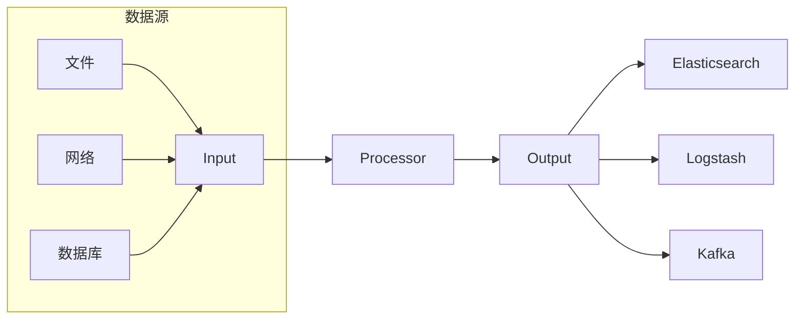

# Beats原理与代码实例讲解

作者：禅与计算机程序设计艺术

## 1. 背景介绍

### 1.1 什么是Beats？

Beats 是 Elastic Stack 中的一员，是轻量级的，开源的数据采集器，你可以将它安装在你的服务器上，它会收集各种操作数据，并把数据发送到 Elasticsearch 或 Logstash 中。Beats 平台使用 Go 语言编写，安装包轻量级，资源占用少，通常运行在边缘服务器上。Beats 可以应用于各种场景，例如：

* **指标监控：** 收集系统和应用程序指标，例如 CPU 使用率、内存使用率、磁盘 IO 等。
* **日志分析：** 收集和集中应用程序日志，以便进行分析和故障排除。
* **安全监控：** 收集安全相关事件，例如登录尝试、文件更改和网络活动。
* **业务数据收集：**  收集业务应用程序数据，例如订单、交易和用户行为。

### 1.2 Beats 的优势

Beats 之所以流行，是因为它具有以下优点：

* **轻量级：** Beats 采用 Go 语言编写，安装包小，资源占用低。
* **易于使用：** Beats 配置简单，易于部署和管理。
* **可扩展：** Beats 提供了丰富的插件机制，可以轻松扩展其功能。
* **社区活跃：** Beats 拥有庞大的社区支持，可以方便地获取帮助和资源。

### 1.3 Beats 的发展历史

Beats 最初是由 Elastic 公司开发的，用于收集和索引日志数据。随着时间的推移，Beats 逐渐发展成为一个功能强大的数据采集平台，支持各种数据源和用例。

## 2. 核心概念与联系

### 2.1 Beats 架构

Beats 采用插件化的架构，主要由以下组件构成：

* **Libbeat：**  Beats 的核心库，提供了通用的数据采集和处理功能。
* **Input：**  负责从各种数据源收集数据，例如文件、网络、数据库等。
* **Processor：**  对收集到的数据进行处理和转换，例如过滤、解析、格式化等。
* **Output：**  将处理后的数据发送到指定的目标，例如 Elasticsearch、Logstash、Kafka 等。

下图展示了 Beats 的架构：



### 2.2 核心概念

* **Event：**  Beats 收集的每一条数据都被称为一个事件，例如一条日志、一个指标数据点等。
* **Pipeline：**  数据在 Beats 中的处理流程被称为管道，管道由 Input、Processor 和 Output 组成。
* **Configuration：**  Beats 的配置文件使用 YAML 格式，用于定义 Input、Processor、Output 等组件的配置信息。

## 3. 核心算法原理具体操作步骤

### 3.1 数据采集流程

Beats 的数据采集流程如下：

1. **配置 Input：**  在 Beats 的配置文件中配置 Input，指定要采集的数据源和相关参数。
2. **启动 Input：**  Beats 启动时会加载配置文件并启动相应的 Input 插件。
3. **采集数据：**  Input 插件会根据配置从数据源采集数据。
4. **生成事件：**  Input 插件将采集到的数据封装成事件。
5. **发送事件：**  Input 插件将事件发送到 Processor 管道。

### 3.2 数据处理流程

Beats 的数据处理流程如下：

1. **接收事件：**  Processor 管道接收来自 Input 插件的事件。
2. **执行处理：**  Processor 管道按照配置顺序执行各个 Processor 插件。
3. **发送事件：**  Processor 管道将处理后的事件发送到 Output 管道。

### 3.3 数据输出流程

Beats 的数据输出流程如下：

1. **接收事件：**  Output 管道接收来自 Processor 管道的事件。
2. **连接目标：**  Output 插件连接到配置的目标，例如 Elasticsearch、Logstash 等。
3. **发送数据：**  Output 插件将事件发送到目标。

## 4. 数学模型和公式详细讲解举例说明

Beats 本身不涉及复杂的数学模型和公式，但其数据采集和处理过程中可能会涉及一些统计指标和算法，例如：

* **平均值：**  用于计算一段时间内的平均值，例如 CPU 使用率的平均值。
* **标准差：**  用于衡量数据的离散程度，例如网络延迟的标准差。
* **百分位数：**  用于描述数据的分布情况，例如请求响应时间的 95% 百分位数。

## 5. 项目实践：代码实例和详细解释说明

### 5.1 安装 Filebeat

Filebeat 是 Beats 家族中用于收集日志文件的成员，以下是安装 Filebeat 的步骤：

```bash
# 下载 Filebeat 安装包
curl -L -O https://artifacts.elastic.co/downloads/beats/filebeat/filebeat-7.10.2-linux-x86_64.tar.gz

# 解压安装包
tar xzvf filebeat-7.10.2-linux-x86_64.tar.gz

# 进入 Filebeat 目录
cd filebeat-7.10.2-linux-x86_64
```

### 5.2 配置 Filebeat

Filebeat 的配置文件位于 `filebeat.yml`，以下是 Filebeat 的示例配置：

```yaml
filebeat.inputs:
- type: log
  paths:
    - /var/log/*.log
  fields:
    log_type: my_app_log

output.elasticsearch:
  hosts: ["localhost:9200"]
```

该配置指定 Filebeat 从 `/var/log/` 目录下收集所有以 `.log` 结尾的文件，并将收集到的日志数据发送到 `localhost:9200` 的 Elasticsearch 集群。

### 5.3 启动 Filebeat

```bash
# 启动 Filebeat
./filebeat -e
```

### 5.4 验证 Filebeat

启动 Filebeat 后，可以通过以下命令验证 Filebeat 是否成功连接到 Elasticsearch 集群：

```bash
curl -XGET 'http://localhost:9200/_cat/indices?v'
```

如果 Filebeat 成功连接到 Elasticsearch 集群，则会返回所有索引的列表，其中应该包含 Filebeat 创建的索引。

## 6. 实际应用场景

### 6.1 日志分析

Beats 可以用于收集和集中应用程序日志，以便进行分析和故障排除。例如，可以使用 Filebeat 收集应用程序日志，并将日志数据发送到 Elasticsearch 集群，然后使用 Kibana 对日志数据进行可视化分析，以便快速定位问题。

### 6.2 指标监控

Beats 可以用于收集系统和应用程序指标，例如 CPU 使用率、内存使用率、磁盘 IO 等。例如，可以使用 Metricbeat 收集系统指标，并将指标数据发送到 Elasticsearch 集群，然后使用 Kibana 创建仪表板来监控系统的运行状况。

### 6.3 安全监控

Beats 可以用于收集安全相关事件，例如登录尝试、文件更改和网络活动。例如，可以使用 Auditbeat 收集 Linux 审计日志，并将日志数据发送到 Elasticsearch 集群，然后使用 Kibana 创建警报规则来检测可疑活动。

## 7. 工具和资源推荐

* **Elasticsearch 官网：** https://www.elastic.co/
* **Beats 文档：** https://www.elastic.co/guide/en/beats/libbeat/current/index.html
* **Kibana 文档：** https://www.elastic.co/guide/en/kibana/current/index.html

## 8. 总结：未来发展趋势与挑战

随着大数据和云计算技术的不断发展，数据采集和分析的需求越来越高。Beats 作为一款轻量级、易于使用、可扩展的数据采集平台，将在未来继续发挥重要作用。

未来 Beats 的发展趋势主要包括：

* **支持更多的数据源：** Beats 将会支持更多的数据源，例如云平台、消息队列、物联网设备等。
* **更强大的数据处理能力：** Beats 将会提供更强大的数据处理能力，例如数据清洗、数据转换、数据聚合等。
* **更智能的分析功能：** Beats 将会集成更智能的分析功能，例如异常检测、趋势预测等。

## 9. 附录：常见问题与解答

### 9.1 如何更改 Filebeat 的日志级别？

可以通过修改 `filebeat.yml` 配置文件中的 `logging.level` 参数来更改 Filebeat 的日志级别，例如：

```yaml
logging.level: debug
```

### 9.2 如何将 Filebeat 作为服务运行？

可以使用操作系统的服务管理工具将 Filebeat 作为服务运行，例如：

```bash
# 将 Filebeat 安装为系统服务
sudo ./install -service

# 启动 Filebeat 服务
sudo service filebeat start
```

### 9.3 如何排查 Filebeat 故障？

可以通过查看 Filebeat 的日志文件来排查故障，日志文件位于 `/var/log/filebeat/` 目录下。