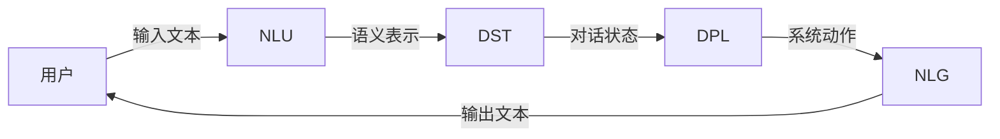

## 1. 背景介绍

### 1.1 对话系统概述

对话系统，也称为对话式AI或聊天机器人，是一种能够与人类用户进行自然语言交互的计算机程序。近年来，随着人工智能技术的飞速发展，对话系统在各个领域都取得了巨大的进步，例如：

* **客户服务：** 自动回答常见问题，提供24/7全天候服务。
* **个人助理：** 管理日程安排、设置提醒、发送消息等。
* **教育：** 提供个性化的学习体验，解答学生问题。
* **娱乐：** 创作故事、玩游戏、提供陪伴等。

### 1.2 对话系统发展历程

对话系统的研究可以追溯到上世纪50年代的图灵测试，其目标是测试机器是否能够像人类一样进行对话。早期对话系统主要基于规则和模板，只能处理有限的对话场景。

近年来，随着深度学习技术的兴起，基于神经网络的对话系统取得了突破性进展，能够处理更复杂、更自然的对话。

### 1.3 对话系统分类

对话系统可以根据不同的标准进行分类，例如：

* **按任务类型：** 任务型对话系统、闲聊型对话系统、问答型对话系统等。
* **按技术实现：** 基于规则的对话系统、基于检索的对话系统、基于生成式的对话系统等。
* **按交互方式：** 文本对话系统、语音对话系统、多模态对话系统等。

## 2. 核心概念与联系

### 2.1 自然语言理解（NLU）

自然语言理解（NLU）是对话系统的核心模块之一，其目标是将人类语言转换成计算机能够理解的语义表示。NLU通常包括以下子任务：

* **分词（Tokenization）：** 将文本分割成单词或词组。
* **词性标注（Part-of-Speech Tagging）：** 识别每个单词的词性，例如名词、动词、形容词等。
* **命名实体识别（Named Entity Recognition）：** 识别文本中的人名、地名、机构名等实体。
* **句法分析（Syntactic Parsing）：** 分析句子的语法结构。
* **语义分析（Semantic Analysis）：** 理解句子的含义。

### 2.2 对话状态跟踪（DST）

对话状态跟踪（DST）负责记录和管理对话的上下文信息，例如用户的目标、对话历史、当前话题等。DST 的作用是帮助系统理解当前对话所处的状态，以便做出更准确的回复。

### 2.3 对话策略学习（DPL）

对话策略学习（DPL）决定了系统在每个对话状态下应该采取什么行动，例如询问问题、提供信息、结束对话等。DPL 的目标是最大化对话的成功率，例如完成任务、满足用户需求等。

### 2.4 自然语言生成（NLG）

自然语言生成（NLG）负责将系统生成的语义表示转换成自然语言文本，以便用户理解。NLG 的目标是生成流畅、自然、符合语法规范的文本。

### 2.5 核心概念联系

下图展示了对话系统中各个核心概念之间的联系：



## 3. 核心算法原理具体操作步骤

### 3.1 基于规则的对话系统

基于规则的对话系统使用预先定义的规则和模板来处理对话。

**操作步骤：**

1. **定义规则库：**  使用正则表达式或其他规则语言定义对话规则，例如：
    * 如果用户说“你好”，则回复“你好”。
    * 如果用户说“我想订餐”，则询问“您想吃什么？”
2. **匹配规则：** 当用户输入文本时，系统会遍历规则库，查找匹配的规则。
3. **执行动作：** 如果找到匹配的规则，则执行相应的动作，例如回复文本、询问问题等。

**优点：**

* 实现简单，易于理解和维护。
* 对于特定领域和场景，可以快速构建原型系统。

**缺点：**

* 难以处理复杂的对话逻辑。
* 扩展性差，难以适应新的对话场景。

### 3.2 基于检索的对话系统

基于检索的对话系统从预先定义的对话语料库中检索最匹配的回复。

**操作步骤：**

1. **构建对话语料库：** 收集大量的对话数据，并进行清洗和标注。
2. **文本表示：** 使用词袋模型、TF-IDF 等方法将文本转换成向量表示。
3. **相似度计算：** 当用户输入文本时，系统会计算用户输入文本与语料库中每个文本的相似度。
4. **返回最匹配的回复：** 选择相似度最高的文本作为回复。

**优点：**

* 可以处理更复杂的对话场景。
* 回复质量较高，因为回复来自真实的对话数据。

**缺点：**

* 需要大量的对话数据来构建语料库。
* 难以处理未见过的对话场景。

### 3.3 基于生成式的对话系统

基于生成式的对话系统使用深度学习模型自动生成回复。

**操作步骤：**

1. **数据预处理：** 对话数据进行清洗、分词、构建词表等预处理操作。
2. **模型训练：** 使用 Seq2Seq、Transformer 等深度学习模型，在对话数据上进行训练。
3. **模型预测：** 当用户输入文本时，将文本输入到训练好的模型中，模型会自动生成回复。

**优点：**

* 可以处理更复杂、更自然的对话。
* 能够生成未见过的回复。

**缺点：**

* 模型训练需要大量的计算资源和时间。
* 生成的回复可能存在语法错误、逻辑混乱等问题。


## 4. 数学模型和公式详细讲解举例说明

### 4.1 Seq2Seq 模型

Seq2Seq 模型是一种常用的神经机器翻译模型，也可以用于对话系统中生成回复。

**模型结构：**

Seq2Seq 模型由编码器和解码器两部分组成：

* **编码器：** 将输入序列编码成一个固定长度的向量表示。
* **解码器：** 根据编码器生成的向量表示，逐词生成输出序列。

**数学公式：**

编码器：
$$
h_t = f(x_t, h_{t-1})
$$

其中：

* $h_t$ 表示编码器在时刻 $t$ 的隐藏状态。
* $x_t$ 表示输入序列在时刻 $t$ 的词向量。
* $f$ 表示编码器的循环神经网络单元，例如 LSTM 或 GRU。

解码器：
$$
s_t = g(y_{t-1}, s_{t-1}, c)
$$

$$
y_t = \text{softmax}(W_o s_t + b_o)
$$

其中：

* $s_t$ 表示解码器在时刻 $t$ 的隐藏状态。
* $y_t$ 表示解码器在时刻 $t$ 生成的词。
* $g$ 表示解码器的循环神经网络单元。
* $c$ 表示编码器生成的上下文向量。
* $W_o$ 和 $b_o$ 分别表示输出层的权重矩阵和偏置向量。

**举例说明：**

假设用户输入文本为“你好”，Seq2Seq 模型的生成过程如下：

1. 将“你好”转换成词向量序列 $[x_1, x_2]$。
2. 将词向量序列输入到编码器中，得到上下文向量 $c$。
3. 将上下文向量 $c$ 输入到解码器中，解码器会逐词生成回复，例如“你好”。

### 4.2 Transformer 模型

Transformer 模型是近年来提出的一种新的神经机器翻译模型，在对话系统中也取得了很好的效果。

**模型结构：**

Transformer 模型抛弃了传统的循环神经网络结构，完全基于注意力机制来建模输入和输出之间的依赖关系。

**注意力机制：**

注意力机制允许模型在生成每个词时，关注输入序列中所有词的信息，并根据词与词之间的相关性，动态地分配权重。

**数学公式：**

$$
\text{Attention}(Q, K, V) = \text{softmax}(\frac{QK^T}{\sqrt{d_k}})V
$$

其中：

* $Q$ 表示查询矩阵。
* $K$ 表示键矩阵。
* $V$ 表示值矩阵。
* $d_k$ 表示键矩阵的维度。

**举例说明：**

假设用户输入文本为“你好”，Transformer 模型的生成过程如下：

1. 将“你好”转换成词向量序列 $[x_1, x_2]$。
2. 将词向量序列输入到编码器中，编码器会计算每个词的注意力权重。
3. 根据注意力权重，将输入序列编码成一个上下文矩阵。
4. 将上下文矩阵输入到解码器中，解码器会逐词生成回复，例如“你好”。

## 5. 项目实践：代码实例和详细解释说明

```python
import tensorflow as tf

# 定义模型参数
vocab_size = 10000
embedding_dim = 128
encoder_units = 256
decoder_units = 256

# 定义编码器
encoder_inputs = tf.keras.layers.Input(shape=(None,))
encoder_embeddings = tf.keras.layers.Embedding(vocab_size, embedding_dim)(encoder_inputs)
encoder_lstm = tf.keras.layers.LSTM(encoder_units, return_state=True)
encoder_outputs, state_h, state_c = encoder_lstm(encoder_embeddings)
encoder_states = [state_h, state_c]

# 定义解码器
decoder_inputs = tf.keras.layers.Input(shape=(None,))
decoder_embeddings = tf.keras.layers.Embedding(vocab_size, embedding_dim)(decoder_inputs)
decoder_lstm = tf.keras.layers.LSTM(decoder_units, return_sequences=True, return_state=True)
decoder_outputs, _, _ = decoder_lstm(decoder_embeddings, initial_state=encoder_states)
decoder_dense = tf.keras.layers.Dense(vocab_size, activation='softmax')
decoder_outputs = decoder_dense(decoder_outputs)

# 定义模型
model = tf.keras.Model([encoder_inputs, decoder_inputs], decoder_outputs)

# 编译模型
model.compile(optimizer='adam', loss='sparse_categorical_crossentropy', metrics=['accuracy'])

# 训练模型
model.fit(x_train, y_train, epochs=10)

# 使用模型进行预测
def predict(input_text):
    # 将输入文本转换成词索引序列
    input_seq = [word2idx[word] for word in input_text.split()]
    # 将词索引序列转换成张量
    input_tensor = tf.convert_to_tensor([input_seq])
    # 初始化解码器的初始状态
    decoder_input = [word2idx['<start>']]
    decoder_state = encoder_states
    # 循环生成回复
    output_text = ''
    for i in range(max_decoder_seq_length):
        # 使用解码器预测下一个词
        predictions, state_h, state_c = decoder_model.predict([input_tensor, decoder_input] + decoder_state)
        # 选择概率最大的词
        predicted_id = tf.argmax(predictions[0, -1, :]).numpy()
        # 将预测的词添加到回复中
        output_text += idx2word[predicted_id] + ' '
        # 更新解码器的输入和状态
        decoder_input = [predicted_id]
        decoder_state = [state_h, state_c]
        # 如果预测的词是结束符，则停止生成
        if predicted_id == word2idx['<end>']:
            break
    return output_text

# 测试模型
input_text = "你好"
output_text = predict(input_text)
print(output_text)
```

**代码解释：**

* 首先，定义模型参数，包括词表大小、词向量维度、编码器和解码器的单元数等。
* 然后，定义编码器和解码器。编码器使用 LSTM 网络将输入序列编码成一个固定长度的向量表示，解码器使用 LSTM 网络根据编码器生成的向量表示，逐词生成输出序列。
* 接下来，定义模型，将编码器和解码器组合起来。
* 编译模型，选择优化器、损失函数和评估指标。
* 训练模型，使用训练数据对模型进行训练。
* 最后，使用训练好的模型进行预测，将输入文本转换成词索引序列，输入到模型中，模型会自动生成回复。

## 6. 实际应用场景

### 6.1  客户服务

* **自动回复常见问题：**  例如，电商平台可以使用对话系统自动回答用户关于商品信息、物流查询、售后服务等问题，节省人力成本，提升用户体验。
* **提供24/7全天候服务：**  对话系统可以不间断地为用户提供服务，即使在非工作时间也能及时响应用户需求。
* **个性化服务：**  对话系统可以根据用户的历史行为和偏好，提供个性化的服务，例如推荐商品、提供定制化的解决方案等。

### 6.2 个人助理

* **管理日程安排：**  例如，用户可以通过语音或文本与对话系统交互，安排会议、设置提醒、预订酒店等。
* **发送消息：**  用户可以通过对话系统发送短信、邮件、微信等消息，无需手动操作。
* **控制智能家居：**  用户可以通过对话系统控制家里的智能设备，例如开关灯、调节空调温度等。

### 6.3  教育

* **提供个性化的学习体验：**  对话系统可以根据学生的学习进度和水平，提供个性化的学习内容和练习题，帮助学生更高效地学习。
* **解答学生问题：**  对话系统可以回答学生关于课程内容的疑问，提供更详细的解释和示例。
* **提供学习反馈：**  对话系统可以根据学生的学习情况，提供及时的反馈和建议，帮助学生改进学习方法。

### 6.4  娱乐

* **创作故事：**  对话系统可以根据用户的输入，生成个性化的故事，提供娱乐体验。
* **玩游戏：**  用户可以通过对话系统与游戏角色进行交互，体验更沉浸式的游戏体验。
* **提供陪伴：**  对于一些孤独的老人或孩子，对话系统可以提供陪伴和聊天，缓解他们的孤独感。

## 7. 总结：未来发展趋势与挑战

### 7.1  未来发展趋势

* **多模态对话系统：**  未来的对话系统将融合语音、图像、视频等多种模态信息，提供更自然、更丰富的交互体验。
* **个性化和情感化的对话系统：**  未来的对话系统将更加注重用户的个性化需求和情感体验，提供更人性化的服务。
* **知识驱动的对话系统：**  未来的对话系统将整合更丰富的知识库，能够回答更复杂、更专业的问题。
* **人机协同的对话系统：**  未来的对话系统将更加注重人机协同，人类专家可以参与到对话系统的训练和优化过程中，提升对话系统的性能和可靠性。

### 7.2  挑战

* **自然语言理解的局限性：**  目前的自然语言理解技术还存在一些局限性，例如难以处理复杂的语义、歧义性问题等。
* **对话数据稀缺：**  训练高质量的对话系统需要大量的对话数据，而获取高质量的对话数据成本高昂。
* **对话系统的安全性：**  对话系统可能会被恶意利用，例如传播虚假信息、进行网络攻击等，因此需要加强对话系统的安全性。

## 8.  附录：常见问题与解答

### 8.1  如何构建一个简单的对话系统？

构建一个简单的对话系统，可以使用基于规则的方法，例如使用 Python 的 `if-else` 语句定义对话规则。

```python
def chatbot(input_text):
  if "你好" in input_text:
    return "你好！"
  elif "你叫什么名字" in input_text:
    return "我是一个聊天机器人。"
  else:
    return "我不明白你的意思。"

# 测试
print(chatbot("你好")) # 输出：你好！
print(chatbot("你叫什么名字")) # 输出：我是一个聊天机器人。
print(chatbot("今天天气怎么样")) # 输出：我不明白你的意思。
```

### 8.2  如何评估对话系统的性能？

评估对话系统的性能可以使用以下指标：

* **任务完成率：**  对于任务型对话系统，可以使用任务完成率来评估系统的性能，例如用户成功订餐的比例。
* **BLEU 分数：**  BLEU 分数是一种常用的机器翻译评估指标，也可以用于评估对话系统生成回复的质量。
* **人工评估：**  人工评估是指由人工对对话系统的回复进行评分，例如流畅度、相关性、 информативность 等方面。

### 8.3  有哪些常用的对话系统工具和资源？

* **Rasa：**  Rasa 是一个开源的对话系统框架，提供了自然语言理解、对话状态跟踪、对话策略学习等模块。
* **Dialogflow：**  Dialogflow 是 Google Cloud Platform 提供的对话系统平台，提供了可视化的界面，方便用户构建和部署对话系统。
* **Botpress：**  Botpress 是一个开源的对话系统平台，提供了可视化的界面，方便用户构建和部署对话系统。
* **Hugging Face Transformers：**  Hugging Face Transformers 提供了预训练的 Transformer 模型，可以用于构建对话系统。

### 8.4  如何学习对话系统？

学习对话系统可以参考以下资源：

* **书籍：**  《Speech