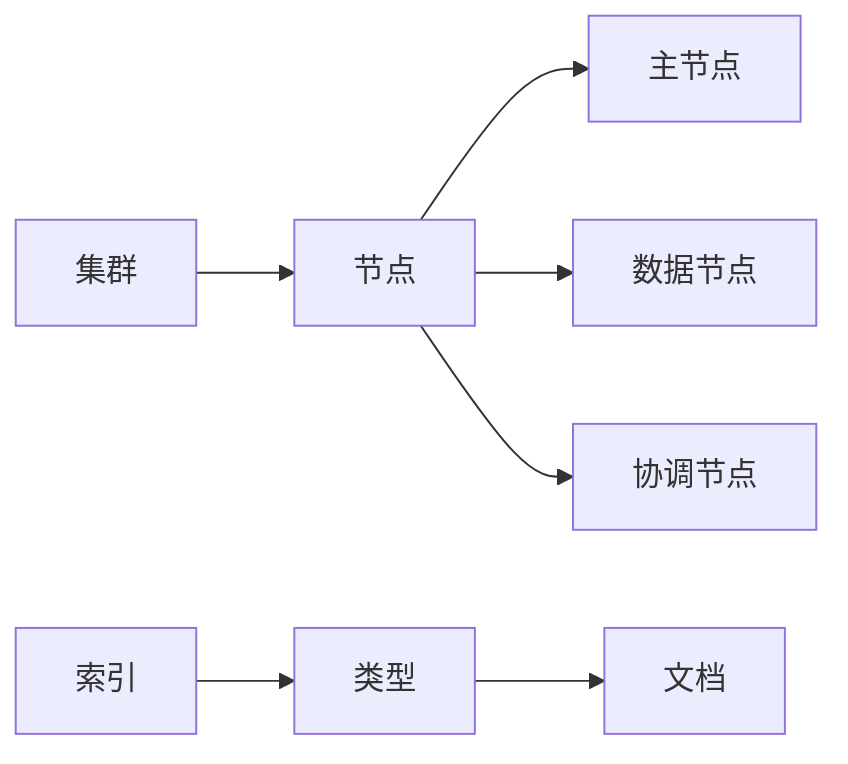

## 1. 背景介绍

### 1.1.  什么是 Elasticsearch？

Elasticsearch 是一个开源的分布式搜索和分析引擎，建立在 Apache Lucene 之上。它以其强大的搜索功能、可扩展性和实时数据分析能力而闻名。Elasticsearch  能够存储、搜索和分析海量结构化和非结构化数据，并以接近实时的速度返回结果。

### 1.2.  Elasticsearch 的应用场景

Elasticsearch 广泛应用于各种场景，包括：

* **网站搜索：** 提供快速、准确的网站搜索体验。
* **日志分析：** 收集、存储和分析日志数据，以识别趋势、异常和根本原因。
* **业务分析：** 分析业务数据以获取洞察力，例如客户行为、销售趋势和市场分析。
* **安全信息和事件管理 (SIEM)：** 收集和分析安全数据以检测和响应威胁。
* **物联网 (IoT)：** 存储和分析来自连接设备的大量数据。

### 1.3.  Elasticsearch 的优势

* **可扩展性：** Elasticsearch 可以轻松扩展以处理 PB 级数据。
* **高可用性：** Elasticsearch 具有内置的冗余和故障转移机制。
* **实时搜索和分析：** Elasticsearch 可以在数据索引后立即对其进行搜索和分析。
* **易于使用：** Elasticsearch 提供了一个简单易用的 RESTful API。
* **开源和社区支持：** Elasticsearch 是一个开源项目，拥有庞大而活跃的社区。

## 2. 核心概念与联系

### 2.1.  倒排索引

Elasticsearch 使用倒排索引来实现快速搜索。倒排索引是一种数据结构，它存储单词和包含这些单词的文档之间的映射关系。

**正排索引**

| 文档 ID | 文档内容                               |
| -------- | ------------------------------------- |
| 1        | Elasticsearch is a search engine.     |
| 2        | Elasticsearch is a distributed system. |
| 3        | Elasticsearch is open source.         |

**倒排索引**

| 单词          | 文档 ID 列表 |
| ------------- | ------------ |
| Elasticsearch | 1, 2, 3       |
| is            | 1, 2, 3       |
| a             | 1, 2         |
| search        | 1             |
| engine        | 1             |
| distributed   | 2             |
| system       | 2             |
| open          | 3             |
| source        | 3             |

当用户搜索 "Elasticsearch is" 时，Elasticsearch 可以使用倒排索引快速找到包含这两个单词的所有文档（文档 ID 1、2 和 3）。

### 2.2.  节点和集群

Elasticsearch 集群由一个或多个节点组成。节点是 Elasticsearch 集群中的单个服务器。集群中的节点协同工作以存储数据、处理搜索请求并提供高可用性。

* **主节点：** 负责集群级别的操作，例如创建或删除索引。
* **数据节点：** 存储数据并处理与数据相关的操作，例如搜索和聚合。
* **协调节点：** 将请求路由到适当的节点并汇总结果。

### 2.3.  索引、类型和文档

* **索引：** 索引是具有相似特征的文档的集合。例如，您可以为产品目录创建一个索引，为客户数据创建另一个索引。
* **类型：** 类型是索引内的逻辑类别。在 Elasticsearch 7.x 及更高版本中，类型已被弃用。
* **文档：** 文档是 Elasticsearch 中的基本信息单元。文档以 JSON 格式表示，包含字段和值。

**关系图**



## 3. 核心算法原理具体操作步骤

### 3.1.  索引过程

1. **接收文档：** Elasticsearch 接收要索引的文档。
2. **分析文档：** 使用分析器将文档文本分解为标记（单词）。
3. **创建倒排索引：** 为每个标记创建一个倒排索引条目，其中包含包含该标记的文档 ID 列表。
4. **存储文档：** 将原始文档存储在磁盘上。

### 3.2.  搜索过程

1. **接收查询：** Elasticsearch 接收搜索查询。
2. **分析查询：** 使用分析器将查询文本分解为标记。
3. **查找匹配的文档：** 使用倒排索引查找包含查询标记的文档 ID 列表。
4. **检索文档：** 从磁盘检索匹配的文档。
5. **评分文档：** 使用相关性评分算法对文档进行评分，以确定其与查询的相关性。
6. **返回结果：** 将按相关性排序的文档列表返回给用户。

## 4. 数学模型和公式详细讲解举例说明

### 4.1.  相关性评分

Elasticsearch 使用称为 **BM25** 的相关性评分算法。BM25 是一种基于概率的检索模型，它考虑以下因素：

* **词频 (TF)：** 查询词在文档中出现的次数。
* **文档频率 (DF)：** 包含查询词的文档数量。
* **反向文档频率 (IDF)：** 查询词的稀缺性。
* **文档长度：** 文档的长度。

**BM25 公式：**

```
score(D, Q) = ∑ (IDF(q) * (TF(q, D) * (k1 + 1)) / (TF(q, D) + k1 * (1 - b + b * (|D| / avgdl))))
```

其中：

* `D` 是文档。
* `Q` 是查询。
* `q` 是查询词。
* `k1` 和 `b` 是可调参数。
* `|D|` 是文档的长度。
* `avgdl` 是所有文档的平均长度。

### 4.2.  举例说明

假设我们有一个包含以下文档的索引：

* **文档 1：** "Elasticsearch is a search engine."
* **文档 2：** "Elasticsearch is a distributed system."

用户搜索 "Elasticsearch search"。

**词频 (TF)：**

* "Elasticsearch" 在文档 1 和文档 2 中都出现一次。
* "search" 在文档 1 中出现一次，在文档 2 中没有出现。

**文档频率 (DF)：**

* "Elasticsearch" 出现在 2 个文档中。
* "search" 出现在 1 个文档中。

**反向文档频率 (IDF)：**

* "Elasticsearch" 的 IDF 较低，因为它出现在许多文档中。
* "search" 的 IDF 较高，因为它出现在较少的文档中。

**文档长度：**

* 文档 1 的长度为 5 个单词。
* 文档 2 的长度为 5 个单词。

**相关性评分：**

使用 BM25 公式，我们可以计算每个文档的相关性评分：

* **文档 1：** 高分，因为它包含两个查询词，并且 "search" 的 IDF 较高。
* **文档 2：** 低分，因为它只包含一个查询词，并且 "Elasticsearch" 的 IDF 较低。

## 5. 项目实践：代码实例和详细解释说明

### 5.1.  安装 Elasticsearch 和 Kibana

```bash
# 下载并安装 Elasticsearch
wget https://artifacts.elastic.co/downloads/elasticsearch/elasticsearch-7.17.4-linux-x86_64.tar.gz
tar -xzf elasticsearch-7.17.4-linux-x86_64.tar.gz

# 下载并安装 Kibana
wget https://artifacts.elastic.co/downloads/kibana/kibana-7.17.4-linux-x86_64.tar.gz
tar -xzf kibana-7.17.4-linux-x86_64.tar.gz
```

### 5.2.  启动 Elasticsearch 和 Kibana

```bash
# 启动 Elasticsearch
cd elasticsearch-7.17.4/
./bin/elasticsearch

# 启动 Kibana
cd kibana-7.17.4-linux-x86_64/
./bin/kibana
```

### 5.3.  使用 Python 客户端连接到 Elasticsearch

```python
from elasticsearch import Elasticsearch

# 创建 Elasticsearch 客户端
es = Elasticsearch([{'host': 'localhost', 'port': 9200}])

# 检查 Elasticsearch 集群是否正在运行
if es.ping():
    print('Yay Connect')
else:
    print('Awww it could not connect!')
```

### 5.4.  创建索引和文档

```python
# 创建一个名为 "products" 的索引
es.indices.create(index='products')

# 索引一个文档
doc = {
    'name': 'T-shirt',
    'price': 19.99,
    'description': 'A comfortable cotton t-shirt.',
    'in_stock': True
}
es.index(index='products', document=doc)
```

### 5.5.  搜索文档

```python
# 搜索 "t-shirt"
results = es.search(index="products", body={"query": {"match": {"name": "t-shirt"}}})

# 打印结果
print(results)
```

## 6. 实际应用场景

### 6.1.  电子商务网站搜索

Elasticsearch 可以为电子商务网站提供快速、准确的产品搜索体验。用户可以按产品名称、描述、类别、价格等搜索产品。

### 6.2.  日志分析

Elasticsearch 可以收集、存储和分析来自各种来源的日志数据，例如服务器、应用程序和网络设备。这允许管理员识别趋势、异常和根本原因。

### 6.3.  业务分析

Elasticsearch 可以分析业务数据以获取洞察力，例如客户行为、销售趋势和市场分析。这可以帮助企业做出更明智的决策。

## 7. 工具和资源推荐

* **Kibana：** Elasticsearch 的数据可视化和管理工具。
* **Logstash：** 用于收集、解析和发送日志数据的工具。
* **Beats：** 轻量级数据收集器，用于将数据从各种来源发送到 Elasticsearch。
* **Elasticsearch Python 客户端：** 用于与 Elasticsearch 交互的 Python 库。

## 8. 总结：未来发展趋势与挑战

### 8.1.  未来发展趋势

* **机器学习：** Elasticsearch 正在集成机器学习功能，以实现更智能的搜索和分析。
* **云原生：** Elasticsearch 正在发展成为一个云原生平台，提供更好的可扩展性和弹性。
* **安全性：** Elasticsearch 正在增强其安全功能，以保护敏感数据。

### 8.2.  挑战

* **数据增长：** 随着数据量的不断增长，管理和搜索大量数据变得越来越具有挑战性。
* **性能优化：** 优化 Elasticsearch 性能以实现快速搜索和分析至关重要。
* **安全威胁：** Elasticsearch 集群容易受到安全威胁，因此实施适当的安全措施至关重要。

## 9. 附录：常见问题与解答

### 9.1.  Elasticsearch 和 Solr 有什么区别？

Elasticsearch 和 Solr 都是基于 Lucene 的开源搜索引擎。主要区别在于：

* **易用性：** Elasticsearch 更易于设置和使用，而 Solr 更灵活，需要更多配置。
* **可扩展性：** Elasticsearch 更易于扩展，而 Solr 在处理大量数据时可能更有效。
* **社区：** Elasticsearch 拥有更大、更活跃的社区。

### 9.2.  如何提高 Elasticsearch 性能？

* **优化硬件：** 使用更快的 CPU、更多 RAM 和 SSD 驱动器。
* **优化索引：** 调整索引设置以提高性能。
* **优化查询：** 编写高效的查询以减少搜索时间。
* **使用缓存：** 缓存经常访问的数据以减少磁盘 I/O。

### 9.3.  如何保护 Elasticsearch 集群？

* **身份验证和授权：** 限制对 Elasticsearch 集群的访问。
* **加密：** 对静态数据和传输中的数据进行加密。
* **安全监控：** 监控 Elasticsearch 集群以 détecter les menaces potentielles。