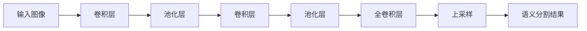

# FCN原理与代码实例讲解

## 1.背景介绍

### 1.1 语义分割任务概述

语义分割是计算机视觉领域的一个核心任务,旨在将图像中的每个像素分配给一个预定义的类别标签。与图像分类任务(识别整个图像的类别)和目标检测任务(识别图像中的物体实例及其边界框)不同,语义分割需要对图像中的每个像素进行精细的分类,因此具有更高的难度和挑战性。

语义分割广泛应用于无人驾驶、医疗图像分析、遥感图像理解等领域。以无人驾驶为例,语义分割可以准确区分道路、行人、车辆、交通标志等不同目标,为决策系统提供关键输入。

### 1.2 全卷积网络(FCN)的重要意义

全卷积网络(Fully Convolutional Network, FCN)是语义分割领域的开山之作,由Jonathan Long等人于2015年提出。FCN的核心思想是将标准卷积网络中的全连接层替换为卷积层,从而可以接受任意尺寸的输入图像,并产生对应尺寸的语义分割结果。这种设计打破了传统卷积网络输入输出尺寸固定的限制,使得卷积网络可以应用于像素级别的密集预测任务。

FCN的提出开启了基于深度学习的语义分割研究的新时代。在此之前,语义分割一直是一个具有挑战性的问题,传统方法往往需要设计复杂的手工特征、图割等模块,性能并不理想。FCN则将该问题转化为端到端的像素级分类任务,通过有监督的训练,可以自动学习最优特征表示,极大地提升了分割精度。

除了卓越的性能表现,FCN的创新之处还在于其网络设计思路的简洁性和通用性。许多后续的语义分割模型都是在FCN的基础上进行改进和扩展,如U-Net、DeepLab等。因此,深入理解FCN的原理和实现细节,对于掌握语义分割的核心知识至关重要。

## 2.核心概念与联系

### 2.1 FCN的网络架构

FCN的网络架构如下图所示:



FCN的主要组成部分包括:

1. **卷积层(Convolution Layer)**: 用于提取图像的局部特征,包括边缘、纹理等低级特征。
2. **池化层(Pooling Layer)**: 通过降采样操作,实现特征的空间不变性和数据量的压缩。
3. **全卷积层(Fully Convolutional Layer)**: 将最后几层的全连接层替换为卷积层,使网络可以接受任意尺寸的输入图像。
4. **上采样层(Upsampling Layer)**: 通过上采样操作(如反卷积、双线性插值等)将低分辨率的特征图恢复到原始图像尺寸,以获得像素级别的分割结果。

与传统卷积网络相比,FCN的关键创新点在于引入了全卷积层和上采样层,从而实现了端到端的像素级预测。

### 2.2 跳跃连接(Skip Connection)

为了融合不同尺度的特征信息,提高分割精度,FCN采用了跳跃连接(Skip Connection)的设计。具体来说,浅层卷积层提取的低级特征(如边缘、纹理等)与高层全卷积层提取的高级语义特征进行融合,从而获得更加丰富的特征表示。

跳跃连接的作用在于:

1. **恢复空间细节信息**: 浅层特征保留了原始图像的空间细节信息,有助于精确定位目标边界。
2. **增强特征表达能力**: 融合不同层次的特征,可以提升整个网络的特征表达能力。
3. **缓解梯度消失问题**: 跳跃连接提供了一条"捷径",使得梯度在反向传播时更容易流动,有效缓解了深层网络的梯度消失问题。

在FCN中,跳跃连接是通过对浅层特征图进行上采样,然后与相应的深层特征图进行元素级相加实现的。这种设计思路在后续的语义分割模型中得到了广泛采用和发展。

## 3.核心算法原理具体操作步骤

### 3.1 卷积和池化层

FCN的前几层由标准的卷积层和池化层组成,用于提取图像的低级特征。具体操作步骤如下:

1. **卷积层**:
   - 输入: $N \times C \times H \times W$ 尺寸的特征图(其中 $N$ 为批量大小, $C$ 为通道数, $H$ 和 $W$ 分别为高度和宽度)。
   - 操作: 通过滑动卷积核在输入特征图上进行卷积运算,产生新的特征图。卷积核的权重通过反向传播算法进行学习。
   - 输出: $N \times C' \times H' \times W'$ 尺寸的特征图(其中 $C'$ 为新的通道数, $H'$ 和 $W'$ 为新的高度和宽度)。

2. **池化层**:
   - 输入: 卷积层的输出特征图。
   - 操作: 通过最大池化或平均池化操作,对输入特征图进行下采样,减小特征图的空间尺寸。
   - 输出: 下采样后的特征图。

通过重复卷积层和池化层的操作,可以逐步提取出更高级的特征表示。

### 3.2 全卷积层

在传统卷积网络中,最后几层通常是全连接层,用于将特征图展平为一维向量,进行分类或回归任务。然而,全连接层要求输入的特征图尺寸固定,这使得网络无法处理任意尺寸的输入图像。

FCN的关键创新之处在于将最后几层的全连接层替换为卷积层,从而实现了"全卷积"的网络架构。具体操作步骤如下:

1. **特征图转换**:
   - 输入: 卷积层和池化层产生的特征图。
   - 操作: 将特征图转换为 $N \times C \times 1 \times 1$ 的形式,其中 $N$ 为批量大小, $C$ 为通道数。
   - 输出: 转换后的特征图。

2. **全卷积层**:
   - 输入: 转换后的特征图。
   - 操作: 对输入特征图进行卷积运算,产生新的特征图。卷积核的权重通过反向传播算法进行学习。
   - 输出: $N \times C' \times H' \times W'$ 尺寸的特征图(其中 $C'$ 为新的通道数, $H'$ 和 $W'$ 为新的高度和宽度)。

通过全卷积层的操作,网络可以接受任意尺寸的输入图像,并产生对应尺寸的特征图。这种设计打破了传统卷积网络输入输出尺寸固定的限制,为语义分割等像素级预测任务提供了可能。

### 3.3 上采样层

由于池化层会导致特征图的空间分辨率下降,因此需要在输出端进行上采样操作,将低分辨率的特征图恢复到原始图像的尺寸,以获得像素级别的分割结果。FCN中采用的上采样方法是反卷积(Deconvolution)或者称为"去卷积"(Deconvolution)。

反卷积的具体操作步骤如下:

1. **输入**:
   - 特征图: $N \times C \times H \times W$ 尺寸的特征图。
   - 上采样因子: 上采样的倍数,记为 $f$。

2. **反卷积操作**:
   - 将输入特征图的每个像素值复制 $f^2$ 次,构成一个 $f$ 倍大小的特征图。
   - 在扩大后的特征图上进行卷积操作,使用可学习的卷积核权重。
   - 通过卷积操作,可以产生 $f$ 倍分辨率的输出特征图。

3. **输出**:
   - $N \times C' \times (fH) \times (fW)$ 尺寸的特征图(其中 $C'$ 为新的通道数)。

通过反卷积操作,可以将低分辨率的特征图逐步上采样,最终恢复到与输入图像相同的分辨率,从而实现像素级别的语义分割。

## 4.数学模型和公式详细讲解举例说明

### 4.1 卷积运算

卷积运算是FCN中最核心的运算之一,用于提取输入图像或特征图的局部特征。给定输入特征图 $X$ 和卷积核 $K$,卷积运算可以表示为:

$$
Y_{i,j} = \sum_{m}\sum_{n}X_{m,n}K_{i-m,j-n}
$$

其中 $Y_{i,j}$ 表示输出特征图在位置 $(i,j)$ 处的像素值, $X_{m,n}$ 表示输入特征图在位置 $(m,n)$ 处的像素值, $K_{i-m,j-n}$ 表示卷积核在位移 $(i-m,j-n)$ 处的权重。

卷积运算可以看作是在输入特征图上滑动卷积核,并在每个位置进行元素级乘积和累加操作。通过学习卷积核的权重,可以自动提取出有意义的特征模式,如边缘、纹理等。

以下是一个二维卷积运算的具体示例:

```python
import numpy as np

# 输入特征图
X = np.array([[1, 0, 1],
              [2, 1, 0],
              [0, 1, 1]])

# 卷积核
K = np.array([[1, 0, 1],
              [0, 1, 0],
              [1, 0, 1]])

# 执行卷积运算
Y = np.zeros((2, 2))
for i in range(2):
    for j in range(2):
        Y[i, j] = np.sum(X[i:i+2, j:j+2] * K)

print("输入特征图:\n", X)
print("卷积核:\n", K)
print("输出特征图:\n", Y)
```

输出结果:

```
输入特征图:
 [[1 0 1]
 [2 1 0]
 [0 1 1]]
卷积核:
 [[1 0 1]
 [0 1 0]
 [1 0 1]]
输出特征图:
 [[4 3]
 [3 4]]
```

在上面的示例中,我们对一个 $3 \times 3$ 的输入特征图 $X$ 和一个 $3 \times 3$ 的卷积核 $K$ 进行了卷积运算,得到了一个 $2 \times 2$ 的输出特征图 $Y$。可以看到,卷积运算能够有效地捕获输入特征图中的局部模式。

### 4.2 池化运算

池化运算是另一种常见的操作,用于降低特征图的空间分辨率,从而减小计算量并提高特征的鲁棒性。最常见的池化方法是最大池化(Max Pooling)和平均池化(Average Pooling)。

**最大池化**:
给定输入特征图 $X$ 和池化窗口大小 $k \times k$,最大池化操作可以表示为:

$$
Y_{i,j} = \max\limits_{(m,n) \in R_{i,j}}X_{m,n}
$$

其中 $Y_{i,j}$ 表示输出特征图在位置 $(i,j)$ 处的像素值, $R_{i,j}$ 表示以 $(i,j)$ 为中心、大小为 $k \times k$ 的窗口区域,取该区域内输入特征图像素值的最大值作为输出。

**平均池化**:
平均池化的操作与最大池化类似,只是取窗口区域内像素值的平均值,而不是最大值:

$$
Y_{i,j} = \frac{1}{k^2}\sum\limits_{(m,n) \in R_{i,j}}X_{m,n}
$$

以下是一个二维最大池化的具体示例:

```python
import numpy as np

# 输入特征图
X = np.array([[1, 3, 2],
              [4, 6, 5],
              [7, 9, 8]])

# 