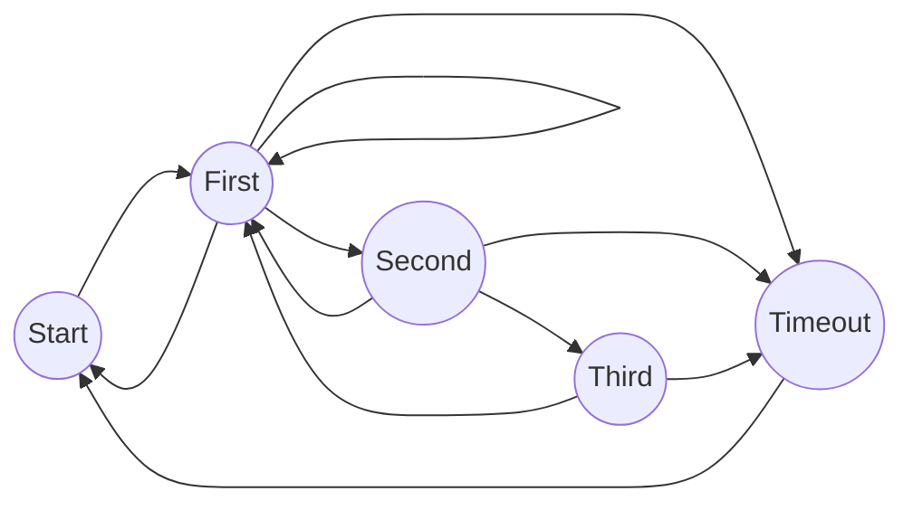

## 1. 背景介绍

### 1.1 什么是复杂事件处理（CEP）?

在当今快节奏的数据时代，企业和组织需要实时地从海量数据中提取有价值的信息，以做出快速、准确的决策。传统的批处理系统已经无法满足这种需求，实时流处理技术应运而生。复杂事件处理 (CEP) 作为实时流处理领域的一个重要分支，旨在帮助用户从无序、无限的数据流中识别出具有特定模式的事件，并对其进行分析和处理。

简单来说，CEP 就是在流数据中寻找特定的事件序列，这些事件序列可能代表着某种业务规则或模式。例如，在电商领域，我们可以使用 CEP 来检测用户在短时间内连续浏览了多个商品，并最终下单购买的行为模式，从而为用户推荐更精准的商品。

### 1.2 为什么选择 Flink CEP？

Apache Flink 是一个开源的分布式流处理和批处理框架，以其高吞吐量、低延迟和容错性而闻名。Flink CEP 是 Flink 提供的一个用于复杂事件处理的库，它构建在 Flink 流处理引擎之上，并提供了丰富的 API 和操作符，方便用户定义和执行 CEP 模式。

相比于其他 CEP 引擎，Flink CEP 具有以下优势：

* **高性能**: Flink CEP 基于 Flink 流处理引擎，可以处理高吞吐量的数据流。
* **低延迟**: Flink CEP 可以实现毫秒级的事件处理延迟。
* **容错性**: Flink CEP 支持数据一致性和容错机制，即使在发生故障的情况下也能保证数据处理的准确性。
* **易用性**: Flink CEP 提供了简单易用的 API，方便用户定义和执行 CEP 模式。
* **可扩展性**: Flink CEP 可以轻松地扩展到大型集群，以处理海量数据。


## 2. 核心概念与联系

### 2.1 事件 (Event)

事件是 CEP 中最基本的概念，代表着系统中发生的任何事情，例如用户点击、传感器数据、交易记录等。每个事件通常包含一个或多个属性，用于描述事件的特征。

### 2.2 模式 (Pattern)

模式是 CEP 的核心，用于描述用户想要从数据流中识别出的事件序列。模式由多个模式元素组成，每个模式元素代表一个事件，并可以通过条件语句来约束事件的属性。

### 2.3 模式匹配 (Pattern Matching)

模式匹配是 CEP 引擎的核心功能，用于将输入的事件流与定义的模式进行匹配，并输出匹配成功的事件序列。

### 2.4 时间语义 (Time Semantics)

在实时流处理中，时间是一个非常重要的概念。Flink CEP 支持多种时间语义，包括事件时间 (Event Time) 和处理时间 (Processing Time)，用户可以根据实际需求选择合适的时间语义。

### 2.5 状态管理 (State Management)

CEP 模式匹配通常需要维护一些状态信息，例如已经匹配到的事件序列、事件的时间窗口等。Flink CEP 提供了多种状态管理机制，方便用户管理和维护模式匹配的状态。

## 3. 核心算法原理具体操作步骤

Flink CEP 使用了基于 NFA（非确定性有限自动机）的算法来实现模式匹配。NFA 是一种状态机，它可以处于多个状态的叠加态，并根据输入的事件进行状态转移。

Flink CEP 的模式匹配过程可以分为以下几个步骤：

1. **模式编译**: 将用户定义的 CEP 模式编译成 NFA 状态机。
2. **事件处理**: 将输入的事件流逐个输入到 NFA 状态机中。
3. **状态转移**: NFA 状态机根据输入的事件进行状态转移，并记录当前的匹配状态。
4. **模式匹配**: 当 NFA 状态机到达最终状态时，表示匹配成功，输出匹配的事件序列。

## 4. 数学模型和公式详细讲解举例说明

Flink CEP 的 NFA 状态机可以使用数学模型来描述。假设我们有一个 CEP 模式，用于检测用户在 5 分钟内连续登录失败 3 次的行为：

```
Pattern<LoginEvent, ?> pattern = Pattern.<LoginEvent>begin("first")
        .where(event -> event.getEventType().equals(LoginEvent.EventType.LOGIN_FAILED))
        .next("second")
        .where(event -> event.getEventType().equals(LoginEvent.EventType.LOGIN_FAILED))
        .within(Time.minutes(5))
        .next("third")
        .where(event -> event.getEventType().equals(LoginEvent.EventType.LOGIN_FAILED))
        .within(Time.minutes(5));
```

该模式可以表示为以下 NFA 状态机：



其中：

* `S` 表示初始状态。
* `F` 表示匹配到一个 `LOGIN_FAILED` 事件的状态。
* `S2` 表示匹配到两个连续的 `LOGIN_FAILED` 事件的状态。
* `S3` 表示匹配到三个连续的 `LOGIN_FAILED` 事件的状态，即最终状态。
* `T` 表示超时状态，即在 5 分钟内没有匹配到下一个 `LOGIN_FAILED` 事件。

## 5. 项目实践：代码实例和详细解释说明

### 5.1  Maven 依赖

```xml
<dependency>
    <groupId>org.apache.flink</groupId>
    <artifactId>flink-cep_2.12</artifactId>
    <version>1.15.0</version>
</dependency>
```

### 5.2 代码实例

以下是一个使用 Flink CEP 检测用户连续登录失败的示例代码：

```java
import org.apache.flink.cep.CEP;
import org.apache.flink