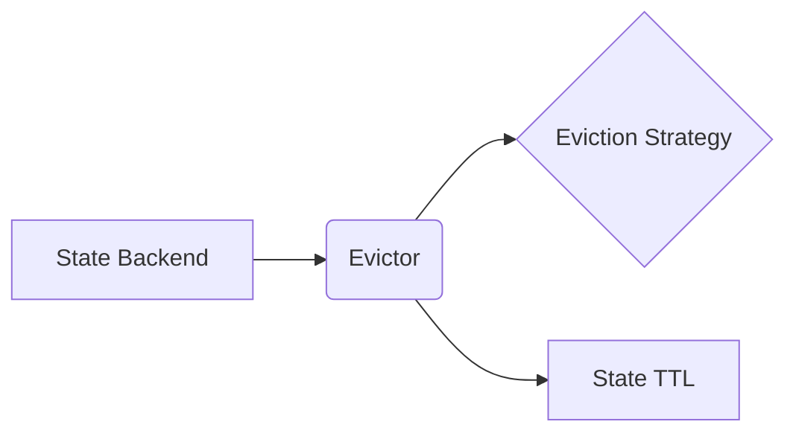

# Flink Evictor原理与代码实例讲解

作者：禅与计算机程序设计艺术

## 1. 背景介绍

### 1.1 什么是Flink？

Apache Flink是一个开源的分布式流处理和批处理框架。它提供高吞吐量、低延迟的实时数据处理能力，并支持事件时间语义、状态管理和容错机制。

### 1.2 为什么需要Evictor？

在Flink中，状态是实现复杂事件处理和增量计算的关键特性。然而，随着应用程序处理的数据量和状态大小的增加，存储和管理状态的成本也会随之增加。为了解决这个问题，Flink提供了状态管理机制，包括状态后  端（State Backends）和驱逐器（Evictors）。

Evictor是Flink状态管理机制的一部分，它负责在状态大小超过预设阈值时从内存中驱逐部分状态数据。这可以有效地控制状态的大小，防止内存溢出，并提高应用程序的稳定性和性能。

### 1.3 Evictor的优势

*   **降低内存占用:** 通过驱逐不常访问的状态数据，Evictor可以有效地降低Flink应用程序的内存占用，提高应用程序的稳定性和性能。
*   **提高状态访问性能:**  Evictor可以将经常访问的状态数据保留在内存中，从而提高状态访问性能。
*   **简化状态管理:**  Evictor提供了一种自动化的状态管理机制，可以简化开发人员的工作。

## 2. 核心概念与联系

### 2.1 状态后端（State Backends）

状态后端是Flink中负责存储和管理状态数据的组件。Flink提供了多种状态后端，包括：

*   **MemoryStateBackend:** 将状态数据存储在内存中，适用于状态数据量较小且对延迟要求较高的场景。
*   **FsStateBackend:** 将状态数据存储在文件系统中，适用于状态数据量较大且对持久化要求较高的场景。
*   **RocksDBStateBackend:** 将状态数据存储在RocksDB数据库中，适用于状态数据量非常大且对读写性能要求较高的场景。

### 2.2 状态生存时间（TTL）

状态生存时间（Time-to-Live，TTL）是指状态数据在被驱逐之前可以保留的最长时间。TTL可以根据应用程序的需求进行配置。

### 2.3 驱逐策略（Eviction Strategy）

驱逐策略是Evictor用于决定哪些状态数据需要被驱逐的算法。Flink提供了多种驱逐策略，包括：

*   **LRU（Least Recently Used）：**  驱逐最近最少使用的状态数据。
*   **LFU（Least Frequently Used）：**  驱逐访问频率最低的状态数据。

### 2.4 核心概念联系

下图展示了Flink中状态后端、状态生存时间、驱逐策略和Evictor之间的关系：



## 3. 核心算法原理具体操作步骤

### 3.1 LRU驱逐策略

LRU（Least Recently Used）驱逐策略是一种常用的缓存淘汰算法，它基于“最近使用的  数据更有可能在将来被使用”的假设，优先淘汰最近最少使用的  数据。

在Flink中，LRU驱逐策略的实现方式如下：

1.  **维护一个双向链表，用于存储所有状态数据。** 链表头节点存储最近最常访问的状态数据，链表尾节点存储最近最少访问的状态数据。
2.  **每次访问状态数据时，将对应的节点移动到链表头部。**
3.  **当状态大小超过预设阈值时，从链表尾部开始驱逐状态数据，直到状态大小低于阈值。**

### 3.2 LFU驱逐策略

LFU（Least Frequently Used）驱逐策略也是一种常用的缓存淘汰算法，它基于“访问频率高的  数据更有可能在将来被使用”的假设，优先淘汰访问频率最低的  数据。

在Flink中，LFU驱逐策略的实现方式如下：

1.  **维护一个哈希表和一个最小堆，哈希表用于存储状态数据和对应的访问频率，最小堆用于存储状态数据和对应的访问频率。**
2.  **每次访问状态数据时，更新哈希表中对应的访问频率，并在最小堆中更新对应节点的位置。**
3.  **当状态大小超过预设阈值时，从最小堆顶开始驱逐状态数据，直到状态大小低于阈值。**

## 4. 数学模型和公式详细讲解举例说明

### 4.1 LRU驱逐策略数学模型

LRU驱逐策略可以使用一个双向链表来实现，链表节点的数据结构如下：

```
class Node {
    Key key;
    Value value;
    Node prev;
    Node next;
}
```

其中，`key`表示状态数据的键，`value`表示状态数据的值，`prev`指向前一个节点，`next`指向后一个节点。

LRU驱逐策略的数学模型可以用以下公式表示：

```
C(t) = (C(t-1) + 1) * I(t = k) + C(t-1) * (1 - I(t = k))
```

其中，

*   $C(t)$ 表示在时刻 $t$ 时刻缓存中键 $k$ 对应的计数器值；
*   $I(t = k)$ 表示在时刻 $t$ 是否访问了键 $k$，如果是，则为 1，否则为 0。

### 4.2 LFU驱逐策略数学模型

LFU驱逐策略可以使用一个哈希表和一个最小堆来实现，哈希表用于存储状态数据和对应的访问频率，最小堆用于存储状态数据和对应的访问频率。

LFU驱逐策略的数学模型可以用以下公式表示：

```
f(k) = f(k) + 1
```

其中，

*   $f(k)$ 表示键 $k$ 的访问频率。

### 4.3 举例说明

假设有一个容量为 3 的缓存，初始为空。现在依次访问以下键：A、B、C、A、D、B。

#### 4.3.1 LRU驱逐策略

1.  访问 A，缓存状态为 `{A}`。
2.  访问 B，缓存状态为 `{B, A}`。
3.  访问 C，缓存状态为 `{C, B, A}`。
4.  访问 A，缓存状态为 `{A, C, B}`。
5.  访问 D，缓存已满，需要驱逐最近最少使用的键 B，缓存状态为 `{D, A, C}`。
6.  访问 B，缓存状态为 `{B, D, A}`。

#### 4.3.2 LFU驱逐策略

1.  访问 A，缓存状态为 `{(A, 1)}`。
2.  访问 B，缓存状态为 `{(A, 1), (B, 1)}`。
3.  访问 C，缓存状态为 `{(A, 1), (B, 1), (C, 1)}`。
4.  访问 A，缓存状态为 `{(A, 2), (B, 1), (C, 1)}`。
5.  访问 D，缓存已满，需要驱逐访问频率最低的键 C，缓存状态为 `{(A, 2), (B, 1), (D, 1)}`。
6.  访问 B，缓存状态为 `{(A, 2), (B, 2), (D, 1)}`。

## 5. 项目实践：代码实例和详细解释说明

### 5.1 创建一个Flink应用程序

首先，我们需要创建一个Flink应用程序。可以使用Maven或Gradle创建一个新的Flink项目。

### 5.2 定义状态

```java
public class WordCountExample {

    public static void main(String[] args) throws Exception {
        // 创建执行环境
        StreamExecutionEnvironment env = StreamExecutionEnvironment.getExecutionEnvironment();

        // 设置状态后端
        env.setStateBackend(new FsStateBackend("hdfs://namenode:9000/flink/checkpoints"));

        // 设置检查点
        env.enableCheckpointing(10000);

        // 创建数据流
        DataStream<String> text = env.fromElements("hello world", "hello flink");

        // 对数据流进行单词计数
        DataStream<Tuple2<String, Integer>> wordCounts = text
                .flatMap(new FlatMapFunction<String, Tuple2<String, Integer>>() {
                    @Override
                    public void flatMap(String value, Collector<Tuple2<String, Integer>> out) {
                        for (String word : value.split(" ")) {
                            out.collect(new Tuple2<>(word, 1));
                        }
                    }
                })
                .keyBy(0)
                .reduce(new ReduceFunction<Tuple2<String, Integer>>() {
                    @Override
                    public Tuple2<String, Integer> reduce(Tuple2<String, Integer> value1, Tuple2<String, Integer> value2) {
                        return new Tuple2<>(value1.f0, value1.f1 + value2.f1);
                    }
                });

        // 打印结果
        wordCounts.print();

        // 执行应用程序
        env.execute("WordCountExample");
    }
}
```

### 5.3 配置Evictor

```java
// 创建状态描述符
ValueStateDescriptor<Integer> descriptor = new ValueStateDescriptor<>(
    "count", // 状态名称
    Integer.class // 状态类型
);

// 设置状态生存时间（TTL）
descriptor.enableTimeToLive(StateTtlConfig
    .newBuilder(Time.seconds(10)) // 状态生存时间为 10 秒
    .setUpdateType(StateTtlConfig.UpdateType.OnCreateAndWrite) // 在状态创建和写入时更新 TTL
    .setStateVisibility(StateTtlConfig.StateVisibility.NeverReturnExpired) // 从不返回过期的状态
    .build()
);

// 创建状态
ValueState<Integer> state = operatorContext.getState(descriptor);
```

## 6. 实际应用场景

### 6.1 Session Windowing

在使用 Session Window 进行计算时，如果窗口数据量很大，可能会导致内存溢出。可以使用 Evictor 对窗口状态进行驱逐，以控制状态大小，防止内存溢出。

### 6.2 Fraud Detection

在进行欺诈检测时，需要实时监控用户的行为，并根据用户的历史行为判断当前行为是否异常。可以使用 Evictor 对用户的历史行为数据进行驱逐，以控制状态大小，提高应用程序的性能。

## 7. 工具和资源推荐

### 7.1 Flink官网

[https://flink.apache.org/](https://flink.apache.org/)

### 7.2 Flink中文社区

[https://flink.org.cn/](https://flink.org.cn/)

## 8. 总结：未来发展趋势与挑战

### 8.1 未来发展趋势

*   **更细粒度的状态管理:** 未来，Flink可能会提供更细粒度的状态管理机制，例如支持对不同状态进行不同的驱逐策略配置。
*   **更高效的驱逐策略:** 未来，Flink可能会引入更高效的驱逐策略，例如基于机器学习的驱逐策略。

### 8.2 挑战

*   **状态一致性:** 在使用 Evictor 进行状态驱逐时，需要保证状态的一致性。
*   **性能优化:**  Evictor 的性能会影响 Flink 应用程序的整体性能，需要对其进行优化。

## 9. 附录：常见问题与解答

### 9.1 如何选择合适的驱逐策略？

选择合适的驱逐策略取决于应用程序的具体需求。如果应用程序对状态访问的实时性要求较高，可以选择 LRU 驱逐策略。如果应用程序对状态访问的频率比较敏感，可以选择 LFU 驱逐策略。

### 9.2 如何配置 Evictor 的参数？

可以通过 `StateTtlConfig` 类来配置 Evictor 的参数，例如状态生存时间、更新类型和状态可见性等。

### 9.3 如何监控 Evictor 的状态？

可以通过 Flink 的 Web UI 或指标系统来监控 Evictor 的状态，例如驱逐的  数据量、驱逐的频率等。
