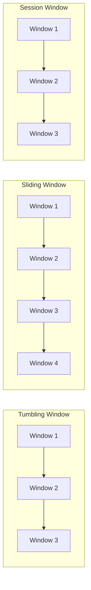

# Flink Window原理与代码实例讲解

作者：禅与计算机程序设计艺术

## 1. 背景介绍
### 1.1 实时数据处理的重要性
随着互联网、物联网和移动应用的快速发展,海量数据实时产生。对这些实时数据进行有效分析和处理,可以帮助企业快速洞察市场趋势、优化业务决策、提升用户体验。因此,实时数据处理引擎在现代大数据架构中扮演着至关重要的角色。

### 1.2 Apache Flink简介
Apache Flink是一个开源的分布式流处理和批处理框架。和其他流处理框架相比,Flink最大的特点是支持有状态的计算,可以保证exactly-once的一致性语义,并提供了丰富的时间概念和窗口操作。Flink以其低延迟、高吞吐、强大的容错能力和灵活的window API,成为实时数据处理领域的佼佼者。

### 1.3 Window概念的提出 
在无限的实时数据流中,我们经常需要统计一个时间段内的数据聚合结果,如过去1分钟的PV数、过去1小时的订单总金额等。这就需要把无限流切分成有限的数据片段,每个片段称为一个window。Window是流处理中的核心概念,让我们可以在无界数据流上进行有界的聚合计算。

## 2. 核心概念与联系
### 2.1 Time和Window
- **Time**: Flink支持三种时间语义:Processing time、Event time和Ingestion time。
  - Processing time: 数据被处理的本地系统时间
  - Event time: 数据本身携带的生成时间
  - Ingestion time: 数据进入Flink的时间
- **Window**: Window将一个无限流切割成有限大小的"buckets",我们可以在这些buckets上做计算操作。Window可以是时间驱动的(Time Window),也可以是数据驱动的(Count Window)。
### 2.2 Window类型
- Time Window
  - Tumbling Window(滚动窗口): 滚动窗口有固定的大小,且窗口之间不重叠。
  - Sliding Window(滑动窗口): 滑动窗口固定窗口大小,可以通过slide参数控制滑动步长,窗口之间可以重叠。 
  - Session Window(会话窗口): 会话窗口不重叠,且没有固定的开始和结束时间。当会话窗口在一段时间内没有接收到数据,窗口就会关闭。
- Count Window  
  - Tumbling Window(滚动窗口): 根据数据数量对无界数据流进行分段。
  - Sliding Window(滑动窗口): 根据数据数量定义窗口大小,类似于滑动窗口。

下图直观展示了Time Window的三种类型:


### 2.3 Window API
Flink提供了灵活的窗口操作API,主要包括:
- `window()`: 定义窗口的类型和大小
- `trigger()`: 定义窗口触发的条件
- `evictor()`: 定义窗口数据的剔除规则
- `allowedLateness()`: 允许数据延迟到达的最大时间
- `sideOutputLateData()`: 将迟到太多而被丢弃的数据发送到侧输出流
- `reduce()`,`aggregate()`,`process()`等: 定义窗口数据的计算逻辑

## 3. 核心算法原理和操作步骤
### 3.1 Window Operator内部原理
Window Operator接收的输入流包含原始数据(data element)和特殊事件(watermark)。内部核心算法可概括为:
1. 根据到达数据的时间戳,将数据分配到不同的window
2. 管理window的状态(window state),包括window开始和结束时间、window内的数据等 
3. 当watermark到达时,根据trigger策略判断是否触发window
4. 对触发的window,执行聚合计算,输出结果
5. 根据evitor策略,清理window中的状态数据

整个过程可以用下面的流程图表示:

```mermaid
graph TD
sourceOp(Source Operator) --> windowAssigner(WindowAssigner)
windowAssigner --> windowState((Window State))
sourceOp --watermark--> triggerPolicy{Trigger Policy}
triggerPolicy --fire-->|registered window| triggerAction[Fire Trigger]
windowState --> triggerAction
triggerAction --> aggregate[Aggregate Function]
aggregate --> windowState
aggregate --> sinkOp(Sink Operator)  
triggerAction --> evictorPolicy{Evictor Policy}
evictorPolicy --evict--> |state to remove| windowState
```

### 3.2 窗口分配器(Window Assigner)
Window Assigner根据时间或数据个数将element分配到对应的window。不同类型的window有不同的分配逻辑:
- 滚动窗口(Tumbling Window): 根据固定的窗口大小,把数据流等分成不重叠的窗口。
```
// 伪代码
long start = timestamp - (timestamp % size); 
long end = start + size;
return TimeWindow.of(start, end);
```
- 滑动窗口(Sliding Window): 通过窗口大小和滑动步长,生成可能重叠的窗口。一个元素可能属于多个窗口。
```
// 伪代码
long lastStart = timestamp - (timestamp % slide);
for (long start = lastStart; start >  timestamp - size; start -= slide) {
    windows.add(TimeWindow.of(start, start + size)); 
}
return windows;
```
- 会话窗口(Session Window): 通过session gap划分窗口,当某个窗口超过gap没有数据到达时,窗口关闭。
```
// 伪代码 
if (windowState.hasWindow() && windowState.window.maxTimestamp + sessionGap <= timestamp) {
    return windowState.window;
} else {
    return new TimeWindow(timestamp, timestamp);
}
```
- 计数窗口(Count Window): 类似滚动和滑动窗口,但根据数据个数划分窗口。

### 3.3 触发器(Trigger)
Trigger定义了window何时被触发själv聚合计算并输出结果。Flink内置几种常用的触发器:
- EventTimeTrigger: 基于事件时间,当watermark超过window结束时间时触发。
- ProcessingTimeTrigger: 基于处理时间定期触发。
- CountTrigger: 根据窗口内数据的数量触发。
- PurgingTrigger: 触发窗口计算,并将窗口状态数据清空。
- ContinuousEventTimeTrigger: 根据时间间隔连续触发窗口,形成类似滑动窗口的效果。

### 3.4 剔除器(Evictor) 
Evictor用于在触发计算前或后从window中移除元素。常用的有:
- CountEvictor: 保留指定数量的元素
- DeltaEvictor: 通过用户定义的DeltaFunction和threshold,移除两个元素之间距离小于threshold的元素。 
- TimeEvictor: 以事件时间或处理时间为基准,保留最近一段时间内的元素。

Evictor在某些需要保证窗口状态大小的场景中非常有用,如固定窗口中仅保留最新的N个元素。

## 4. 数学模型和公式详解
### 4.1 滚动窗口分配公式
对于大小为$size$的滚动窗口,给定元素的时间戳$timestamp$,其所属窗口的起止时间为:

$start = timestamp - (timestamp \bmod{} size)$

$end = start + size$

例如,每5分钟统计一次最近5分钟的数据,10:03分到达一个数据,其时间戳为1612504980000,则其窗口为:

$start = 1612504980000 - (1612504980000 \bmod{} 300000) = 1612504800000$

$end = 1612504800000 + 300000 = 1612505100000$

即[10:00, 10:05)这个窗口。

### 4.2 滑动窗口分配公式
对于大小为$size$,滑动步长为$slide$的滑动窗口,给定元素时间戳$timestamp$,其可能所属的窗口为:

$start_n = timestamp - (timestamp \bmod{} slide) - n*slide,\quad while\  start_n > timestamp - size$

$end_n = start_n + size$

### 4.3 Count Window
计数窗口根据数据数量划分窗口,类似于滚动和滑动窗口。其中:
- 滚动计数窗口大小为$size$,每$size$个元素生成一个窗口。
- 滑动计数窗口大小为$size$,滑动步长为$slide$,每$slide$个元素滑动一次,生成$size$个元素的窗口。

## 5. 代码实例讲解
下面通过具体代码示例演示Flink Window API的常见用法。

### 5.1 滚动窗口
```java
DataStream<Tuple2<String, Double>> stream = ...;
// 每30秒统计一次每个sensor的温度平均值 
DataStream<Tuple2<String, Double>> avgTemp = stream
    .keyBy(r -> r.f0) 
    .window(TumblingProcessingTimeWindows.of(Time.seconds(30)))
    .reduce((r1, r2) -> Tuple2.of(r1.f0, (r1.f1 + r2.f1) / 2));
```

### 5.2 滑动窗口
```java
DataStream<Integer> stream = ...;
// 每5秒计算过去1分钟的数据总和
DataStream<Integer> slidingSumStream = stream
    .windowAll(SlidingProcessingTimeWindows.of(Time.minutes(1), Time.seconds(5))) 
    .sum(0);
```

### 5.3 会话窗口
```java
DataStream<Tuple2<String, Long>> stream = ...;
// session gap为30分钟 
DataStream<Tuple2<String, Long>> sessionStream = stream
    .keyBy(r -> r.f0)
    .window(EventTimeSessionWindows.withGap(Time.minutes(30)))
    .reduce((r1, r2) -> Tuple2.of(r1.f0, Math.max(r1.f1, r2.f1)));  
```

### 5.4 Count Window
```java
DataStream<Tuple2<String, Long>> stream = ...;
DataStream<Tuple2<String, Long>> countWindowStream = stream
    .keyBy(r -> r.f0)
    .countWindow(100, 10)
    .aggregate(new AverageAggregate());

private static class AverageAggregate implements AggregateFunction<Tuple2<String, Long>, Tuple2<Long, Long>, Tuple2<String, Double>> {
    @Override
    public Tuple2<Long, Long> createAccumulator() {
        return new Tuple2<>(0L, 0L);
    }

    @Override
    public Tuple2<Long, Long> add(Tuple2<String, Long> value, Tuple2<Long, Long> accumulator) {
        return new Tuple2<>(accumulator.f0 + value.f1, accumulator.f1 + 1L);
    }

    @Override
    public Tuple2<String, Double> getResult(Tuple2<Long, Long> accumulator) {
        return new Tuple2<>("window avg", (double) accumulator.f0 / accumulator.f1);
    }

    @Override
    public Tuple2<Long, Long> merge(Tuple2<Long, Long> a, Tuple2<Long, Long> b) {
        return new Tuple2<>(a.f0 + b.f0, a.f1 + b.f1);
    }
}
```

### 5.5 自定义Trigger
```java
DataStream<String> stream = ...;
DataStream<String> lateStream = new DataStream<>(); 

DataStream<String> windowStream = stream
    .keyBy(r -> r.split(",")[0])
    .window(TumblingEventTimeWindows.of(Time.minutes(1)))
    .trigger(new OneMinuteTrigger())
    .allowedLateness(Time.seconds(30))
    .sideOutputLateData(lateStream)
    .reduce((r1, r2) -> r1 + "," + r2);

// 自定义触发器,当watermark超过window end - 1s时触发  
public static class OneMinuteTrigger extends Trigger<String, TimeWindow> {
    @Override
    public TriggerResult onElement(String element, long timestamp, TimeWindow window, TriggerContext ctx) throws Exception {
        if (window.maxTimestamp() <= ctx.getCurrentWatermark() + 1000) {
            return TriggerResult.FIRE;
        } else {
            ctx.registerEventTimeTimer(window.maxTimestamp() - 1000);
            return TriggerResult.CONTINUE;
        }
    }

    @Override
    public TriggerResult onEventTime(long time, TimeWindow window, TriggerContext ctx) {
        return time == window.maxTimestamp() - 1000 ? TriggerResult.FIRE : TriggerResult.CONTINUE;
    }

    @Override
    public TriggerResult onProcessingTime(long time, TimeWindow window, TriggerContext ctx) throws Exception {
        return TriggerResult.CONTINUE;
    }

    @Override
    public void clear(TimeWindow window, TriggerContext ctx) throws Exception {
        ctx.deleteEventTimeTimer(window.maxTimestamp()