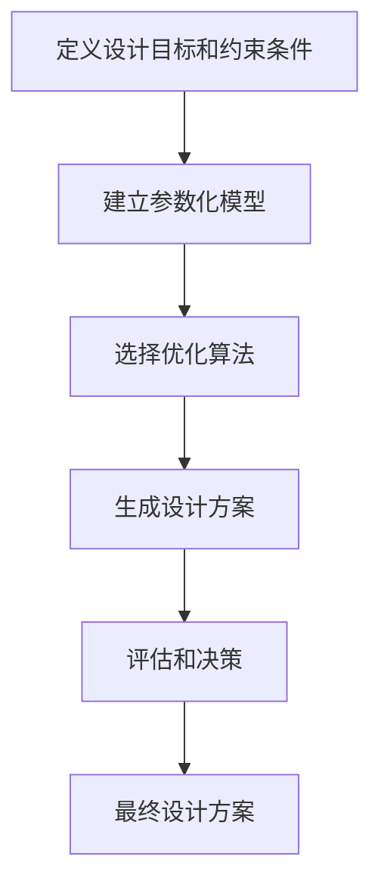
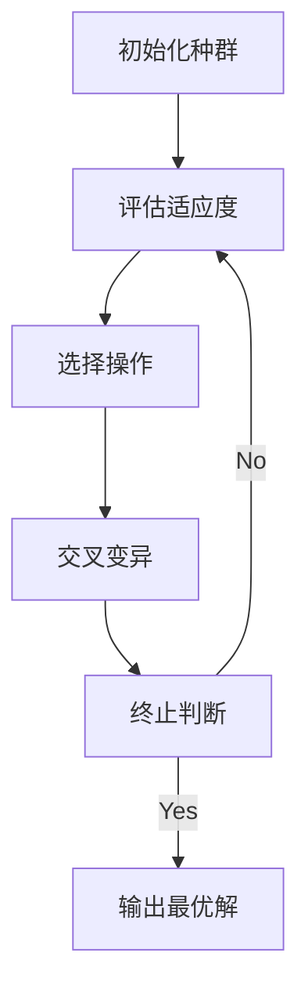
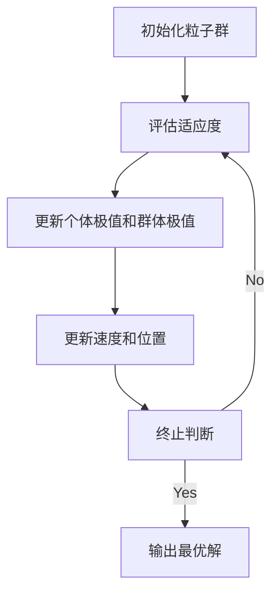
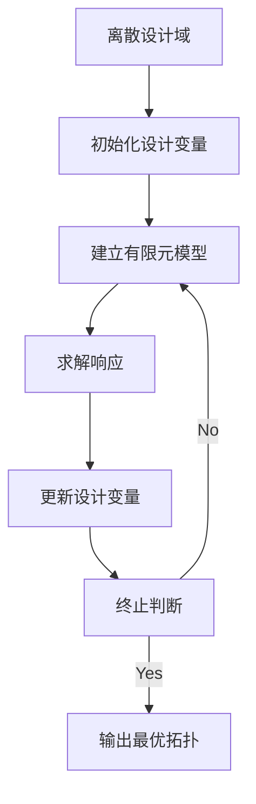

# Generative Design原理与代码实例讲解

## 1.背景介绍

### 1.1 什么是Generative Design?

Generative Design(生成式设计)是一种设计方法,利用计算机算法生成设计替代方案,而不是依赖传统的人工设计方式。它结合了人工智能、计算机辅助设计(CAD)、优化算法等多种技术,为设计师提供了一种新的设计思路和工具。

传统的设计过程往往是设计师根据需求和约束条件,通过经验和直觉不断试错,最终得到满意的设计方案。这种过程耗时耗力,且难以探索所有可能的设计空间。而Generative Design通过建模和编程,将设计目标、性能要求、材料限制等条件输入计算机,利用优化算法自动生成大量可行的设计方案,设计师可以从中选择最优方案。

### 1.2 Generative Design的优势

相比传统设计方式,Generative Design具有以下优势:

1. **探索设计空间**:通过算法可以快速生成数以万计的设计替代方案,充分探索设计空间,发现传统方法难以找到的创新设计。

2. **满足多重约束**:可以同时考虑结构强度、成本、制造工艺等多个约束条件,生成满足各种要求的最优化设计。

3. **提高设计效率**:减少了大量重复的人工试错过程,缩短了设计周期,提高了效率。

4. **增加设计灵活性**:随时可以调整优化目标和约束条件,快速生成新的设计方案。

5. **减轻设计人员负担**:算法自动生成设计方案,设计师只需进行评估和决策,降低了工作强度。

### 1.3 Generative Design的应用领域

Generative Design方法可以广泛应用于各个设计领域,如航空航天、汽车制造、建筑设计、产品设计等。其中,一些著名的应用案例包括:

- 空客A320飞机翼梁的拓扑优化设计
- 通用电气(GE)燃气轮机叶片的3D打印设计
- 宝马i8概念车的生物启发结构设计
- Autodesk的建筑结构优化设计
- Under Armour运动鞋的3D打印设计

## 2.核心概念与联系

### 2.1 Generative Design流程

Generative Design的核心流程包括以下几个步骤:

1. **定义设计目标和约束条件**
2. **建立参数化模型**  
3. **选择优化算法**
4. **生成设计方案**
5. **评估和决策**



其中,定义目标和约束是设计问题的起点,参数化模型则是将设计问题数学化的关键,优化算法的选择直接影响生成方案的质量和效率。最后通过评估分析,选择最优设计方案。

### 2.2 参数化建模

参数化建模是Generative Design的核心,是将设计问题转化为数学模型的过程。主要包括以下步骤:

1. **确定设计参数**:根据设计需求,确定影响设计的各种参数,如尺寸、形状、材料等。

2. **建立数学模型**:使用方程式或其他数学表达形式,描述设计参数与性能指标之间的关系。

3. **添加约束条件**:将各种约束条件(如强度、成本等)转化为数学约束,并加入模型。

4. **设置优化目标**:根据需求设置优化目标,如最小化重量、最大化强度等。

建立好参数化模型后,就可以输入到计算机中,由优化算法自动搜索满足约束条件的最优解。

### 2.3 优化算法

优化算法是Generative Design的"大脑",决定了生成设计方案的质量和效率。常用的优化算法包括:

- 遗传算法(Genetic Algorithms)
- 粒子群优化(Particle Swarm Optimization) 
- 蚁群算法(Ant Colony Optimization)
- 模拟退火(Simulated Annealing)
- 拓扑优化(Topology Optimization)

不同算法适用于不同类型的优化问题,需要根据具体情况选择合适的算法。此外,算法的参数设置也对性能有重大影响。

### 2.4 人机协作

尽管Generative Design可以自动生成设计方案,但人机协作仍然是关键。设计师在以下几个环节发挥重要作用:

1. **定义目标和约束**:设计师需要清晰地表达设计需求和限制条件。

2. **构建参数模型**:设计师的专业知识和经验对建模至关重要。

3. **评估和决策**:算法生成的是可选方案,最终决策仍需设计师判断。

4. **反馈优化**:设计师可以根据评估结果,调整目标和约束,重新生成方案。

人机协作可以发挥人的创造力和算法的计算能力,实现最优设计。

## 3.核心算法原理具体操作步骤

### 3.1 遗传算法(Genetic Algorithms)

遗传算法是Generative Design中最常用的一种启发式优化算法,模拟生物进化过程,用于解决高维、非线性、多约束的复杂优化问题。其核心思想是:

1. 初始化一组可行解(个体)的种群
2. 评估每个个体的适应度(目标函数值) 
3. 根据适应度选择优秀个体
4. 通过交叉和变异产生新一代种群
5. 重复2-4步骤,直到满足停止条件



遗传算法的核心操作包括:

1. **编码**:将解空间中的个体用某种数据结构编码,通常使用二进制串或实数向量。

2. **交叉**:模拟生物的交叉过程,从两个父代个体产生新的子代个体。

3. **变异**:引入少量随机扰动,增加种群多样性,防止陷入局部最优。

4. **选择**:根据适应度大小,选择优秀个体传递到下一代。

算法的性能很大程度上取决于编码方式、交叉变异操作和选择策略的设计。

#### 3.1.1 编码设计

设计变量通常包括尺寸、形状参数等,可以使用二进制串或实数向量进行编码。以二进制编码为例:

```python
# 形状编码
shape_code = '10110011'  

# 尺寸编码 
size_code = [0.32, 1.07, 2.14]
```

#### 3.1.2 适应度函数

适应度函数用于评估个体的优劣,是遗传算法的核心部分。以最小化重量为例:

$$
\begin{align}
\min\quad & f(x) = \text{weight}(x) \\
\text{s.t.}\quad & g_i(x) \leq 0,\quad i=1,2,...,m\\
               & h_j(x) = 0,\quad j=1,2,...,p
\end{align}
$$

其中$x$为设计变量, $g_i(x)$和$h_j(x)$分别为不等式和等式约束条件。

对于违反约束的不可行解,可以采用惩罚函数法处理:

$$
\Phi(x)=f(x)+\sum_{i=1}^{m}r_i\max\{0,g_i(x)\}+\sum_{j=1}^{p}s_j|h_j(x)|
$$

其中$r_i$和$s_j$为惩罚系数。

#### 3.1.3 选择、交叉和变异

**选择操作**通常采用轮盘赌选择、锦标赛选择等策略,按一定概率选择适应度高的个体。

**交叉操作**对于二进制编码,可采用部分映射交叉、顺序交叉等;对于实数编码,可采用算术交叉、模拟二进制交叉等。

**变异操作**对于二进制编码,可以按一定概率反转某个基因;对于实数编码,可在一定范围内添加随机扰动。

以上步骤重复迭代,直到满足终止条件(如达到最大代数或目标值),输出最优解。

### 3.2 粒子群优化(Particle Swarm Optimization)

粒子群优化(PSO)是另一种常用的启发式优化算法,模拟鸟群觅食行为,具有简单、易于实现的特点。算法流程如下:

1. 初始化一组粒子(潜在解)的位置和速度
2. 评估每个粒子的适应度值
3. 更新每个粒子的历史最佳位置和全局最佳位置
4. 根据速度更新公式,计算粒子新的速度和位置
5. 重复2-4步骤,直到满足停止条件



粒子在解空间的运动受个体最优位置和群体最优位置的引导,速度更新公式如下:

$$
\begin{align}
v_i^{k+1} &= w v_i^k + c_1r_1(p_i^k - x_i^k) + c_2r_2(p_g^k - x_i^k)\\
x_i^{k+1} &= x_i^k + v_i^{k+1}
\end{align}
$$

其中:

- $v_i^k$是粒子$i$在当前迭代的速度
- $x_i^k$是粒子$i$在当前迭代的位置 
- $p_i^k$是粒子$i$搜索到的历史最佳位置
- $p_g^k$是全部粒子中的当前全局最优位置
- $w$是惯性权重, $c_1$和$c_2$是加速常数
- $r_1$和$r_2$是[0,1]区间内的随机数

算法的性能很大程度取决于惯性权重、加速常数和终止条件的设置。

### 3.3 拓扑优化(Topology Optimization)

拓扑优化是一种应用广泛的结构优化方法,用于确定给定设计域内的最优材料分布,以实现最大刚度或最小重量等目标。算法流程如下:

1. 离散化设计域,将其划分为有限个单元
2. 将单元的相对密度作为设计变量,初始化为某个值
3. 建立有限元模型,求解每个单元的应力、应变等响应
4. 根据目标函数和约束条件,更新每个单元的相对密度
5. 重复3-4步骤,直到满足收敛条件



在此过程中,需要对目标函数和约束条件进行敏感性分析,得到设计变量的灵敏度信息,并按照优化准则(如最大刚度或最小合成)更新设计变量。

拓扑优化的数学模型可以表示为:

$$
\begin{align}
\min\quad & f(x) \\
\text{s.t.}\quad & g_i(x) \leq 0,\quad i=1,2,...,m\\
               & x_\text{min} \leq x \leq x_\text{max}
\end{align}
$$

其中$x$为相对密度设计变量向量, $g_i(x)$为约束条件,如体积约束、应力约束等。

拓扑优化广泛应用于航空航天、汽车制造等行业,用于获得轻量化且满足强度要求的结构设计。

## 4.数学模型和公式详细讲解举例说明

在Generative Design中,数学模型和公式扮演着十分重要的角色,是将设计问题数字化和量化的基础。本节将详细介绍一些常见的