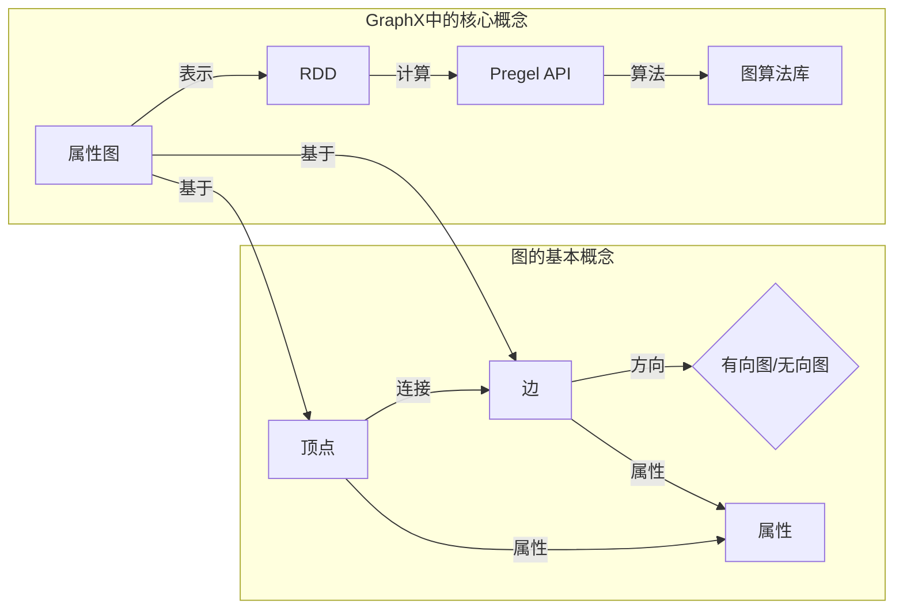
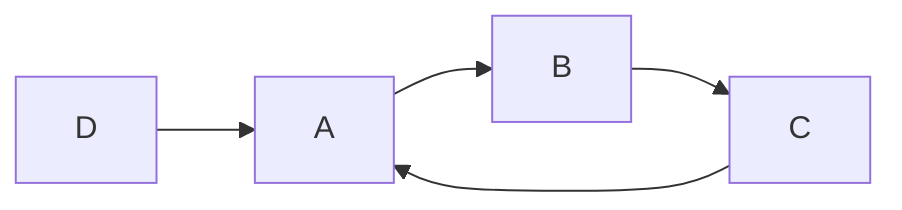

## 1. 背景介绍

### 1.1  大数据时代与图计算

步入大数据时代，海量数据的处理和分析成为各行各业的迫切需求。传统的数据库管理系统在处理复杂关联关系时显得力不从心，而图数据库应运而生。图数据库以图论为基础，通过节点和边来表示数据之间的关系，能够高效地存储和查询大规模图数据，为社交网络分析、推荐系统、金融风险控制等领域提供了强大的技术支持。

### 1.2  GraphX：Spark生态系统中的图计算引擎

GraphX是Spark生态系统中专门用于图计算的组件，它将图论和分布式计算相结合，能够高效地处理大规模图数据。GraphX构建在Spark RDD之上，充分利用了Spark的内存计算、容错机制和分布式存储等优势，为用户提供了简洁易用的API，方便进行图的构建、转换和分析。

### 1.3  GraphX的优势

- **高效性:** GraphX基于Spark平台，能够充分利用Spark的分布式计算能力，高效地处理大规模图数据。
- **易用性:** GraphX提供了丰富的API，用户可以使用Scala、Java或Python语言编写图算法。
- **灵活性:** GraphX支持多种图算法，用户可以根据实际需求选择合适的算法。
- **可扩展性:** GraphX可以运行在各种规模的集群上，并且可以与Spark的其他组件无缝集成。

## 2.  核心概念与联系

### 2.1  图的基本概念

- **顶点(Vertex):** 图的基本单元，代表现实世界中的实体，例如用户、商品、地点等。
- **边(Edge):** 连接两个顶点的线段，代表实体之间的关系，例如朋友关系、交易关系、地理位置关系等。
- **有向图(Directed Graph):** 边具有方向的图，例如社交网络中的关注关系。
- **无向图(Undirected Graph):** 边没有方向的图，例如社交网络中的好友关系。
- **属性(Property):** 顶点和边可以携带属性，用于描述实体或关系的特征，例如用户的年龄、性别、商品的价格、交易的时间等。

### 2.2  GraphX中的核心概念

- **属性图(Property Graph):** GraphX支持属性图，用户可以在顶点和边上存储任意类型的属性。
- **图的表示:** GraphX使用RDD来表示图，其中顶点和边分别存储在不同的RDD中。
- **Pregel API:** GraphX提供Pregel API，用户可以使用类似于消息传递的方式编写迭代式图算法。
- **图算法库:** GraphX提供丰富的图算法库，例如PageRank、连通图、三角计数等。

### 2.3  核心概念之间的联系

下图展示了GraphX中核心概念之间的联系：



## 3.  核心算法原理具体操作步骤

### 3.1 PageRank算法

#### 3.1.1 算法原理

PageRank算法是一种用于评估网页重要性的算法，其基本思想是：一个网页的重要性由链接到它的其他网页的重要性决定。PageRank算法假设用户在浏览网页时，会随机点击网页上的链接，并有一定的概率跳转到其他网页。

#### 3.1.2 操作步骤

1. 初始化所有网页的PageRank值，通常设置为1/N，其中N为网页总数。
2. 迭代计算每个网页的PageRank值，直到收敛为止。
    - 对于每个网页，计算链接到它的所有网页的PageRank值的加权和，其中权重为链接网页的PageRank值除以链接网页的出度（链接网页指向其他网页的数量）。
    - 将计算得到的加权和乘以阻尼系数（damping factor），再加上(1-阻尼系数)/N，得到该网页新的PageRank值。
3. 输出所有网页的PageRank值。

#### 3.1.3 代码实例

```scala
// 创建一个属性图
val graph = GraphLoader.edgeListFile(sc, "data/web-Google.txt")

// 运行PageRank算法
val ranks = graph.pageRank(0.0001).vertices

// 打印结果
ranks.collect().foreach(println)
```

### 3.2 连通图算法

#### 3.2.1 算法原理

连通图算法用于寻找图中所有相互连接的顶点集合，即连通分量。连通图算法的基本思想是：从图中的任意一个顶点开始，递归地访问与其相邻的所有顶点，直到所有可达的顶点都被访问为止。

#### 3.2.2 操作步骤

1. 初始化所有顶点的连通分量ID，初始值为顶点ID。
2. 迭代更新所有顶点的连通分量ID，直到所有顶点的连通分量ID不再变化为止。
    - 对于每条边，将边的两个顶点的连通分量ID设置为较小的ID。
3. 输出所有顶点的连通分量ID。

#### 3.2.3 代码实例

```scala
// 创建一个属性图
val graph = GraphLoader.edgeListFile(sc, "data/followers.txt")

// 运行连通图算法
val cc = graph.connectedComponents().vertices

// 打印结果
cc.collect().foreach(println)
```

### 3.3 三角计数算法

#### 3.3.1 算法原理

三角计数算法用于统计图中所有三角形的数量，三角形是由三个顶点和三条边组成的闭合路径。三角计数算法可以用于衡量图的聚集程度，例如社交网络中的社区结构。

#### 3.3.2 操作步骤

1. 对于图中的每个顶点，找到其所有邻居节点。
2. 对于每个顶点，统计其邻居节点之间存在的边的数量，即三角形的数量。
3. 将所有顶点的三角形数量加起来，得到图中三角形的总数。

#### 3.3.3 代码实例

```scala
// 创建一个属性图
val graph = GraphLoader.edgeListFile(sc, "data/followers.txt")

// 运行三角计数算法
val triangleCount = graph.triangleCount().vertices

// 打印结果
triangleCount.collect().foreach(println)
```


## 4. 数学模型和公式详细讲解举例说明

### 4.1 PageRank算法的数学模型

PageRank算法的数学模型可以表示为以下迭代公式：

$$
PR(A) = (1-d)/N + d \sum_{i=1}^{n} \frac{PR(T_i)}{C(T_i)}
$$

其中：

- $PR(A)$ 表示网页 A 的 PageRank 值。
- $d$ 表示阻尼系数，通常设置为 0.85。
- $N$ 表示网页总数。
- $T_i$ 表示链接到网页 A 的网页。
- $C(T_i)$ 表示网页 $T_i$ 的出度，即链接到其他网页的数量。

### 4.2  举例说明

假设有 A、B、C、D 四个网页，其链接关系如下图所示：



初始时，所有网页的 PageRank 值均为 1/4。

第一次迭代：

- $PR(A) = (1-0.85)/4 + 0.85 * (PR(C)/1 + PR(D)/1) = 0.2875$
- $PR(B) = (1-0.85)/4 + 0.85 * (PR(A)/1) = 0.25625$
- $PR(C) = (1-0.85)/4 + 0.85 * (PR(B)/1) = 0.2296875$
- $PR(D) = (1-0.85)/4 + 0.85 * 0 = 0.0375$

第二次迭代：

- $PR(A) = (1-0.85)/4 + 0.85 * (0.2296875/1 + 0.0375/1) = 0.252109375$
- $PR(B) = (1-0.85)/4 + 0.85 * (0.2875/1) = 0.2765625$
- $PR(C) = (1-0.85)/4 + 0.85 * (0.2765625/1) = 0.245078125$
- $PR(D) = (1-0.85)/4 + 0.85 * 0 = 0.0375$

以此类推，经过多次迭代后，所有网页的 PageRank 值将趋于稳定。


## 5. 项目实践：代码实例和详细解释说明

### 5.1  社交网络分析

#### 5.1.1 项目背景

社交网络分析是图计算的一个重要应用场景，例如，我们可以使用GraphX来分析社交网络中的用户关系，识别重要的用户和社区结构。

#### 5.1.2 代码实例

```scala
import org.apache.spark.SparkContext
import org.apache.spark.SparkConf
import org.apache.spark.graphx._

object SocialNetworkAnalysis {
  def main(args: Array[String]): Unit = {
    // 创建 SparkConf 对象
    val conf = new SparkConf().setAppName("SocialNetworkAnalysis").setMaster("local[*]")

    // 创建 SparkContext 对象
    val sc = new SparkContext(conf)

    // 加载社交网络数据
    val socialNetwork = GraphLoader.edgeListFile(sc, "data/social_network.txt")

    // 计算每个用户的度
    val degrees = socialNetwork.degrees

    // 打印度最高的10个用户
    println("Top 10 users with highest degrees:")
    degrees.top(10)(Ordering[Int].on(_._2)).foreach(println)

    // 运行 Louvain 社区发现算法
    val louvain = socialNetwork.connectedComponents()

    // 打印每个社区的用户数量
    println("Number of users in each community:")
    louvain.vertices.map { case (vid, communityId) => (communityId, 1) }
      .reduceByKey(_ + _)
      .foreach(println)

    // 停止 SparkContext
    sc.stop()
  }
}
```

#### 5.1.3 代码解释

- 首先，我们使用 `GraphLoader.edgeListFile()` 方法加载社交网络数据，该方法会返回一个 `Graph` 对象。
- 然后，我们使用 `degrees` 方法计算每个用户的度，即与该用户相连的边的数量。
- 接着，我们使用 `top()` 方法找到度最高的 10 个用户，并打印出来。
- 接下来，我们使用 `connectedComponents()` 方法运行 Louvain 社区发现算法，该算法会将图分成若干个社区，每个社区内的用户之间联系紧密，而社区之间的联系稀疏。
- 最后，我们统计每个社区的用户数量，并打印出来。

### 5.2  推荐系统

#### 5.2.1 项目背景

推荐系统是另一个重要的图计算应用场景，例如，我们可以使用GraphX来构建基于图的协同过滤推荐系统，根据用户之间的关系和用户对物品的评分来推荐用户可能感兴趣的物品。

#### 5.2.2 代码实例

```scala
import org.apache.spark.SparkContext
import org.apache.spark.SparkConf
import org.apache.spark.graphx._
import org.apache.spark.rdd.RDD

object RecommendationSystem {
  def main(args: Array[String]): Unit = {
    // 创建 SparkConf 对象
    val conf = new SparkConf().setAppName("RecommendationSystem").setMaster("local[*]")

    // 创建 SparkContext 对象
    val sc = new SparkContext(conf)

    // 加载用户评分数据
    val ratings = sc.textFile("data/ratings.txt")
      .map { line =>
        val fields = line.split(",")
        (fields(0).toInt, fields(1).toInt, fields(2).toDouble)
      }

    // 创建用户物品二部图
    val users = ratings.map(_._1).distinct()
    val products = ratings.map(_._2).distinct()
    val edges = ratings.map { case (userId, productId, rating) => Edge(userId.toLong, productId.toLong, rating) }
    val graph = Graph(users.union(products), edges)

    // 计算每个用户的平均评分
    val userAvgRatings = ratings.map { case (userId, productId, rating) => (userId, rating) }
      .aggregateByKey((0.0, 0), (acc, rating) => (acc._1 + rating, acc._2 + 1), (acc1, acc2) => (acc1._1 + acc2._1, acc1._2 + acc2._2))
      .map { case (userId, (sum, count)) => (userId, sum / count) }

    // 预测用户对未评分物品的评分
    val predictions = graph.aggregateMessages[(Double, Int)](
      // 发送消息：将用户的平均评分发送给所有未评分的物品
      triplet => {
        if (triplet.srcAttr != null && triplet.dstAttr == null) {
          triplet.sendToDst((triplet.srcAttr.asInstanceOf[Double], 1))
        }
      },
      // 合并消息：计算所有收到消息的物品的平均评分
      (a, b) => (a._1 + b._1, a._2 + b._2)
    )
      .map { case (productId, (sum, count)) => (productId, sum / count) }

    // 打印预测结果
    println("Predicted ratings:")
    predictions.foreach(println)

    // 停止 SparkContext
    sc.stop()
  }
}
```

#### 5.2.3 代码解释

- 首先，我们加载用户评分数据，并将数据转换成 `(userId, productId, rating)` 的格式。
- 然后，我们根据用户评分数据创建用户物品二部图，其中用户和物品是图的顶点，评分是边的权重。
- 接着，我们计算每个用户的平均评分，用于预测用户对未评分物品的评分。
- 最后，我们使用 `aggregateMessages()` 方法预测用户对未评分物品的评分，该方法会将用户的平均评分发送给所有未评分的物品，并计算所有收到消息的物品的平均评分。


## 6. 工具和资源推荐

### 6.1  Spark GraphX官方文档

Spark GraphX官方文档提供了详细的API文档、示例代码和使用指南，是学习GraphX的首选资源。

- 地址：https://spark.apache.org/docs/latest/graphx-programming-guide.html

### 6.2  GraphFrames

GraphFrames是Spark SQL的一个扩展，它提供了DataFrame风格的API来操作图数据，可以与Spark SQL的其他组件无缝集成。

- 地址：https://graphframes.github.io/graphframes/docs/_site/index.html

### 6.3  Neo4j

Neo4j是一个开源的图数据库，它提供了高效的图数据存储和查询功能，可以用于构建各种图应用。

- 地址：https://neo4j.com/

## 7. 总结：未来发展趋势与挑战

### 7.1  未来发展趋势

- **图神经网络(GNN):** GNN是一种新兴的机器学习方法，它能够学习图数据的特征表示，在节点分类、链接预测等任务上取得了显著的效果。
- **图数据库:** 图数据库将成为主流的数据管理系统之一，用于存储和查询大规模图数据。
- **图计算与人工智能的融合:** 图计算将与人工智能技术深度融合，例如，使用图计算来加速机器学习算法的训练和推理。

### 7.2  挑战

- **图数据的规模和复杂性:** 随着互联网和物联网的快速发展，图数据的规模和复杂性不断增加，对图计算系统提出了更高的要求。
- **图算法的效率和可扩展性:** 图算法的效率和可扩展性是图计算面临的重大挑战，需要不断优化算法和系统架构。
- **图计算的易用性:** 图计算技术门槛较高，需要降低使用门槛，让更多的人能够使用图计算技术。

## 8. 附录：常见问题与解答

### 8.1  GraphX和GraphFrames有什么区别？

GraphX是Spark Core的一部分，而GraphFrames是Spark SQL的一个扩展。GraphX提供了底层的API来操作图数据，而GraphFrames提供了DataFrame风格的API，更易于使用。

### 8.2  如何选择合适的图计算框架？

选择合适的图计算框架需要考虑以下因素：

- 数据规模和复杂性
- 算法需求
- 开发语言和生态系统
- 集群规模和性能要求

### 8.3  如何学习图计算？

学习图计算可以参考以下资源：

- Spark GraphX官方文档
- GraphFrames官方文档
- 图论教材
- 在线课程和教程

### 8.4 如何处理大规模图数据？

处理大规模