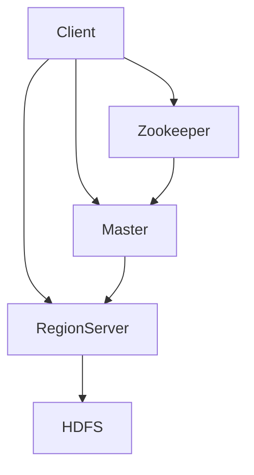

# HBase原理与代码实例讲解

作者：禅与计算机程序设计艺术

## 1. 背景介绍

### 1.1 大数据时代的数据存储挑战
随着互联网、物联网、人工智能等技术的快速发展,数据呈现爆炸式增长。传统的关系型数据库已经无法满足海量数据存储和实时处理的需求。NoSQL数据库应运而生,其中HBase作为一种高性能、可伸缩、分布式的NoSQL数据库,在大数据领域得到广泛应用。

### 1.2 HBase的诞生与发展历程
HBase起源于Google的BigTable论文,由Apache软件基金会于2008年发起,成为Hadoop生态系统中的重要组成部分。HBase建立在HDFS之上,利用Hadoop的分布式计算能力,实现了高吞吐量的随机读写。经过十多年的发展,HBase已经成为业界主流的NoSQL数据库之一。

### 1.3 HBase在行业中的应用现状
HBase凭借其优秀的性能和可伸缩性,在众多领域得到广泛应用,如社交网络、电商、金融、物联网等。典型的应用场景包括:
- Facebook的消息存储
- 淘宝的商品、交易数据存储  
- 华为的实时计费系统
- 小米的OLAP分析平台

通过这些成功案例,我们可以看到HBase在支撑企业级应用中的重要地位。

## 2. 核心概念与联系

### 2.1 HBase的数据模型

#### 2.1.1 Table、Row、Column Family、Column、Cell
HBase采用了类似Google BigTable的数据模型,主要由以下几个核心概念组成:
- Table(表):HBase中数据的组织单元,包含多个Row。
- Row(行):表中的一条记录,由Row Key唯一标识。  
- Column Family(列族):一个Row中存储的数据按列族组织,每个列族可包含多个Column。
- Column(列):归属于某个列族下的数据列。
- Cell:行、列族、列三者交叉形成的数据单元。

#### 2.1.2 Row Key与数据存储
HBase通过Row Key对表中的行进行唯一标识和快速定位。Row Key是字节数组,支持多种数据类型。表中的数据按照Row Key的字典序存储,为Row Key的设计提供了很大的灵活性,也对查询性能有重要影响。

#### 2.1.3 时间戳与版本
每个Cell都关联一个时间戳,默认为数据写入时的系统时间。时间戳用于支持多版本,可以对同一个Cell存储多个版本的数据。用户可以指定版本数,超出版本数的旧数据会被自动淘汰。

### 2.2 HBase的架构设计

#### 2.2.1 Client、Zookeeper、Master、RegionServer 
HBase采用了主从式架构,主要由以下几个部分组成:
- Client:包含访问HBase的API,与HBase集群交互。
- Zookeeper:分布式协调服务,用于管理HBase集群。
- Master:HBase集群的管理节点,负责Table和Region的管理。
- RegionServer:HBase集群的工作节点,负责存储HBase的数据。

#### 2.2.2 Region分配与负载均衡
HBase引入Region的概念,将一个大表横向切分成多个Region,分散在不同的RegionServer上,以实现负载均衡。Region按照Row Key范围分配,当Region增大到一定程度后会触发切分。Master负责将Region动态分配给不同的RegionServer,以均衡负载。

#### 2.2.3 WAL与数据持久化
HBase使用Write Ahead Log(预写式日志)保证数据的持久性。所有的数据写入都会先写WAL,再写MemStore,最后刷新到HFile。WAL和MemStore都位于内存中,HFile位于HDFS上。通过WAL机制,即使RegionServer宕机,也可以从WAL中恢复数据,保证数据不丢失。

下面是HBase架构的示意图:

### 2.3 HBase与其他大数据组件的关系

#### 2.3.1 HBase与HDFS
HBase构建在HDFS之上,利用HDFS提供的分布式存储能力,将HFile存储在HDFS上。同时,HBase也继承了HDFS的高可用、高扩展、数据容错等特性。但与HDFS不同,HBase提供了低延迟的随机读写,更适合实时数据访问。

#### 2.3.2 HBase与MapReduce
HBase可以与MapReduce无缝集成,支持MR直接从HBase表中读取数据,也可以将MR计算结果写回HBase。这使得HBase不仅是一个数据库,也可以作为一种数据源,方便进行数据分析和挖掘。

#### 2.3.3 HBase与Hive 
Hive作为一种数据仓库工具,可以将结构化数据文件映射为一张数据库表,并提供类SQL查询功能。Hive支持将HBase表映射为外部表,借助MR进行查询,将HBase用于数据分析的OLAP场景。

#### 2.3.4 HBase与Spark
Spark作为新兴的大数据分析引擎,凭借其内存计算和DAG执行引擎,在数据分析领域得到广泛应用。Spark提供了多种数据源API,可以从HBase中读取数据进行分析,也可以将分析结果写回HBase。Spark On HBase利用两者的优势,实现了交互式查询、机器学习等高级分析功能。

## 3. 核心算法原理与操作

### 3.1 读写数据流程

#### 3.1.1 写入数据的步骤
1. Client向HRegionServer发起写请求。
2. HRegionServer将数据写入WAL。
3. HRegionServer将数据写入MemStore。
4. 当MemStore达到阈值,触发flush操作。
5. 将MemStore中的数据flush到HFile。

#### 3.1.2 读取数据的步骤  
1. Client向HRegionServer发起读请求。
2. 检查Block Cache,如果命中则直接返回。
3. 检查MemStore,如果命中则返回。
4. 到HFile中读取所需要的Block。
5. 将读到的Block加载到Block Cache。
6. 解析Block,组装数据返回给Client。

### 3.2 MemStore与flush

#### 3.2.1 MemStore的作用
MemStore是Region级别的内存写缓存,用于存储尚未持久化到硬盘的数据。写入的数据会先保存在MemStore中,再通过flush写到HFile中。MemStore的引入主要有两个目的:
1. 提高写入性能,先写内存,再批量刷写到磁盘。 
2. 数据在内存中累积到一定量再持久化,减少磁盘I/O。

#### 3.2.2 MemStore的flush机制
每个Region都有一个MemStore,当MemStore的大小达到一定阈值后,会触发flush操作,将数据持久化到HFile中。flush的主要过程如下:
1. 对MemStore按照Row Key排序。
2. 遍历排序后的数据,按照Column Family分别写入对应的HFile。
3. flush结束后,清空MemStore,等待下一次写入。  

HBase会定期自动触发flush,用户也可以手动执行flush。适当调整flush的阈值和频率,对写入性能有重要影响。

### 3.3 LSM树与数据合并

#### 3.3.1 LSM树的基本原理
HBase的存储设计受到Log Structured Merge Tree(日志结构合并树)的启发。LSM树由一个内存索引结构和多个磁盘索引结构组成,数据写入时先写内存,再定期批量写入磁盘,磁盘中的数据定期进行合并。LSM树的原理与HBase的MemStore+HFile设计非常相似。

#### 3.3.2 HFile的合并机制
随着flush次数增多,HFile的数量会越来越多,为了避免小文件问题,HBase需要定期对HFile进行合并。主要有两种合并方式:
1. Minor Compaction:选取一些小的、相邻的HFile合并成一个更大的HFile。
2. Major Compaction:将所有的HFile合并成一个HFile,并删除过期和删除的数据。

通过Compaction机制,HBase能够保持较好的读写性能,同时有效控制HFile的数量和大小。

### 3.4 RegionServer容错与故障恢复

#### 3.4.1 WAL的作用
预写式日志WAL记录了所有的写操作,当RegionServer发生宕机时,可以通过WAL恢复数据,避免数据丢失。每个RegionServer都有一个独立的WAL,写入数据时会同步写入WAL,保证了数据的可靠性。

#### 3.4.2 RegionServer故障检测
HBase通过Zookeeper来监控RegionServer的状态。每个RegionServer都会在Zookeeper上注册一个临时节点,定期发送心跳。如果一段时间内没有收到RegionServer的心跳,Zookeeper会自动删除临时节点,Master就会认为该RegionServer已经宕机。

#### 3.4.3 故障恢复流程
当Master检测到某个RegionServer宕机后,会自动进行故障恢复,主要步骤如下:  
1. 将宕机RegionServer上的Region分配给其他活跃的RegionServer。
2. 读取宕机RegionServer的WAL,重放其中的写操作,恢复数据。
3. 使用Zookeeper通知Client RegionServer的变更。

HBase的自动故障恢复能力保证了集群的高可用性,最大限度减少了故障带来的影响。

## 4. 数学模型与公式

### 4.1 读写性能计算

#### 4.1.1 读写延迟
读写延迟是评估HBase性能的重要指标,影响读写延迟的因素主要有:
- 网络延迟:Client与RegionServer之间的网络传输时间。
- 磁盘延迟:读写HFile时的磁盘I/O时间。
- 内存延迟:读写MemStore、Block Cache等内存操作的时间。

读写延迟可以用下面的公式表示:

$延迟 = 网络延迟 + 磁盘延迟 + 内存延迟$

其中,网络延迟可以通过提高网络带宽、减少跳数来优化;磁盘延迟可以通过使用SSD、RAID等手段来改善;内存延迟可以通过增大内存、优化GC等方式来降低。

#### 4.1.2 读写吞吐量
吞吐量表示单位时间内可以处理的读写请求数,是衡量HBase负载能力的重要指标。影响吞吐量的因素除了读写延迟外,还有:
- RegionServer数量:RegionServer越多,可以处理的并发请求越多。 
- 读写并发度:批量读写、异步读写可以提高吞吐量。
- 行键设计:行键决定了数据分布,合理的设计可以避免热点。

读写吞吐量可以用下面的公式表示:

$吞吐量 = \frac{并发请求数}{平均延迟} = 并发请求数 × (网络延迟 + 磁盘延迟 + 内存延迟)^{-1}$

增加RegionServer数量、提高读写并发度是提升吞吐量的有效手段。同时,也要注意均衡负载,防止出现热点Region。

### 4.2 压缩与编码

#### 4.2.1 数据压缩
HBase支持对HFile进行压缩,以节省存储空间。目前支持的压缩算法有:
- GZIP:基于Deflate算法,压缩率高,但压缩速度慢。 
- LZO:压缩率适中,压缩速度快,可以分割。
- Snappy:Google开源的压缩算法,压缩率低但速度非常快。

压缩率和压缩速度的权衡可以用下面的公式表示:

$压缩速度 × 压缩率 = 常数$

根据实际需求选择合适的压缩算法,可以在节省空间和提高性能之间找到平衡。

#### 4.2.2 数据编码
HBase支持对特定数据类型进行编码,以降低存储空间和提高查询效率。常用的编码有:
- Prefix:将行键相同前缀合并存储。
- Diff:存储行键与上一个行键的差异值。
- Fast Diff:只编码行键最后8个字节。

编码虽然会带来额外的计算开销,但能够有效减小数据规模。编码效率E可以用下面的公式衡量:

$