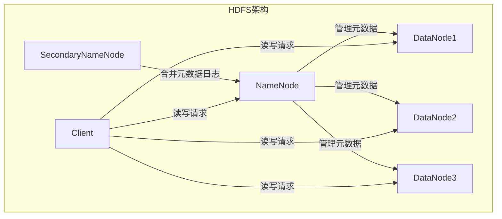
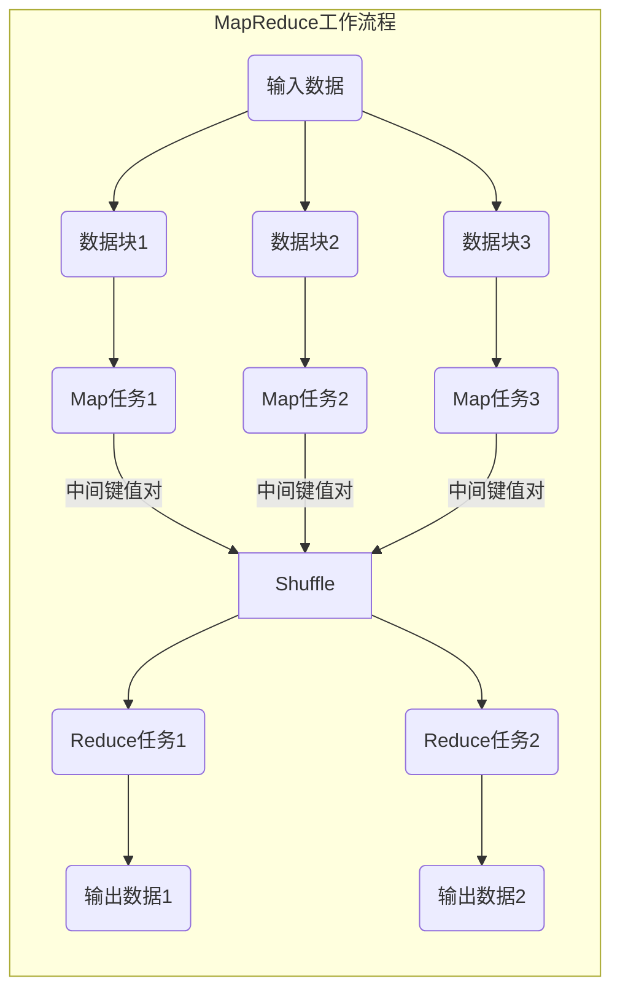
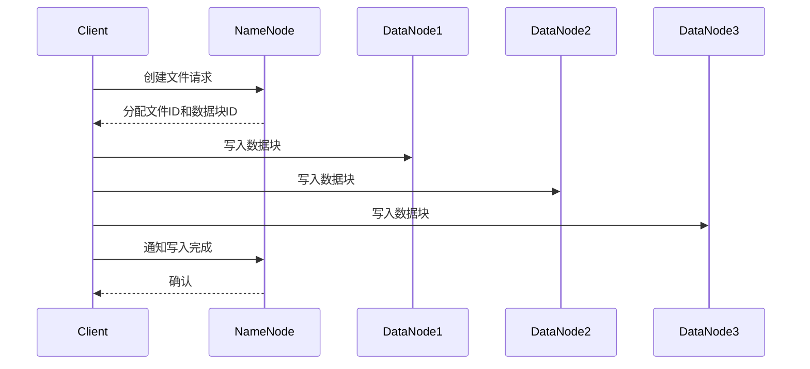
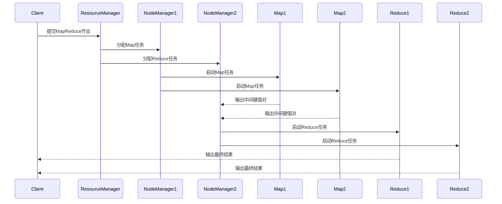

# Hadoop原理与代码实例讲解

## 1. 背景介绍

### 1.1 大数据时代的到来

在当今时代，数据无处不在。从网络流量、社交媒体活动到物联网设备等各个领域都在不断产生海量的数据。这些数据蕴藏着巨大的价值,如果能够有效地收集、存储和分析,就能为企业带来新的商业洞见和竞争优势。然而,传统的数据处理系统已经无法满足如此庞大数据量的需求,因此大数据技术应运而生。

### 1.2 Hadoop的诞生

Hadoop是一种开源的大数据处理框架,由Apache软件基金会开发和维护。它的名字源于它的创始人之一的一个儿童玩具大象的名字。Hadoop被设计用于可靠地存储和处理大规模数据集,具有高度的可扩展性、容错性和成本效益。

Hadoop的核心由两个主要组件组成:

1. **HDFS(Hadoop分布式文件系统)**: 一种高度容错的分布式文件系统,用于存储大规模数据集。

2. **MapReduce**: 一种编程模型,用于在分布式环境中并行处理大数据。

### 1.3 Hadoop的优势

相比传统的数据处理系统,Hadoop具有以下优势:

- **可扩展性**: Hadoop可以轻松扩展到数千台服务器,处理数PB级别的数据。

- **成本效益**: Hadoop可以在廉价的商用硬件上运行,降低了基础设施成本。

- **容错性**: Hadoop通过数据复制和自动故障转移机制,提供了高度的容错能力。

- **批处理能力**: Hadoop非常适合批量处理大规模数据集。

## 2. 核心概念与联系

### 2.1 HDFS架构

HDFS是Hadoop分布式文件系统的核心组件,它被设计用于在廉价的商用硬件上可靠地存储大规模数据集。HDFS的架构包括以下几个主要部分:

1. **NameNode(名称节点)**: 负责管理文件系统的命名空间和客户端对文件的访问。它存储了文件系统的元数据,如文件名、目录、文件属性等。

2. **DataNode(数据节点)**: 用于在本地存储文件数据块,并执行数据块的读写操作。

3. **辅助NameNode(Secondary NameNode)**: 定期合并HDFS元数据的变更日志,并将合并后的元数据发送给NameNode,以减轻NameNode的工作负载。

4. **客户端(Client)**: 用于向HDFS发送读写请求。

下图展示了HDFS的基本架构:



### 2.2 MapReduce编程模型

MapReduce是Hadoop用于并行处理大数据的编程模型。它将计算过程分为两个阶段:Map阶段和Reduce阶段。

1. **Map阶段**: 输入数据被划分为多个数据块,每个数据块由一个独立的Map任务处理。Map任务将输入的键值对转换为一组中间键值对。

2. **Reduce阶段**: 将Map阶段输出的中间键值对按键进行排序和合并,然后由Reduce任务处理。Reduce任务将相同键的值合并,并对值执行聚合操作。

下图展示了MapReduce的工作流程:



MapReduce编程模型使得并行处理大数据成为可能,同时也简化了分布式计算的复杂性。

## 3. 核心算法原理具体操作步骤

### 3.1 HDFS写数据流程

当客户端向HDFS写入数据时,会经历以下步骤:

1. 客户端向NameNode发送一个创建文件的请求。

2. NameNode执行文件创建操作,并分配一个新的文件ID。

3. NameNode为文件分配一个数据块ID,并确定该数据块应该存储在哪些DataNode上(通常是三个副本)。

4. NameNode将数据块ID和DataNode列表返回给客户端。

5. 客户端开始向DataNode写入数据块。

6. 当数据块写入完成后,客户端通知NameNode。

7. NameNode记录文件的新大小。

8. 客户端完成写入操作。

下图展示了HDFS写数据的流程:



### 3.2 MapReduce执行流程

MapReduce作业的执行流程如下:

1. 客户端向ResourceManager提交MapReduce作业。

2. ResourceManager将作业划分为多个Task(Map任务和Reduce任务),并分配给各个NodeManager。

3. NodeManager在本地启动Container,并在Container中运行Task。

4. Map任务读取输入数据,执行Map函数,生成中间键值对,并将结果写入本地磁盘。

5. Reduce任务从Map任务的输出中远程读取相应的中间键值对。

6. Reduce任务对相同键的值执行聚合操作,生成最终结果。

7. 客户端从HDFS中读取最终结果。

下图展示了MapReduce执行流程:



## 4. 数学模型和公式详细讲解举例说明

在Hadoop中,有一些重要的数学模型和公式,用于优化系统性能和资源利用率。

### 4.1 数据块大小选择

HDFS将文件划分为多个数据块存储,数据块的大小对系统性能有重大影响。数据块过小会导致元数据开销过大,而数据块过大又会降低并行度。因此,需要根据实际情况选择合适的数据块大小。

HDFS中数据块大小的计算公式如下:

$$
block\_size = \sqrt{HDFS\_capacity \times \frac{bytes}{transfer}}
$$

其中:

- $block\_size$: 数据块大小(以字节为单位)
- $HDFS\_capacity$: HDFS的总存储容量(以字节为单位)
- $\frac{bytes}{transfer}$: 每次数据传输的平均字节数

例如,假设HDFS的总存储容量为1PB,每次数据传输的平均字节数为1MB,则数据块大小应该设置为:

$$
block\_size = \sqrt{1PB \times 1MB} = \sqrt{10^{15}} = 128MB
$$

### 4.2 复制策略

为了提高数据可靠性和可用性,HDFS会对每个数据块创建多个副本。副本的数量和位置由复制策略决定。Hadoop采用的是机架感知复制策略,其目标是在不同机架上存储副本,以避免单点故障导致数据丢失。

假设每个数据块有$N$个副本,机架数量为$R$,机架$i$上的节点数量为$n_i$,则机架$i$上的期望副本数量为:

$$
E[X_i] = N \times \frac{n_i}{\sum_{j=1}^{R} n_j}
$$

如果$E[X_i] < 1$,则至少会在机架$i$上存储一个副本,以确保每个机架至少有一个副本。

### 4.3 任务调度

在MapReduce中,任务调度器负责将Map任务和Reduce任务分配给适当的节点执行。Hadoop采用了延迟调度算法,旨在最小化数据传输。

对于Map任务,调度器会尽量将任务分配给已经存储了相应输入数据的节点,以避免跨节点数据传输。如果无法找到合适的节点,则会随机选择一个节点执行Map任务。

对于Reduce任务,调度器会尝试将任务分配给已经存储了相应中间数据的节点,以减少数据传输。如果无法找到合适的节点,则会选择一个网络拓扑距离较近的节点执行Reduce任务。

## 5. 项目实践: 代码实例和详细解释说明

在本节中,我们将通过一个实际的MapReduce示例来深入了解Hadoop的编程模型。我们将开发一个Word Count程序,统计给定文本文件中每个单词出现的次数。

### 5.1 Maven依赖

首先,我们需要在Maven项目中添加Hadoop依赖:

```xml
<dependency>
    <groupId>org.apache.hadoop</groupId>
    <artifactId>hadoop-client</artifactId>
    <version>3.3.4</version>
</dependency>
```

### 5.2 Map函数

Map函数的作用是将输入的文本文件转换为单词和计数的键值对。具体实现如下:

```java
public static class WordCountMapper extends Mapper<LongWritable, Text, Text, IntWritable> {
    private final static IntWritable one = new IntWritable(1);
    private Text word = new Text();

    @Override
    protected void map(LongWritable key, Text value, Context context) throws IOException, InterruptedException {
        String line = value.toString();
        StringTokenizer tokenizer = new StringTokenizer(line);
        while (tokenizer.hasMoreTokens()) {
            word.set(tokenizer.nextToken());
            context.write(word, one);
        }
    }
}
```

1. 首先定义Map函数的输入和输出类型。输入是文本文件的行号(LongWritable)和行内容(Text),输出是单词(Text)和计数(IntWritable)。

2. 在`map`方法中,我们将文本行使用空格分割成单词。

3. 对于每个单词,我们将其作为键,初始计数为1,发送给Reduce函数。

### 5.3 Reduce函数

Reduce函数的作用是将Map函数输出的中间键值对进行聚合,计算每个单词的总计数。具体实现如下:

```java
public static class WordCountReducer extends Reducer<Text, IntWritable, Text, IntWritable> {
    private IntWritable result = new IntWritable();

    @Override
    protected void reduce(Text key, Iterable<IntWritable> values, Context context) throws IOException, InterruptedException {
        int sum = 0;
        for (IntWritable val : values) {
            sum += val.get();
        }
        result.set(sum);
        context.write(key, result);
    }
}
```

1. 首先定义Reduce函数的输入和输出类型。输入是Map函数输出的单词(Text)和计数(IntWritable),输出也是单词(Text)和总计数(IntWritable)。

2. 在`reduce`方法中,我们遍历相同键的所有值,将它们相加得到总计数。

3. 最后,我们将单词作为键,总计数作为值,输出到HDFS。

### 5.4 主程序

最后,我们编写主程序来提交MapReduce作业:

```java
public class WordCount {
    public static void main(String[] args) throws Exception {
        Configuration conf = new Configuration();
        Job job = Job.getInstance(conf, "word count");
        job.setJarByClass(WordCount.class);