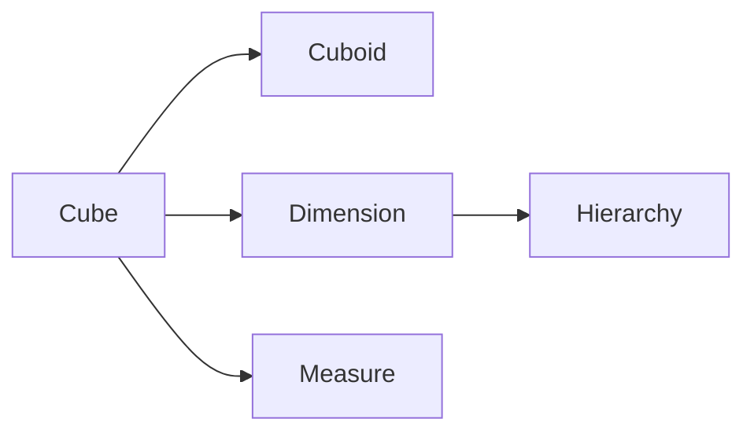

# Kylin原理与代码实例讲解

作者：禅与计算机程序设计艺术

## 1. 背景介绍

### 1.1 大数据时代下的分析挑战

随着互联网、物联网等技术的飞速发展，全球数据量呈爆炸式增长，企业积累的数据规模越来越大，数据分析的需求也日益迫切。然而，传统的关系型数据库在处理海量数据时面临着巨大的挑战，主要体现在以下几个方面：

* **查询速度慢：**  传统数据库在处理复杂查询时，需要扫描大量的数据，导致查询速度非常慢。
* **数据膨胀：** 为了支持各种分析需求，传统数据库通常需要建立大量的索引和预计算表，导致数据膨胀严重。
* **扩展性差：**  传统数据库难以扩展到PB级别的数据量，无法满足大数据分析的需求。

### 1.2 OLAP技术的兴起

为了解决上述挑战，OLAP（Online Analytical Processing，联机分析处理）技术应运而生。OLAP技术旨在快速响应用户的多维分析需求，其核心思想是预先计算并存储聚合结果，从而避免在查询时进行大量的计算。

### 1.3 Kylin：开源分布式OLAP引擎

Apache Kylin是一个开源的分布式OLAP引擎，提供Hadoop/Spark之上的SQL查询接口及多维分析（OLAP）能力以支持超大规模数据，最初由eBay开发并贡献至开源社区。Kylin的核心思想是将数据预先计算成Cube，并将Cube存储在HBase等存储引擎中，从而实现亚秒级查询响应。

## 2. 核心概念与联系

### 2.1 数据立方体（Cube）

Cube是Kylin的核心概念，它是一种多维数据结构，用于存储预计算的聚合结果。Cube的每个维度对应一个业务指标，例如时间、地区、产品等，每个维度可以有多个层级，例如时间维度可以有年、季度、月、日等层级。

### 2.2 度量（Measure）

度量是Cube中存储的聚合值，例如销售额、用户数、点击量等。Kylin支持多种聚合函数，例如SUM、COUNT、AVG、MAX、MIN等。

### 2.3 维度（Dimension）

维度是Cube的分析角度，例如时间、地区、产品等。每个维度可以有多个层级，例如时间维度可以有年、季度、月、日等层级。

### 2.4 层级（Hierarchy）

层级是维度的不同粒度，例如时间维度可以有年、季度、月、日等层级。

### 2.5 Cuboid

Cuboid是Cube的子集，它包含Cube的部分维度和度量。例如，一个包含时间、地区、产品三个维度和销售额度量的Cube，可以有以下Cuboid：

* 时间、地区、产品、销售额
* 时间、地区、销售额
* 时间、产品、销售额
* 地区、产品、销售额
* 时间、销售额
* 地区、销售额
* 产品、销售额
* 销售额

### 2.6 关系图



## 3. 核心算法原理具体操作步骤

### 3.1 数据预处理

在构建Cube之前，需要对原始数据进行预处理，主要包括数据清洗、数据转换、数据抽取等操作。

#### 3.1.1 数据清洗

数据清洗是指识别和纠正数据文件中的错误数据，包括检查数据的一致性、处理无效值和缺失值等。

#### 3.1.2 数据转换

数据转换是指将数据从一种格式转换为另一种格式，例如将日期格式从“YYYY-MM-DD”转换为“YYYYMMDD”。

#### 3.1.3 数据抽取

数据抽取是指从源数据系统中提取构建Cube所需的数据。

### 3.2 Cube构建

Cube构建是Kylin的核心步骤，它包括以下几个步骤：

#### 3.2.1 选择维度和度量

根据业务需求选择构建Cube所需的维度和度量。

#### 3.2.2  定义维度层级

为每个维度定义层级关系，例如时间维度可以定义为年、季度、月、日等层级。

#### 3.2.3 设置聚合组

将维度和度量组合成多个聚合组，每个聚合组对应一个Cuboid。

#### 3.2.4 数据分片

将数据按照一定的规则划分到不同的分片中，以便并行计算。

#### 3.2.5 预计算

根据聚合组定义，对每个分片的数据进行预计算，并将计算结果存储到HBase中。

### 3.3 查询执行

当用户提交查询请求时，Kylin会根据查询条件选择合适的Cuboid，并从HBase中读取预计算结果，返回给用户。


## 4. 数学模型和公式详细讲解举例说明

### 4.1 数据立方体模型

数据立方体模型是一种多维数据模型，它将数据组织成一个多维数组的形式。每个维度对应一个业务指标，例如时间、地区、产品等，每个维度可以有多个层级，例如时间维度可以有年、季度、月、日等层级。

### 4.2  星形模型和雪花模型

星形模型和雪花模型是两种常见的数据仓库模型。

* **星形模型:**  星形模型中，事实表位于中心，维度表围绕事实表进行组织。
* **雪花模型:**  雪花模型是星形模型的扩展，它将维度表进行规范化，将一个维度表拆分成多个维度表。

### 4.3  数据立方体的计算

数据立方体的计算可以通过以下公式表示：

```
Cube = GROUP BY (Dimension1, Dimension2, ..., DimensionN)
       AGGREGATE_FUNCTION (Measure1),
       AGGREGATE_FUNCTION (Measure2),
       ...
       AGGREGATE_FUNCTION (MeasureM)
```

其中：

* Dimension1, Dimension2, ..., DimensionN 表示数据立方体的维度
* AGGREGATE_FUNCTION 表示聚合函数，例如 SUM、COUNT、AVG、MAX、MIN 等
* Measure1, Measure2, ..., MeasureM 表示数据立方体的度量


## 5. 项目实践：代码实例和详细解释说明

### 5.1 构建示例数据

```sql
CREATE TABLE website_visit (
  visit_time timestamp,
  user_id bigint,
  city string,
  product_id bigint
);

INSERT INTO website_visit VALUES
  ('2023-05-01 10:00:00', 1, '北京', 1001),
  ('2023-05-01 10:05:00', 2, '上海', 1002),
  ('2023-05-01 10:10:00', 3, '广州', 1003),
  ('2023-05-02 10:00:00', 4, '深圳', 1001),
  ('2023-05-02 10:05:00', 5, '北京', 1002),
  ('2023-05-02 10:10:00', 6, '上海', 1003);
```

### 5.2 创建Kylin Cube

#### 5.2.1  配置Kylin连接信息

```properties
kylin.metadata.url=http://your-kylin-host:7070/kylin
```

#### 5.2.2 创建Kylin模型

```sql
CREATE MODEL website_visit_model
  WITH (
    'owner' = 'admin',
    'description' = 'Website visit model'
  );
```

#### 5.2.3  创建Kylin Cube

```sql
CREATE CUBE website_visit_cube
  MODEL 'website_visit_model'
  WITH (
    'dimensions' = ARRAY[
      'city',
      'product_id',
      'visit_time'
    ],
    'measures' = ARRAY[
      'COUNT(DISTINCT user_id)'
    ],
    'dictionaries' = ARRAY[
      'city',
      'product_id'
    ],
    'rowkey' = ARRAY[
      'city',
      'product_id',
      'visit_time'
    ]
  );
```

### 5.3  查询数据

```sql
SELECT
  city,
  product_id,
  COUNT(DISTINCT user_id) AS uv
FROM website_visit_cube
GROUP BY
  city,
  product_id;
```

### 5.4 代码解释

* `CREATE TABLE` 语句用于创建示例数据表 `website_visit`。
* `INSERT INTO` 语句用于向 `website_visit` 表中插入数据。
* `CREATE MODEL` 语句用于创建一个 Kylin 模型 `website_visit_model`。
* `CREATE CUBE` 语句用于创建一个 Kylin Cube `website_visit_cube`，并指定了 Cube 的维度、度量、字典和行键等信息。
* `SELECT` 语句用于查询 Kylin Cube `website_visit_cube` 中的数据。

## 6. 实际应用场景

Kylin 适用于需要对大规模数据进行快速查询和分析的场景，例如：

* **电商平台：**  分析用户行为、商品销售情况、营销活动效果等。
* **金融行业：**  进行风险控制、反欺诈、客户关系管理等。
* **物流行业：**  优化物流路线、提高配送效率、降低物流成本等。
* **物联网领域：**  分析传感器数据、监控设备运行状态、预测设备故障等。

## 7. 工具和资源推荐

### 7.1 Kylin官网

* https://kylin.apache.org/

### 7.2 Kylin GitHub仓库

* https://github.com/apache/kylin

### 7.3  Kylin书籍

* 《Apache Kylin权威指南》

## 8. 总结：未来发展趋势与挑战

### 8.1 未来发展趋势

* **云原生化：**  Kylin 将更加紧密地与云计算平台集成，提供更方便的部署和使用方式。
* **实时分析：**  Kylin 将支持更实时的分析场景，例如流式数据分析。
* **人工智能：**  Kylin 将与人工智能技术结合，提供更智能的分析服务。

### 8.2 面临的挑战

* **数据湖的兴起：**  数据湖的出现对 Kylin 等传统 OLAP 引擎提出了挑战。
* **实时分析的需求：**  实时分析的需求越来越强烈，Kylin 需要不断提升实时分析能力。
* **数据安全和隐私保护：**  随着数据量的不断增长，数据安全和隐私保护问题日益突出。

## 9. 附录：常见问题与解答

### 9.1 Kylin和Hive的区别是什么？

**Hive** 是一个基于 Hadoop 的数据仓库工具，它提供了一种类似 SQL 的查询语言，可以用于查询和分析存储在 Hadoop 上的数据。**Kylin** 是一个 OLAP 引擎，它可以将数据预先计算成 Cube，并存储在 HBase 等存储引擎中，从而实现亚秒级查询响应。

### 9.2 Kylin支持哪些数据源？

Kylin 支持多种数据源，包括 Hive、Kafka、HBase、RDBMS 等。

### 9.3 Kylin如何保证数据一致性？

Kylin 通过以下机制保证数据一致性：

* **数据预计算：**  Kylin 在构建 Cube 时会对数据进行预计算，并将计算结果存储到 HBase 中，从而保证数据的一致性。
* **数据刷新：**  Kylin 支持增量刷新和全量刷新两种数据刷新方式，以保证数据的新鲜度。
* **数据校验：**  Kylin 提供了数据校验机制，用于检测数据的一致性。
