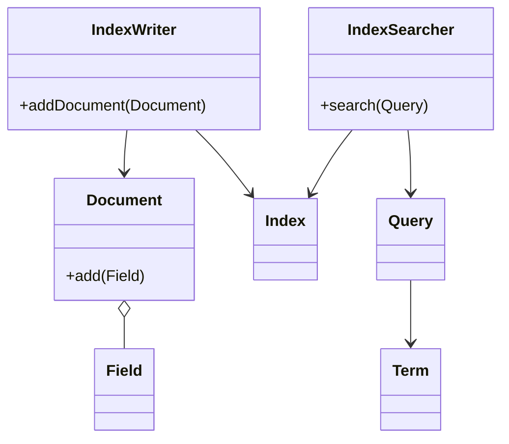

# Lucene原理与代码实例讲解

作者：禅与计算机程序设计艺术

## 1. 背景介绍

### 1.1 全文检索的需求与挑战
在当今海量数据爆炸式增长的时代,高效的全文检索技术成为了信息检索领域一个重要的研究课题。传统的基于关系数据库的检索方式,在海量数据面前显得力不从心。如何从TB甚至PB级别的非结构化或半结构化的文本数据中,快速准确地检索出用户想要的信息,是一个巨大的挑战。

### 1.2 Lucene的诞生与发展
Lucene诞生于2000年,是由Doug Cutting最初创建的一个开源全文搜索引擎工具包。Lucene提供了完整的查询引擎和索引引擎,使得开发人员可以方便地为自己的应用程序添加搜索功能。

Lucene最初是用Java语言编写的,后来发展成为一个跨语言的平台,目前已经有了多种编程语言的移植版本。2001年,Lucene成为Apache软件基金会Jakarta项目的一个子项目。2005年,Lucene从Jakarta项目中独立出来,正式称为Apache顶级项目。多年来,Lucene凭借其出色的性能、稳定性和可扩展性,逐渐在全文检索领域占据了统治地位,成为事实上的标准。

### 1.3 Lucene在产业界的应用
目前,很多知名的搜索引擎和互联网公司都在使用Lucene构建自己的搜索服务,如Twitter、LinkedIn、StackOverflow等。国内也有很多公司的搜索系统是基于Lucene搭建的,如百度论坛搜索、京东商品搜索等。此外,主流的开源搜索服务器如Solr、Elasticsearch,也是基于Lucene实现的。可以说,Lucene已经成为业界事实上的全文检索标准。

## 2. 核心概念与联系

### 2.1 文档(Document)
在Lucene中,文档是最小的索引和搜索单位。一个文档包含多个字段(Field),每个字段可以是文本、数字、日期等类型的数据。比如,对于一篇文章,标题、作者、发表日期、正文等都可以作为不同的字段存储在文档中。

### 2.2 字段(Field) 
字段是文档的一个组成部分。不同类型的数据会被存储在不同的字段中。字段有以下几个重要属性:
- 是否分词(Tokenized):该字段的内容是否需要经过分词处理。
- 是否索引(Indexed):该字段是否需要建立索引,只有索引后的字段才能被搜索。
- 是否存储(Stored):该字段的原始内容是否需要保存,以便在搜索结果中原样展示。

### 2.3 分词(Tokenization)
分词是指将字段中的文本内容切分成一个一个单独的词条(Term)的过程。英文文本的分词相对简单,主要是以空格和标点为分隔符对文本进行拆分。而中文文本没有天然的分隔符,需要采用专门的中文分词算法进行分词。

### 2.4 词条(Term)
词条是索引和搜索的最小单位。搜索引擎在底层把查询和索引都转换成了词条进行匹配。

### 2.5 索引(Index)
索引是Lucene对文档进行快速检索的关键。对文档建立索引实际上是把文档转换成一种特殊的数据结构,通过这种数据结构可以实现快速的全文搜索。Lucene采用了倒排索引结构,可以高效地根据关键词查找包含这些关键词的文档。

### 2.6 查询(Query)
用户在搜索框中输入的检索关键词,会被Lucene转换成内部的查询对象Query,Query中可以指定多个检索条件,如指定检索字段、指定逻辑关系(AND/OR)等。

### 2.7 核心类之间的关系

下图是Lucene几个核心概念类之间的UML关系图:



可以看出:
- Document由多个Field组成
- IndexWriter将Document写入Index
- IndexSearcher从Index中检索Document
- IndexSearcher根据Query进行搜索
- Query由一个或多个Term构成

## 3. 核心算法原理与操作步骤

### 3.1 倒排索引原理
Lucene采用了倒排索引(Inverted Index)的数据结构来实现全文检索。倒排索引结构如下:

```
Term1 -> <Doc1, frequence>, <Doc2, frequence>, ...
Term2 -> <Doc2, frequence>, <Doc3, frequence>, ...  
...
```
即以词条(Term)为key,每个Term映射到一个包含该Term的Document列表,列表中元素为<文档ID,词频>对。

这种索引结构的优点是可以非常高效地根据关键词(Term)找到包含该关键词的文档。比如要找包含"Lucene"这个词的文档,只需要找到Term为"Lucene"的那个列表即可。

### 3.2 索引文件格式
Lucene的索引其实是存储在磁盘上的一组文件。主要包括:
- Segments文件:它是索引的入口,记录了索引包含哪些Segment。   
- Segment文件:一个Segment对应索引的一部分,包含多个子文件,主要有:
   - .si (Segment Info)  记录Segment的元数据信息 
   - .cfs,.cfe (Compound File)  将其他子文件以CFS格式压缩存储
   - .tim,.tip (Term Index)  倒排索引的词典,记录Term->Term freq/positions的映射
   - .doc (Document) 正排索引,记录 Document->Terms的映射
   - .pos (Position)  词语位置信息
   - .pay (Payload) 记录词语的额外信息
   - .nvd,.nvm (Norms)  存储加权值
   - .dvd,.dvm (DocValues) 存储每个文档的字段值
   - .fdt,.fdx (Field Data) 存储被标记为存储的Field值  

### 3.3 索引阶段的步骤
1. 采集文档  
将原始的文本文件、网页、数据库记录等转换成Lucene的Document对象。

2. 建立文档  
将原始内容分拆成各个Field,创建Field对象,将Field添加到Document中。

3. 分析文档   
对需要建立索引的Field进行分词、索引、评分。涉及的具体流程有:
   - 分词:将Field的文本切分成一个个Token(词元)。
   - 去除停用词:去除can、the等无意义的词。
   - 索引:将词元转换成Term,建立Term->Document的倒排映射关系。
   - 评分:为每个文档的不同Field计算boost加权值。

4. 写入索引
将Document写入索引,同时将索引信息写入内存缓冲区(In-Memory Buffer)。Buffer满后会触发一次Flush操作,将Buffer中的索引信息写入新的Segment文件。多个Segment定期会被合并成一个大的Segment以优化查询速度。

### 3.4 搜索阶段的步骤 
1. 解析查询字符串
Lucene会将用户输入的查询字符串解析成Query对象。Query可以是一个简单的TermQuery,也可以是由多个Query通过BooleanQuery组合而成的复合Query。

2. 搜索索引
IndexSearcher根据解析出的Query对象,去倒排索引中检索符合条件的文档,主要的搜索算法有:
   - 对TermQuery进行搜索,直接根据Term找到对应的倒排列表即可。
   - 对BooleanQuery进行搜索,先分别搜索子Query,再根据子Query的逻辑关系对结果进行合并。 

3. 排序打分
搜索出的文档根据相关度打分(Scoring),再根据分值排序。打分过程中主要考虑因素有:  
   - tf (Term Frequency):词条在文档中出现的频率。tf越大,文档的相关度越高。
   - idf (Inverse Document Frequency):词条在整个索引的文档集中出现的频率。idf越大,词条的区分度越高。
   - Field加权值:不同Field可以设置不同的加权值(boost)
   - 文档长度:对文档长度进行归一化,防止文档越长打分越高。

4. 返回结果  
将排序后的结果返回给用户,通常只返回Top N个文档。Lucene提供了分页(Paging)和高亮显示(Highlighting)等功能,方便用户浏览搜索结果。

## 4. 数学公式与模型 

### 4.1 向量空间模型(Vector Space Model)
Lucene在对文档评分时用到了向量空间模型。向量空间模型把文本信息表示为一个多维向量,其中每一维对应一个索引单词,纬度的值是该单词在文档中的权重。两个文档的相似度可以通过计算它们的向量之间的夹角余弦值得到。夹角越小,余弦值越大,表示两个文档越相似。

设文档D和查询Q都用向量表示:
$$
\vec{D} = (d_1, d_2, ..., d_n)
$$
$$
\vec{Q} = (q_1, q_2, ..., q_n)
$$
其中$d_i$表示词$t_i$在文档D的权重,$q_i$表示词$t_i$在查询Q中的权重。两个向量的夹角余弦公式为:
$$
\cos\theta = \frac{\vec{D} \cdot \vec{Q}}{\lVert \vec{D} \rVert \lVert \vec{Q} \rVert} = \frac{\sum_{i=1}^n d_i q_i}{\sqrt{\sum_{i=1}^n d_i^2} \sqrt{\sum_{i=1}^n q_i^2}}
$$
余弦值在0到1之间,值越大,相似度越大。

### 4.2 Lucene评分公式
Lucene的默认评分公式包含了tf、idf、Field boost、向量规范化等因素:  

$$
score(q,d) = \sum_{t \in q} \bigg( \underbrace{tf(t,d)}_{Term Freq} \cdot \underbrace{idf(t)}_{Inverse Doc Freq} \cdot \underbrace{boost(t.field)}_{Field Boost} \cdot \underbrace{norm(d)}_{Doc Vector Norm} \bigg)
$$

其中:  
- $tf(t,d)$ 词条t在文档d中出现的频率
- $idf(t)$ 反文档频率,衡量词条t的稀缺程度,公式为:
$$
  idf(t) = 1 + \log \bigg(\frac{numDocs}{docFreq(t)+1}\bigg)
$$
其中$numDocs$为索引的文档总数,$docFreq(t)$为包含词条$t$的文档数。

- $boost(t.field)$ 词条t所在Field的加权值
- $norm(d)$ 文档d向量的规范化因子,用于平衡不同长度文档的相关度

可以看出Lucene评分公式综合考虑了多个因素,既体现了向量空间模型中的tf-idf思想,又考虑了实际应用中的Field权重和长度归一化等因素,是一个非常经典和实用的评分模型。

## 5. 项目实践:代码实例和详解

下面我们通过一些简单的代码示例来看看如何使用Lucene进行索引和搜索。

### 5.1 创建索引
```java
//目录对象,指定索引在硬盘中的位置
Directory dir = FSDirectory.open(Paths.get("/tmp/index"));
//标准分词器,对英文按单词分词
Analyzer analyzer = new StandardAnalyzer();
//索引写入配置
IndexWriterConfig config = new IndexWriterConfig(analyzer);
//创建IndexWriter
IndexWriter writer = new IndexWriter(dir, config);

//创建一个Document对象
Document doc = new Document();
//创建一个字段,字段名为content,字段值为一段文本,存储并建立索引
doc.add(new TextField("content", "Lucene is an Information Retrieval library",
                      Field.Store.YES));
//创建一个字段,字段名为path,字段值为一个文件路径,只存储不索引                              
doc.add(new StoredField("path", "/test/1.txt")); 
//将文档写入索引
writer.addDocument(doc);

//关闭IndexWriter
writer.close();
```
上例创建了一个包含两个Field的Document,其中"content"字段既存储又建立索引,而"path"字段只存储不建立索引。最后将Document通过IndexWriter写入索引。

### 5.2 检索文档
```java
//获取IndexReader 
IndexReader reader