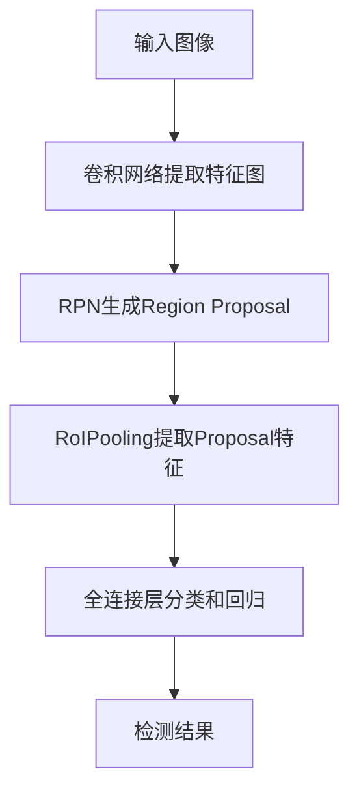
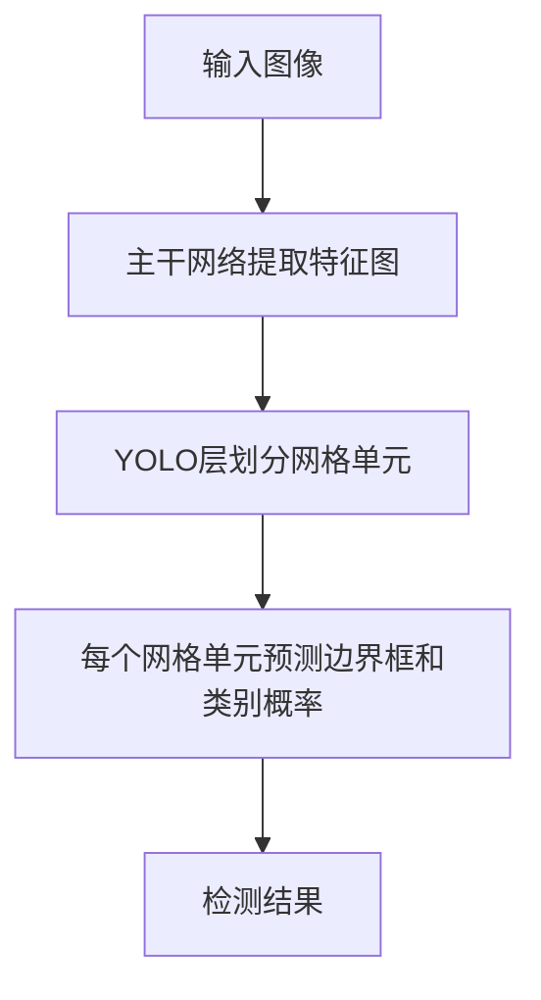

# Object Detection 原理与代码实战案例讲解

## 1. 背景介绍

### 1.1 什么是目标检测？

目标检测(Object Detection)是计算机视觉和深度学习领域的一个核心任务,旨在从数字图像或视频中识别、定位和分类物体实例。与图像分类任务不同,目标检测不仅需要识别出图像中存在什么对象,还需要精确定位每个对象的位置和边界框(bounding box)。

随着深度学习技术的不断发展,目标检测在许多领域得到了广泛应用,如自动驾驶、安防监控、机器人视觉、人脸识别等。准确高效的目标检测对于这些应用场景至关重要。

### 1.2 目标检测的挑战

尽管目标检测技术取得了长足进步,但仍然面临诸多挑战:

- 尺度变化:同一类别的目标在图像中可能呈现出不同的尺度大小
- 遮挡:目标可能被其他物体部分或完全遮挡
- 光照变化:不同的光照条件会影响目标的外观
- 旋转和视角变化:目标可能出现不同角度和方向
- 类内变化:同一类别的目标可能在外观上存在较大差异
- 背景杂波:复杂的背景环境会干扰目标检测

## 2. 核心概念与联系

### 2.1 传统目标检测方法

在深度学习时代之前,传统的目标检测方法主要基于手工设计的特征提取和机器学习分类器,主要有:

1. **基于滑动窗口的方法**:在图像上使用不同尺度和位置的窗口进行密集采样,对每个窗口提取特征并使用分类器判断是否包含目标。这种方法计算量大且效率低下。

2. **基于选择性搜索的方法**:先使用分割算法生成候选区域,再对每个候选区域提取特征并进行分类。这种方法可减少搜索空间,但对分割算法的性能依赖较大。

3. **基于级联分类器的方法**:使用简单分类器快速排除大量负样本,再使用更复杂的分类器对剩余窗口进行细化,如Viola-Jones人脸检测算法。这种方法速度较快但检测效果一般。

上述传统方法通常依赖于手工设计的特征,如HOG、SIFT等,并使用SVM、Adaboost等经典机器学习算法进行分类,无法充分利用数据中的丰富信息,且难以处理复杂场景。

### 2.2 基于深度学习的目标检测

2012年AlexNet在ImageNet大赛中取得巨大成功后,深度学习在计算机视觉领域掀起了新的浪潮。基于深度学习的目标检测算法主要分为两大类:

1. **基于区域提议的两阶段方法**

   这类方法首先生成候选区域(Region Proposal),然后对每个候选区域提取特征并进行分类和精修。典型代表有R-CNN系列算法:

   - R-CNN
   - Fast R-CNN
   - Faster R-CNN
   - Mask R-CNN

   这些算法准确性较高,但由于需要两阶段处理,速度较慢,无法满足实时性要求。

2. **基于密集采样的一阶段方法**  

   这类方法不需要先生成候选区域,而是直接对密集采样的窗口进行分类和回归。典型代表有YOLO系列和SSD等:

   - YOLO
   - YOLOv2
   - YOLOv3
   - SSD
   - RetinaNet

   这些算法速度更快,但准确率通常低于两阶段方法。

无论是两阶段还是一阶段,这些目标检测算法的核心都是利用卷积神经网络(CNN)自动从数据中学习特征表示,并基于这些特征完成分类和回归任务。

## 3. 核心算法原理具体操作步骤  

在这一节,我们将重点介绍目前最流行和有影响力的两种目标检测算法:Faster R-CNN和YOLO,并详细阐述它们的工作原理和具体实现步骤。

### 3.1 Faster R-CNN

Faster R-CNN是R-CNN系列算法的最新版本,由两个主要模块组成:Region Proposal Network(RPN)和检测网络。

#### 3.1.1 Region Proposal Network(RPN)

RPN模块的作用是从图像中生成高质量的候选区域(Region Proposal),为检测网络提供输入。它的工作流程如下:

1. 在输入图像上滑动一个小的3x3卷积窗口,对每个位置生成k(如9)个锚框(anchor box),这些锚框具有不同的尺寸和纵横比。

2. 对每个锚框提取特征,输入到两个全连接层:一个用于二分类(是否包含目标),一个用于bbox回归(精修锚框位置)。

3. 对所有锚框的分类和回归输出进行过滤和非极大值抑制(NMS),生成最终的Region Proposal。

4. 将Region Proposal作为输入传递给检测网络。

RPN的优势在于它与检测网络共享全卷积特征,无需单独的区域生成模块,计算高效。它也是Faster R-CNN相比Fast R-CNN的关键创新之处。

#### 3.1.2 检测网络

检测网络的作用是对RPN生成的Region Proposal进行细化和分类。它的工作流程如下:

1. 使用RoIPooling层从特征图上提取每个Region Proposal的特征,并进行归一化处理。

2. 将归一化后的特征输入全连接层,同时进行分类和bbox回归。

3. 对所有Region Proposal的分类和回归输出进行过滤和NMS,生成最终的检测结果。

Faster R-CNN的整体流程如下图所示:

### 3.2 YOLO 

YOLO(You Only Look Once)是一种一阶段目标检测算法,它将目标检测任务重新构建为一个回归问题,直接从图像像素预测边界框和类别概率。

#### 3.2.1 网络架构

YOLO算法的网络架构主要包括以下几个部分:

1. **主干网络(Backbone)**: 通常采用预训练的卷积神经网络如VGG、ResNet等,用于从输入图像提取特征。

2. **YOLO层**: 在主干网络的输出特征图上添加一个YOLO层,该层将整个图像划分为SxS个网格单元,每个网格单元预测B个边界框以及每个边界框所属的类别概率。

3. **锚框(Anchor Box)**: YOLO中使用预设的锚框,通过调整锚框的长宽比和面积,使其能够更好地捕获不同形状和大小的目标。

4. **损失函数**: YOLO直接预测边界框坐标和目标类别,因此其损失函数包括边界框坐标误差、置信度误差和分类误差三个部分。

#### 3.2.2 预测过程

给定一个输入图像,YOLO的预测过程如下:

1. 将输入图像输入到主干网络,获取特征图。

2. 在YOLO层,将特征图划分为SxS个网格单元。

3. 对于每个网格单元:
   - 预测B个边界框,每个边界框由(x, y, w, h, confidence)五个值表示
   - 预测每个边界框所属的类别概率
   
4. 对所有预测的边界框进行过滤和非极大值抑制(NMS),得到最终的检测结果。

YOLO算法的优点是端到端的预测过程较为简单高效,但缺点是对小目标的检测效果较差,且预测精度通常低于Faster R-CNN等两阶段算法。

YOLO的预测过程如下图所示:

## 4. 数学模型和公式详细讲解举例说明

在目标检测算法中,往往需要使用数学模型和公式来定义损失函数、评估指标等,本节将详细讲解相关的数学模型和公式。

### 4.1 边界框表示

在目标检测任务中,通常使用四个值(x, y, w, h)来表示一个边界框,其中(x, y)表示边界框中心坐标,w和h分别表示边界框的宽度和高度。

为了简化计算,我们通常将边界框的坐标值进行归一化,使其在0到1之间。假设输入图像的宽度和高度分别为W和H,则边界框(x, y, w, h)的归一化公式如下:

$$
b_x = \frac{x}{W}, \quad b_y = \frac{y}{H}, \quad b_w = \frac{w}{W}, \quad b_h = \frac{h}{H}
$$

其中$b_x, b_y, b_w, b_h$分别表示归一化后的中心坐标和宽高比。

### 4.2 IoU(Intersection over Union)

IoU是目标检测中一个重要的评估指标,用于衡量预测边界框与真实边界框之间的重叠程度。对于两个边界框A和B,它们的IoU可以计算如下:

$$
\text{IoU}(A, B) = \frac{\text{Area of Intersection}}{\text{Area of Union}} = \frac{A \cap B}{A \cup B}
$$

IoU的值范围在0到1之间,值越大表示两个边界框重叠度越高。在目标检测算法中,我们通常会设置一个IoU阈值,只有当预测边界框与真实边界框的IoU大于该阈值时,才将其视为正样本。

### 4.3 YOLO损失函数

YOLO算法直接预测边界框坐标和类别概率,因此其损失函数包括三个部分:边界框坐标误差、置信度误差和分类误差。

假设有S x S个网格单元,每个单元预测B个边界框,真实边界框的个数为N,则YOLO的损失函数可以表示为:

$$
\begin{aligned}
\mathcal{L} &= \frac{1}{S^2}\sum_{i=0}^{S^2}\sum_{j=0}^B\mathbb{1}_{ij}^{obj}\Big[\lambda_{\text{coord}}\sum_{k=0}^4\big(y_k^{(i,j)} - \hat{y}_k^{(i,j)}\big)^2 \\
&+ \lambda_{\text{noobj}}\sum_{k=0}^4\mathbb{1}_{ij}^{noobj}\big(C_k^{(i,j)} - \hat{C}_k^{(i,j)}\big)^2 \\
&+ \sum_{c \in \text{classes}}\big(p_c^{(i,j)} - \hat{p}_c^{(i,j)}\big)^2\Big]
\end{aligned}
$$

其中:

- $\mathbb{1}_{ij}^{obj}$表示第(i, j)个网格单元是否包含目标
- $y_k^{(i,j)}$表示第(i, j)个网格单元的第k个边界框坐标值(x, y, w, h)
- $\hat{y}_k^{(i,j)}$表示第(i, j)个网格单元预测的第k个边界框坐标值
- $\mathbb{1}_{ij}^{noobj}$表示第(i, j)个网格单元是否不包含目标
- $C_k^{(i,j)}$表示第(i, j)个网格单元的第k个边界框的置信度
- $\hat{C}_k^{(i,j)}$表示第(i, j)个网格单元预测的第k个边界框的置信度
- $p_c^{(i,j)}$表示第(i, j)个网格单元包含目标的类别概率
- $\hat{p}_c^{(i,j)}$表示第(i, j)个网格单元预测的目标类别概率
- $\lambda_{\text{coord}}$和$\lambda_{\text{noobj}}$是超参数,用于平衡不同损失项的权重

通过最小化上述损失函数,YOLO算法可以同时学习预测边界框坐标、置信度和类别概率。

### 4.4 mean Average Precision (mAP)

mAP是目标检测任务中常用的评估指标,用于衡量