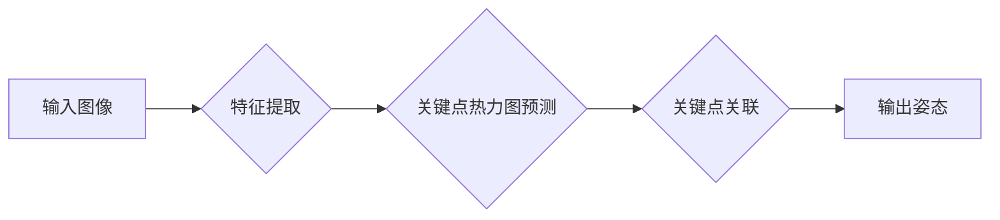

## 1. 背景介绍

### 1.1 什么是姿态估计？

姿态估计（Pose Estimation）是计算机视觉领域中的一个重要研究方向，其目标是从图像或视频中识别人物或物体的姿态。姿态估计的应用非常广泛，例如：

* **动作识别:**  分析视频中的人物动作，应用于安全监控、运动分析等领域。
* **人机交互:**  通过识别用户的姿态，实现更自然的人机交互方式。
* **虚拟现实/增强现实:** 将虚拟的人物或物体与现实场景融合，增强用户体验。
* **医疗健康:**  分析患者的姿态，辅助医生进行诊断和治疗。

### 1.2 姿态估计的发展历程

姿态估计技术的发展可以追溯到上世纪70年代，早期的研究主要集中在基于二维图像的姿态估计。近年来，随着深度学习技术的快速发展，基于深度学习的姿态估计方法取得了突破性进展，并在多个公开数据集上取得了领先的性能。

### 1.3 本文主要内容

本文将深入浅出地介绍姿态估计的基本原理、常用算法以及代码实例，并探讨姿态估计技术的未来发展趋势与挑战。

## 2. 核心概念与联系

### 2.1 姿态的表示方法

姿态估计的目标是识别人物或物体的姿态，而姿态的表示方法有多种，常见的包括：

* **关键点:**  使用一系列关键点来表示人体的关键部位，例如头部、肩膀、肘部、手腕、髋部、膝盖和脚踝等。
* **骨骼:**  将人体看作是由多个骨骼连接而成的结构，通过识别骨骼的位置和方向来表示姿态。
* **3D 模型:**  使用三维模型来表示人体的形状和姿态，可以提供更精细的姿态信息。

### 2.2 姿态估计的分类

根据输入数据的不同，姿态估计可以分为：

* **二维姿态估计:**  从二维图像中估计人物或物体的姿态。
* **三维姿态估计:**  从三维数据（例如深度图像、点云等）中估计人物或物体的姿态。

### 2.3 关键技术

姿态估计涉及到多个关键技术，例如：

* **目标检测:**  首先需要从图像或视频中检测出目标人物或物体。
* **特征提取:**  从目标区域中提取有效的特征信息，用于姿态估计。
* **姿态推断:**  根据提取的特征信息，推断出目标人物或物体的姿态。

## 3. 核心算法原理具体操作步骤

### 3.1 基于深度学习的姿态估计方法

近年来，基于深度学习的姿态估计方法取得了显著的进展。这类方法通常使用卷积神经网络 (CNN) 来提取图像特征，并使用回归网络或热力图来预测关键点的位置。

### 3.2 OpenPose 算法

OpenPose 是一种基于深度学习的多人姿态估计算法，其核心思想是使用**关键点关联**来实现多人姿态估计。

**具体操作步骤如下：**

1. **输入图像:**  将包含多个人物的图像输入到网络中。
2. **特征提取:**  使用 CNN 提取图像特征。
3. **关键点热力图预测:**  使用多个分支网络分别预测每个关键点的热力图。
4. **关键点关联:**  根据关键点热力图，使用**部件亲和场 (Part Affinity Fields, PAFs)**来预测相邻关键点之间的关联关系，并将属于同一个人的关键点连接起来，从而实现多人姿态估计。

**Mermaid 流程图:**



### 3.3 其他算法

除了 OpenPose 之外，还有许多其他的姿态估计算法，例如：

* **CPM (Convolutional Pose Machines):**  一种基于 CNN 的姿态估计方法，使用级联的网络结构来逐步 refine 关键点的位置。
* **Hourglass:**  一种对称的网络结构，可以有效地提取图像的全局和局部特征，用于姿态估计。
* **SimpleBaseline:**  一种简单但有效的姿态估计方法，使用 ResNet 作为 backbone 网络，并使用热力图回归来预测关键点的位置。

## 4. 数学模型和公式详细讲解举例说明

### 4.1 关键点热力图

关键点热力图是一种常用的姿态估计表示方法，其思想是为每个关键点生成一张热力图，热力图上的每个像素值表示该像素位置是对应关键点的概率。

**举例说明:**

假设我们要预测人体的左肩膀关键点，则可以生成一张左肩膀关键点的热力图。如果图像中左肩膀关键点的坐标为 (x, y)，则热力图上 (x, y) 位置的像素值应该接近于 1，而其他位置的像素值应该接近于 0。

### 4.2 部件亲和场 (PAFs)

部件亲和场 (PAFs) 用于描述相邻关键点之间的关联关系。PAFs 是一组向量场，每个向量场对应于一个肢体，向量场上的每个向量表示该位置属于对应肢体的方向和置信度.

**举例说明:**

假设我们要预测左肩膀和左肘部之间的关联关系，则可以生成一个左上臂的 PAF 向量场。如果图像中左肩膀关键点的坐标为 (x1, y1)，左肘部关键点的坐标为 (x2, y2)，则 PAF 向量场在 (x1, y1) 位置的向量应该指向 (x2, y2) 方向，并且向量的长度应该与 (x1, y1) 和 (x2, y2) 之间的距离成正比。

## 5. 项目实践：代码实例和详细解释说明

### 5.1 使用 OpenPose 进行姿态估计

```python
# 导入必要的库
import cv2
import time
import numpy as np

# 加载 OpenPose 模型
net = cv2.dnn.readNetFromCaffe("pose/coco/pose_iter_402000.caffemodel", "pose/coco/deploy_coco.prototxt")

# 加载图像
image = cv2.imread("image.jpg")

# 获取图像尺寸
height, width, _ = image.shape

# 将图像转换为 blob 格式
blob = cv2.dnn.blobFromImage(image, 1.0 / 255, (width, height), (0, 0, 0), swapRB=False, crop=False)

# 将 blob 输入到网络中进行推理
net.setInput(blob)
output = net.forward()

# 获取关键点热力图
heatmaps = output[0, :18, :, :]

# 获取 PAFs
pafs = output[0, 18:, :, :]

# 使用非极大值抑制 (NMS) 获取关键点的位置
keypoints = []
for i in range(heatmaps.shape[0]):
    heatmap = cv2.resize(heatmaps[i], (width, height))
    _, confidence, _, location = cv2.minMaxLoc(heatmap)
    keypoints.append((location[0], location[1], confidence))

# 使用 PAFs 连接关键点
# ...

# 绘制姿态骨架
# ...

# 显示结果
cv2.imshow("Pose Estimation", image)
cv2.waitKey(0)
```

### 5.2 代码解释

* **加载 OpenPose 模型:**  使用 `cv2.dnn.readNetFromCaffe` 函数加载 OpenPose 模型。
* **加载图像:**  使用 `cv2.imread` 函数加载图像。
* **将图像转换为 blob 格式:**  使用 `cv2.dnn.blobFromImage` 函数将图像转换为 blob 格式。
* **将 blob 输入到网络中进行推理:**  使用 `net.setInput` 和 `net.forward` 函数将 blob 输入到网络中进行推理。
* **获取关键点热力图和 PAFs:**  从网络输出中获取关键点热力图和 PAFs。
* **使用 NMS 获取关键点的位置:**  使用非极大值抑制 (NMS) 获取关键点的位置。
* **使用 PAFs 连接关键点:**  根据 PAFs 连接关键点，构建姿态骨架。
* **绘制姿态骨架:**  使用 OpenCV 的绘图函数绘制姿态骨架。

## 6. 实际应用场景

### 6.1 动作识别

姿态估计技术可以用于分析视频中的人物动作，应用于安全监控、运动分析等领域。例如，可以通过分析运动员的姿态来评估其运动技术，或者通过分析监控视频中的人物姿态来识别可 suspicious 行为。

### 6.2 人机交互

姿态估计技术可以用于识别用户的姿态，实现更自然的人机交互方式。例如，可以通过识别用户的 hand gestures 来控制设备，或者通过识别用户的 body language 来理解用户的意图。

### 6.3 虚拟现实/增强现实

姿态估计技术可以用于将虚拟的人物或物体与现实场景融合，增强用户体验。例如，可以通过识别用户的姿态来控制虚拟人物的动作，或者将虚拟家具放置在用户的房间中。

### 6.4 医疗健康

姿态估计技术可以用于分析患者的姿态，辅助医生进行诊断和治疗。例如，可以通过分析帕金森患者的姿态来评估其病情，或者通过分析中风患者的姿态来制定康复计划。

## 7. 工具和资源推荐

### 7.1 OpenPose

* **官网:**  https://github.com/CMU-Perceptual-Computing-Lab/openpose
* **简介:**  OpenPose 是一种开源的实时多人姿态估计库，支持多种平台和编程语言。

### 7.2 PoseNet

* **官网:**  https://github.com/tensorflow/tfjs-models/tree/master/posenet
* **简介:**  PoseNet 是一种基于 TensorFlow.js 的轻量级姿态估计模型，可以在浏览器中运行。

### 7.3 COCO 数据集

* **官网:**  http://cocodataset.org/#home
* **简介:**  COCO 数据集是一个大型的图像识别、分割和 captioning 数据集，包含了大量的姿态估计标注数据。

## 8. 总结：未来发展趋势与挑战

### 8.1 未来发展趋势

* **更加精确和鲁棒的姿态估计:**  随着深度学习技术的不断发展，未来将会出现更加精确和鲁棒的姿态估计方法。
* **实时多人三维姿态估计:**  实时多人三维姿态估计是姿态估计领域的一个重要发展方向，将能够为虚拟现实、增强现实等应用提供更加逼真的体验。
* **与其他计算机视觉任务的结合:**  姿态估计技术可以与其他计算机视觉任务（例如目标检测、语义分割等）相结合，实现更加复杂的任务。

### 8.2 面临的挑战

* **遮挡问题:**  当目标人物或物体被遮挡时，姿态估计的难度会大大增加。
* **复杂背景:**  在复杂的背景下，姿态估计的精度会受到影响。
* **计算复杂度:**  高精度的姿态估计方法通常需要较高的计算复杂度，难以应用于实时系统。

## 9. 附录：常见问题与解答

### 9.1 问：姿态估计和目标检测有什么区别？

**答：** 目标检测的目标是识别图像或视频中是否存在特定类别的物体，并确定其位置。而姿态估计的目标是识别人物或物体的姿态，例如人体的关键点位置或骨骼的方向。

### 9.2 问：姿态估计有哪些应用场景？

**答：** 姿态估计的应用场景非常广泛，例如动作识别、人机交互、虚拟现实/增强现实、医疗健康等。

### 9.3 问：如何评估姿态估计算法的性能？

**答：** 常用的姿态估计评估指标包括 PCK (Percentage of Correct Keypoints) 和 OKS (Object Keypoint Similarity)。PCK 表示关键点预测的准确率，OKS 表示预测的姿态与 ground truth 姿态的相似度。
