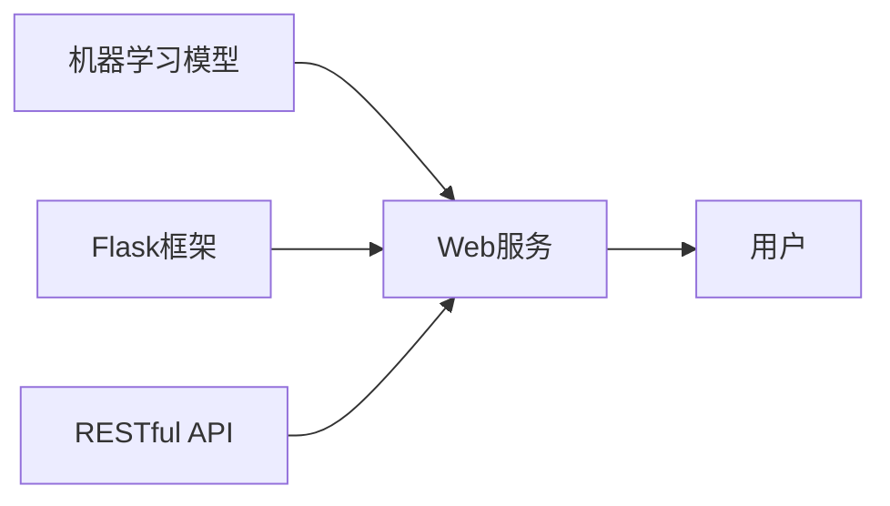

##  Python机器学习实战：搭建自己的机器学习Web服务

作者：禅与计算机程序设计艺术

## 1. 背景介绍

### 1.1 机器学习的兴起

近年来，随着数据量的爆炸式增长和计算能力的不断提升，机器学习（Machine Learning，ML）作为人工智能领域的核心技术之一，正在以前所未有的速度发展，并深刻地改变着我们的生活。从个性化推荐、图像识别到自然语言处理，机器学习的应用已经渗透到各个领域，为我们带来了巨大的便利和效率提升。

### 1.2 机器学习服务的必要性

传统的机器学习模型开发流程通常包括数据收集、数据预处理、特征工程、模型训练、模型评估和模型部署等多个步骤。然而，将一个训练好的机器学习模型部署到实际应用环境中，并为用户提供稳定的、可扩展的、高性能的预测服务，却并非易事。

为了解决这个问题，越来越多的开发者和企业开始将机器学习模型封装成Web服务，通过API接口的方式对外提供预测服务。这种方式不仅可以简化模型部署的流程，还可以提高模型的可扩展性和可维护性，使得更多的人能够方便地使用机器学习技术。

### 1.3 本文的目标

本文将以Python语言为例，介绍如何使用Flask框架搭建一个简单的机器学习Web服务。我们将以一个文本分类模型为例，演示如何将模型训练、模型部署和Web服务开发三个环节有机地结合起来，构建一个完整的机器学习应用。

## 2. 核心概念与联系

### 2.1 机器学习模型

机器学习模型是机器学习的核心，它可以根据输入的数据进行预测或决策。常见的机器学习模型包括线性回归、逻辑回归、支持向量机、决策树、随机森林、神经网络等。

### 2.2 Web服务

Web服务是一种通过网络进行通信的软件系统，它使用标准的网络协议（如HTTP、XML、JSON等）来交换数据。Web服务可以提供各种功能，例如数据查询、数据更新、业务逻辑处理等。

### 2.3 Flask框架

Flask是一个轻量级的Python Web框架，它简单易用，灵活扩展，非常适合用于构建小型到中型的Web应用。

### 2.4 RESTful API

RESTful API是一种基于REST架构风格的API设计规范，它使用HTTP协议的GET、POST、PUT、DELETE等方法来操作资源。RESTful API具有简单易用、可扩展性强、可缓存等优点，已经成为Web服务开发的主流规范。

### 2.5 关系图



## 3. 核心算法原理具体操作步骤

### 3.1 文本分类任务介绍

文本分类是自然语言处理领域中的一项基本任务，其目标是将文本数据自动分类到预定义的类别中。例如，可以将电子邮件分类为垃圾邮件和非垃圾邮件，将新闻文章分类为政治、经济、体育等不同类别。

### 3.2 文本分类模型训练

#### 3.2.1 数据准备

首先，我们需要准备用于训练文本分类模型的数据集。数据集通常包含两部分：文本数据和类别标签。

#### 3.2.2 特征工程

在将文本数据输入到机器学习模型之前，我们需要先将其转换为数值特征向量。常用的文本特征表示方法包括词袋模型（Bag-of-Words，BoW）、TF-IDF、Word2Vec等。

#### 3.2.3 模型选择与训练

选择合适的机器学习模型对于文本分类任务的性能至关重要。常用的文本分类模型包括朴素贝叶斯、支持向量机、逻辑回归等。

#### 3.2.4 模型评估与调参

训练完成后，我们需要对模型的性能进行评估，并根据评估结果对模型进行调参，以提高模型的泛化能力。

### 3.3 模型部署

训练好的文本分类模型可以通过多种方式进行部署，例如：

* 将模型保存为文件，并在Web服务中加载模型文件进行预测。
* 使用模型服务平台，例如TensorFlow Serving、MLflow等，将模型部署为在线服务。

### 3.4 Web服务开发

#### 3.4.1 创建Flask应用

使用Flask框架创建一个简单的Web应用。

#### 3.4.2 定义API接口

使用Flask-RESTful扩展定义API接口，用于接收用户请求和返回预测结果。

#### 3.4.3 处理用户请求

在API接口中，接收用户提交的文本数据，并使用加载的文本分类模型进行预测。

#### 3.4.4 返回预测结果

将模型的预测结果封装成JSON格式，并返回给用户。

## 4. 数学模型和公式详细讲解举例说明

### 4.1 朴素贝叶斯模型

朴素贝叶斯模型是一种基于贝叶斯定理的概率分类模型。它假设每个特征之间相互独立，并使用贝叶斯公式计算样本属于每个类别的概率。

#### 4.1.1 贝叶斯公式

$$P(A|B) = \frac{P(B|A)P(A)}{P(B)}$$

其中：

* $P(A|B)$ 表示在已知事件B发生的情况下，事件A发生的概率。
* $P(B|A)$ 表示在已知事件A发生的情况下，事件B发生的概率。
* $P(A)$ 表示事件A发生的概率。
* $P(B)$ 表示事件B发生的概率。

#### 4.1.2 朴素贝叶斯模型的应用

在文本分类任务中，我们可以将每个单词看作一个特征，将每个类别看作一个事件。假设我们有一个包含$n$个样本的数据集，其中每个样本$x_i$表示为一个$d$维特征向量：

$$x_i = (x_{i1}, x_{i2}, ..., x_{id})$$

其中$x_{ij}$表示第$i$个样本的第$j$个特征的值。

假设我们有$k$个类别，分别为$C_1, C_2, ..., C_k$。对于一个新的样本$x$，我们需要计算它属于每个类别的概率$P(C_j|x)$。

根据贝叶斯公式，我们可以得到：

$$P(C_j|x) = \frac{P(x|C_j)P(C_j)}{P(x)}$$

其中：

* $P(x|C_j)$ 表示在类别$C_j$下，样本$x$出现的概率。
* $P(C_j)$ 表示类别$C_j$出现的概率。
* $P(x)$ 表示样本$x$出现的概率。

由于$P(x)$对于所有类别都是相同的，因此我们可以忽略它，只比较$P(x|C_j)P(C_j)$的值。

根据朴素贝叶斯模型的假设，每个特征之间相互独立，因此我们可以将$P(x|C_j)$表示为：

$$P(x|C_j) = \prod_{i=1}^{d} P(x_i|C_j)$$

其中$P(x_i|C_j)$表示在类别$C_j$下，特征$x_i$出现的概率。

#### 4.1.3 举例说明

假设我们有一个文本分类任务，需要将邮件分类为垃圾邮件和非垃圾邮件。我们有一个包含1000封邮件的数据集，其中800封邮件为非垃圾邮件，200封邮件为垃圾邮件。

假设我们使用词袋模型来表示文本特征，并将词汇表的大小设置为10000。

对于一封新的邮件，假设它包含以下单词：

```
["free", "money", "now"]
```

我们需要计算它属于垃圾邮件和非垃圾邮件的概率。

首先，我们需要计算每个类别下，每个单词出现的概率。

例如，在垃圾邮件中，单词"free"出现的次数为100次，因此：

$$P("free"|垃圾邮件) = \frac{100}{200} = 0.5$$

同理，我们可以计算其他单词在垃圾邮件和非垃圾邮件中出现的概率。

接下来，我们可以计算这封邮件属于垃圾邮件和非垃圾邮件的概率：

$$
\begin{aligned}
P(垃圾邮件|邮件) &\propto P(邮件|垃圾邮件)P(垃圾邮件) \\
&= P("free"|垃圾邮件)P("money"|垃圾邮件)P("now"|垃圾邮件)P(垃圾邮件) \\
&= 0.5 \times 0.2 \times 0.1 \times 0.2 \\
&= 0.002
\end{aligned}
$$

$$
\begin{aligned}
P(非垃圾邮件|邮件) &\propto P(邮件|非垃圾邮件)P(非垃圾邮件) \\
&= P("free"|非垃圾邮件)P("money"|非垃圾邮件)P("now"|非垃圾邮件)P(非垃圾邮件) \\
&= 0.1 \times 0.05 \times 0.02 \times 0.8 \\
&= 0.00008
\end{aligned}
$$

由于$P(垃圾邮件|邮件) > P(非垃圾邮件|邮件)$，因此我们可以将这封邮件分类为垃圾邮件。

### 4.2 逻辑回归模型

逻辑回归模型是一种用于二分类的线性模型。它使用sigmoid函数将线性模型的输出转换为概率值。

#### 4.2.1 sigmoid函数

sigmoid函数的公式如下：

$$sigmoid(z) = \frac{1}{1 + e^{-z}}$$

其中$z$是线性模型的输出。

sigmoid函数的图像如下：

[sigmoid函数图像]

#### 4.2.2 逻辑回归模型的应用

在文本分类任务中，我们可以将每个单词看作一个特征，将每个类别看作一个事件。假设我们有一个包含$n$个样本的数据集，其中每个样本$x_i$表示为一个$d$维特征向量：

$$x_i = (x_{i1}, x_{i2}, ..., x_{id})$$

其中$x_{ij}$表示第$i$个样本的第$j$个特征的值。

假设我们有2个类别，分别为0和1。对于一个新的样本$x$，我们需要计算它属于类别1的概率$P(y=1|x)$。

逻辑回归模型的公式如下：

$$P(y=1|x) = sigmoid(w^Tx + b)$$

其中：

* $w$是权重向量。
* $b$是偏置项。

#### 4.2.3 举例说明

假设我们有一个文本分类任务，需要将邮件分类为垃圾邮件和非垃圾邮件。我们有一个包含1000封邮件的数据集，其中800封邮件为非垃圾邮件，200封邮件为垃圾邮件。

假设我们使用词袋模型来表示文本特征，并将词汇表的大小设置为10000。

假设我们训练得到的逻辑回归模型的权重向量为：

$$w = [0.1, 0.2, -0.1, ..., 0.05]$$

偏置项为：

$$b = -0.2$$

对于一封新的邮件，假设它包含以下单词：

```
["free", "money", "now"]
```

我们可以计算它属于垃圾邮件的概率：

$$
\begin{aligned}
P(垃圾邮件|邮件) &= sigmoid(w^Tx + b) \\
&= sigmoid(0.1 \times 1 + 0.2 \times 1 - 0.1 \times 1 + ... + 0.05 \times 1 - 0.2) \\
&= 0.6
\end{aligned}
$$

因此，我们可以将这封邮件分类为垃圾邮件。

## 5. 项目实践：代码实例和详细解释说明

### 5.1 项目结构

```
text-classification-web-service/
├── app.py
├── model.py
├── requirements.txt
└── data/
    └── spam.csv
```

### 5.2 代码实现

#### 5.2.1 `model.py`

```python
import pandas as pd
from sklearn.feature_extraction.text import TfidfVectorizer
from sklearn.linear_model import LogisticRegression
from sklearn.model_selection import train_test_split
from sklearn.metrics import accuracy_score

# 加载数据集
df = pd.read_csv('data/spam.csv')

# 将数据集拆分为训练集和测试集
X_train, X_test, y_train, y_test = train_test_split(df['text'], df['label'], test_size=0.2)

# 创建TF-IDF向量化器
vectorizer = TfidfVectorizer()

# 使用训练集创建词汇表
X_train = vectorizer.fit_transform(X_train)

# 将测试集转换为特征向量
X_test = vectorizer.transform(X_test)

# 创建逻辑回归模型
model = LogisticRegression()

# 训练模型
model.fit(X_train, y_train)

# 评估模型
y_pred = model.predict(X_test)
accuracy = accuracy_score(y_test, y_pred)
print(f'Accuracy: {accuracy}')

# 保存模型
import pickle
with open('model.pkl', 'wb') as f:
    pickle.dump((vectorizer, model), f)
```

#### 5.2.2 `app.py`

```python
from flask import Flask, request, jsonify
import pickle

app = Flask(__name__)

# 加载模型
with open('model.pkl', 'rb') as f:
    vectorizer, model = pickle.load(f)

@app.route('/predict', methods=['POST'])
def predict():
    # 获取用户输入的文本
    text = request.json['text']

    # 将文本转换为特征向量
    X = vectorizer.transform([text])

    # 使用模型进行预测
    prediction = model.predict(X)[0]

    # 返回预测结果
    return jsonify({'prediction': prediction})

if __name__ == '__main__':
    app.run(debug=True)
```

#### 5.2.3 `requirements.txt`

```
flask
flask-restful
scikit-learn
pandas
```

### 5.3 启动服务

```
pip install -r requirements.txt
python app.py
```

### 5.4 测试服务

```
curl -X POST -H "Content-Type: application/json" -d '{"text": "Free money now!"}' http://127.0.0.1:5000/predict
```

## 6. 实际应用场景

### 6.1 垃圾邮件过滤

将文本分类模型应用于垃圾邮件过滤，可以自动识别和过滤垃圾邮件，提高邮件系统的效率和安全性。

### 6.2 情感分析

将文本分类模型应用于情感分析，可以自动识别文本的情感倾向，例如正面、负面或中性，为企业了解用户情感、改进产品和服务提供数据支持。

### 6.3 新闻分类

将文本分类模型应用于新闻分类，可以自动将新闻文章分类到不同的类别，例如政治、经济、体育等，方便用户快速浏览和查找感兴趣的内容。

## 7. 工具和资源推荐

### 7.1 Python机器学习库

* scikit-learn: 一个常用的Python机器学习库，提供了丰富的机器学习算法和工具。
* TensorFlow: 一个开源的机器学习平台，提供了丰富的机器学习模型和工具。
* PyTorch: 一个开源的机器学习框架，提供了灵活的模型构建和训练功能。

### 7.2 Web框架

* Flask: 一个轻量级的Python Web框架，简单易用，灵活扩展。
* Django: 一个功能强大的Python Web框架，适用于构建大型Web应用。

### 7.3 模型部署工具

* TensorFlow Serving: 一个用于部署TensorFlow模型的平台。
* MLflow: 一个用于管理机器学习模型生命周期的平台。

## 8. 总结：未来发展趋势与挑战

### 8.1 未来发展趋势

* **模型自动化:** 随着机器学习技术的不断发展，模型自动化将成为未来的趋势，例如自动化的特征工程、模型选择和模型调参。
* **模型可解释性:** 随着机器学习模型在越来越多的领域得到应用，模型的可解释性变得越来越重要。
* **边缘计算:** 将机器学习模型部署到边缘设备，例如智能手机、智能家居设备等，将成为未来的趋势。

### 8.2 面临的挑战

* **数据隐私和安全:** 随着机器学习模型使用越来越多的数据，数据隐私和安全问题变得越来越重要。
* **模型偏差:** 机器学习模型可能会受到训练数据的影响，导致模型偏差。
* **模型泛化能力:** 如何提高机器学习模型的泛化能力，使其能够在不同的数据集上都表现良好，是一个挑战。

## 9. 附录：常见问题与解答

### 9.1 如何选择合适的机器学习模型？

选择合适的机器学习模型取决于具体的应用场景、数据集大小、特征维度等因素。

### 9.2 如何提高机器学习模型的性能？

提高机器学习模型的性能可以通过以下几种方式：

* 收集更多的数据
* 进行特征工程
* 选择合适的模型
* 对模型进行调参

### 9.3 如何部署机器学习模型？

机器学习模型可以通过多种方式进行部署，例如：

* 将模型保存为文件，并在Web服务中加载模型文件进行预测。
* 使用模型服务平台，例如TensorFlow Serving、MLflow等，将模型部署为在线服务。