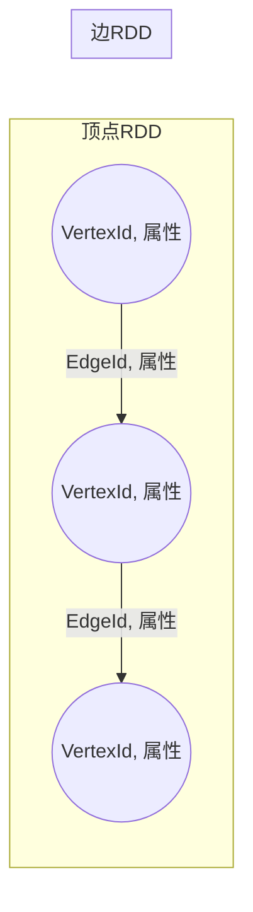
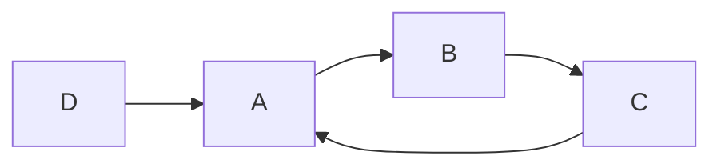
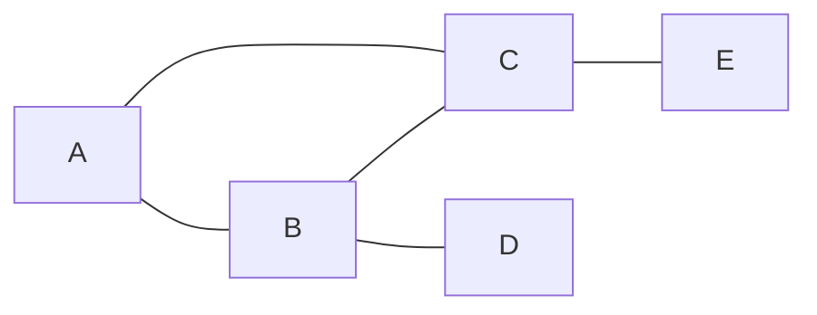

# Spark GraphX图计算引擎原理与代码实例讲解

作者：禅与计算机程序设计艺术

## 1. 背景介绍

### 1.1  什么是图计算？

图计算是一种处理图结构数据的计算模型。图是由顶点（Vertex）和边（Edge）组成的非线性数据结构，能够直观地表示现实世界中的关系和交互。例如，社交网络中的用户可以看作顶点，用户之间的关系可以看作边；交通网络中的路口可以看作顶点，道路可以看作边。

图计算的核心思想是利用图的结构信息来解决问题。传统的计算模型往往难以处理图数据，因为图数据是非线性的，数据之间存在复杂的依赖关系。而图计算算法能够有效地利用图的结构信息，对图数据进行分析和处理。

### 1.2  图计算的应用场景

图计算在很多领域都有着广泛的应用，例如：

* **社交网络分析:** 社交网络分析是图计算最经典的应用场景之一，例如用户关系分析、社区发现、用户画像等。
* **推荐系统:** 图计算可以用来构建推荐系统，例如基于用户-物品二部图的协同过滤算法。
* **金融风控:** 图计算可以用来进行金融风控，例如识别欺诈交易、识别洗钱行为等。
* **网络安全:** 图计算可以用来进行网络安全分析，例如识别网络攻击、识别恶意软件等。
* **生物信息学:** 图计算可以用来进行生物信息学研究，例如蛋白质相互作用网络分析、基因调控网络分析等。

### 1.3  Spark GraphX简介

Spark GraphX是Spark生态系统中用于图并行计算的组件，它提供了一组API用于表达图计算算法，并在Spark集群上进行高效的并行计算。

Spark GraphX建立在Spark RDD之上，充分利用了Spark的内存计算、容错机制和调度优化等特性，使得图计算能够在更大规模的数据集上进行。

## 2. 核心概念与联系

### 2.1  图的表示

在GraphX中，图是由顶点RDD和边RDD组成的。

* **顶点RDD:** 存储图的顶点信息，每个顶点都有一个唯一的ID和属性。
    
    ```scala
    val vertices: RDD[(VertexId, Any)] 
    ```
    
* **边RDD:** 存储图的边信息，每条边连接两个顶点，并可以有自己的属性。
    
    ```scala
    val edges: RDD[Edge[ED]] 
    ```
    

**图示:**



### 2.2  图的属性

GraphX中的图可以有两种属性：

* **顶点属性:** 存储在顶点RDD中，每个顶点可以有任意类型的属性。
* **边属性:** 存储在边RDD中，每条边可以有任意类型的属性。

### 2.3  图的操作

GraphX提供了丰富的图操作API，例如：

* **结构操作:** 获取图的度分布、连通分量、三角形计数等。
* **属性操作:** 修改顶点或边的属性、聚合顶点或边的属性等。
* **消息传递:** 在图的顶点之间传递消息，例如PageRank算法。
* **图算法:** GraphX内置了一些常用的图算法，例如PageRank、三角形计数、连通分量等。

## 3. 核心算法原理具体操作步骤

### 3.1 PageRank算法

PageRank算法是一种用于评估网页重要性的算法，其基本思想是：一个网页的重要程度与链接到它的网页的数量和质量成正比。

**算法步骤:**

1. 初始化：为每个网页分配一个初始的PageRank值，通常设置为1/N，其中N是网页总数。
2. 迭代计算：在每次迭代中，每个网页将其PageRank值平均分配给它所链接的网页。
3. 终止条件：当所有网页的PageRank值都收敛到一个稳定的值时，算法终止。

**GraphX实现:**

```scala
val ranks = graph.pageRank(tol=0.0001).vertices
```

### 3.2 三角形计数算法

三角形计数算法用于计算图中三角形的数量，三角形是图中三个顶点相互连接的结构。

**算法步骤:**

1. 构建邻接表：将图表示成邻接表的形式，方便查找每个顶点的邻居节点。
2. 遍历顶点：对于每个顶点v，遍历它的邻居节点u和w，如果u和w之间存在边，则构成一个三角形。

**GraphX实现:**

```scala
val triangleCount = graph.triangleCount().vertices
```

### 3.3 连通分量算法

连通分量算法用于将图划分为多个连通的子图，每个子图中的所有顶点都可以通过边相互到达。

**算法步骤:**

1. 初始化：为每个顶点分配一个唯一的标签，表示它所属的连通分量。
2. 迭代合并：在每次迭代中，对于每条边(u, v)，将u和v所属的连通分量合并成一个。
3. 终止条件：当所有顶点都属于同一个连通分量时，算法终止。

**GraphX实现:**

```scala
val cc = graph.connectedComponents().vertices
```

## 4. 数学模型和公式详细讲解举例说明

### 4.1 PageRank算法

PageRank算法的数学模型如下：

$$
PR(A) = (1-d) + d \sum_{i=1}^{n} \frac{PR(T_i)}{C(T_i)}
$$

其中：

* $PR(A)$ 表示网页A的PageRank值。
* $d$ 是阻尼系数，通常设置为0.85。
* $T_i$ 表示链接到网页A的网页。
* $C(T_i)$ 表示网页$T_i$的出度，即它链接到的网页数量。

**举例说明:**

假设有四个网页A、B、C、D，它们之间的链接关系如下图所示：



初始时，所有网页的PageRank值都为0.25。

**第一次迭代:**

* $PR(A) = (1-0.85) + 0.85 * (\frac{0.25}{1} + \frac{0.25}{1}) = 0.575$
* $PR(B) = (1-0.85) + 0.85 * (\frac{0.25}{1}) = 0.3625$
* $PR(C) = (1-0.85) + 0.85 * (\frac{0.25}{1}) = 0.3625$
* $PR(D) = (1-0.85) + 0.85 * (\frac{0.25}{1}) = 0.3625$

**第二次迭代:**

* $PR(A) = (1-0.85) + 0.85 * (\frac{0.3625}{1} + \frac{0.3625}{1}) = 0.78125$
* $PR(B) = (1-0.85) + 0.85 * (\frac{0.575}{1}) = 0.6375$
* $PR(C) = (1-0.85) + 0.85 * (\frac{0.3625}{1}) = 0.4625$
* $PR(D) = (1-0.85) + 0.85 * (\frac{0.575}{1}) = 0.6375$

以此类推，经过多次迭代后，所有网页的PageRank值都将收敛到一个稳定的值。

### 4.2 三角形计数算法

三角形计数算法的数学模型如下：

$$
\text{Triangle Count} = \frac{1}{6} \sum_{v \in V} |N(v)| \choose 2
$$

其中：

* $V$ 表示图的顶点集合。
* $N(v)$ 表示顶点v的邻居节点集合。
* $|N(v)| \choose 2$ 表示从顶点v的邻居节点集合中选取2个节点的组合数。

**举例说明:**

假设有五个顶点A、B、C、D、E，它们之间的边连接关系如下图所示：



根据公式，可以计算出该图的三角形数量为：

$$
\begin{aligned}
\text{Triangle Count} &= \frac{1}{6} * (2 + 3 + 3 + 1 + 1) \\
&= \frac{10}{6} \\
&= 1.67
\end{aligned}
$$

## 5. 项目实践：代码实例和详细解释说明

### 5.1 构建图数据

```scala
import org.apache.spark.SparkConf
import org.apache.spark.SparkContext
import org.apache.spark.graphx._

object GraphXExample {

  def main(args: Array[String]): Unit = {

    // 创建 Spark 配置
    val conf = new SparkConf().setAppName("GraphXExample").setMaster("local[*]")
    val sc = new SparkContext(conf)

    // 创建顶点 RDD
    val vertices = sc.parallelize(Array(
      (1L, ("Alice", 28)),
      (2L, ("Bob", 27)),
      (3L, ("Charlie", 65)),
      (4L, ("David", 42)),
      (5L, ("Ed", 55)),
      (6L, ("Fran", 50))
    ))

    // 创建边 RDD
    val edges = sc.parallelize(Array(
      Edge(2L, 1L, "friend"),
      Edge(2L, 4L, "colleague"),
      Edge(3L, 2L, "friend"),
      Edge(3L, 6L, "friend"),
      Edge(4L, 1L, "colleague"),
      Edge(5L, 2L, "friend"),
      Edge(5L, 3L, "friend"),
      Edge(5L, 6L, "friend")
    ))

    // 构建图
    val graph = Graph(vertices, edges)

    // 打印图的信息
    println("Graph vertices:")
    graph.vertices.collect().foreach(println)
    println("Graph edges:")
    graph.edges.collect().foreach(println)
  }
}
```

### 5.2 计算PageRank

```scala
    // 计算 PageRank
    val ranks = graph.pageRank(0.0001).vertices

    // 打印结果
    println("PageRank:")
    ranks.collect().foreach(println)
```

### 5.3 计算三角形数量

```scala
    // 计算三角形数量
    val triangleCount = graph.triangleCount().vertices

    // 打印结果
    println("Triangle Count:")
    triangleCount.collect().foreach(println)
```

### 5.4 计算连通分量

```scala
    // 计算连通分量
    val cc = graph.connectedComponents().vertices

    // 打印结果
    println("Connected Components:")
    cc.collect().foreach(println)
```

## 6. 实际应用场景

### 6.1 社交网络分析

在社交网络中，可以使用GraphX进行用户关系分析、社区发现、用户画像等。

例如，可以使用PageRank算法识别社交网络中的关键用户，可以使用连通分量算法发现社交网络中的社区结构。

### 6.2 推荐系统

在推荐系统中，可以使用GraphX构建基于图的推荐算法。

例如，可以使用协同过滤算法，根据用户-物品二部图，预测用户对物品的评分。

### 6.3 金融风控

在金融风控领域，可以使用GraphX进行欺诈检测、洗钱分析等。

例如，可以构建交易图，使用图算法识别可疑交易。

## 7. 工具和资源推荐

* **Spark官方文档:** https://spark.apache.org/docs/latest/
* **GraphX编程指南:** https://spark.apache.org/docs/latest/graphx-programming-guide.html
* **Neo4j:** https://neo4j.com/ (图数据库)
* **Gephi:** https://gephi.org/ (图可视化工具)

## 8. 总结：未来发展趋势与挑战

### 8.1 未来发展趋势

* **图计算与机器学习的结合:** 图神经网络(GNN)是近年来兴起的一种新的机器学习模型，它将图计算和深度学习结合起来，在很多领域都取得了很好的效果。
* **图计算在大规模数据集上的应用:** 随着互联网和物联网的发展，数据规模越来越大，图计算在大规模数据集上的应用将会越来越广泛。
* **图计算的实时性:** 实时图计算是未来的一个重要发展方向，它可以用于实时监控、实时推荐等场景。

### 8.2 面临的挑战

* **图计算的算法复杂度:** 图计算算法的复杂度往往比较高，如何设计高效的图计算算法是一个挑战。
* **图计算的系统优化:** 图计算系统需要处理大量的图数据，如何优化图计算系统的性能是一个挑战。
* **图计算的应用落地:** 图计算在实际应用中还面临着很多挑战，例如如何将图计算技术与业务场景结合起来。


## 9. 附录：常见问题与解答

### 9.1 如何选择合适的图计算框架？

选择合适的图计算框架需要考虑以下因素：

* **数据规模:** 不同的图计算框架适用于不同的数据规模。
* **计算模型:** 不同的图计算框架支持不同的计算模型。
* **易用性:** 不同的图计算框架的易用性不同。
* **生态系统:** 不同的图计算框架的生态系统不同。

### 9.2 如何学习图计算？

学习图计算可以参考以下资料：

* **图论基础知识:** 学习图论的基础知识，例如图的定义、图的类型、图的算法等。
* **图计算框架:** 学习常用的图计算框架，例如GraphX、Pregel、Giraph等。
* **图计算应用:** 学习图计算的应用场景，例如社交网络分析、推荐系统、金融风控等。

### 9.3 图计算的未来发展方向？

图计算的未来发展方向包括：

* **图计算与机器学习的结合:** 图神经网络(GNN)是近年来兴起的一种新的机器学习模型，它将图计算和深度学习结合起来，在很多领域都取得了很好的效果。
* **图计算在大规模数据集上的应用:** 随着互联网和物联网的发展，数据规模越来越大，图计算在大规模数据集上的应用将会越来越广泛。
* **图计算的实时性:** 实时图计算是未来的一个重要发展方向，它可以用于实时监控、实时推荐等场景。