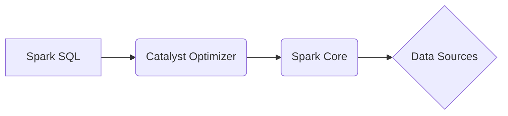

# Spark SQL原理与代码实例讲解

作者：禅与计算机程序设计艺术

## 1. 背景介绍

### 1.1 大数据时代的数据处理需求

随着互联网和物联网技术的飞速发展，全球数据量呈爆炸式增长，传统的数据库系统难以满足海量数据的存储、处理和分析需求。如何高效地处理和分析这些数据，成为企业和研究机构面临的巨大挑战。

### 1.2 Spark SQL的诞生背景

为了应对大数据时代的挑战，Apache Spark应运而生，它是一个快速、通用、可扩展的分布式计算引擎。Spark SQL是Spark生态系统中的一个重要组件，它提供了一种结构化的数据处理方式，允许用户使用SQL语言查询和操作存储在不同数据源中的数据。

### 1.3 Spark SQL的优势

相比于传统的数据库系统，Spark SQL具有以下优势：

* **高性能:** Spark SQL基于内存计算模型，能够快速地处理大规模数据集。
* **可扩展性:** Spark SQL可以运行在由数千台服务器组成的集群上，轻松处理PB级的数据。
* **易用性:** Spark SQL支持标准的SQL语法，用户可以使用熟悉的SQL语句进行数据查询和操作。
* **丰富的功能:** Spark SQL提供了丰富的内置函数和操作符，支持多种数据源和数据格式。

## 2. 核心概念与联系

### 2.1 Spark SQL架构

Spark SQL的核心架构如下图所示：



* **Spark SQL:** Spark SQL是Spark生态系统中的一个模块，它提供了一种结构化的数据处理方式。
* **Catalyst Optimizer:** Catalyst Optimizer是Spark SQL的查询优化器，它负责将SQL语句转换为高效的执行计划。
* **Spark Core:** Spark Core是Spark的基础执行引擎，负责调度和执行任务。
* **Data Sources:** Spark SQL支持多种数据源，包括HDFS、Hive、JSON、Parquet等。

### 2.2 DataFrame和DataSet

DataFrame和DataSet是Spark SQL中两个重要的数据抽象：

* **DataFrame:** DataFrame是一个分布式的数据集，它以表格的形式组织数据，类似于关系型数据库中的表。DataFrame提供了丰富的操作API，例如select、filter、groupBy等。
* **DataSet:** DataSet是DataFrame的类型化视图，它提供了编译时类型检查和更丰富的API。

### 2.3 Catalyst Optimizer

Catalyst Optimizer是Spark SQL的查询优化器，它负责将SQL语句转换为高效的执行计划。Catalyst Optimizer采用了一种基于规则的优化方法，它定义了一系列优化规则，用于对逻辑计划进行转换和优化。

## 3. 核心算法原理具体操作步骤

### 3.1 SQL语句解析

当用户提交一条SQL语句时，Spark SQL首先会对SQL语句进行解析，将其转换为一个抽象语法树(AST)。

### 3.2 逻辑计划生成

AST会被转换为一个逻辑计划，逻辑计划是一个关系代数表达式，它描述了查询的逻辑操作步骤。

### 3.3 逻辑计划优化

Catalyst Optimizer会对逻辑计划进行优化，例如：

* **谓词下推:** 将过滤条件尽可能早地应用到数据源，以减少数据传输量。
* **列裁剪:** 只选择查询需要的列，以减少数据读取量。
* **连接操作优化:** 选择合适的连接算法，以提高连接效率。

### 3.4 物理计划生成

优化后的逻辑计划会被转换为一个物理计划，物理计划描述了查询的具体执行步骤，例如：

* **数据读取:** 从哪些数据源读取数据。
* **数据混洗:** 如何将数据分发到不同的节点进行处理。
* **数据计算:** 如何对数据进行计算。

### 3.5 物理计划执行

Spark Core会根据物理计划调度和执行任务，最终将查询结果返回给用户。

## 4. 数学模型和公式详细讲解举例说明

### 4.1 关系代数

关系代数是关系型数据库的基础，它定义了一系列操作关系的操作符，例如：

* **选择:** σ(条件)(关系)
* **投影:** π(属性列表)(关系)
* **连接:** R ⋈ 条件 S

### 4.2 Catalyst Optimizer优化规则

Catalyst Optimizer定义了一系列优化规则，例如：

* **谓词下推:** σ(条件)(R ⋈ S)  =>  (σ(条件)(R)) ⋈ S
* **列裁剪:** π(A, B)(R)  =>  π(A, B)(π(A, B, C)(R))

## 5. 项目实践：代码实例和详细解释说明

### 5.1 创建SparkSession

```python
from pyspark.sql import SparkSession

spark = SparkSession.builder \
    .appName("Spark SQL Example") \
    .getOrCreate()
```

### 5.2 加载数据

```python
df = spark.read.json("data.json")
```

### 5.3 数据查询

```python
# 选择name列和age列
df.select("name", "age").show()

# 过滤age大于30岁的数据
df.filter(df["age"] > 30).show()

# 按age分组统计数量
df.groupBy("age").count().show()
```

## 6. 实际应用场景

### 6.1 数据分析

Spark SQL可以用于各种数据分析场景，例如：

* 用户行为分析
* 产品销售分析
* 金融风险控制

### 6.2 ETL

Spark SQL可以用于ETL(Extract, Transform, Load)过程中的数据清洗、转换和加载。

### 6.3 机器学习

Spark SQL可以与Spark MLlib集成，用于特征工程和模型训练。

## 7. 工具和资源推荐

### 7.1 Apache Spark官网

https://spark.apache.org/

### 7.2 Spark SQL文档

https://spark.apache.org/docs/latest/sql/

### 7.3 Databricks

https://databricks.com/

## 8. 总结：未来发展趋势与挑战

### 8.1 未来发展趋势

* 更高的性能和可扩展性
* 更丰富的功能和数据源支持
* 更智能的查询优化器
* 与人工智能技术的深度融合

### 8.2 面临的挑战

* 处理复杂数据类型和数据结构
* 保证数据质量和数据安全
* 降低学习成本和使用门槛

## 9. 附录：常见问题与解答

### 9.1 Spark SQL和Hive的区别是什么？

Hive是一个数据仓库系统，它构建在Hadoop之上，提供了一种类似于SQL的查询语言HiveQL。Spark SQL是Spark生态系统中的一个模块，它提供了一种结构化的数据处理方式，可以使用SQL语言查询和操作存储在不同数据源中的数据。

### 9.2 Spark SQL支持哪些数据源？

Spark SQL支持多种数据源，包括：

* 文件格式：CSV、JSON、Parquet、ORC等
* 数据库：MySQL、PostgreSQL、Oracle、SQL Server等
* NoSQL数据库：Cassandra、MongoDB、HBase等

### 9.3 如何提高Spark SQL的性能？

* 使用Parquet或ORC等列式存储格式
* 调整Spark SQL配置参数
* 使用数据分区和数据倾斜优化技术
* 使用缓存和持久化机制