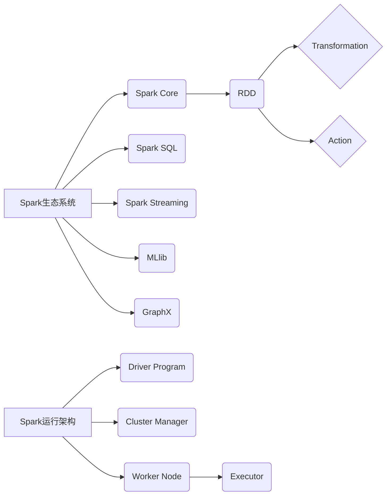

## 1. 背景介绍

### 1.1 大数据时代的计算挑战
随着互联网、物联网等技术的快速发展，全球数据量呈爆炸式增长，传统的单机计算模式已经无法满足海量数据的处理需求。如何高效地存储、处理和分析这些数据成为了企业和科研机构面临的巨大挑战。

### 1.2 分布式计算的兴起
为了应对大数据带来的挑战，分布式计算应运而生。分布式计算将计算任务分解成多个子任务，由多台计算机协同完成，从而实现对海量数据的快速处理。

### 1.3 Spark：新一代大数据处理引擎
Spark作为新一代的分布式计算引擎，凭借其高效性、易用性和通用性，迅速成为了大数据领域的明星项目。它不仅支持批处理，还支持流处理、机器学习和图计算等多种计算模式，能够满足不同场景下的数据处理需求。

## 2. 核心概念与联系

### 2.1 Spark生态系统概述
Spark生态系统包含多个组件，其中最核心的组件包括：

* **Spark Core:** Spark的核心计算引擎，提供了RDD（弹性分布式数据集）等基础抽象。
* **Spark SQL:** 用于结构化数据处理的模块，支持SQL查询和DataFrame API。
* **Spark Streaming:** 用于实时数据流处理的模块，支持DStream（离散化数据流）等抽象。
* **MLlib:** Spark的机器学习库，提供了丰富的机器学习算法和工具。
* **GraphX:** Spark的图计算引擎，支持Pregel等图计算模型。

### 2.2 RDD：Spark的核心抽象
RDD是Spark中最基本的数据抽象，它代表一个不可变的、可分区的数据集，可以分布式存储在集群中。RDD支持两种类型的操作：

* **Transformation:** 对RDD进行转换，生成新的RDD，例如map、filter、reduceByKey等。
* **Action:** 对RDD进行计算，返回结果到Driver程序，例如count、collect、saveAsTextFile等。

### 2.3 Spark运行架构
Spark采用Master/Slave架构，主要包含以下组件：

* **Driver Program:** 运行用户编写的Spark应用程序，负责将应用程序转换成多个任务，并协调任务的执行。
* **Cluster Manager:** 负责集群资源的管理和分配，例如Standalone、YARN、Mesos等。
* **Worker Node:** 集群中的工作节点，负责执行Driver Program分配的任务。
* **Executor:** 在Worker Node上启动的进程，负责执行具体的计算任务。

### 2.4 核心概念关系图



## 3. 核心算法原理具体操作步骤

### 3.1 WordCount案例分析

WordCount是一个经典的大数据处理案例，用于统计文本文件中每个单词出现的次数。下面以WordCount为例，详细介绍Spark的核心算法原理和操作步骤。

#### 3.1.1 算法流程

1. 读取输入文本文件，将文件内容转换为RDD。
2. 对RDD进行flatMap操作，将每行文本分割成单词。
3. 对单词RDD进行map操作，将每个单词映射为(word, 1)的形式。
4. 对(word, 1)RDD进行reduceByKey操作，统计每个单词出现的次数。
5. 将统计结果保存到输出文件中。

#### 3.1.2 代码实例

```scala
// 创建SparkConf对象，设置应用程序名称
val conf = new SparkConf().setAppName("WordCount")

// 创建SparkContext对象，连接到Spark集群
val sc = new SparkContext(conf)

// 读取输入文件
val input = sc.textFile("input.txt")

// 统计单词出现次数
val wordCounts = input
  .flatMap(line => line.split(" "))
  .map(word => (word, 1))
  .reduceByKey(_ + _)

// 将结果保存到输出文件
wordCounts.saveAsTextFile("output")

// 关闭SparkContext
sc.stop()
```

### 3.2 Shuffle操作详解

Shuffle是Spark中非常重要的一个操作，它用于将数据重新分布到不同的分区，以便进行后续的计算。Shuffle操作通常发生在reduceByKey、groupByKey、join等操作中。

#### 3.2.1 Shuffle过程

1. **Map阶段:**  每个Map任务将数据按照key进行分区，并将数据写入本地磁盘。
2. **Shuffle阶段:**  每个Reduce任务从各个Map任务获取属于自己的数据分区，并将数据合并。
3. **Reduce阶段:**  每个Reduce任务对获取到的数据进行聚合操作。

#### 3.2.2 Shuffle优化

Shuffle操作是Spark性能瓶颈之一，可以通过以下方式进行优化：

* **减少Shuffle数据量:**  例如，使用mapPartitions代替map操作，避免为每个元素创建新的对象。
* **调整Shuffle参数:**  例如，调整spark.shuffle.spill.numElementsForceSpillThreshold参数，控制Shuffle过程中数据溢写到磁盘的阈值。
* **使用广播变量:**  将较小的数据集广播到各个节点，避免数据传输。

## 4. 数学模型和公式详细讲解举例说明

### 4.1 TF-IDF算法

TF-IDF（Term Frequency-Inverse Document Frequency）是一种常用的文本挖掘算法，用于评估一个词语对于一个文档集或语料库中的其中一份文档的重要程度。

#### 4.1.1 TF-IDF公式

$$
TF-IDF(t, d, D) = TF(t, d) * IDF(t, D)
$$

其中：

* **t:**  词语
* **d:**  文档
* **D:**  文档集
* **TF(t, d):**  词语t在文档d中出现的频率
* **IDF(t, D):**  词语t在文档集D中的逆文档频率，计算公式如下：

$$
IDF(t, D) = log(\frac{|D|}{|\{d \in D : t \in d\}|})
$$

#### 4.1.2 代码实例

```scala
import org.apache.spark.mllib.feature.{HashingTF, IDF}

// 创建SparkContext对象
val sc = new SparkContext(conf)

// 加载文档数据
val documents: RDD[Seq[String]] = sc.textFile("documents.txt")
  .map(_.split(" ").toSeq)

// 创建HashingTF对象
val hashingTF = new HashingTF()

// 计算每个文档的词频向量
val tf: RDD[Vector] = hashingTF.transform(documents)

// 创建IDF模型
val idf = new IDF().fit(tf)

// 计算每个文档的TF-IDF向量
val tfidf: RDD[Vector] = idf.transform(tf)
```

### 4.2 PageRank算法

PageRank是Google用于评估网页重要性的一种算法，它基于以下假设：

* 一个网页被链接的次数越多，则该网页越重要。
* 链接到一个网页的网页越重要，则该网页越重要。

#### 4.2.1 PageRank公式

$$
PR(p_i) = \frac{1 - d}{N} + d \sum_{p_j \in M(p_i)} \frac{PR(p_j)}{L(p_j)}
$$

其中：

* **PR(p_i):**  网页$p_i$的PageRank值
* **N:**  网页总数
* **d:**  阻尼系数，通常设置为0.85
* **M(p_i):**  链接到网页$p_i$的网页集合
* **L(p_j):**  网页$p_j$链接到的网页数量

#### 4.2.2 代码实例

```scala
import org.apache.spark.graphx._

// 创建SparkContext对象
val sc = new SparkContext(conf)

// 加载图数据
val edges: RDD[Edge[Double]] = sc.textFile("graph.txt")
  .map { line =>
    val parts = line.split(" ")
    Edge(parts(0).toLong, parts(1).toLong, 1.0)
  }

// 创建图
val graph = Graph.fromEdges(edges, 0.0)

// 运行PageRank算法
val ranks = graph.pageRank(0.0001).vertices

// 打印结果
ranks.collect().foreach(println)
```

## 5. 项目实践：代码实例和详细解释说明

### 5.1 电商网站用户行为分析

本案例模拟一个电商网站的用户行为数据，使用Spark对用户行为进行分析，例如统计用户访问次数、购买商品次数、平均消费金额等。

#### 5.1.1 数据集

| 用户ID | 商品ID | 行为类型 | 时间戳 |
|---|---|---|---|
| 1 | 1001 | 浏览 | 2024-05-23 10:00:00 |
| 1 | 1002 | 购买 | 2024-05-23 10:10:00 |
| 2 | 1003 | 浏览 | 2024-05-23 10:20:00 |
| 2 | 1004 | 购买 | 2024-05-23 10:30:00 |
| 3 | 1001 | 浏览 | 2024-05-23 10:40:00 |

#### 5.1.2 代码实现

```scala
import org.apache.spark.sql.SparkSession

// 创建SparkSession对象
val spark = SparkSession.builder()
  .appName("UserBehaviorAnalysis")
  .getOrCreate()

// 读取用户行为数据
val userBehavior = spark.read.format("csv")
  .option("header", "true")
  .load("user_behavior.csv")

// 统计用户访问次数
val userVisitCount = userBehavior
  .groupBy("用户ID")
  .count()

// 统计用户购买商品次数
val userPurchaseCount = userBehavior
  .filter($"行为类型" === "购买")
  .groupBy("用户ID")
  .count()

// 计算用户平均消费金额
val userAvgPurchaseAmount = userBehavior
  .filter($"行为类型" === "购买")
  .groupBy("用户ID")
  .agg(avg("商品ID").alias("平均消费金额"))

// 打印结果
userVisitCount.show()
userPurchaseCount.show()
userAvgPurchaseAmount.show()

// 关闭SparkSession
spark.stop()
```

### 5.2  Spark Streaming实时日志分析

本案例模拟一个实时日志数据流，使用Spark Streaming对日志数据进行实时分析，例如统计每分钟的访问量、错误率等。

#### 5.2.1 数据集

```
2024-05-23 10:00:00 INFO  用户1访问首页
2024-05-23 10:00:10 ERROR 用户2访问商品详情页出错
2024-05-23 10:00:20 INFO  用户3访问订单列表页
2024-05-23 10:01:00 INFO  用户4访问首页
2024-05-23 10:01:10 INFO  用户5访问商品详情页
```

#### 5.2.2 代码实现

```scala
import org.apache.spark.SparkConf
import org.apache.spark.streaming.{Seconds, StreamingContext}

// 创建SparkConf对象
val conf = new SparkConf().setAppName("RealTimeLogAnalysis")

// 创建StreamingContext对象
val ssc = new StreamingContext(conf, Seconds(60))

// 创建DStream，接收日志数据
val lines = ssc.socketTextStream("localhost", 9999)

// 解析日志数据
val logData = lines.map { line =>
  val parts = line.split(" ")
  val timestamp = parts(0) + " " + parts(1)
  val level = parts(2)
  val message = parts.drop(3).mkString(" ")
  (timestamp, level, message)
}

// 统计每分钟的访问量
val visitCount = logData
  .filter(_._2 == "INFO")
  .map(_._1.substring(0, 16))
  .countByValue()

// 统计每分钟的错误率
val errorRate = logData
  .map { case (_, level, _) =>
    if (level == "ERROR") 1 else 0
  }
  .reduceByWindow(_ + _, _ - _, Seconds(60), Seconds(60))
  .map(count => count.toDouble / 60)

// 打印结果
visitCount.print()
errorRate.print()

// 启动Spark Streaming应用程序
ssc.start()
ssc.awaitTermination()
```

## 6. 工具和资源推荐

* **Spark官网:** https://spark.apache.org/
* **Spark官方文档:** https://spark.apache.org/docs/latest/
* **Spark源码:** https://github.com/apache/spark
* **Spark学习资料:** 
    * **《Spark快速大数据分析》**
    * **《Spark机器学习》**
    * **《Spark GraphX实战》**

## 7. 总结：未来发展趋势与挑战

### 7.1 未来发展趋势

* **更强大的计算能力:**  随着硬件技术的不断发展，Spark将能够处理更大规模的数据集，并支持更加复杂的计算任务。
* **更丰富的应用场景:**  Spark将被应用于更多领域，例如人工智能、物联网、金融等。
* **更易用和智能化:**  Spark将提供更加友好和智能化的API和工具，降低用户的使用门槛。

### 7.2 面临的挑战

* **性能优化:**  随着数据规模的不断增长，Spark需要不断优化性能，以满足日益增长的计算需求。
* **安全性和可靠性:**  Spark需要提供更加安全可靠的数据处理能力，以保护用户数据的安全。
* **生态系统建设:**  Spark需要不断完善其生态系统，提供更加丰富的工具和资源，以满足用户的多样化需求。

## 8. 附录：常见问题与解答

### 8.1 Spark与Hadoop的区别？

Spark和Hadoop都是开源的分布式计算框架，但它们之间存在一些区别：

* **计算模型:**  Hadoop使用MapReduce计算模型，而Spark支持多种计算模型，包括MapReduce、SQL、流处理、机器学习和图计算。
* **数据存储:**  Hadoop使用HDFS存储数据，而Spark可以使用多种数据存储系统，包括HDFS、本地文件系统、Amazon S3、HBase等。
* **性能:**  Spark比Hadoop更快，因为它将数据存储在内存中进行计算，而Hadoop需要将数据写入磁盘。

### 8.2 Spark如何保证数据可靠性？

Spark通过以下机制保证数据可靠性：

* **数据冗余:**  Spark将数据存储在多个节点上，即使某个节点出现故障，也不会导致数据丢失。
* **任务重试:**  如果某个任务执行失败，Spark会自动将其调度到其他节点上重新执行。
* **数据恢复:**  如果某个节点出现故障，Spark可以从其他节点恢复数据。

### 8.3 Spark如何进行性能优化？

Spark性能优化可以从以下几个方面入手：

* **数据分区:**  合理的数据分区可以减少数据传输量，提高数据局部性。
* **数据序列化:**  使用高效的数据序列化格式可以减少数据存储空间和网络传输时间。
* **内存管理:**  合理地设置内存使用参数可以避免内存溢出，提高程序运行效率。
* **代码优化:**  编写高效的Spark代码可以充分利用集群资源，提高程序性能。
