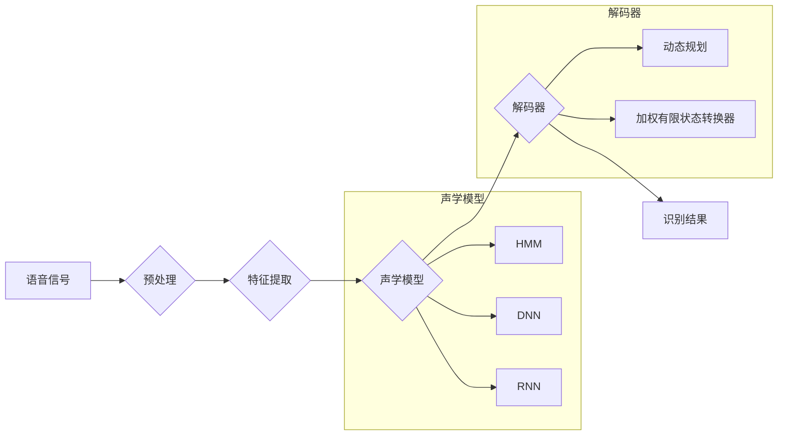

## 1. 背景介绍

### 1.1 语音识别的发展历程

语音识别技术，简单来说就是让机器能够“听懂”人类语音的一项技术，其发展历程可以追溯到20世纪50年代。从最初只能识别单个数字的简单系统，到如今能够理解自然语言的复杂模型，语音识别技术经历了漫长的发展历程。

- **萌芽阶段（20世纪50-60年代）：**  这一阶段主要集中在孤立词语音识别，即识别单个的、发音清晰的词语，例如数字、简单的命令词等。
- **技术突破阶段（20世纪70-80年代）：** 随着计算机技术的进步和语音信号处理理论的发展，语音识别技术取得了突破性进展。隐马尔可夫模型（HMM）的引入，使得语音识别系统能够处理连续语音，识别精度也得到了显著提高。
- **快速发展阶段（20世纪90年代至今）：** 随着互联网的普及和计算能力的提升，语音识别技术进入了快速发展阶段。统计机器学习方法，特别是深度学习技术的应用，极大地提升了语音识别的性能，使得语音识别系统能够处理更加复杂的任务，例如大词汇量连续语音识别、说话人识别等。

### 1.2 语音识别的应用领域

如今，语音识别技术已经渗透到我们生活的方方面面，其应用领域涵盖了：

- **智能家居：** 语音控制家电、智能音箱等。
- **移动设备：** 语音助手、语音输入法等。
- **医疗保健：** 语音电子病历、语音辅助诊断等。
- **教育培训：** 语音评测、语音交互式学习等。
- **安防监控：** 语音识别报警、语音身份验证等。

### 1.3 语音识别的技术挑战

尽管语音识别技术已经取得了长足的进步，但仍然面临着一些技术挑战，例如：

- **环境噪声的影响：** 现实环境中存在各种噪声，例如背景噪音、人声干扰等，这些噪声会严重影响语音识别的准确率。
- **说话人差异的影响：** 不同说话人的语音特征存在差异，例如口音、语速、语调等，这些差异也会影响语音识别的性能。
- **语言多样性的挑战：** 全球范围内存在着大量的语言和方言，开发能够识别多种语言的语音识别系统是一项巨大的挑战。

## 2. 核心概念与联系

### 2.1 语音识别系统的基本流程

一个典型的语音识别系统通常包含以下几个核心模块：



1. **预处理：** 对输入的语音信号进行去噪、静音检测、端点检测等处理，以提高后续处理的效率和准确性。
2. **特征提取：** 从预处理后的语音信号中提取能够表征语音内容的特征参数，例如MFCC、PLP等。
3. **声学模型：** 建立声学特征与音素之间的映射关系，常用的声学模型包括HMM、DNN、RNN等。
4. **语言模型：** 建立语言单元（例如词语、句子）之间的概率关系，用于约束解码过程，提高识别结果的流畅性和准确性。
5. **解码器：** 在声学模型和语言模型的指导下，将声学特征序列解码成文本序列，常用的解码算法包括动态规划、加权有限状态转换器等。

### 2.2 声学模型

声学模型是语音识别系统的核心模块之一，其作用是建立声学特征与音素之间的映射关系。常用的声学模型包括：

- **隐马尔可夫模型（HMM）：**  HMM是一种统计模型，用于描述一个系统在不同状态之间的转移概率以及每个状态下观测到不同特征的概率。在语音识别中，HMM的状态通常对应于音素，观测值对应于声学特征。
- **深度神经网络（DNN）：** DNN是一种多层神经网络，能够学习复杂的非线性关系。在语音识别中，DNN可以用于直接预测声学特征对应的音素概率，相比HMM具有更好的性能。
- **循环神经网络（RNN）：** RNN是一种能够处理序列数据的深度学习模型，能够捕捉语音信号中的时序信息。在语音识别中，RNN可以用于建模语音信号的上下文信息，进一步提升识别性能。

### 2.3 语言模型

语言模型用于描述语言单元（例如词语、句子）之间的概率关系，其作用是在解码过程中提供语言约束，提高识别结果的流畅性和准确性。常用的语言模型包括：

- **N-gram语言模型：** N-gram模型基于马尔可夫假设，认为一个词出现的概率只与其前N-1个词相关。
- **神经网络语言模型：** 神经网络语言模型利用神经网络学习词语之间的语义关系，能够捕捉更长距离的上下文信息，相比N-gram模型具有更好的性能。

## 3. 核心算法原理具体操作步骤

### 3.1 语音信号预处理

语音信号预处理的目的是消除或减弱语音信号中的噪声和干扰，提高后续处理的效率和准确性。常用的预处理方法包括：

- **去噪：** 采用谱减法、维纳滤波等方法去除语音信号中的背景噪声。
- **静音检测：**  识别语音信号中的静音段，将其剔除，保留有效的语音片段。
- **端点检测：** 确定语音信号的起始和结束点，提取完整的语音片段。

### 3.2 语音特征提取

语音特征提取的目的是从预处理后的语音信号中提取能够表征语音内容的特征参数。常用的语音特征包括：

- **MFCC（Mel频率倒谱系数）：** MFCC是一种基于人耳听觉特性的特征参数，能够有效地表征语音的频谱包络信息。
- **PLP（感知线性预测）：** PLP是一种基于听觉模型的特征参数，能够模拟人耳的听觉感知特性，提取更符合人耳听觉特性的特征。

### 3.3 声学模型训练

声学模型训练的目的是利用大量的语音数据，训练一个能够将声学特征映射到音素的模型。以DNN为例，声学模型训练的基本步骤如下：

1. **准备训练数据：** 收集大量的语音数据，并进行标注，即标注出每个语音片段对应的文本内容。
2. **构建DNN模型：**  根据任务需求，选择合适的网络结构，例如层数、每层神经元个数、激活函数等。
3. **训练模型：** 利用标注好的语音数据，采用梯度下降等优化算法训练DNN模型，使得模型能够根据输入的声学特征预测对应的音素概率。

### 3.4 解码

解码的目的是在声学模型和语言模型的指导下，将声学特征序列解码成文本序列。常用的解码算法包括：

- **动态规划：** 动态规划算法是一种全局搜索算法，能够找到最优的解码路径。
- **加权有限状态转换器（WFST）：** WFST是一种高效的解码算法，能够将声学模型、语言模型和词典等信息整合到一个统一的框架中，实现高效的解码。


## 4. 数学模型和公式详细讲解举例说明

### 4.1 隐马尔可夫模型（HMM）

HMM是一种统计模型，用于描述一个系统在不同状态之间的转移概率以及每个状态下观测到不同特征的概率。在语音识别中，HMM的状态通常对应于音素，观测值对应于声学特征。

**HMM的定义：**

一个HMM模型可以表示为一个五元组 $\lambda = (S, V, A, B, \pi)$，其中：

- $S$ 是状态集合，表示模型所有可能的状态。
- $V$ 是观测值集合，表示模型所有可能的观测值。
- $A$ 是状态转移概率矩阵，$A_{ij} = P(s_t = j | s_{t-1} = i)$ 表示从状态 $i$ 转移到状态 $j$ 的概率。
- $B$ 是观测概率矩阵，$B_{jk} = P(o_t = k | s_t = j)$ 表示在状态 $j$ 下观测到观测值 $k$ 的概率。
- $\pi$ 是初始状态概率分布，$\pi_i = P(s_1 = i)$ 表示初始状态为 $i$ 的概率。

**HMM的三个基本问题：**

1. **评估问题：** 给定一个HMM模型 $\lambda$ 和一个观测序列 $O = (o_1, o_2, ..., o_T)$，计算该观测序列出现的概率 $P(O|\lambda)$。
2. **解码问题：** 给定一个HMM模型 $\lambda$ 和一个观测序列 $O = (o_1, o_2, ..., o_T)$，找到最有可能产生该观测序列的状态序列 $S = (s_1, s_2, ..., s_T)$。
3. **训练问题：** 给定一个观测序列 $O = (o_1, o_2, ..., o_T)$，估计HMM模型 $\lambda = (S, V, A, B, \pi)$ 的参数。

**HMM在语音识别中的应用：**

在语音识别中，HMM的状态通常对应于音素，观测值对应于声学特征。例如，对于音素 /a/，我们可以建立一个HMM模型，该模型包含三个状态，分别表示音素 /a/ 的起始、中间和结束状态。每个状态下都对应一个观测概率分布，表示在该状态下观测到不同声学特征的概率。

### 4.2 深度神经网络（DNN）

DNN是一种多层神经网络，能够学习复杂的非线性关系。在语音识别中，DNN可以用于直接预测声学特征对应的音素概率，相比HMM具有更好的性能。

**DNN的结构：**

一个DNN模型通常包含多个隐藏层，每个隐藏层包含多个神经元。每个神经元都与上一层的所有神经元相连，并通过一个激活函数进行非线性变换。

**DNN的训练：**

DNN的训练过程通常采用反向传播算法，利用大量的训练数据，不断调整网络的权重和偏置，使得模型能够根据输入的特征预测对应的输出。

**DNN在语音识别中的应用：**

在语音识别中，DNN可以用于直接预测声学特征对应的音素概率。例如，对于一个包含13维MFCC特征的语音帧，我们可以构建一个DNN模型，该模型的输入层包含13个神经元，输出层包含音素个数个神经元。通过训练，DNN模型可以根据输入的MFCC特征预测每个音素的概率。

## 5. 项目实践：代码实例和详细解释说明

### 5.1 基于Python的语音识别系统实现

```python
import speech_recognition as sr

# 初始化识别器
r = sr.Recognizer()

# 读取音频文件
with sr.AudioFile('audio.wav') as source:
    # 监听音频
    audio_data = r.record(source)

    # 识别语音
    try:
        # 使用Google Speech Recognition进行识别
        text = r.recognize_google(audio_data)
        print("Google Speech Recognition:", text)
    except sr.UnknownValueError:
        print("Google Speech Recognition could not understand audio")
    except sr.RequestError as e:
        print("Could not request results from Google Speech Recognition service; {0}".format(e))
```

**代码解释：**

1. 首先，我们导入 `speech_recognition` 库，该库提供了语音识别功能。
2. 然后，我们初始化一个识别器对象 `r`。
3. 接下来，我们使用 `sr.AudioFile` 函数读取音频文件 `audio.wav`，并使用 `r.record` 函数监听音频数据。
4. 最后，我们使用 `r.recognize_google` 函数调用 Google Speech Recognition API 进行语音识别，并将识别结果打印出来。

### 5.2 使用Kaldi工具包进行语音识别

Kaldi是一个开源的语音识别工具包，提供了丰富的语音识别功能，包括特征提取、声学模型训练、解码等。

**使用Kaldi进行语音识别的基本步骤如下：**

1. **数据准备：** 收集语音数据，并进行标注。
2. **特征提取：** 使用Kaldi提供的工具提取MFCC等语音特征。
3. **声学模型训练：** 使用Kaldi提供的训练脚本训练声学模型，例如GMM-HMM、DNN-HMM等。
4. **解码：** 使用Kaldi提供的解码工具进行解码，得到识别结果。

## 6. 实际应用场景

### 6.1 智能家居

- **语音控制家电：** 用户可以通过语音指令控制家电的开关、模式、温度等。例如，“打开空调，温度调到26度”。
- **智能音箱：** 智能音箱可以通过语音交互的方式，为用户提供音乐播放、新闻播报、天气查询等服务。

### 6.2 移动设备

- **语音助手：** 语音助手可以帮助用户完成打电话、发短信、设置闹钟、查询信息等操作。
- **语音输入法：** 语音输入法可以让用户通过语音输入文字，提高输入效率。

### 6.3 医疗保健

- **语音电子病历：**  医生可以使用语音输入的方式记录病历，提高工作效率。
- **语音辅助诊断：** 语音识别技术可以用于辅助医生进行疾病诊断，例如识别患者的语音症状。

### 6.4 教育培训

- **语音评测：** 语音评测系统可以对学生的语音进行评分，帮助学生提高口语水平。
- **语音交互式学习：** 语音交互式学习系统可以让学生通过语音与系统进行交互，提高学习兴趣和效率。

## 7. 工具和资源推荐

### 7.1 语音识别工具包

- **Kaldi：** 开源的语音识别工具包，提供了丰富的语音识别功能。
- **CMU Sphinx：** 由卡耐基梅隆大学开发的开源语音识别工具包。
- **HTK：** 由剑桥大学开发的语音识别工具包。

### 7.2 语音数据集

- **LibriSpeech：** 包含约1000小时的英语语音数据集。
- **TIMIT：** 包含约5小时的英语语音数据集，用于声学-语音学研究。
- **WSJ：** 包含约80小时的英语语音数据集，用于语音识别研究。

### 7.3 语音识别学习资源

- **斯坦福大学公开课：自然语言处理：**  介绍自然语言处理的基本概念和技术，包括语音识别。
- **Coursera课程：语音识别：**  介绍语音识别的基本原理和技术，包括HMM、DNN等。

## 8. 总结：未来发展趋势与挑战

### 8.1 未来发展趋势

- **端到端语音识别：**  端到端语音识别系统将语音信号直接转换成文本，无需进行人工设计的特征提取和声学模型建模。
- **多语言语音识别：**  开发能够识别多种语言的语音识别系统，以满足全球用户的需求。
- **低资源语音识别：**  针对数据量较少的语言或方言，开发低资源语音识别系统。

### 8.2 面临的挑战

- **环境鲁棒性：** 提高语音识别系统在噪声环境下的鲁棒性。
- **说话人自适应：**  提高语音识别系统对不同说话人的适应能力。
- **语言模型的改进：**  开发更强大的语言模型，提高识别结果的流畅性和准确性。


## 9. 附录：常见问题与解答

### 9.1  问：语音识别技术的准确率如何？

答：语音识别技术的准确率取决于多种因素，包括语音数据的质量、声学环境、说话人的口音等。目前，在安静的环境下，对于发音清晰的语音，语音识别系统的准确率可以达到95%以上。

### 9.2 问：如何提高语音识别的准确率？

答：提高语音识别准确率的方法包括：

- **使用高质量的语音数据进行训练。**
- **降低环境噪声的影响。**
- **使用更强大的声学模型和语言模型。**
- **进行说话人自适应。**

### 9.3 问：语音识别技术有哪些应用场景？

答：语音识别技术的应用场景非常广泛，包括智能家居、移动设备、医疗保健、教育培训、安防监控等。
