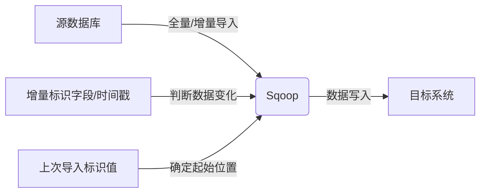

# Sqoop增量导入原理与代码实例讲解

作者：禅与计算机程序设计艺术

## 1. 背景介绍

在当今大数据时代，海量数据的处理和分析已经成为企业发展的重要基石。如何高效地将数据从关系型数据库（RDBMS）迁移到 Hadoop 生态系统中，是许多企业面临的一项挑战。Sqoop 作为 Apache 基金会开源的一款数据迁移工具，能够便捷地实现 RDBMS 与 Hadoop 之间的数据交换，被广泛应用于数据仓库、ETL 等领域。

Sqoop 提供了两种数据导入模式：全量导入和增量导入。全量导入会将源表中的所有数据一次性导入到目标系统中，适用于初始数据迁移或历史数据备份等场景。而增量导入则只导入自上次导入操作以来发生变化的数据，适用于实时数据同步、数据增量更新等场景。

本文将深入探讨 Sqoop 增量导入的原理和实现机制，并结合实际代码实例，帮助读者掌握 Sqoop 增量导入的核心技术。

### 1.1. Sqoop 简介

Sqoop (SQL-to-Hadoop) 是 Apache 软件基金会开源的一款用于在结构化数据存储（如关系数据库）与 Hadoop 分布式文件系统（HDFS）之间传输数据的工具。Sqoop 支持从关系数据库（如 MySQL、Oracle、PostgreSQL 等）导入数据到 Hadoop 生态系统中（如 HDFS、Hive、HBase 等），也支持将 Hadoop 生态系统中的数据导出到关系数据库中。

### 1.2. 增量导入的应用场景

增量导入适用于以下场景：

- **实时数据同步**: 将关系数据库中的最新数据实时同步到 Hadoop 生态系统中，用于实时数据分析、机器学习等场景。
- **数据增量更新**: 定期将关系数据库中新增或修改的数据更新到 Hadoop 生态系统中，保持数据的一致性。
- **降低数据传输成本**: 相比于全量导入，增量导入只传输变化的数据，可以有效降低数据传输成本和时间。

## 2. 核心概念与联系

### 2.1. 增量导入的类型

Sqoop 支持两种类型的增量导入：

- **基于时间戳的增量导入**: 根据数据记录的时间戳字段判断数据是否发生变化，只导入时间戳大于上次导入时间戳的数据。
- **基于增量标识字段的增量导入**: 根据数据记录的增量标识字段判断数据是否发生变化，只导入增量标识字段值大于上次导入标识值的数据。

### 2.2. 关键参数

Sqoop 增量导入涉及以下关键参数：

- **--incremental**: 指定增量导入模式，可选值为 `append` 和 `lastmodified`。
    - `append`: 基于增量标识字段的增量导入模式。
    - `lastmodified`: 基于时间戳的增量导入模式。
- **--check-column**: 指定用于判断数据是否发生变化的字段，可以是时间戳字段或增量标识字段。
- **--last-value**: 指定上次导入操作的标识值，用于确定本次导入的起始位置。

### 2.3.  核心概念联系

下图展示了 Sqoop 增量导入的核心概念及其联系：



## 3. 核心算法原理具体操作步骤

### 3.1. 基于时间戳的增量导入

基于时间戳的增量导入的步骤如下:

1. **确定上次导入时间戳**: 在第一次增量导入时，需要指定一个初始时间戳作为 `--last-value` 参数的值。在后续的增量导入中，`--last-value` 参数的值将自动更新为上次导入的最大时间戳。
2. **读取源数据**: Sqoop 根据用户指定的查询语句从源数据库中读取数据。
3. **过滤数据**: Sqoop 根据 `--check-column` 参数指定的字段和 `--last-value` 参数的值过滤数据，只保留时间戳大于 `--last-value` 的数据。
4. **写入目标系统**: Sqoop 将过滤后的数据写入到目标系统中。
5. **更新 `--last-value`**: Sqoop 记录本次导入的最大时间戳，用于下次增量导入。

### 3.2. 基于增量标识字段的增量导入

基于增量标识字段的增量导入的步骤如下:

1. **确定上次导入标识值**: 在第一次增量导入时，需要指定一个初始标识值作为 `--last-value` 参数的值。在后续的增量导入中，`--last-value` 参数的值将自动更新为上次导入的最大标识值。
2. **读取源数据**: Sqoop 根据用户指定的查询语句从源数据库中读取数据。
3. **过滤数据**: Sqoop 根据 `--check-column` 参数指定的字段和 `--last-value` 参数的值过滤数据，只保留标识值大于 `--last-value` 的数据。
4. **写入目标系统**: Sqoop 将过滤后的数据写入到目标系统中。
5. **更新 `--last-value`**: Sqoop 记录本次导入的最大标识值，用于下次增量导入。

## 4. 数学模型和公式详细讲解举例说明

本节以基于时间戳的增量导入为例，详细讲解 Sqoop 增量导入的数学模型和公式。

### 4.1. 变量定义

- $T_i$: 第 $i$ 次增量导入的时间戳。
- $D_i$: 第 $i$ 次增量导入的数据集。
- $D$: 源数据库中的完整数据集。

### 4.2. 数学模型

基于时间戳的增量导入可以表示为以下数学模型：

$$
\begin{aligned}
D_1 &= \{d \in D | d.timestamp > T_0\} \\
D_2 &= \{d \in D | d.timestamp > T_1\} \\
&\dots \\
D_i &= \{d \in D | d.timestamp > T_{i-1}\}
\end{aligned}
$$

其中，$T_0$ 表示初始时间戳，$d.timestamp$ 表示数据记录的时间戳字段。

### 4.3. 举例说明

假设源数据库中有一个名为 `users` 的表，包含以下数据：

| id | name | timestamp |
|---|---|---|
| 1 | Alice | 2023-05-23 10:00:00 |
| 2 | Bob | 2023-05-23 10:01:00 |
| 3 | Charlie | 2023-05-23 10:02:00 |
| 4 | David | 2023-05-23 10:03:00 |

第一次增量导入时，指定初始时间戳为 `2023-05-23 10:00:00`，则第一次增量导入的数据集为：

```
id,name,timestamp
2,Bob,2023-05-23 10:01:00
3,Charlie,2023-05-23 10:02:00
4,David,2023-05-23 10:03:00
```

第二次增量导入时，`--last-value` 参数的值将自动更新为 `2023-05-23 10:03:00`，则第二次增量导入的数据集为空。

## 5. 项目实践：代码实例和详细解释说明

### 5.1. 环境准备

- Hadoop 集群
- MySQL 数据库
- Sqoop 客户端

### 5.2. 数据准备

在 MySQL 数据库中创建一个名为 `users` 的表，并插入一些测试数据：

```sql
CREATE TABLE users (
  id INT PRIMARY KEY AUTO_INCREMENT,
  name VARCHAR(255) NOT NULL,
  timestamp TIMESTAMP DEFAULT CURRENT_TIMESTAMP ON UPDATE CURRENT_TIMESTAMP
);

INSERT INTO users (name) VALUES
  ('Alice'),
  ('Bob'),
  ('Charlie');
```

### 5.3. 基于时间戳的增量导入

```bash
# 第一次增量导入
sqoop import \
  --connect jdbc:mysql://localhost:3306/test \
  --username root \
  --password root \
  --table users \
  --incremental lastmodified \
  --check-column timestamp \
  --last-value '2023-05-23 10:00:00' \
  --target-dir /user/hive/warehouse/users \
  --hive-import \
  --create-hive-table

# 插入新数据
INSERT INTO users (name) VALUES
  ('David');

# 第二次增量导入
sqoop import \
  --connect jdbc:mysql://localhost:3306/test \
  --username root \
  --password root \
  --table users \
  --incremental lastmodified \
  --check-column timestamp \
  --last-value '1970-01-01 00:00:00' \
  --target-dir /user/hive/warehouse/users \
  --hive-import \
  --create-hive-table
```

### 5.4. 基于增量标识字段的增量导入

```sql
# 修改 users 表结构，添加自增 ID 字段
ALTER TABLE users ADD COLUMN increment_id INT AUTO_INCREMENT;
```

```bash
# 第一次增量导入
sqoop import \
  --connect jdbc:mysql://localhost:3306/test \
  --username root \
  --password root \
  --table users \
  --incremental append \
  --check-column increment_id \
  --last-value 0 \
  --target-dir /user/hive/warehouse/users \
  --hive-import \
  --create-hive-table

# 插入新数据
INSERT INTO users (name) VALUES
  ('David');

# 第二次增量导入
sqoop import \
  --connect jdbc:mysql://localhost:3306/test \
  --username root \
  --password root \
  --table users \
  --incremental append \
  --check-column increment_id \
  --last-value 0 \
  --target-dir /user/hive/warehouse/users \
  --hive-import \
  --create-hive-table
```

## 6. 实际应用场景

Sqoop 增量导入在实际应用中有着广泛的应用，以下是一些常见的应用场景：

- **电商网站**: 将用户订单、商品信息等数据实时同步到 Hadoop 生态系统中，用于实时数据分析、推荐系统等场景。
- **金融行业**: 将交易记录、客户信息等数据增量更新到 Hadoop 生态系统中，用于风险控制、反欺诈等场景。
- **物联网**: 将传感器采集的数据实时同步到 Hadoop 生态系统中，用于设备监控、数据分析等场景。

## 7. 工具和资源推荐

- **Sqoop 官网**: https://sqoop.apache.org/
- **Sqoop 官方文档**: https://sqoop.apache.org/docs/1.4.7/SqoopUserGuide.html

## 8. 总结：未来发展趋势与挑战

Sqoop 作为一款成熟的数据迁移工具，在未来仍将扮演着重要的角色。以下是一些未来发展趋势和挑战：

- **支持更多的数据源**: Sqoop 目前支持关系数据库、NoSQL 数据库等数据源，未来需要支持更多类型的数据源，如云数据库、消息队列等。
- **提高数据传输性能**: 随着数据量的不断增长，Sqoop 需要不断优化数据传输性能，以满足大规模数据迁移的需求。
- **增强数据质量控制**: Sqoop 需要提供更完善的数据质量控制机制，确保数据迁移的准确性和完整性。

## 9. 附录：常见问题与解答

### 9.1. 如何处理增量导入过程中出现的错误？

Sqoop 提供了多种错误处理机制，如重试机制、失败重跑机制等。可以通过配置相关参数来控制错误处理策略。

### 9.2. 如何监控 Sqoop 增量导入任务的执行情况？

可以使用 Hadoop 生态系统中的监控工具（如 Yarn、Ganglia 等）来监控 Sqoop 增量导入任务的执行情况。

### 9.3. 如何优化 Sqoop 增量导入的性能？

可以通过以下方式优化 Sqoop 增量导入的性能：

- 使用压缩算法压缩数据。
- 调整 Sqoop 的并发参数。
- 优化数据库查询语句。
- 使用数据分区技术。