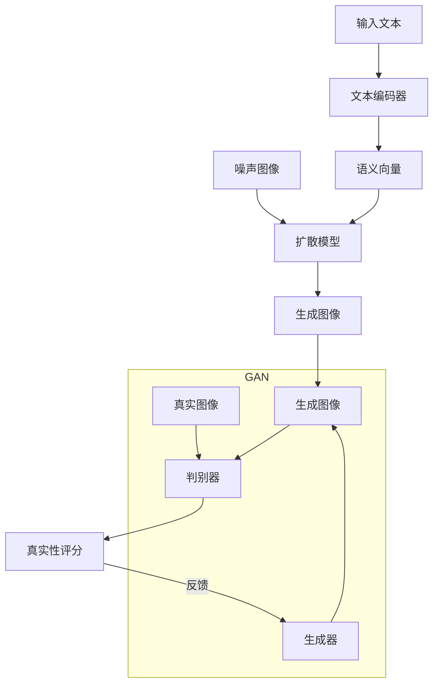

# Stable Diffusion原理与代码实例讲解

## 1.背景介绍

### 1.1 什么是Stable Diffusion?

Stable Diffusion是一种基于深度学习的文本到图像生成模型,由Stability AI公司和LAION等机构共同开发。它能够根据文本描述生成高分辨率、高质量的图像,在视觉创作、设计、娱乐等领域有着广泛的应用前景。

Stable Diffusion的核心是一种生成式对抗网络(Generative Adversarial Network, GAN),由一个生成器网络和一个判别器网络组成。生成器从随机噪声开始,尝试生成与给定文本描述相匹配的图像,而判别器则评估生成图像与真实图像的相似程度,两者通过对抗训练不断改进生成质量。

### 1.2 Stable Diffusion的重要性

人工智能图像生成技术正在快速发展,Stable Diffusion作为开源且性能卓越的模型,在以下几个方面具有重要意义:

1. **民主化创作**:Stable Diffusion使图像创作不再只局限于专业人士,普通用户只需输入文本就可创作出精美图像,大大降低了创作门槛。

2. **加速设计迭代**:在产品设计、视觉营销等领域,Stable Diffusion可快速生成多种设计方案,提高设计效率。

3. **推动AI艺术发展**:Stable Diffusion可用于生成独特的艺术作品,为AI艺术注入新的活力。

4. **缓解数据瓶颈**:相比收集大量真实图像数据,Stable Diffusion只需文本描述即可生成所需图像,有助于解决数据稀缺问题。

5. **可解释性更强**:基于文本的图像生成具有很好的可解释性,有助于理解模型内在机制。

## 2.核心概念与联系

### 2.1 生成式对抗网络(GAN)

Stable Diffusion的核心是生成式对抗网络(Generative Adversarial Network, GAN),包含两个互相对抗的网络:生成器(Generator)和判别器(Discriminator)。

#### 2.1.1 生成器(Generator)

生成器的目标是从随机噪声中生成逼真的图像,试图愚弄判别器。在Stable Diffusion中,生成器会根据输入的文本描述和噪声,生成与描述相匹配的图像。

#### 2.1.2 判别器(Discriminator)

判别器的目标是区分生成器生成的图像和真实图像,并给出真实性评分。判别器通过大量真实图像训练而获得分辨真伪的能力。在Stable Diffusion中,判别器会评估生成图像与真实图像的差异,反馈给生成器用于改进。

#### 2.1.3 对抗训练

生成器和判别器通过不断对抗训练来相互促进:

1. 生成器努力生成足以愚弄判别器的逼真图像; 
2. 判别器则努力提高识别生成图像的能力;
3. 两者相互迭代,生成器逐步改善生成质量,判别器则变得更加敏锐。

这种对抗训练最终达到一种动态平衡,使生成器能够产生高度逼真的图像。

### 2.2 扩散模型(Diffusion Model)

扩散模型是Stable Diffusion生成图像的核心技术,它将图像生成过程建模为从噪声图像到清晰图像的逆向扩散过程。

#### 2.2.1 正向扩散过程

正向扩散过程是将一张清晰的图像逐步添加高斯噪声,直到完全变为纯噪声图像的过程。这个过程可以被建模为一个马尔可夫链,每一步都会增加一定量的噪声。

#### 2.2.2 逆向扩散过程

逆向扩散过程则是从纯噪声图像出发,通过扩散模型逐步"去噪",最终生成与目标图像相似的清晰图像。这个过程涉及到条件概率的计算,需要极大的计算能力。

Stable Diffusion采用自回归模型来高效近似计算这个逆向过程,使用先进的深度学习架构来提高计算效率。

### 2.3 文本到图像生成

Stable Diffusion将扩散模型与大规模语言模型相结合,实现了高质量的文本到图像生成能力。

1. 首先使用预训练的文本编码器(如CLIP)将文本描述编码为语义向量;
2. 将语义向量与噪声图像输入到U-Net结构的扩散模型;
3. 扩散模型利用条件注意力机制,在逆向扩散过程中将文本语义信息融入图像生成;
4. 经过数次迭代后,模型即可从纯噪声图像生成出与文本描述相匹配的图像。

这种结合语义理解和图像生成的方法,赋予了Stable Diffusion极强的创造力和灵活性。

### 2.4 Mermaid流程图

以下是Stable Diffusion核心概念和流程的Mermaid示意图:

该流程图展示了Stable Diffusion的以下关键步骤:

1. 将输入文本通过文本编码器编码为语义向量;
2. 将语义向量与噪声图像输入扩散模型,经过多次迭代生成图像;
3. 生成图像被输入GAN的生成器和判别器中进行对抗训练;
4. 判别器给出真实性评分,反馈给生成器持续改进生成质量。

通过语义理解、扩散模型和GAN的紧密结合,Stable Diffusion实现了高质量的文本到图像生成能力。

## 3.核心算法原理具体操作步骤

### 3.1 正向扩散过程

正向扩散过程将一张清晰图像逐步添加高斯噪声,直到变为纯噪声图像。具体步骤如下:

1. 定义一个扩散过程,包含T个时间步长,用一个从0到1的扩散系数β(0<β<1)表示每个时间步长添加的噪声量;

2. 在时间步长t=0时,从真实图像数据分布q(x0)中采样一张图像x0;

3. 对每个时间步长t=1,...,T:

   a) 从正态分布N(0,1)中采样一个噪声εt;
   
   b) 根据如下公式计算添加噪声后的图像:
   
   $$x_t = \sqrt{1-\beta_t}x_{t-1} + \sqrt{\beta_t}\epsilon_t$$

4. 最终在时间步长T时,得到纯噪声图像xT;

5. 正向扩散过程的目标是学习从q(xT)到q(x0)的逆向条件概率q(x0|xT)。

通过这种方式,Stable Diffusion可以将图像生成问题转化为从纯噪声图像出发,逐步"去噪"以生成目标图像的过程。

### 3.2 逆向扩散过程

逆向扩散过程即从纯噪声图像xT出发,通过学习的扩散模型渐进式地"去噪",最终生成与目标图像x0相似的图像。具体步骤如下:

1. 给定条件xT(纯噪声图像)和y(文本描述的语义表示),目标是从联合分布p(xT,y)中生成与y相匹配的图像样本;

2. 使用预训练的CLIP等模型,将文本y编码为语义向量c;

3. 对每个时间步长t=T-1,...,0:

   a) 计算由扩散模型预测的均值μt,用于指导"去噪"方向;
   
   b) 从高斯分布中采样一个噪声εt;
   
   c) 根据如下公式计算当前时间步长的"去噪"图像:
   
   $$x_{t-1} = \frac{1}{\sqrt{1-\beta_t}}(x_t - \frac{\beta_t}{\sqrt{1-\bar{\beta}_t}}\epsilon_\theta(x_t, t, c))$$
   
   其中εθ是扩散模型根据条件(xt, t, c)预测的均值。

4. 重复步骤3,直到t=0时得到最终生成的图像x0;

5. 生成的图像x0应当与文本描述y相匹配。

通过学习扩散模型εθ,Stable Diffusion可以从噪声图像出发,利用文本条件信息逐步"去噪",最终生成高质量图像。这种基于扩散的生成过程赋予了模型极强的灵活性和创造力。

### 3.3 U-Net架构

Stable Diffusion使用U-Net作为扩散模型的核心架构,用于从噪声图像和文本条件生成图像。U-Net包含编码器和解码器两部分:

1. **编码器**:
   
   a) 将噪声图像和文本条件向量进行拼接作为输入;
   
   b) 通过一系列卷积和下采样操作提取图像特征,形成特征图金字塔;
   
   c) 使用跨注意力层(Cross-Attention)将文本条件信息融入图像特征中。

2. **解码器**:

   a) 将编码器输出的特征图金字塔作为输入;
   
   b) 通过一系列上采样和卷积操作进行解码和特征融合;
   
   c) 在每个解码块中,使用条件注意力层将文本条件信息融入图像特征;
   
   d) 最终输出与输入尺寸相同的图像张量,作为"去噪"后的预测图像。

U-Net架构的设计使得Stable Diffusion能够有效利用文本条件信息,在图像生成的每个尺度级别上都融入条件信息,从而生成高质量、与文本描述高度匹配的图像。

### 3.4 注意力机制

注意力机制是Stable Diffusion的一个关键技术,使模型能够灵活地利用文本条件信息。主要包括以下两种注意力层:

1. **跨注意力层(Cross-Attention)**:

   跨注意力层用于将文本条件信息融入图像特征中。具体做法是:
   
   a) 将文本编码向量与图像特征进行点积,得到注意力权重;
   
   b) 使用注意力权重对文本编码向量进行加权求和,得到条件向量;
   
   c) 将条件向量与图像特征进行逐元素相加,融合文本条件信息。

2. **自注意力层(Self-Attention)**:

   自注意力层用于增强图像特征内部的相关性,使模型能够更好地捕获长程依赖关系。具体做法是:
   
   a) 将图像特征与其自身进行点积,得到注意力权重;
   
   b) 使用注意力权重对原始图像特征进行加权求和,得到增强后的特征。

通过有效融合文本条件信息和增强图像内部特征,注意力机制赋予了Stable Diffusion强大的表达能力,使其能够生成高质量、与文本描述高度匹配的图像。

## 4.数学模型和公式详细讲解举例说明

### 4.1 扩散过程的数学模型

Stable Diffusion采用的扩散过程可以用如下数学模型表示:

给定一个扩散过程,包含T个时间步长,每个时间步长t有对应的方差系数β(t)∈(0,1)。在时间步长t,将图像x(t-1)转换为x(t)的过程可以表示为:

$$x(t) = \sqrt{\alpha(t)}x(0) + \sqrt{1-\alpha(t)}\epsilon$$

其中:

- α(t) = 1 - β(t)
- α(t) = Π(t≤s≤T)(1 - β(s))
- ε ~ N(0, I)是一个标准正态分布噪声

反过来,从x(t)得到x(0)的过程可以表示为:

$$x(0) = \frac{1}{\sqrt{\alpha(t)}}(x(t) - \sqrt{1-\alpha(t)}\epsilon)$$

这个逆向过程就是Stable Diffusion需要学习的核心部分。

为了简化计算,Stable Diffusion假设β(t)服从如下分布:

$$\beta(t