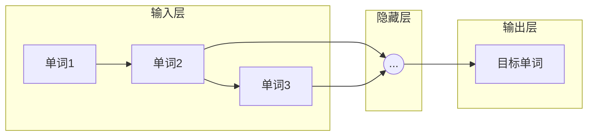
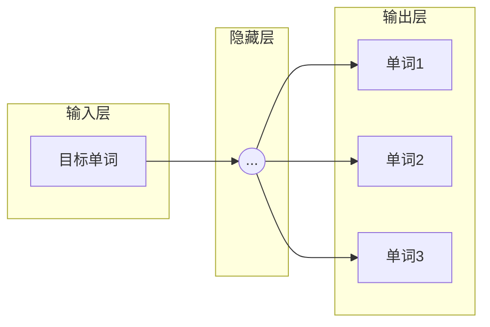

##  Word Embeddings原理与代码实例讲解

作者：禅与计算机程序设计艺术


## 1. 背景介绍

### 1.1 自然语言处理的挑战

自然语言处理（Natural Language Processing，NLP）领域一直致力于让计算机能够理解和处理人类语言。然而，人类语言的复杂性和歧义性给 NLP 任务带来了巨大的挑战。其中一个核心挑战是如何将离散的文本数据转换为计算机可以理解和处理的数值表示。

### 1.2  Word Embeddings 的诞生

为了解决这个问题，词嵌入（Word Embeddings）技术应运而生。词嵌入的目标是将词汇表中的每个单词映射到一个低维稠密向量空间中的一个点，使得语义相似的单词在向量空间中彼此靠近。

### 1.3 词嵌入的意义

词嵌入的出现极大地推动了 NLP 领域的发展，它为许多 NLP 任务提供了更有效的特征表示，例如：

* 文本分类（Text Classification）
* 情感分析（Sentiment Analysis）
* 机器翻译（Machine Translation）
* 问答系统（Question Answering）

## 2. 核心概念与联系

### 2.1 词向量

词向量（Word Vector）是词嵌入的核心概念，它是一个用来表示单词语义的低维稠密向量。词向量的维度通常在几十到几百之间，远小于词汇表的大小。

### 2.2 分布式语义假设

词嵌入技术基于分布式语义假设（Distributional Semantics Hypothesis），该假设认为：**一个单词的语义可以通过它在文本中出现的上下文来确定**。换句话说，如果两个单词在相似的上下文中出现，那么它们 likely 具有相似的语义。

### 2.3 词嵌入模型

词嵌入模型的目标是学习一个函数，该函数可以将一个单词映射到一个低维稠密向量。常用的词嵌入模型包括：

* **基于统计的方法:**
    * **共现矩阵（Co-occurrence Matrix）**: 统计单词在固定大小的上下文窗口内共同出现的频率。
    * **奇异值分解（Singular Value Decomposition，SVD）**: 对共现矩阵进行降维，得到低维词向量。
* **基于神经网络的方法:**
    * **Word2Vec**: 包括 CBOW（Continuous Bag-of-Words）和 Skip-gram 两种模型。
    * **GloVe（Global Vectors for Word Representation）**: 结合了全局和局部上下文信息。
    * **FastText**:  对 Word2Vec 进行改进，训练速度更快。

### 2.4 词嵌入的评估

评估词嵌入质量的常用指标包括：

* **Intrinsic Evaluation**:  通过词语之间的语义相似度或类比任务来评估词向量的质量。
* **Extrinsic Evaluation**: 将词向量应用于下游 NLP 任务，例如文本分类或情感分析，并评估任务性能的提升。

## 3. 核心算法原理具体操作步骤

### 3.1 Word2Vec

Word2Vec 是一种基于神经网络的词嵌入模型，它包含两种模型：CBOW 和 Skip-gram。

#### 3.1.1 CBOW 模型

CBOW（Continuous Bag-of-Words）模型的目标是根据上下文预测目标单词。

**操作步骤：**

1. 将文本数据转换为词序列。
2. 对于每个目标单词，选择一个固定大小的上下文窗口。
3. 将上下文窗口内的单词作为输入，目标单词作为输出，训练一个神经网络。
4. 神经网络的隐藏层输出即为目标单词的词向量。

**图解：**



#### 3.1.2 Skip-gram 模型

Skip-gram 模型的目标是根据目标单词预测上下文。

**操作步骤：**

1. 将文本数据转换为词序列。
2. 对于每个目标单词，选择一个固定大小的上下文窗口。
3. 将目标单词作为输入，上下文窗口内的每个单词作为输出，训练一个神经网络。
4. 神经网络的隐藏层输出即为目标单词的词向量。

**图解：**



### 3.2 GloVe

GloVe（Global Vectors for Word Representation）是一种结合了全局和局部上下文信息的词嵌入模型。

**操作步骤：**

1. 构建一个单词共现矩阵，该矩阵存储了每个单词对在语料库中共同出现的频率。
2. 定义一个损失函数，该函数的目标是最小化词向量点积与共现矩阵中对应元素的对数之间的差异。
3. 使用梯度下降法优化损失函数，得到词向量。

## 4. 数学模型和公式详细讲解举例说明

### 4.1 Skip-gram 模型的数学模型

Skip-gram 模型的目标是最大化给定目标单词 $w_i$ 时，观测到上下文单词 $w_c$ 的概率：

$$
\arg \max_{\theta} \prod_{i=1}^T \prod_{-c \le j \le c, j \ne 0} P(w_{i+j} | w_i; \theta)
$$

其中：

* $T$ 是语料库中单词的数量。
* $c$ 是上下文窗口的大小。
* $\theta$ 是模型的参数，包括词向量矩阵。

为了简化计算，通常将目标函数转换为对数似然函数：

$$
\arg \max_{\theta} \sum_{i=1}^T \sum_{-c \le j \le c, j \ne 0} \log P(w_{i+j} | w_i; \theta)
$$

### 4.2 Skip-gram 模型的 softmax 公式

Skip-gram 模型使用 softmax 函数来计算条件概率 $P(w_{i+j} | w_i; \theta)$：

$$
P(w_{i+j} | w_i; \theta) = \frac{\exp(v_{w_i}^T v'_{w_{i+j}})}{\sum_{w=1}^V \exp(v_{w_i}^T v'_w)}
$$

其中：

* $v_{w_i}$ 是目标单词 $w_i$ 的词向量。
* $v'_{w_{i+j}}$ 是上下文单词 $w_{i+j}$ 的词向量。
* $V$ 是词汇表的大小。

### 4.3 GloVe 模型的损失函数

GloVe 模型的损失函数定义如下：

$$
J = \sum_{i,j=1}^V f(X_{ij}) (v_i^T v_j + b_i + b_j - \log X_{ij})^2
$$

其中：

* $X_{ij}$ 是单词 $i$ 和单词 $j$ 在共现矩阵中的值。
* $v_i$ 和 $v_j$ 分别是单词 $i$ 和单词 $j$ 的词向量。
* $b_i$ 和 $b_j$ 分别是单词 $i$ 和单词 $j$ 的偏置项。
* $f(x)$ 是一个权重函数，用于降低低频词对的影响。

## 5. 项目实践：代码实例和详细解释说明

### 5.1 使用 Gensim 训练 Word2Vec 模型

```python
from gensim.models import Word2Vec

# 读取语料库
sentences = [['this', 'is', 'a', 'sentence'],
             ['this', 'is', 'another', 'sentence']]

# 训练 Word2Vec 模型
model = Word2Vec(sentences, size=100, window=5, min_count=1)

# 获取单词 "sentence" 的词向量
vector = model.wv['sentence']

# 打印词向量
print(vector)
```

**代码解释：**

1. 导入 `Word2Vec` 类。
2. 定义一个包含两个句子的语料库。
3. 使用 `Word2Vec()` 函数训练 Word2Vec 模型。
    * `sentences`: 语料库。
    * `size`: 词向量的维度。
    * `window`: 上下文窗口的大小。
    * `min_count`: 忽略出现次数小于 `min_count` 的单词。
4. 使用 `model.wv['sentence']` 获取单词 "sentence" 的词向量。
5. 打印词向量。

### 5.2 使用 TensorFlow 训练 Skip-gram 模型

```python
import tensorflow as tf

# 定义模型参数
vocab_size = 10000
embedding_dim = 128
window_size = 5

# 定义输入和输出占位符
inputs = tf.placeholder(tf.int32, shape=[None])
labels = tf.placeholder(tf.int32, shape=[None, 1])

# 定义词嵌入矩阵
embeddings = tf.Variable(
    tf.random_uniform([vocab_size, embedding_dim], -1.0, 1.0))

# 查找输入单词的词向量
embed = tf.nn.embedding_lookup(embeddings, inputs)

# 定义 softmax 层
nce_weights = tf.Variable(
    tf.truncated_normal([vocab_size, embedding_dim],
                        stddev=1.0 / tf.sqrt(embedding_dim)))
nce_biases = tf.Variable(tf.zeros([vocab_size]))

# 计算损失函数
loss = tf.reduce_mean(
    tf.nn.nce_loss(weights=nce_weights,
                   biases=nce_biases,
                   labels=labels,
                   inputs=embed,
                   num_classes=vocab_size,
                   num_sampled=100))

# 定义优化器
optimizer = tf.train.GradientDescentOptimizer(learning_rate=1.0).minimize(loss)

# 训练模型
with tf.Session() as sess:
  # 初始化变量
  sess.run(tf.global_variables_initializer())

  # 迭代训练数据
  for epoch in range(10):
    for batch_inputs, batch_labels in generate_batch(batch_size=128):
      # 运行优化器
      sess.run(optimizer, feed_dict={inputs: batch_inputs, labels: batch_labels})

  # 获取词向量
  final_embeddings = embeddings.eval()
```

**代码解释：**

1. 导入 TensorFlow 库。
2. 定义模型参数，包括词汇表大小、词向量维度和上下文窗口大小。
3. 定义输入和输出占位符。
4. 定义词嵌入矩阵。
5. 使用 `tf.nn.embedding_lookup()` 函数查找输入单词的词向量。
6. 定义 softmax 层，使用 `tf.nn.nce_loss()` 函数计算损失函数。
7. 定义优化器。
8. 在 TensorFlow 会话中训练模型。
9. 获取训练好的词向量。

## 6. 实际应用场景

### 6.1 文本分类

词嵌入可以作为文本分类模型的输入特征。例如，可以使用预训练的词向量来表示每个单词，然后将所有单词的词向量平均或拼接起来，作为文本的特征向量。

### 6.2 情感分析

词嵌入可以用于情感分析任务，例如判断一段文本的情感极性（积极、消极或中性）。例如，可以训练一个分类器，将词向量作为输入，情感标签作为输出。

### 6.3 机器翻译

词嵌入可以用于机器翻译任务，例如将一种语言的文本翻译成另一种语言的文本。例如，可以使用词嵌入来计算两种语言中单词之间的语义相似度，从而找到最合适的翻译词语。

## 7. 工具和资源推荐

### 7.1 Gensim

Gensim 是一个用于主题建模、文档索引和相似度检索的 Python 库，它也提供了训练 Word2Vec 和 FastText 模型的接口。

### 7.2 TensorFlow

TensorFlow 是一个开源的机器学习平台，它提供了丰富的 API 用于构建和训练神经网络模型，包括词嵌入模型。

### 7.3 PyTorch

PyTorch 是另一个开源的机器学习平台，它也提供了丰富的 API 用于构建和训练神经网络模型，包括词嵌入模型。

### 7.4 预训练词向量

许多机构和研究团队都发布了预训练的词向量，例如：

* **Google News word vectors**: 由 Google 发布，包含 300 万个单词的词向量，维度为 300。
* **GloVe word vectors**: 由 Stanford NLP Group 发布，包含多种语料库和词向量维度。
* **FastText word vectors**: 由 Facebook AI Research 发布，包含多种语言的词向量。

## 8. 总结：未来发展趋势与挑战

### 8.1 未来发展趋势

* **上下文相关的词向量**:  当前的词嵌入模型通常为每个单词学习一个固定的词向量，而上下文相关的词向量可以根据单词在不同上下文中的语义来动态调整词向量。
* **多语言词向量**:  多语言词向量可以将不同语言的单词映射到同一个向量空间，从而 facilitating  跨语言 NLP 任务。
* **更深层次的语义理解**:  未来的词嵌入模型需要能够捕捉更深层次的语义信息，例如单词之间的语义关系、句子之间的语义关系等。

### 8.2 面临的挑战

* **数据稀疏性**:  对于低频词或新词，很难学习到高质量的词向量。
* **计算效率**:  训练大型词嵌入模型需要大量的计算资源和时间。
* **可解释性**:  词嵌入模型通常是一个黑盒子，很难解释词向量是如何学习到的。

## 9. 附录：常见问题与解答

### 9.1 什么是词嵌入的维度？

词嵌入的维度是指词向量的长度，通常在几十到几百之间。词向量的维度越高，能够表示的语义信息就越丰富，但同时也会增加计算复杂度和模型过拟合的风险。

### 9.2 如何选择合适的词嵌入模型？

选择合适的词嵌入模型取决于具体的 NLP 任务和数据集。例如，对于文本分类任务，Word2Vec 和 GloVe 都是不错的选择；对于需要考虑词序信息的 NLP 任务，例如机器翻译，可以使用 RNN 或 Transformer 等模型。

### 9.3 如何评估词嵌入的质量？

评估词嵌入质量的常用方法包括 Intrinsic Evaluation 和 Extrinsic Evaluation。Intrinsic Evaluation 通过词语之间的语义相似度或类比任务来评估词向量的质量；Extrinsic Evaluation 将词向量应用于下游 NLP 任务，并评估任务性能的提升。